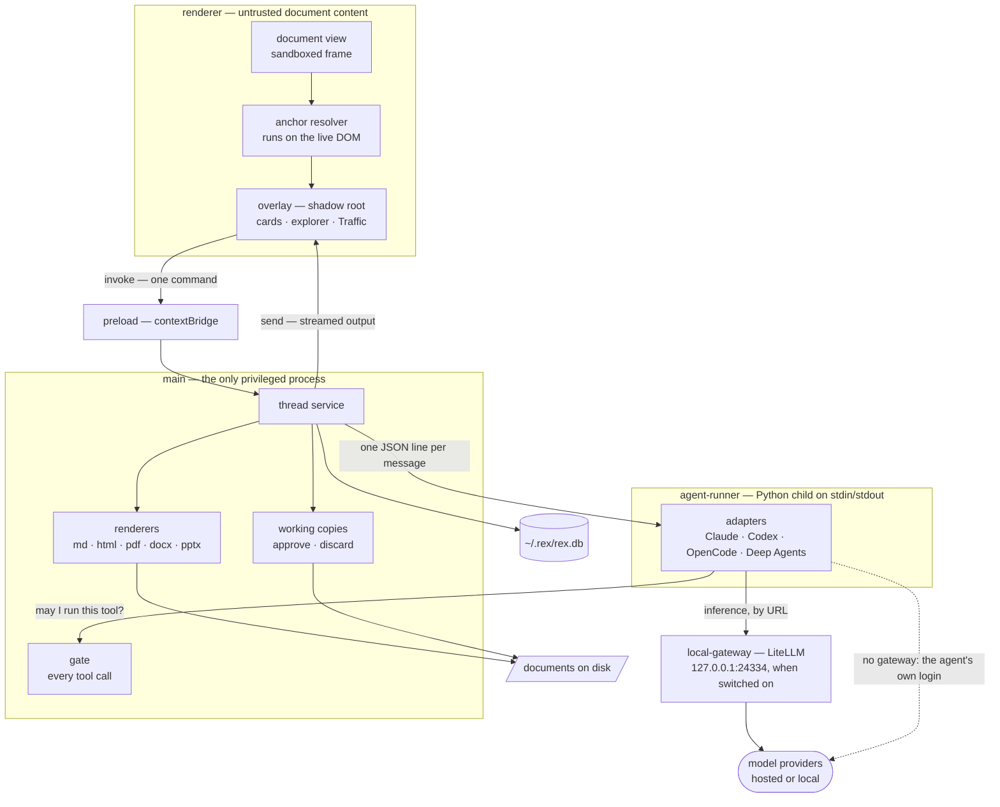
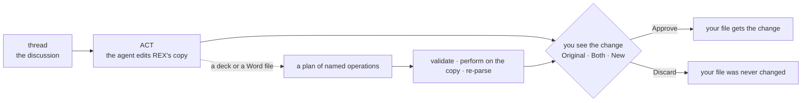

<p align="center">
  <picture>
    <source media="(prefers-color-scheme: dark)" srcset="docs/logo/full/rex-full-on-dark-1024.png">
    
  </picture>
</p>

<p align="center">
  <a href="https://github.com/lukaskellerstein/rex/releases/latest"></a>
  
  
  <a href="https://github.com/lukaskellerstein/rex/actions/workflows/release.yml"></a>
</p>

<p align="center">
  
  
  
  
  
</p>

<p align="center">
  <b>Comment on a document. Talk each comment through with an AI agent.<br>
  Let it make the change — and keep only what you approve.</b>
</p>

# REX

*Review EX* — third in the family after **VEX** and **DEX**.

## Why REX

**Reviewing a document with AI still means copy and paste.** You copy a
paragraph into a chat and explain where it came from. You read the answer and
carry the fix back by hand. The chat does not know where that paragraph lives,
so the next question starts from zero. And when you finally let an agent edit
the file, it changes more than you asked, and you find out afterwards.

**REX puts the conversation where the question is: on the document.** Select a
sentence, a table cell, a region of a chart or a whole section, and write a
comment. An agent answers *that* comment, with the document open in front of
it. Keep talking in the thread until you agree. Then switch the same box from
**ASK** to **ACT** and say what should change. The agent edits a copy, REX
shows you the change beside the original, and your file stays exactly as it was
until you press **Approve**.

What that gives you:

- **The place is never lost.** A comment is anchored to the text itself, not to
  a line number, so it stays attached while the document is edited underneath
  it. When a passage is really gone, the comment says so. It never jumps quietly
  to the wrong paragraph.
- **One comment, one conversation.** Every comment is its own thread with its own
  agent session. Twenty open questions on a report are twenty focused
  discussions, not one long chat that forgot the first nineteen.
- **A question cannot change your file.** ASK runs every agent read-only, and
  REX's own gate checks each tool call before it runs.
- **A change waits for you.** ACT works on REX's copy of the document. You see
  Original, New, or both side by side, and then Approve, Undo last, or Discard.
- **Your agent, your model — local ones too.** Claude Agent SDK, Codex, OpenCode
  or Deep Agents, on your own subscription, on an API key, or on a model that
  runs on your Mac through LM Studio or Ollama.
- **Nothing is hidden.** Traffic shows every request REX sent to a model and
  every answer that came back, down to the JSON.
- **The documents you actually review.** Markdown, HTML, PDF, Word and
  PowerPoint, in one window, with a folder of them as a workspace.

REX is built for the documents that decide things: specifications, design
documents, READMEs, reports and decks.

## Install

### Supported systems

**REX is a macOS app for Apple silicon.** That is the one platform where every
agent works in every mode, and REX claims nothing it cannot keep.

| System | Status |
|:--|:--|
| **macOS on Apple silicon** (M1 or newer) | **Supported.** Needs macOS 12 or newer — the minimum the app declares. Built and tested on macOS 26 |
| macOS on Intel | Not supported. No build |
| Windows | Not supported |
| Linux | Not supported |

Windows and Linux builds did exist. Both were installed and tested on
2026-09-07 and removed the next day, because two of the three systems could not
run every agent in every mode. [Spec 50](docs/my-specs/50-macos-completely/SPEC.md)
records why, and what bringing them back would take.

### Three steps

1. Download **`REX-<version>-arm64.dmg`** from the
   [latest release](https://github.com/lukaskellerstein/rex/releases/latest).
2. Open it and drag **REX** into **Applications**.
3. The build is not signed yet, so macOS blocks the first launch and says REX
   "is damaged" or "cannot be verified". Clear the download flag once, in
   Terminal, then open REX:

   ```bash
   xattr -dr com.apple.quarantine /Applications/REX.app
   ```

That is all. REX carries its own Python runtime, and three of its four agents
ship inside it — only OpenCode is installed separately. REX keeps its data in
`~/.rex/`, which uninstalling leaves in place.

### Connect a model

REX needs one way to reach a model. Pick the row that matches what you have:

| You have | Do this |
|:--|:--|
| **A Claude subscription** | If Claude Code is signed in on this Mac, there is nothing to do: the default agent, Claude Agent SDK, uses that login. If not, install Claude Code and run `claude login` once |
| **A Codex subscription** | If the Codex CLI is signed in, choose **Codex** in the comment box. If not, install it and run `codex login` once |
| **An API key, or a local model** | Open **Settings** (the cog in the top bar), switch on **Run the built-in gateway**, and add a provider: a key for Anthropic, OpenAI or OpenRouter, or the address of LM Studio, Ollama or Unsloth. Tick the models you want, then pick the **Built-in** gateway and a model in the comment box |

### Your first review

1. **Open ▾** in the top bar → **Document…** or **Folder as a workspace…**
2. **Select** the text your comment is about. For a table, a figure or a section,
   press `P` to pick an element and `↑` to widen it. To circle a mix of things,
   press `N` and draw with the pen.
3. **Ask.** Write the question and press **Ask about 1**, or `⌘↵`. The answer
   arrives in the comment card. Reply to keep talking.
4. **Act.** When you know what should change, press `⇧⇥` to move the switch to
   **ACT**, write the instruction, and press **Change 1**.
5. **Decide.** Look at the change as **Original**, **Both** or **New**, then
   press **Approve**, **Undo last** or **Discard**. Until you approve, your file
   is untouched.

`⇧⇥` has a third position, **NOTE**: a comment that is saved and reaches no
agent at all.

## What REX can do

### Point at exactly what you mean

Not everything worth a comment is a run of text. **Pick element** — `P`, holding
`⌥`, or the chip at the foot of the page — hovers the smallest thing under the
cursor that can be anchored, and a path bar offers what encloses it (`↑` / `↓`
to widen and narrow). So a comment can be about a table, a row, a cell, a
section or a figure. Dragging inside a figure cuts out a region of it, and a
node or an edge of a Mermaid diagram is named in the diagram's source.

Two scopes sit at the wide end of the path bar. **`section`** is one heading's
worth: the heading and everything under it up to the next heading of the same
rank or higher. **`document`** is the file itself. It names nothing inside the
file, so it is the one comment whose subject cannot be edited away: "Is this
still accurate?" is still waiting a month later, whatever happened to the prose.

Some subjects have no structure to point at — a table, the two paragraphs under
it and a picture. The **pen** (`N`) draws a circle on REX's own glass, and every
block whose centre falls inside it becomes a place in the comment, in document
order. One comment can hold many places, across many documents, and a reply
can add more in the middle of a conversation.

### Comments that survive edits

Comments persist in a local database. Reopening a document shows every
comment, open and resolved, still attached to the right place — even after the
document was edited underneath them, by you or by REX's own agent. A comment
whose passage is gone is **orphaned**: it keeps its note and its original quote
in the orphan tray, and it is never re-attached somewhere wrong.
[Anchoring](#anchoring) explains how.

### ASK, ACT and NOTE

One switch beside the send button decides what pressing it does:

| Mode | The button | What happens |
|:--|:--|:--|
| **ASK** | `Ask about 3` | An agent answers. It runs read-only, and REX's gate refuses any tool call that could change a file |
| **ACT** | `Change 3` | An agent makes the change on REX's copy of each document, and you approve it or discard it |
| **NOTE** | `Save 3` | The comment is saved. No agent runs |

A conversation that starts as a question can end with "ok, do it" without
leaving the reply box, and a reviewer who already knows what they want can
select, switch to ACT and send in one go. [The agent, and ACT](#the-agent-and-act)
has the details.

### Four agents, one comment box

| Agent | ASK | ACT | Signs in with | Worth knowing |
|:--|:--|:--|:--|:--|
| **Claude Agent SDK** — the default | yes | yes | `claude login`, or the built-in gateway | Ships inside REX |
| **Codex** | yes | yes | `codex login`, or the built-in gateway | Ships inside REX |
| **OpenCode** | yes | yes | `opencode auth login`, or the built-in gateway | Install `opencode` yourself. REX runs its server inside a macOS sandbox |
| **Deep Agents** | yes | yes | the built-in gateway | A LangGraph graph inside REX's own agent process |

Every message can use a different agent and model, and the answer says which
one wrote it. You can set a default model, and an output style for how Claude
writes.

### The built-in gateway

REX ships its own **LiteLLM** and runs it on a switch, on `127.0.0.1` only. In
**Settings** you add providers instead of editing a YAML file:

| Provider | Needs |
|:--|:--|
| LM Studio, Ollama | the server's address |
| Unsloth | the server's address, and a key if it has one |
| OpenAI, OpenRouter, Anthropic | an API key |

REX asks each provider which models it serves, and you tick the ones you want.
Keys are encrypted with the macOS Keychain before they are stored, and the
gateway's configuration file names environment variables, never values. One
model name serves all four agents, so a model you choose works whichever agent
you send to.

### Traffic

**Traffic** — the chart icon in the top bar, or the `traffic` link on a comment
card — shows what REX actually sent to a model and what came back, at four
depths: every chat, the turns of one chat, one turn as a conversation, and one
message as JSON. The exchanges are recorded for every chat that runs through
the built-in gateway. A `debug` button copies a chat or a turn as text, with the
commands that read the same records from disk.

### A folder is a workspace

Open a **folder** and REX shows an explorer down the left with each document's
comment counts, and a **reference graph** of how the documents link to each
other, with the review drawn on top. `⌘F` finds in the page and `⌘⇧F` searches
the whole workspace. A link to another document opens it at the right section,
and `⌘[` / `⌘]` go back and forward. Renaming or moving a file from the tree
takes its comments with it. Deleting one moves it to the Bin, and its comments
wait for it to come back.

### Documents it opens

| Format | Extensions | Read by | ACT can change it |
|:--|:--|:--|:--|
| Markdown | `.md` `.markdown` `.mdown` `.mkd` | `markdown-it`, in main | yes — any edit. Every block carries `data-src-line`, so ACT knows which source line a comment is about |
| HTML | `.html` `.htm` `.xhtml` | sanitised with DOMPurify, in main | yes — any edit |
| DOCX | `.docx` | `mammoth`, in main | through **10 named operations** that REX performs and checks |
| PPTX | `.pptx` | `pptxtojson`, in main | through **13 named operations** — see [PowerPoint](#powerpoint) |
| PDF | `.pdf` | `pdfjs-dist`, in the renderer | no. A PDF is read-only |

`.doc` and `.ppt` — the pre-2007 binary formats — are deliberately absent. They
are not zips, so accepting them would fail at parse time with a confusing
message instead of at listing time with a clear one.

A file REX cannot open still appears in the explorer, with the reason beside it.
A folder can be excluded from the review, and the excluded row stays in the tree
rather than vanishing from it. [`docs/FORMATS.md`](docs/FORMATS.md) is the
product decision behind every format.

## Run from source

### Prerequisites

- **An Apple-silicon Mac.** The same rule as the app.
- **Node.js 22.18 or newer.** The test suites hand `.ts` files straight to
  `node`, so it must be a version that strips types by default. CI uses 22.
- **[`uv`](https://docs.astral.sh/uv/).** It installs Python 3.12 and the two
  Python packages. Never `pip`.
- **Xcode Command Line Tools**, because `better-sqlite3` is a native module.

### Install and run

```bash
git clone https://github.com/lukaskellerstein/rex.git && cd rex
npm ci
npm run rebuild                    # better-sqlite3 against Electron's ABI
(cd agent-runner && uv sync)       # the agent library
(cd local-gateway && uv sync)      # the built-in gateway
npm run dev                        # the app, with hot reload
```

Or build once and open something straight away:

```bash
npm run build
npx electron .                     # empty
npx electron . doc.md              # one document
npx electron . docs/               # a folder, as a workspace
```

> **Every `npm install` undoes `npm run rebuild`** — including one that installs
> a single unrelated package. npm reinstalls `better-sqlite3` against Node's
> ABI, and the tests keep passing (they run under `node`) while the app dies the
> moment it touches the database. It does not die loudly: the window opens, the
> debugger port answers, and the process disappears on the first query, which
> looks like a crash on whatever you clicked. Measured 2026-09-03, updating the
> Agent SDK. **Run `npm run rebuild` after any install.**

### Developing

`npm run dev` runs the app through electron-vite. Only the renderer is truly hot,
and the difference is worth knowing before you go looking for a change that is
not there:

| You edited | With `npm run dev` | With `npm run dev:watch` |
|:--|:--|:--|
| `src/renderer/**` | Vite HMR patches the module in place; the open document stays open | the same |
| `src/preload/**` | nothing, until you restart | the renderer reloads; the window survives |
| `src/main/**`, `src/shared/**` used by main, `schema.sql` | nothing, until you restart | **Electron restarts** — a new window |

Without `--watch`, electron-vite builds main and preload once at startup and never
looks at them again. So an IPC channel or a query added after the server started
is simply not there, and the renderer hot-reloads a UI that calls into a preload
which does not have the method. That failure looks exactly like "my change did
nothing". A main-process restart cannot be hot: the process holds the SQLite
handle and both Python children.

### Commands

| Command | What it does |
|:--|:--|
| `npm run dev` | electron-vite dev server, renderer hot |
| `npm run dev:watch` | the same, and restarts on main and preload changes |
| `npm run dev:nohmr` | the dev server with hot module replacement off |
| `npm run build` | build main, preload and renderer into `out/` |
| `npm start` | preview the built app through electron-vite |
| `npm run rebuild` | rebuild `better-sqlite3` for the current Electron — **after every `npm install`** |
| `npm run typecheck` | `tsc --noEmit` over everything |
| `npm run bundle:python` | stage a relocatable CPython 3.12 with both Python packages into `python-dist/` |
| `npm run package` | build, bundle Python, and make `release/REX-<version>-arm64.dmg` |
| `npm run export -- <doc>` | a document's threads as Markdown (`--json`, `--out <file>`) |
| `npm run test:<name>` | one test suite. There are 60, one per file, listed in `package.json` |
| `npm run test:library` | the three seam suites, then `uv run pytest` in `agent-runner/` |
| `npm run test:gateway` | the two gateway suites, then `uv run pytest` in `local-gateway/` |

There is no single `npm test`: each suite names one component that fails
silently, and running them one at a time is how their output stays readable.

### Configuration

REX needs no configuration file. These environment variables move what it owns
or pin what it would otherwise choose:

| Variable | What it does | Default |
|:--|:--|:--|
| `REX_DB_PATH` | the comment database; `rex.log` sits beside it | `~/.rex/rex.db` |
| `REX_CACHE_PATH` | extracted deck media and text sidecars | `~/.rex/cache` |
| `REX_WORK_PATH` | REX's copies of the documents an agent works on | `~/.rex/work` |
| `REX_GATEWAY_DIR` | the built-in gateway's configuration and traffic log | `~/.rex/gateway` |
| `REX_GATEWAY_PORT` | pins the gateway's port instead of walking up from 24334 to 24343 | unset |
| `REX_CDP_PORT` | Electron's debugger port, or `off` | `9334` |
| `REX_PYTHON` | the Python interpreter for both children | the runtime inside the app, then each package's `.venv` |
| `GEMINI_API_KEY` | turns on generated images and video in decks. Absent, the feature is **absent** rather than broken | unset |

Everything REX owns lives under `~/.rex/`, outside every repository, so no
comment and no cached slide can ever be committed by accident:

```text
~/.rex/
├── rex.db          comments, threads, messages, runs, encrypted provider keys
├── rex.log         this run's errors, renderer console included
├── cache/          extracted deck media, agent text sidecars
├── work/           REX's copy of each document an agent works on
├── gateway/        config.yaml, and traffic/ — every request, kept 30 days
├── codex-home/     Codex's home for runs through a gateway
├── opencode/       OpenCode's home
├── scratch/        an empty working directory, for an agent whose document is gone
├── plugins/        plugins the agents load
└── marketplaces/   plugin checkouts, only when one is not already on the machine
```

## Releases

**One version, one Release** ([spec 57](docs/my-specs/57-one-version-one-release/SPEC.md)).
`version` in `package.json` is the number people see, and a person raises it:

1. On your branch: `npm version minor --no-git-tag-version` — or `patch` for a
   fix only. It changes `package.json` and `package-lock.json` together.
2. Open the pull request. The **Version bump** check fails it if the version is
   not higher than `main`'s, if the two files disagree, or if the tag is already
   used — and says what to run.
3. Merge. The Release workflow builds the DMG on a macOS runner and publishes it
   as `v<version>`, with the install guide from `.github/release-notes.md` and
   the list of merged pull requests.

A push to `main` that does not raise the version builds nothing and publishes
nothing. A Release that fails makes no tag, so the next push — or a manual run of
the workflow — publishes it.

## How it works

Four processes. The renderer shows the document and everything REX draws over
it. Main is the only privileged one. The agent library is a Python child spoken
to over its own stdin and stdout, and the built-in gateway is a second Python
child that exists only while its switch is on.

| # | Invariant (spec 01 §3) |
|:--|:--|
| I1 | The anchor resolver runs **in the renderer, on the live DOM**. Main stores anchors and never resolves them. |
| I2 | Only main touches SQLite and speaks to the agent library. The renderer displays untrusted document content. |
| I3 | Commands are `ipcRenderer.invoke`; agent output is `webContents.send`. No HTTP server, no broker. **Amended by spec 46 §2:** one loopback port carries inference, and nothing else. |



```text
src/
├── main/        SQLite, the pipe to the agent library, document renderers, the gate
│   ├── agent/      the pipe client, the event bridge, profiles, the gate, prompts
│   ├── db/         schema.sql, migrations, typed queries
│   ├── docx/       Word editing operations
│   ├── gateway/    the built-in gateway: lifecycle, providers, keys, traffic
│   ├── ooxml/      what Word and PowerPoint share
│   ├── pptx/       the deck plan, the surgery, the validator
│   ├── render/     markdown · html · pdf · docx · pptx
│   ├── search/     search across the workspace
│   └── workspace/  the folder scan and the reference graph
├── renderer/    the document view, the shadow-root overlay, the anchor resolver
│   ├── anchor/     create, resolve, highlight, section, lasso, pick
│   └── overlay/    the shell, the cards, Settings, Traffic, the graph, the pen
├── preload/     the contextBridge surface
├── shared/      types.ts, channels.ts, and the generated agent protocol
└── cli/         rex export
agent-runner/    the agent library — every agent SDK, one adapter each (spec 42)
local-gateway/   REX's own LiteLLM (spec 46)
```

## Anchoring

A CSS selector breaks the instant a paragraph is inserted above it, and REX
ships a feature that edits documents — so anchors are invalidated by the tool's
own normal operation. Anchors therefore degrade in layers (spec 01 §6):

| Layer | Resolves by | Survives |
|:--|:--|:--|
| 1 | the quoted text, disambiguated by its surrounding 32 characters | reflow, restyling, most edits |
| 2 | a bounded fuzzy search, verified over the whole quote | small rewordings |
| 3 | an element's identity — its id, or a selector built from what identifies it | images, SVG, anything with no text |

Two things are read *before* the layers. A **region** — a box dragged inside a
figure — carries a fingerprint of what that figure held, because geometry always
resolves and a redrawn chart would otherwise report success while pointing at new
content. An **extent** says the anchor covers more than the thing it names: a
`section` resolves its heading through the layers above and then walks siblings
to find where the run ends, and a `document` names nothing inside the file and so
can never move.

When every layer fails the thread is **orphaned**, which is a normal outcome
rather than an error: it keeps its note and its original quote in the orphan
tray. Nothing is ever deleted, and nothing is ever silently re-attached
somewhere else.

Highlights are painted with the CSS Custom Highlight API and the stylesheet is
adopted rather than inserted, so the document under review is never mutated —
no `<mark>`, not one node.

## The agent, and ACT

The two agent modes carry two different promises, and the difference between
them is the whole safety story (spec 01 §8.2 and §8.4, spec 12). The band at the
head of the comment card says which one is running from the first step, not when
the answer arrives.

| Stored profile | Mode | The promise | Kept by |
|:--|:--|:--|:--|
| `read` | **ASK** | the run cannot change a file you own | REX's gate, which the agent library asks **before every tool call**; no answer within thirty seconds is a deny. Each agent adds its own boundary under it — a read-only tool set, Codex's sandbox, a macOS sandbox around OpenCode's server |
| `write` | **ACT** | nothing reaches your file until you approve it | the working copy: the agent edits REX's copy, and you see the change first |

**The rule the gate keeps is spec 12 §6.1: a command is refused when it can
change something, and allowed when it cannot.** The mechanism is an allowlist
anyway, and the mismatch is deliberate — to allow everything except known
writers, REX would have to know every program that writes, and `xsltproc -o`,
`sqlite3` and `make` are three that nobody thinks of. Under an allowlist
"cannot write" is a fact; under a denylist it is a hope.

So the list is long and grows under one test: **a binary joins only when there
is a decidable test for "this invocation writes"**. `cd`, `jq`, `diff`, `sort`,
`unzip -l`, `sed -n` and about thirty others are on it, and `curl` is allowed in
its reading forms only. `python`, `sh`, `xargs`, `env` and `make` are absent and
always will be, because no flag tells you what they will do. A refusal says what
the command would do and where the same answer can be had instead — never that
it "is not on the allowlist".

The read guarantee is checked as a backstop, not assumed: `git status
--porcelain` in the document's repository after a read session must be empty,
and `npm run test:gate` runs the deny vectors directly.

An ACT run never changes a file you have not seen the change to:



REX's copy of a document lives at one path under `~/.rex/work/` from the first
agent run on, and it is never deleted (spec 34). Approve and Discard move content
between the copy and your file, a running agent holds its documents, and a
reviewer's approve or discard is itself a message in the thread.

When an answer looks wrong, the **trace** shows the run as it happened — every
tool call as a head with its input, change and output — and the **debug report**
(`B`, or the bug icon) copies out the facts only main knows: which session holds
this answer, which thread row it came from, and which directory the agent was
pointed at.

## PowerPoint

A deck is a review document, and there are 144 `.pptx` files on the machine REX
was built on; it is not a hypothetical format.

**Reading.** The deck is parsed to one HTML slide per slide, so a slide is HTML
like everything else REX renders — which is why `src/renderer/anchor/` needed no
change at all. Media is extracted to `~/.rex/cache` and served over `rex-doc://`,
never inlined as a `data:` URI. Speaker notes appear in a drawer. A deck that
does not parse shows its message rather than a blank pane, and ACT is disabled
for it.

**Anchoring.** A slide is a set of boxes, and a comment on a slide is almost
always about one box — this title, that card, this photograph. `Anchor` already
modelled exactly that with `ElementRef` and `RegionRef`, so `src/shared/types.ts`
is unchanged too. `npm run test:pptx-anchor` re-resolves anchors against decks
REX itself edited.

**Editing.** `git diff` on a `.pptx` prints `Binary files differ`, so a
show-the-change-and-wait step would become a rubber stamp. Two things replace it:

1. **The agent writes a plan, never bytes.** REX validates the plan, performs it
   on a copy, then re-parses the result and confirms that **nothing the plan did
   not name changed**. The agent never fetches an image, never draws one, and
   never touches the zip.
2. **The preview is a picture.** Before and after, slide by slide — the change
   as you will actually get it.

Thirteen operations, because a review is wide. A tool that can only retype a
sentence sends the reviewer back to PowerPoint for most of what is said about a
deck:

| | | |
|:--|:--|:--|
| `setText` | `insertTextBox` | `deleteShape` |
| `insertImage` | `replaceImage` | `insertVideo` |
| `moveShape` | `setStyle` | `setThemeFont` |
| `reorderSlides` | `duplicateSlide` | `deleteSlide` |
| `setNotes` | | |

Every operation that changes something which already exists names what it
expects to find, and the surgery refuses when the expectation does not hold.

Native PowerPoint comments are out of scope by decision: REX renders a deck and
holds its own comments in its own database. It does not write `ppt/comments/`,
does not read existing ones, and does not try to round-trip PowerPoint's review
model.

## The reference graph

Links come out of `markdown-it`'s token stream rather than a pattern, so a link
inside a code fence is not counted and a reference-style link resolves to its
definition. HTML uses a pattern, which is honest for a navigational aid.

What is drawn, and what is only counted:

| | |
|:--|:--|
| a document in the workspace | drawn |
| a document outside it that exists | drawn, as `external` |
| a link target that does not exist | drawn as `missing`, and listed as a broken link with its line |
| `http(s)` and `mailto` | counted — drawing them buries the structure |
| a PDF, an image, any non-document | counted — the explorer will not open it, so the graph does not offer to |

Node size is the count of open comments and colour is their state, so the graph
shows where review attention is concentrated and which documents have orphaned
anchors. Edge thickness is how many times one document references another.

Selection is one idea shared by both views: pick a file in the explorer and its
node lights up with everything it links to; pick a node and the explorer follows
it. A single click never navigates away from the graph — seeing the connections
is what the click asked for — so double-click opens the document instead.

The simulation stays live. Drag a node and its neighbours follow, drag the
background to pan, scroll to zoom, and **fit** re-frames.

Ranking is by **total incoming links**, not in-degree. Measured on a real docs
folder: five documents that all cite each other have an in-degree of 4 apiece
and the hub is invisible, while link count puts it first with 19.

## The tests, and why these ones

They cover the components that **fail silently** — where a regression looks
exactly like working code until a human notices something wrong.

**`test:anchor`** resolves ten anchors across
`2026-08-20-architecture-explained.html` and `components.md`, applies three
realistic edits (insert a paragraph, reword a sentence, delete a section), and
re-resolves. It does not assert that resolution *succeeded* — it prints what
each anchor landed on and fails when an anchor reports success while sitting on
text it was never created from. A comment that quietly moves to the wrong
paragraph is the failure mode this exists to catch.

It then does the same for a **region** — a box dragged inside a figure. Geometry
always resolves, so a redrawn chart would otherwise report success while
pointing at whatever now occupies the box. The case redraws one figure and
requires that anchor to orphan, while its untouched neighbour still resolves.

It then does the same for **sections**, which fail differently: a section is
anchored on its heading, and a positional path like `section:nth-of-type(4) >
div > h2` still matches a heading after a section above it is deleted — just not
the same one. Measured with the guard removed, a comment on a *deleted* section
resolved onto "The six components" and reported `moved`. The case reports which
heading each section landed on and fails when that is not the one it was created
from.

**`test:lasso`** puts fixture boxes in and reads selected boxes out, with no DOM
involved: an open circle must select what a closed one does, a `td` inside its
`tr` inside its `table` must yield only the table, and a circle that encloses
nothing must yield nothing. A circle that quietly takes the wrong paragraph
looks exactly like a circle that worked.

**`test:migrate`** runs each schema migration against a real SQLite file and
then runs it again. A migration executes on every open, against a database that
already holds somebody's comments, so its *second* run matters as much as its
first.

**`test:gate`** checks that a `read` agent cannot write, against the write
vectors spec 01 §8.4 names — `python -c`, `tee`, `sh -c`, a plain redirect —
and against redirects appended to otherwise-allowed commands. Since spec 12 it
checks the other direction too, and that half is the one with transcripts
behind it: `cd … && grep …` and `wc -l *.md 2>/dev/null` were both refused by a
gate working exactly as written, and neither could have changed a byte.

**`test:links`** checks the half of the reference graph that has a right
answer. A link inside a fenced code block is not a link, a reference-style link
resolves to its definition, a fragment does not create a second node, and an
ambiguous wikilink is reported rather than guessed at. The drawing is judged by
eye; this is judged by assertion.

**`test:pptx-edit`** runs each deck operation against real presentations and
then asserts what the operation did **not** change. A deck is a zip of XML with
parts that reference each other by id: an edit that leaves a dangling
relationship still opens in REX and still fails in PowerPoint, which is the
definition of a silent failure.

**`test:version`** checks both halves of the release rule: the pull request
check, and the workflow that publishes only a version whose tag is new. If
either drifts, merges stop shipping or ship twice — and a skipped Release is a
green run.

## The specs

The specs are the authority on everything above. Each one extends its
predecessors rather than restating them:

| # | Spec | About |
|:--|:--|:--|
| 01 | [the app](docs/my-specs/01-initial/SPEC.md) | anchors, threads, the two agent profiles, Apply |
| 02 | [workspace and graph](docs/my-specs/02-workspace-and-graph/SPEC.md) | the folder explorer and the reference graph |
| 03 | [rich rendering](docs/my-specs/03-rich-rendering/SPEC.md) | HTML, PDF and DOCX beside Markdown |
| 04 | [selection and shortcuts](docs/my-specs/04-selection-and-shortcuts/SPEC.md) | a comment about more than one place |
| 05 | [selection as a phase](docs/my-specs/05-selection-as-a-phase/SPEC.md) | Apply across documents, shown in the document |
| 06 | [the document, the section and the pen](docs/my-specs/06-document-section-and-pen/SPEC.md) | the wide end of the path bar, and the ink |
| 07 | [the fact graph](docs/my-specs/07-fact-graph/SPEC.md) | **withdrawn** by 09 — kept for its measurements |
| 08 | [the shell redesign](docs/my-specs/08-shell-redesign/SPEC.md) | the shell, the trace sheet, the debug report |
| 09 | [removing the fact graph](docs/my-specs/09-removing-the-fact-graph/SPEC.md) | 6,334 lines deleted, and why |
| 10 | [the figure preview, and exclusions](docs/my-specs/10-figure-preview-and-exclusions/SPEC.md) | the lightbox, and what is not part of the review |
| 11 | [PowerPoint](docs/my-specs/11-powerpoint/SPEC.md) | reading a deck, and editing one |
| 12 | [ASK and ACT](docs/my-specs/12-ask-and-act/SPEC.md) | the mode is a choice, and it is on the screen |
| 13 | [debugging](docs/my-specs/13-debugging/SPEC.md) | every run opens a debugger, and the log a reviewer can paste |
| 14 | [naming, order and groups](docs/my-specs/14-naming-order-groups/SPEC.md) | a name on every comment, an order you set, groups that nest |
| 15 | [the working copy, and the two panes](docs/my-specs/15-the-working-copy/SPEC.md) | the agent edits a copy you iterate on, read side by side, and approve when it is right |
| 16 | [the two versions](docs/my-specs/16-the-two-versions/SPEC.md) | what a gesture means in each pane, and a place between two blocks |
| 17 | [stopping a run](docs/my-specs/17-stopping-a-run/SPEC.md) | a running agent can be stopped, and the conversation says who stopped it |
| 18 | [what the colours mean](docs/my-specs/18-what-the-colours-mean/SPEC.md) | seven facts, seven colours, one vocabulary |
| 19 | [the Word document, and the notes on a slide](docs/my-specs/19-word-and-notes/SPEC.md) | a comment can change a DOCX, a deck's notes are reachable, and a PDF never will be |
| 20 | [the agent window](docs/my-specs/20-the-agent-window/SPEC.md) | with `PW_AGENT=1`, REX says who opened it — and is born on the test desktop, out of the reviewer's sight |
| 21 | [the file the agent creates](docs/my-specs/21-the-file-the-agent-creates/SPEC.md) | a file the agent wrote inside the workspace is kept, and shown in the tree |
| 22 | [the whole workspace](docs/my-specs/22-the-whole-workspace/SPEC.md) | ACT may edit any text document under the root, and each one gets a working copy |
| 23 | [renaming and deleting a file](docs/my-specs/23-renaming-and-deleting-a-file/SPEC.md) | the tree's menu can rename a file and move one to the Bin, and the comments follow |
| 24 | [pointing at a place, mid-conversation](docs/my-specs/24-pointing-mid-conversation/SPEC.md) | a reply can carry new places; the comment grows, and the turn says what it added |
| 25 | [choosing the model](docs/my-specs/25-choosing-the-model/SPEC.md) | a model per message, a default you set, and the answer says which one wrote it |
| 26 | [widening a place you already took](docs/my-specs/26-widening-a-place/SPEC.md) | the path bar outlives the click, and ↑ ↓ move the place instead of adding a second |
| 27 | [the width of the page, and the dark paper](docs/my-specs/27-width-and-dark-paper/SPEC.md) | two switches on the Markdown page REX typeset itself — and nothing else |
| 28 | [find in the page, and search across the workspace](docs/my-specs/28-find-and-search/SPEC.md) | `⌘F` paints every match on the page and marks them on a ruler at the pane's edge; `⌘⇧F` is a `Search` tab beside the tree that lists the files, and a click opens one painted — as VS Code does |
| 29 | [the parts of a diagram, and its source](docs/my-specs/29-diagram-parts-and-source/SPEC.md) | a comment on a Mermaid node, edge, subgraph or line names it in the fence's source, not in the SVG; the lightbox shows the drawing beside the source, and a click in either takes a place |
| 31 | [how the agent writes](docs/my-specs/31-how-the-agent-writes/SPEC.md) | an output style beside the model, remembered for the whole chat and used by every mode |
| 34 | [the copy is permanent](docs/my-specs/34-the-permanent-copy/SPEC.md) | REX's copy of a document lives at one path from the first agent on and is never deleted; approve and discard move content, a running agent holds its documents, and a reviewer's approve or discard is a message in the thread |
| 38 | [the trace block](docs/my-specs/38-the-trace-block/SPEC.md) | a tool call in the trace is a head and stacked `INPUT` / `CHANGE` / `OUTPUT` rows; `YOU` wears its mode and lists its places, the answer's foot names the model and the style, the head is the comment's name and the card's run line, and the foot is the card's composer |
| 41 | [copying a block](docs/my-specs/41-copying-a-block/SPEC.md) | every block in the chat and the trace grows a copy button in its head, hidden until the pointer is over it; a spoken block copies its words alone, a tool call copies its head, `INPUT`, `CHANGE` and `OUTPUT` even while they are folded |
| 42 | [the agent library](docs/my-specs/42-the-agent-library/SPEC.md) | every agent SDK sits in one Python package that REX runs as a child over stdin and stdout, one JSON line per message and no port; it emits its own events and asks REX's gate before every tool call, and with only Claude and the reviewer's subscription behind it nothing on screen changes |
| 43 | [the local gateway](docs/my-specs/43-the-local-gateway/SPEC.md) | a gateway control beside the model, LiteLLM and Envoy filled from a kind and a host, one session per gateway a comment has used, and every answer records the gateway, URL and model that produced it |
| 44 | [the Codex agent](docs/my-specs/44-the-codex-agent/SPEC.md) | the agent control appears, and Codex is its second row: a Responses route, a read-only sandbox for ASK, and ACT held behind a write-boundary proof |
| 45 | [watching the gateway](docs/my-specs/45-watching-the-gateway/SPEC.md) | every request through the gateway kept and searchable, with its cost, its latency and the REX run, thread and profile that spent it; three containers beside the gateway in `infra/`, development infrastructure that ships nothing, and a comment card that links to its own traffic. **Retired by spec 46**: `infra/` and its containers are gone, and REX renders the traffic itself |
| 46 | [the built-in gateway](docs/my-specs/46-the-builtin-gateway/SPEC.md) | REX ships its own LiteLLM and runs it on a switch, on one loopback port; model providers — LM Studio, Ollama, Unsloth, OpenAI, OpenRouter, Anthropic — are added in a Settings screen instead of a YAML file, every key is stored encrypted, an existing LiteLLM is asked what it serves, and one model name serves all four SDKs |
| 47 | [the OpenCode agent](docs/my-specs/47-the-opencode-agent/SPEC.md) | the agent control's third row: a loopback OpenCode server REX owns and drives with its own small HTTP client, a private provider per gateway, a project mirror so ASK never writes into the repository, and permission requests answered by REX's gate. **ASK and ACT are both built and proved end to end** — a seatbelt around the OpenCode server makes the reviewed repository unwritable by the operating system rather than by a promise |
| 48 | [the deep agent](docs/my-specs/48-the-deep-agent/SPEC.md) | the agent control's fourth and last row: LangChain Deep Agents as a graph inside the agent service itself — no child process, no CLI and no shell — on the OpenAI chat route of the built-in gateway, with the SDK's own filesystem rules plus REX's path check as the write boundary, and a fresh graph seeded with the replay on every send. **ASK and ACT are both built and proved end to end**, with the boundary in the SDK's rules and a path check rather than an operating-system sandbox |
| 49 | [releases](docs/my-specs/49-releases/SPEC.md) | every merge to `main` builds the installer on a GitHub runner and publishes it as a Release, with an install guide for unsigned builds. Five installers until spec 50 cut it to one; tagged `v<version>-<run>` until spec 57 |
| 50 | [macOS, completely](docs/my-specs/50-macos-completely/SPEC.md) | one platform, no footnotes: Windows and Linux removed — the builds, the installers, the platform branches and the claim — and the one thing that was actually broken fixed. A Deep Agents ASK could not read the document REX told it to read, because the prompt names the working copy by absolute path and the backend was rooted at the workspace; `RunRequest.readable` is what carries those folders now |
| 51 | [the trace, at four depths](docs/my-specs/51-the-trace-at-four-depths/SPEC.md) | what REX actually sent to a model and what came back, from every chat down to one message's JSON. The record is made whole first — the whole request instead of one field, a response that parses instead of a Python repr, an oversized body stored instead of deleted, and images moved out of the line — and `message.run_id` is added, because **depth 3 is a join** between REX's own rows and the gateway's log and the key did not exist. Also: Settings stops saying "Starting…" for a gateway that started, or failed |
| 52 | [whose boundary it is](docs/my-specs/52-whose-boundary-it-is/SPEC.md) | a reviewed repository may shape the agent's context and may not set REX's boundary. Its `.claude/settings.json` was doing both: `sandbox.enabled` left every `gh` call with no network, and a `permissions.ask` rule turned a command the gate allows into a question a headless run cannot answer — recorded as a failed tool call, never as a denial. REX pins the sandbox off and answers the CLI's permission prompt with `gate.ts` |
| 53 | [following a link, and getting back](docs/my-specs/53-following-a-link/SPEC.md) | a link to another document did nothing, and an external link **blanked the document pane** — the frame navigated and there was nothing left to recover it with. Every link is REX's now: a document opens and its `#fragment` lands, `http` goes to the system browser, anything else says why in one sentence. And the way back is a stack — `⌘[` and `⌘]`, two buttons, and the **row** the link was on, not the top of the file. Hovering a link says where it goes first: the full path, the section, and — the line that earns it — why a broken one will not work |
| 54 | [the frame around the text](docs/my-specs/54-the-frame-around-the-text/SPEC.md) | REX's prompt templates were Markdown and so are the documents REX reviews, so `## Surrounding section` was followed three lines later by the document's own `## Installation` with nothing to say the owner had changed. Every run of text REX did not write now sits inside a `rex-` tag and REX's own templates stop being Markdown — which also means a file containing the line `## Comment` can no longer forge the reviewer's question. The shape is the document: one `rex-document` per file holding its own picks, one tag per pick, and the pick itself as the body. A document that spells a tag moves every tag in that builder's output, because the guard **checks** rather than hopes. It also forced a fix nobody had seen: a `#` comment inside a ```bash fence had always been read as a heading, cutting every section short |
| 55 | [asking about one turn](docs/my-specs/55-asking-about-one-turn/SPEC.md) | Traffic shows what REX sent and what came back, and the reviewer's next move is to ask somebody about it — where the screen is the wrong shape, because the facts are in ten cells and the log the reader needs is a file the screen never names. A `debug` button in the head of depths 2 and 3 copies the chat, or one turn, as text: the `sqlite3` and `jq` commands that read it, the nine facts, the exchanges by the line they are on in the day file, and the steps. The numbers cannot disagree with the screen's, because `shared/turns.ts` counts them once for both processes |
| 56 | [the agent can look it up](docs/my-specs/56-the-agent-can-look-it-up/SPEC.md) | a comment on a glossary asked "What is it?" and the table's own introduction cited an Anthropic article. The agent read the document, searched the repository, tried to open the citation — and REX killed the run, six good steps in, over a `curl` it had itself told the agent to replace with `WebFetch`, a tool the Codex adapter does not have. Three locks, each enough alone: REX disabled Codex's own `web_search`, an ASK ran in a read-only sandbox that **has no network switch at all**, and the gate refused every `curl`. Turning the first one on is not the fix — `web_search` is a **hosted** tool, so a local model accepts it, drops it, and writes a counterfeit tool call into the answer with HTTP 200 and no error. So: `web_search` on for Codex's own endpoint only, an ASK moved to `workspace-write` with the network on and its `cwd` on an empty per-run throwaway — because `cwd` is writable whatever `writable_roots` says — and `curl` allowed by **flag**, not by binary. A refusal now stops the command instead of the run |
| 57 | [one version, one Release](docs/my-specs/57-one-version-one-release/SPEC.md) | build 8 was still called 0.1.0, because every push to `main` published and nothing made anyone raise `version`. Now a pull request into `main` must raise it — the `Version bump` check says so, and says what to run — and the Release workflow publishes `v<version>` only while that tag does not exist, so a push that does not raise it ships nothing and a failed Release retries itself. The install guide stops saying right-click → Open, which does not get past a bundle whose signature is invalid |

## Contributing

This is a personal project and there is no contribution process yet. The
workflow every change follows — understand, plan, implement, **test**, report —
is in [`.claude/CLAUDE.md`](.claude/CLAUDE.md) and the numbered files under
[`.claude/rules/`](.claude/rules). The rule that matters most: a change is not
done until it has been run and watched working, because the anchor resolver is
the one component where "the code looks right" is actively misleading.

The logo kit — every lockup, treatment and icon size — is in
[`docs/logo/`](docs/logo/README.md), generated from `docs/logo/rex-logo.png` by
`docs/logo/build.sh`.

## License

Not licensed for redistribution. The package is `private`, and no `LICENSE` file
has been chosen yet.
