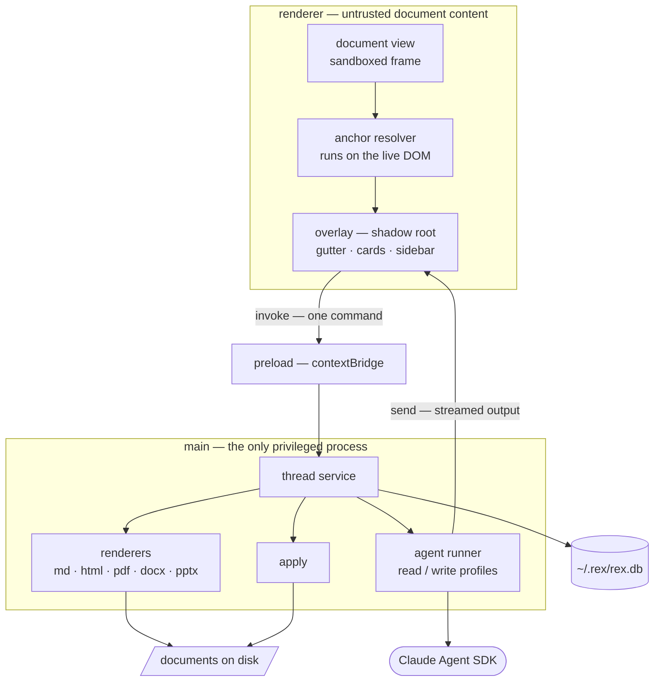
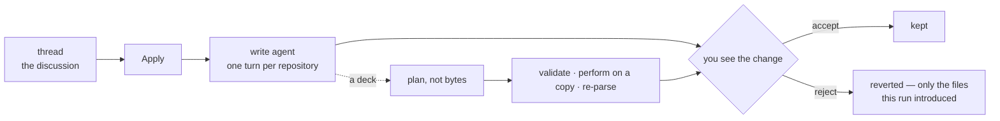

<p align="center">
  <picture>
    <source media="(prefers-color-scheme: dark)" srcset="docs/logo/full/rex-full-on-dark-1024.png">
    
  </picture>
</p>

<p align="center">
  
  
  
  
  
</p>

# REX

*Review EX* — a desktop app for commenting on documents and discussing each
comment with an AI agent. Third in the family after **VEX** and **DEX**.

The logo kit — every lockup, treatment and icon size — is in
[`docs/logo/`](docs/logo/README.md), generated from `docs/logo/rex-logo.png` by
`docs/logo/build.sh`. The header above is the `full` lockup, the same shape VEX
uses: the mark, then the whole word. It swaps itself in GitHub's dark theme —
all three letters go white and the mark stays red, which is the `on-dark`
treatment.

## What it does

Select text → write a comment → **Ask**. One agent answers that one comment.
Keep chatting in the thread. Flip the switch beside the box to **Act** — or
press `shift`+`tab` — and the same gesture sends an *instruction* instead of a
question: a write-capable agent makes the change and shows you a diff, and
nothing is kept until you accept it.

Not everything worth commenting on is a run of text. **Pick element** — the
toolbar button, `P`, or holding `⌥` — hovers the smallest anchorable thing under
the cursor and offers what encloses it along a path bar (`↑` / `↓` to widen),
so a comment can be written against a table, a row, a cell, a section or a
figure. Dragging inside a figure cuts a region out of it. The panel offers the
same widening after a text selection, and shows how well each choice would
survive an edit before you commit to it.

Two scopes sit at the wide end of that path bar. **`section`** is one heading's
worth — the heading, plus everything under it up to the next heading of the same
or higher rank — and it is anchored on the *heading*, which is short and in
Markdown carries a hand-written slug id. **`document`** is the file itself: it
names nothing inside the file, so it is the one comment whose subject cannot be
edited away. "Is this still accurate?" is still waiting a month later, whatever
happened to the prose.

And some subjects have no structure to point at — a table, the two paragraphs
under it and a picture. The **pen** — the toolbar button or `N` — draws a circle
on REX's own glass, and every block whose centre falls inside it becomes a place
in the panel, in document order. Circle something with no block inside it, like
a region of a chart, and you get that region instead. The ink is kept with the
comment as fractions of what it was drawn around, so it reflows when the
document does; the *targets* are ordinary anchors, and nothing downstream — not
resolution, not Apply, not the agent — knows the pen exists.

Comments persist. Reopening a document shows every comment, open and resolved,
still attached to the right place in the text — even after the document has
been edited underneath them.

Open a **folder** instead of a file and REX shows an explorer down the left,
with each document's comment counts beside it, and a **reference graph** of how
the documents link to each other — with the review data drawn on top, so it
shows where the unfinished discussion is.

## Documents it opens

| Format | Extensions | Read by | What is worth knowing |
|:--|:--|:--|:--|
| Markdown | `.md` `.markdown` `.mdown` `.mkd` | `markdown-it`, in main | every block carries `data-src-line`, so Apply knows which source line a comment is about. KaTeX, footnotes, heading slugs; Mermaid is drawn in the renderer |
| HTML | `.html` `.htm` `.xhtml` | sanitised with DOMPurify, in main | shown as the document draws itself, `prefers-color-scheme` included |
| PDF | `.pdf` | `pdfjs-dist`, in the renderer | the document frame runs no script, so a canvas inside it never composites. REX draws the page in its own document and passes the finished picture in as an `` |
| DOCX | `.docx` | `mammoth`, in main | semantic HTML — headings, lists, tables. Styles mammoth could not map are reported, not swallowed |
| PPTX | `.pptx` | `pptxtojson`, in main | one HTML slide per slide, media served over `rex-doc://`, speaker notes in a drawer. See [PowerPoint](#powerpoint) |

`.ppt` — the pre-2007 binary format — is deliberately absent. It is not a zip,
so accepting it would fail at parse time with a confusing message instead of at
listing time with a clear one.

A file REX cannot open still appears in the explorer, with the reason beside it.
A folder can be excluded from the review, and the excluded row stays in the tree
rather than vanishing from it.

## Quick start

### Prerequisites

- **Node.js 24 or newer.** The suites hand `.ts` files straight to `node`, so it
  must be a version whose type stripping is on by default — 22.18+, 23.6+, or
  any 24.
- A toolchain that can rebuild a native module, because `better-sqlite3` is one.
- **macOS on Apple silicon.** REX is a macOS app (spec 50). It was built for
  Windows and Linux too, and both were installed and validated in VMs on
  2026-09-07; support for them was removed on 2026-09-08, because REX claimed
  three operating systems while two of them could not run every agent in every
  mode. One platform that is true beats three with footnotes. Spec 50 §5 keeps
  what those builds measured.

### Install and run

```bash
npm install                # postinstall is not used; rebuild explicitly
npm run rebuild            # better-sqlite3 against Electron's ABI
npm run build
npx electron .             # empty
npx electron . doc.md      # one document
npx electron . docs/       # a folder, as a workspace
```

> **Every `npm install` undoes `npm run rebuild`** — including one that installs
> a single unrelated package. npm reinstalls `better-sqlite3` against Node's
> ABI, and the tests keep passing (they run under `node`) while the app dies the
> moment it touches the database. It does not die loudly: the window opens, the
> debugger port answers, and the process disappears on the first query, which
> looks like a crash on whatever you clicked. Measured 2026-09-03, updating the
> Agent SDK. **Run `npm run rebuild` after any install.**

### Developing

`npm run dev` runs the same app through electron-vite, watching all three
processes. Only one of them is truly hot, and the difference is worth knowing
before you go looking for a change that is not there:

| You edited | What happens | State |
|:--|:--|:--|
| `src/renderer/**` | Vite HMR patches the module in place | kept — the open document stays open |
| `src/preload/**` | the renderer reloads | the window survives, the page does not |
| `src/main/**`, `src/shared/**` used by main, `schema.sql` | **Electron restarts** | lost — a new window |

The `--watch` flag is what covers the last two rows. Without it, `electron-vite
dev` builds main and preload once at startup and never looks at them again, so
an IPC channel or a query added after the server started is simply not there —
the renderer hot-reloads a UI that then calls into a preload which does not have
the method. That failure looks exactly like "my change did nothing".

A main-process restart cannot be hot: the process holds the SQLite handle and
the Agent SDK, and there is no way to patch a running one.

## Commands

| Command | What it does |
|:--|:--|
| `npm run dev` | electron-vite dev server, watching main and preload too |
| `npm run build` | build main, preload and renderer into `out/` |
| `npm start` | preview the built app through electron-vite |
| `npm run rebuild` | rebuild `better-sqlite3` for the current Electron — **after every `npm install`**, see below |
| `npm run typecheck` | `tsc --noEmit` over everything |
| `npm run test:anchor` | the anchor gate, against two real documents |
| `npm run test:comments` | comment names, the tree, the drop rules and the group store |
| `npm run test:errors` | what a failed run tells you, and what it must not guess |
| `npm run test:gate` | the read profile's deny gate |
| `npm run test:lasso` | what a drawn circle selects, as pure geometry |
| `npm run test:links` | link extraction and resolution, for the graph |
| `npm run test:markdown` | the Markdown renderer and its `data-src-line` stamps |
| `npm run test:migrate` | the schema migrations, run twice |
| `npm run test:models` | the model list, the default, and the column that records one |
| `npm run test:prompts` | what a comment's places look like to the agent |
| `npm run test:targets` | multi-target comments and their worst-state rule |
| `npm run test:diff` | which lines an Apply changed, from its patch |
| `npm run test:debug` | the debug report, and what it names |
| `npm run test:workspace` | the folder scan, exclusions and the tree |
| `npm run test:workspace-files` | the guards on renaming a file and moving one to the Bin |
| `npm run test:pptx` | the deck reader, against four real presentations |
| `npm run test:pptx-anchor` | the deck anchor gate, against decks REX itself edited |
| `npm run test:pptx-edit` | the twelve edit operations, and what each did *not* change |
| `npm run test:profiles` | which marketplace plugins a session loads, and when |
| `npm run export -- <doc>` | a document's threads as Markdown (`--json`, `--out`) |

There is no single `npm test`: each suite names one component that fails
silently, and running them one at a time is how their output stays readable.

## Configuration

REX needs no configuration file. Five environment variables exist, and four of
them are overrides you will not normally set:

| Variable | What it does | Default |
|:--|:--|:--|
| `REX_DB_PATH` | where the comment database lives | `~/.rex/rex.db` |
| `REX_CACHE_PATH` | extracted deck media and agent sidecars | `~/.rex/cache` |
| `CLAUDE_CONFIG_DIR` | where the Agent SDK keeps its session transcripts | `~/.claude` |
| `GEMINI_API_KEY` | turns on the generated-image and generated-video operations. Absent, the feature is **absent** rather than broken — a plan that asks for it is rejected with that reason | unset |
| `MEDIA_OUTPUT_DIR` | **set by REX**, not by you — it tells the media plugin where to put what it makes | set per run |

Everything REX owns lives under `~/.rex/`, outside every repository, so no
comment and no cached slide can ever be committed by accident:

```text
~/.rex/
├── rex.db          comments, threads, messages, apply runs
├── cache/          extracted deck media, agent text sidecars
└── marketplaces/   plugin checkouts, only when one is not already on the machine
```

## Architecture

Electron, two processes, talking over IPC only. Three invariants shape
everything (spec 01 §3):

| # | Invariant |
|:--|:--|
| I1 | The anchor resolver runs **in the renderer, on the live DOM**. Main stores anchors and never resolves them. |
| I2 | Only main touches SQLite and the Agent SDK. The renderer displays untrusted document content. |
| I3 | Commands are `ipcRenderer.invoke`; agent output is `webContents.send`. No HTTP server, no broker, no listening port. |



```text
src/
├── main/        SQLite, the Agent SDK, document renderers, Apply
│   ├── agent/      the runner, the two profiles, the deny gate, prompts
│   ├── db/         schema.sql, migrations, typed queries
│   ├── pptx/       the deck plan, the surgery, the validator
│   ├── render/     markdown · html · pdf · docx · pptx
│   └── workspace/  the folder scan and the reference graph
├── renderer/    the document view, the shadow-root overlay, the anchor resolver
│   ├── anchor/     create, resolve, highlight, section, lasso, pick
│   └── overlay/    the shell, the cards, the sidebar, the graph, the pen
├── preload/     the contextBridge surface
├── shared/      types.ts and channels.ts — the contract between the two
└── cli/         rex export
```

## Anchoring

A CSS selector breaks the instant a paragraph is inserted above it, and REX
ships a feature that edits documents — so anchors are invalidated by the tool's
own normal operation. Anchors therefore degrade in layers (spec 01 §6):

| Layer | Resolves by | Survives |
|:--|:--|:--|
| 1 | the quoted text, disambiguated by its surrounding 32 characters | reflow, restyling, most edits |
| 2 | a bounded fuzzy search, verified over the whole quote | small rewordings |
| 3 | an element's identity — its id, or a selector built from what identifies it | images, SVG, anything with no text |

Two things are read *before* the layers. A **region** — a box dragged inside a
figure — carries a fingerprint of what that figure held, because geometry always
resolves and a redrawn chart would otherwise report success while pointing at new
content. An **extent** says the anchor covers more than the thing it names: a
`section` resolves its heading through the layers above and then walks siblings
to find where the run ends, and a `document` names nothing inside the file and so
can never move.

When every layer fails the thread is **orphaned**, which is a normal outcome
rather than an error: it keeps its note and its original quote in the orphan
tray. Nothing is ever deleted, and nothing is ever silently re-attached
somewhere else.

Highlights are painted with the CSS Custom Highlight API and the stylesheet is
adopted rather than inserted, so the document under review is never mutated —
no `<mark>`, not one node.

## The agent, and Apply

Two profiles, and the difference between them is the whole safety story
(spec 01 §8.2 and §8.4). On screen they are called **ASK** and **ACT** —
spec 12 §2, named after what the reviewer is doing — and the band at the head of
the comment card says which one is running, from the first step rather than when
the answer arrives:

| Profile | Mode | Runs for | Can write | Turns |
|:--|:--|:--|:--|:--|
| `read` | **ASK** | a question about the document, and every message in the thread after it | **no.** `Write`, `Edit` and `NotebookEdit` are disallowed, and a `PreToolUse` hook denies the shell write vectors — `tee`, `sh -c`, `python -c`, a plain redirect, and a redirect appended to an otherwise-allowed command | 30 |
| `write` | **ACT** | an instruction to change the document | yes, on the documents the comment is about — and you see a diff before anything is kept | unbounded |

**The rule the gate keeps is spec 12 §6.1: a command is refused when it can
change something, and allowed when it cannot.** The mechanism is an allowlist
anyway, and the mismatch is deliberate — to allow everything except known
writers, REX would have to know every program that writes, and `xsltproc -o`,
`sqlite3` and `make` are three that nobody thinks of. Under an allowlist
"cannot write" is a fact; under a denylist it is a hope.

So the list is long and grows under one test: **a binary joins only when there
is a decidable test for "this invocation writes"**. `cd`, `jq`, `diff`, `sort`,
`unzip -l`, `sed -n` and about thirty others are on it; `2>/dev/null` and `2>&1`
are not writes and no longer stop a command. `python`, `sh`, `xargs`, `env` and
`make` are absent and always will be, because no flag tells you what they will
do. A refusal says what the command would do and where the same answer can be
had instead — never that it "is not on the allowlist".

The read profile's guarantee is checked as a backstop, not assumed:
`git status --porcelain` in the document's repository after a read session must
be empty, and `npm run test:gate` runs the deny vectors directly.

### Choosing the mode

**You pick the mode before you send, in the same gesture** — spec 12 §3. A
segmented `ASK | ACT` switch sits beside the send button, in the selection
panel's foot and in the comment card's reply row. **`shift`+`tab`** toggles it
from inside the box, and the send button changes with it: `Ask about 3` becomes
`Change 3`.

- **ASK** is the default for every new comment, because most comments are
  questions.
- **ACT** sends what you typed as an *instruction*. It needs no prior answer, so
  a reviewer who already knows what they want selects a passage, switches to
  ACT, types it, and sends.
- The switch **stays on ACT** for that thread, so a run of changes takes a
  sentence each. It resets to ASK when REX restarts: the state that survives a
  restart should be the safe one.
- ACT is greyed out when this comment's documents cannot be edited at all, with
  the reason in its tooltip.

There is **no `Apply…` button**. ACT replaces it, which is what lets a
conversation that started as a question end with "ok, do it" without leaving the
reply box.

An ACT run never changes a file you have not seen the change to:



The write agent does edit the files first — that is how the change comes to
exist — so rejecting reverts them, and Apply refuses to start unless that revert
is guaranteed to be clean. The revert list is the files *this run* introduced,
never every dirty file in the tree: somebody else's uncommitted work is not
REX's to discard. A comment that spans three files gets one agent turn per
repository, because `git checkout` is a per-repository promise.

When an answer looks wrong, the **trace sheet** shows the run as it happened —
every call, and `system` kept as a third voice rather than folded into the
answer — and the **debug report** copies out the facts only main knows: which
session file holds this answer, which thread row it came from, and which working
directory the agent was pointed at.

## PowerPoint

A deck is a review document, and until spec 11 REX showed it in the explorer as
a file it refused to render. There are 144 `.pptx` files on this machine; it is
not a hypothetical format.

**Reading.** The deck is parsed to one HTML slide per slide, so a slide is HTML
like everything else REX renders — which is why `src/renderer/anchor/` needed no
change at all. Media is extracted to `~/.rex/cache` and served over `rex-doc://`,
never inlined as a `data:` URI. Speaker notes appear in a drawer. A deck that
does not parse shows its message rather than a blank pane, and Apply is disabled
for it.

**Anchoring.** A slide is a set of boxes, and a comment on a slide is almost
always about one box — this title, that card, this photograph. `Anchor` already
modelled exactly that with `ElementRef` and `RegionRef`, so `src/shared/types.ts`
is unchanged too. `npm run test:pptx-anchor` re-resolves anchors against decks
REX itself edited.

**Editing.** `git diff` on a `.pptx` prints `Binary files differ`, so the
show-the-change-and-wait step that protects every other Apply would become a
rubber stamp. Two things replace it:

1. **The agent writes a plan, never bytes.** REX validates the plan, performs it
   on a copy, then re-parses the result and confirms that **nothing the plan did
   not name changed**. The agent never fetches an image, never draws one, and
   never touches the zip.
2. **The preview is a picture.** Before and after, slide by slide — the change
   as you will actually get it.

Twelve operations, because a review is wide. A tool that can only retype a
sentence sends the reviewer back to PowerPoint for most of what is said about a
deck:

| | | |
|:--|:--|:--|
| `setText` | `insertTextBox` | `deleteShape` |
| `insertImage` | `replaceImage` | `insertVideo` |
| `moveShape` | `setStyle` | `setThemeFont` |
| `reorderSlides` | `duplicateSlide` | `deleteSlide` |

Every operation that changes something which already exists names what it
expects to find, and the surgery refuses when the expectation does not hold.

Native PowerPoint comments are out of scope by decision: REX renders a deck and
holds its own comments in its own database. It does not write `ppt/comments/`,
does not read existing ones, and does not try to round-trip PowerPoint's review
model.

## The reference graph

Links come out of `markdown-it`'s token stream rather than a pattern, so a link
inside a code fence is not counted and a reference-style link resolves to its
definition. HTML uses a pattern, which is honest for a navigational aid.

What is drawn, and what is only counted:

| | |
|:--|:--|
| a document in the workspace | drawn |
| a document outside it that exists | drawn, as `external` |
| a link target that does not exist | drawn as `missing`, and listed as a broken link with its line |
| `http(s)` and `mailto` | counted — drawing them buries the structure |
| a PDF, an image, any non-document | counted — the explorer will not open it, so the graph does not offer to |

Node size is the count of open comments and colour is their state, so the graph
shows where review attention is concentrated and which documents REX's own
Apply has orphaned anchors in. Edge thickness is how many times one document
references another.

Selection is one idea shared by both views: pick a file in the explorer and its
node lights up with everything it links to; pick a node and the explorer follows
it. A single click never navigates away from the graph — seeing the connections
is what the click asked for — so double-click opens the document instead.

The simulation stays live. Drag a node and its neighbours follow, drag the
background to pan, scroll to zoom, and **fit** re-frames.

Ranking is by **total incoming links**, not in-degree. Measured on a real docs
folder: five documents that all cite each other have an in-degree of 4 apiece
and the hub is invisible, while link count puts it first with 19.

## The tests, and why these ones

They cover the components that **fail silently** — where a regression looks
exactly like working code until a human notices something wrong.

**`test:anchor`** resolves ten anchors across
`2026-08-20-architecture-explained.html` and `components.md`, applies three
realistic edits (insert a paragraph, reword a sentence, delete a section), and
re-resolves. It does not assert that resolution *succeeded* — it prints what
each anchor landed on and fails when an anchor reports success while sitting on
text it was never created from. A comment that quietly moves to the wrong
paragraph is the failure mode this exists to catch.

It then does the same for a **region** — a box dragged inside a figure. Geometry
always resolves, so a redrawn chart would otherwise report success while
pointing at whatever now occupies the box. The case redraws one figure and
requires that anchor to orphan, while its untouched neighbour still resolves.

It then does the same for **sections**, which fail differently: a section is
anchored on its heading, and a positional path like `section:nth-of-type(4) >
div > h2` still matches a heading after a section above it is deleted — just not
the same one. Measured with the guard removed, a comment on a *deleted* section
resolved onto "The six components" and reported `moved`. The case reports which
heading each section landed on and fails when that is not the one it was created
from.

**`test:lasso`** puts fixture boxes in and reads selected boxes out, with no DOM
involved: an open circle must select what a closed one does, a `td` inside its
`tr` inside its `table` must yield only the table, and a circle that encloses
nothing must yield nothing. A circle that quietly takes the wrong paragraph
looks exactly like a circle that worked.

**`test:migrate`** runs each schema migration against a real SQLite file and
then runs it again. A migration executes on every open, against a database that
already holds somebody's comments, so its *second* run matters as much as its
first.

**`test:gate`** checks that a `read` agent cannot write, against the write
vectors spec 01 §8.4 names — `python -c`, `tee`, `sh -c`, a plain redirect —
and against redirects appended to otherwise-allowed commands. Since spec 12 it
checks the other direction too, and that half is the one with transcripts
behind it: `cd … && grep …` and `wc -l *.md 2>/dev/null` were both refused by a
gate working exactly as written, and neither could have changed a byte.

**`test:errors`** checks what REX says when a run fails. The rule is that the
original error always survives — REX may add a sentence in front of it and
never speaks in its place. It exists because a real failure was reported as
"check that the claude executable is on PATH", which was false: the Agent SDK
ships its own binary and never consults `PATH`.

**`test:links`** checks the half of the reference graph that has a right
answer. A link inside a fenced code block is not a link, a reference-style link
resolves to its definition, a fragment does not create a second node, and an
ambiguous wikilink is reported rather than guessed at. The drawing is judged by
eye; this is judged by assertion.

**`test:pptx-edit`** runs each of the twelve deck operations against real
presentations and then asserts what the operation did **not** change. A deck is
a zip of XML with parts that reference each other by id: an edit that leaves a
dangling relationship still opens in REX and still fails in PowerPoint, which is
the definition of a silent failure.

## What REX does with each file format

[`docs/FORMATS.md`](docs/FORMATS.md) is the product decision behind every format
REX opens: what it will change in a `.docx`, a `.pptx`, Markdown and HTML, why a
PDF is read-only, and why there is no manual editing anywhere. Read it before
asking "can REX do X to a Word file" — every answer is in one table, and every
"no" says why.

## The specs

The specs are the authority on everything above. Each one extends its
predecessors rather than restating them:

| # | Spec | About |
|:--|:--|:--|
| 01 | [the app](docs/my-specs/01-initial/SPEC.md) | anchors, threads, the two agent profiles, Apply |
| 02 | [workspace and graph](docs/my-specs/02-workspace-and-graph/SPEC.md) | the folder explorer and the reference graph |
| 03 | [rich rendering](docs/my-specs/03-rich-rendering/SPEC.md) | HTML, PDF and DOCX beside Markdown |
| 04 | [selection and shortcuts](docs/my-specs/04-selection-and-shortcuts/SPEC.md) | a comment about more than one place |
| 05 | [selection as a phase](docs/my-specs/05-selection-as-a-phase/SPEC.md) | Apply across documents, shown in the document |
| 06 | [the document, the section and the pen](docs/my-specs/06-document-section-and-pen/SPEC.md) | the wide end of the path bar, and the ink |
| 07 | [the fact graph](docs/my-specs/07-fact-graph/SPEC.md) | **withdrawn** by 09 — kept for its measurements |
| 08 | [the shell redesign](docs/my-specs/08-shell-redesign/SPEC.md) | the shell, the trace sheet, the debug report |
| 09 | [removing the fact graph](docs/my-specs/09-removing-the-fact-graph/SPEC.md) | 6,334 lines deleted, and why |
| 10 | [the figure preview, and exclusions](docs/my-specs/10-figure-preview-and-exclusions/SPEC.md) | the lightbox, and what is not part of the review |
| 11 | [PowerPoint](docs/my-specs/11-powerpoint/SPEC.md) | reading a deck, and editing one |
| 12 | [ASK and ACT](docs/my-specs/12-ask-and-act/SPEC.md) | the mode is a choice, and it is on the screen |
| 13 | [debugging](docs/my-specs/13-debugging/SPEC.md) | every run opens a debugger, and the log a reviewer can paste |
| 14 | [naming, order and groups](docs/my-specs/14-naming-order-groups/SPEC.md) | a name on every comment, an order you set, groups that nest |
| 15 | [the working copy, and the two panes](docs/my-specs/15-the-working-copy/SPEC.md) | the agent edits a copy you iterate on, read side by side, and approve when it is right |
| 16 | [the two versions](docs/my-specs/16-the-two-versions/SPEC.md) | what a gesture means in each pane, and a place between two blocks |
| 17 | [stopping a run](docs/my-specs/17-stopping-a-run/SPEC.md) | a running agent can be stopped, and the conversation says who stopped it |
| 18 | [what the colours mean](docs/my-specs/18-what-the-colours-mean/SPEC.md) | seven facts, seven colours, one vocabulary |
| 19 | [the Word document, and the notes on a slide](docs/my-specs/19-word-and-notes/SPEC.md) | a comment can change a DOCX, a deck's notes are reachable, and a PDF never will be |
| 20 | [the agent window](docs/my-specs/20-the-agent-window/SPEC.md) | with `PW_AGENT=1`, REX says who opened it — and is born on the test desktop, out of the reviewer's sight |
| 21 | [the file the agent creates](docs/my-specs/21-the-file-the-agent-creates/SPEC.md) | a file the agent wrote inside the workspace is kept, and shown in the tree |
| 22 | [the whole workspace](docs/my-specs/22-the-whole-workspace/SPEC.md) | ACT may edit any text document under the root, and each one gets a working copy |
| 23 | [renaming and deleting a file](docs/my-specs/23-renaming-and-deleting-a-file/SPEC.md) | the tree's menu can rename a file and move one to the Bin, and the comments follow |
| 24 | [pointing at a place, mid-conversation](docs/my-specs/24-pointing-mid-conversation/SPEC.md) | a reply can carry new places; the comment grows, and the turn says what it added |
| 25 | [choosing the model](docs/my-specs/25-choosing-the-model/SPEC.md) | a model per message, a default you set, and the answer says which one wrote it |
| 26 | [widening a place you already took](docs/my-specs/26-widening-a-place/SPEC.md) | the path bar outlives the click, and ↑ ↓ move the place instead of adding a second |
| 27 | [the width of the page, and the dark paper](docs/my-specs/27-width-and-dark-paper/SPEC.md) | two switches on the Markdown page REX typeset itself — and nothing else |
| 28 | [find in the page, and search across the workspace](docs/my-specs/28-find-and-search/SPEC.md) | `⌘F` paints every match on the page and marks them on a ruler at the pane's edge; `⌘⇧F` is a `Search` tab beside the tree that lists the files, and a click opens one painted — as VS Code does |
| 29 | [the parts of a diagram, and its source](docs/my-specs/29-diagram-parts-and-source/SPEC.md) | a comment on a Mermaid node, edge, subgraph or line names it in the fence's source, not in the SVG; the lightbox shows the drawing beside the source, and a click in either takes a place |
| 31 | [how the agent writes](docs/my-specs/31-how-the-agent-writes/SPEC.md) | an output style beside the model, remembered for the whole chat and used by every mode |
| 34 | [the copy is permanent](docs/my-specs/34-the-permanent-copy/SPEC.md) | REX's copy of a document lives at one path from the first agent on and is never deleted; approve and discard move content, a running agent holds its documents, and a reviewer's approve or discard is a message in the thread |
| 38 | [the trace block](docs/my-specs/38-the-trace-block/SPEC.md) | a tool call in the trace is a head and stacked `INPUT` / `CHANGE` / `OUTPUT` rows; `YOU` wears its mode and lists its places, the answer's foot names the model and the style, the head is the comment's name and the card's run line, and the foot is the card's composer |
| 41 | [copying a block](docs/my-specs/41-copying-a-block/SPEC.md) | every block in the chat and the trace grows a copy button in its head, hidden until the pointer is over it; a spoken block copies its words alone, a tool call copies its head, `INPUT`, `CHANGE` and `OUTPUT` even while they are folded |
| 42 | [the agent library](docs/my-specs/42-the-agent-library/SPEC.md) | every agent SDK sits in one Python package that REX runs as a child over stdin and stdout, one JSON line per message and no port; it emits its own events and asks REX's gate before every tool call, and with only Claude and the reviewer's subscription behind it nothing on screen changes |
| 43 | [the local gateway](docs/my-specs/43-the-local-gateway/SPEC.md) | a gateway control beside the model, LiteLLM and Envoy filled from a kind and a host, one session per gateway a comment has used, and every answer records the gateway, URL and model that produced it |
| 44 | [the Codex agent](docs/my-specs/44-the-codex-agent/SPEC.md) | the agent control appears, and Codex is its second row: a Responses route, a read-only sandbox for ASK, and ACT held behind a write-boundary proof |
| 45 | [watching the gateway](docs/my-specs/45-watching-the-gateway/SPEC.md) | every request through the gateway kept and searchable, with its cost, its latency and the REX run, thread and profile that spent it; three containers beside the gateway in `infra/`, development infrastructure that ships nothing, and a comment card that links to its own traffic. **Retired by spec 46**: `infra/` and its containers are gone, and REX renders the traffic itself |
| 46 | [the built-in gateway](docs/my-specs/46-the-builtin-gateway/SPEC.md) | REX ships its own LiteLLM and runs it on a switch, on one loopback port; model providers — LM Studio, Ollama, Unsloth, OpenAI, OpenRouter, Anthropic — are added in a Settings screen instead of a YAML file, every key is stored encrypted, an existing LiteLLM is asked what it serves, and one model name serves all four SDKs |
| 47 | [the OpenCode agent](docs/my-specs/47-the-opencode-agent/SPEC.md) | the agent control's third row: a loopback OpenCode server REX owns and drives with its own small HTTP client, a private provider per gateway, a project mirror so ASK never writes into the repository, and permission requests answered by REX's gate. **ASK and ACT are both built and proved end to end** — a seatbelt around the OpenCode server makes the reviewed repository unwritable by the operating system rather than by a promise |
| 48 | [the deep agent](docs/my-specs/48-the-deep-agent/SPEC.md) | the agent control's fourth and last row: LangChain Deep Agents as a graph inside the agent service itself — no child process, no CLI and no shell — on the OpenAI chat route of the built-in gateway, with the SDK's own filesystem rules plus REX's path check as the write boundary, and a fresh graph seeded with the replay on every send. **ASK and ACT are both built and proved end to end**, with the boundary in the SDK's rules and a path check rather than an operating-system sandbox |
| 49 | [releases](docs/my-specs/49-releases/SPEC.md) | every merge to `main` builds the installer on a GitHub runner and publishes it as a Release tagged `v<version>-<run>`, with an install guide for unsigned builds. Five installers until spec 50 cut it to one |
| 50 | [macOS, completely](docs/my-specs/50-macos-completely/SPEC.md) | one platform, no footnotes: Windows and Linux removed — the builds, the installers, the platform branches and the claim — and the one thing that was actually broken fixed. A Deep Agents ASK could not read the document REX told it to read, because the prompt names the working copy by absolute path and the backend was rooted at the workspace; `RunRequest.readable` is what carries those folders now |

## Contributing

This is a personal project and there is no contribution process yet. The
workflow every change follows — understand, plan, implement, **test**, report —
is in [`.claude/CLAUDE.md`](.claude/CLAUDE.md) and the numbered files under
[`.claude/rules/`](.claude/rules). The rule that matters most: a change is not
done until it has been run and watched working, because the anchor resolver is
the one component where "the code looks right" is actively misleading.

## License

Not licensed for redistribution. The package is `private`, and no `LICENSE` file
has been chosen yet.
