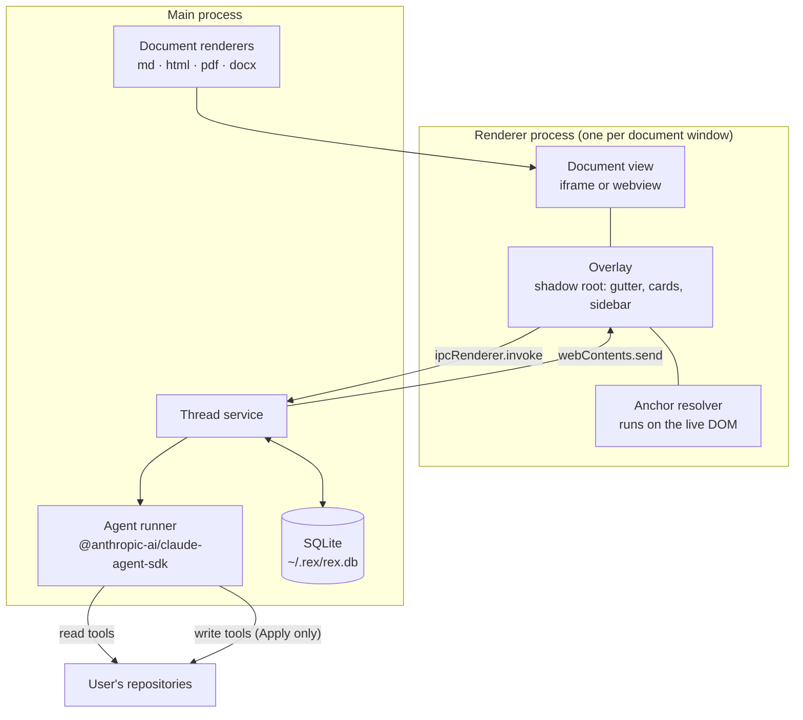

# REX — implementation specification

**Version:** 1.0 · 2026-08-20
**Audience:** an engineer or agent implementing this from scratch, with no prior context.

> [!note]
> The product is **REX**. Identifiers, paths and the CLI use lowercase `rex`
> (`~/.rex/rex.db`, `rex export`, the `rex-open` highlight name).

---

## 0. How to use this document

Read §1 to §3 before writing any code. Then work milestone by milestone (§13).
Each milestone has acceptance criteria you can run.

**Three rules for the implementer:**

1. **Milestone 0 is a gate.** Do not build the app before the anchor spike
   passes. The anchor resolver is the only component that fails silently — if
   it does not survive a real document edit, the design needs rework, and that
   is far cheaper to learn in 150 lines than in milestone 6.
2. **Verify every Claude Agent SDK symbol before you use it.** This document
   describes *what* to build using Python names from the reference
   implementation (§11). It does **not** give you TypeScript signatures,
   because they were not verified when it was written. Read the SDK docs first:
   `https://code.claude.com/docs/en/agent-sdk`.
3. **Where this document is silent, prefer the simplest thing that works.** Do
   not add features. §14 lists what is deliberately out of scope.

---

## 1. What REX is

REX is a desktop application for **commenting on documents and discussing
each comment with an AI agent.**

The user flow:

1. Open a document (Markdown, HTML, or a URL).
2. Select text, a block, an element, or a region of a diagram.
3. Write a comment.
4. Press **Ask**. One agent answers that one comment.
5. Keep chatting with that agent inside the comment. Each comment is its own
   independent thread.
6. Optionally open a **synthesis thread** that references several comments, to
   ask one agent about all of them at once — for example when two comments
   contradict each other.
7. When a discussion concludes, press **Apply**. A second agent — this one
   allowed to write — makes the change in the source document.

Comments persist. Reopening a document shows every comment, open and resolved,
still attached to the right place in the text.

### 1.1 The name

**REX** — *Review EX*. It is the third in a family of tools by the same author,
after **VEX** (*Visual EX*) and **DEX**. Reviewing documents is what REX does;
commenting is how.

### 1.2 Relationship to Vex

[Vex](https://github.com/lukaskellerstein/vex) is a sibling tool by the same
author. It edits web pages visually and sends the changes to a coding agent.
REX reuses **one** thing from Vex: its Claude Agent SDK adapter, ported to
TypeScript (§11). Everything else is new.

| | Vex | REX |
|:--|:--|:--|
| Purpose | change code by editing a page visually | ask questions about a document |
| Annotation lifetime | seconds — one batch, then discarded | weeks — survives reloads and document edits |
| Anchor strategy | CSS selector | layered text anchor (§6) |
| Default agent right | write | **read** |
| Delivery | Chrome extension + Electron + NATS broker | Electron only |
| Languages | TypeScript + Python | TypeScript only |

---

## 2. Prerequisites

Before starting, confirm each of these exists. Paths are on the author's
machine; adjust if yours differ.

| What | Where | Used for |
|:--|:--|:--|
| Vex checkout | `~/Projects/Github/lukaskellerstein/vex` | The reference adapter you are porting (§11). **Read-only.** |
| The adapter itself | `vex/agent-orchestrator/src/agent_orchestrator/adapters/claude_code_sdk.py` | 1,317 lines. Read it fully before §11. |
| Transcript parser | `vex/agent-orchestrator/src/agent_orchestrator/services/transcript_parser.py` | Port for the session-replay path (§8.5) |
| Plugin marketplace | `~/Projects/Github/lukaskellerstein/claude-my-marketplace` | Supplies the `lsp-*` plugins (§8.3) |
| Agent SDK docs | `https://code.claude.com/docs/en/agent-sdk` | **Authoritative** for every TypeScript binding |
| Test documents | `~/Projects/Github/redhat/ProtoBot/docs/` | Real Markdown and HTML to test anchoring against |

**Test document properties**, measured 2026-08-20 — use these in milestone 0:

- `docs/review/2026-08-20-architecture-explained.html` — 920 lines, 4 `id`
  attributes, 4 inline SVG diagrams, custom light/dark stylesheet.
- `docs/architecture/components.md` — 1,063 lines of Markdown.

These are deliberately hostile: almost no stable `id` attributes, and real
diagrams. If anchoring works here it will work generally.

---

## 3. Architecture



**Three invariants that follow from this shape. Do not break them.**

| # | Invariant | Why |
|:--|:--|:--|
| I1 | The anchor resolver runs **in the renderer, on the live DOM**. The main process stores anchors and never resolves them. | For a `<webview>` showing a remote page there is no local file for the main process to search. |
| I2 | Only the main process touches SQLite and the Agent SDK. | The renderer displays untrusted document content. It must hold no database handle and no credentials. |
| I3 | Commands are `ipcRenderer.invoke`; agent output is `webContents.send`. **No HTTP server, no SSE, no message broker, no listening port.** | Vex needs NATS because three processes share events. REX has one producer. |

### 3.1 Repository layout

```text
rex/
├── package.json
├── tsconfig.json
├── electron.vite.config.ts
├── src/
│   ├── main/
│   │   ├── index.ts                 app bootstrap, window creation
│   │   ├── ipc.ts                   channel registration (§10)
│   │   ├── db/
│   │   │   ├── schema.sql           §9, verbatim
│   │   │   ├── database.ts          open, migrate, WAL
│   │   │   └── queries.ts           typed query functions
│   │   ├── agent/
│   │   │   ├── runner.ts            ported adapter (§11)
│   │   │   ├── profiles.ts          read / write profiles (§8.2)
│   │   │   ├── gate.ts              PreToolUse deny hook (§8.4)
│   │   │   ├── prompts.ts           system + user prompt templates (§8.6)
│   │   │   └── transcript.ts        JSONL replay (§8.5)
│   │   ├── render/
│   │   │   ├── markdown.ts          markdown-it + data-src-line (§5.3)
│   │   │   ├── html.ts              sanitise + serve (§5.4)
│   │   │   └── index.ts             dispatch on DocumentRef
│   │   └── apply.ts                 Apply orchestration (§8.7)
│   ├── renderer/
│   │   ├── index.html
│   │   ├── main.tsx                 mounts the shell
│   │   ├── overlay/
│   │   │   ├── Overlay.tsx          shadow root host
│   │   │   ├── Gutter.tsx           markers
│   │   │   ├── CommentCard.tsx      thread view + chat
│   │   │   ├── Sidebar.tsx          all threads, filters
│   │   │   └── OrphanTray.tsx       unresolvable anchors
│   │   └── anchor/
│   │       ├── textIndex.ts         normalise + offset map (§6.3)
│   │       ├── create.ts            Range → Anchor (§6.4)
│   │       ├── resolve.ts           Anchor → Range (§6.5)
│   │       └── highlight.ts         CSS Custom Highlight API (§6.7)
│   ├── shared/
│   │   ├── types.ts                 §4, the single source of truth
│   │   └── channels.ts              IPC channel names + payload types
│   └── preload/
│       └── index.ts                 contextBridge surface
└── test/
    ├── anchor.spec.ts               milestone 0 lives here
    └── fixtures/
```

### 3.2 Dependencies

| Package | Purpose | Note |
|:--|:--|:--|
| `electron` | shell | |
| `electron-vite` | build | |
| `react`, `react-dom` | renderer UI | |
| `better-sqlite3` | storage | Native module. Add `electron-rebuild` to the build. |
| `@anthropic-ai/claude-agent-sdk` | agents | **Verify every binding against the docs** |
| `markdown-it` | Markdown rendering | needs `token.map` for `data-src-line` |
| `dompurify` | HTML sanitising | §5.4 |
| `diff-match-patch` | fuzzy anchor matching | §6.5 step 4 |
| `uuid` | ids, and `uuidv5` for session ids | |

Do **not** add: any NATS client, any HTTP server framework, `nats.ws`, or any
Python runtime.

---

## 4. Shared types

`src/shared/types.ts` is the single source of truth. Everything below is
complete and can be copied verbatim.

```ts
// ── Documents ───────────────────────────────────────────────

export type DocumentRef =
  | { kind: "file"; value: string }   // absolute path
  | { kind: "url";  value: string };  // full URL

export interface DocumentRecord {
  id: string;
  ref: DocumentRef;
  title: string | null;
  contentHash: string | null;         // sha256 of source bytes; null for url
  lastSeenAt: string;                 // ISO 8601
}

// ── Anchors ─────────────────────────────────────────────────

export interface TextQuote {
  exact: string;
  prefix: string;                     // up to 32 chars before
  suffix: string;                     // up to 32 chars after
}

export interface TextPosition {
  start: number;                      // offset in normalised document text
  end: number;
}

export interface ElementRef {
  id?: string;                        // element id attribute, if stable
  css?: string;                       // fallback CSS path
}

export interface RegionRef {
  x: number; y: number;               // fractions of the element box, 0..1
  w: number; h: number;
}

export interface SourceRef {
  file: string;                       // absolute path
  line: number;                       // 1-indexed
}

export interface Anchor {
  quote: TextQuote | null;            // null for pure element/region anchors
  position: TextPosition | null;
  element: ElementRef | null;
  region: RegionRef | null;
  source: SourceRef | null;           // only when REX rendered the document
}

export type AnchorState = "ok" | "moved" | "orphaned";

// ── Threads and messages ────────────────────────────────────

export type ThreadKind = "anchored" | "synthesis";
export type ThreadStatus = "open" | "resolved";
export type Profile = "read" | "write";

export interface Thread {
  id: string;
  documentId: string;
  kind: ThreadKind;
  status: ThreadStatus;
  anchor: Anchor | null;              // null for synthesis threads
  anchorState: AnchorState | null;
  note: string;                       // the comment the user typed
  sessionId: string | null;
  profile: Profile;
  model: string | null;
  refThreadIds: string[];             // synthesis threads only
  createdAt: string;
  updatedAt: string;
  resolvedAt: string | null;
}

export type MessageRole = "user" | "assistant" | "system";

export type MessageKind =
  | "text" | "thinking" | "tool_call" | "tool_result"
  | "diff" | "error" | "completed";

export interface Message {
  id: string;
  threadId: string;
  seq: number;
  role: MessageRole;
  kind: MessageKind;
  content: string | null;
  toolName: string | null;
  toolInput: unknown | null;
  isError: boolean;
  costUsd: number | null;
  durationMs: number | null;
  inputTokens: number | null;
  outputTokens: number | null;
  createdAt: string;
}

// ── Apply ───────────────────────────────────────────────────

export type ApplyStatus = "pending" | "applied" | "rejected" | "failed";

export interface ApplyRun {
  id: string;
  threadId: string;
  status: ApplyStatus;
  diff: string | null;
  files: string[];
  createdAt: string;
  completedAt: string | null;
}
```

---

## 5. Documents and rendering

### 5.1 Identity and hashing

A document is identified by `DocumentRef` — a kind plus a value, never a bare
string. This is what allows remote pages to be stored without a schema
migration later.

For `kind: "file"`, compute `contentHash` as the SHA-256 of the file bytes on
every open. Compare it to the stored value. A difference means the document
changed since the comments were written, which affects `anchorState` (§6.6).

For `kind: "url"`, `contentHash` is `null`.

### 5.2 Format tiers

Build in this order. **Do not build tier 3 until a real document requires it.**

| Tier | Format | Renderer | Apply | Milestone |
|:--|:--|:--|:--|:--|
| 1 | Markdown | `markdown-it`, own pipeline | **yes** | 1 |
| 1 | HTML | sanitised, in an `<iframe>` | **yes** | 1 |
| 2 | any URL | `<webview>` | no | 7 |
| 3 | PDF | PDF.js | no | not scheduled |
| 3 | DOCX | `mammoth.js` | no | not scheduled |

Apply is disabled for tiers 2 and 3. There is no local source file, or no
honest way to write back into it. Grey the button out and show why on hover.

Tier 3 notes, for whoever schedules it: PDF text layers give unreliable exact
quotes because of ligatures, hyphenation and column ordering. DOCX renders
acceptably through `mammoth.js` but the conversion is lossy, and writing a
change back into OOXML is a separate project.

### 5.3 Markdown rendering — `data-src-line`

This is the feature that makes Apply precise, so get it right.

`markdown-it` block tokens carry `token.map = [startLine, endLine]`, zero-indexed.
Add a rule that stamps the start line onto every block-level element:

```ts
const md = new MarkdownIt({ html: true, linkify: true });

const BLOCK_RULES = [
  "paragraph_open", "heading_open", "blockquote_open",
  "list_item_open", "table_open", "fence", "code_block",
] as const;

for (const rule of BLOCK_RULES) {
  const base = md.renderer.rules[rule];
  md.renderer.rules[rule] = (tokens, idx, opts, env, self) => {
    const t = tokens[idx];
    if (t.map) t.attrSet("data-src-line", String(t.map[0] + 1));
    return base
      ? base(tokens, idx, opts, env, self)
      : self.renderToken(tokens, idx, opts);
  };
}
```

`fence` and `code_block` have no `_open` token, so they are handled by the same
loop but stamp the whole element.

When creating an anchor, walk up from the selection to the nearest ancestor
carrying `data-src-line` and record it as `Anchor.source`.

### 5.4 HTML rendering

Local HTML files may contain scripts. Rendering them in the renderer process
would execute them with whatever privileges that process holds.

Required handling:

1. Load the file, run it through `dompurify` with scripts and event handlers
   stripped.
2. Render inside an `<iframe sandbox="allow-same-origin">` — same-origin so the
   overlay can reach the DOM for anchoring, but no script execution.
3. Keep the document's own `<style>` and `<link rel=stylesheet>` — the point is
   to review the document as it looks.

For tier 1 HTML, `Anchor.source` is left `null`. Apply locates the edit by
searching the file for the quote text, which works because hand-written HTML
contains its prose literally.

---

## 6. Anchoring

The core of the product. Specified in full because it is the only part that
fails silently.

### 6.1 The problem

A CSS selector such as `html > body > div:nth-of-type(2) > p:nth-of-type(3)`
breaks the instant a paragraph is inserted above it. REX ships a feature
(Apply) that edits documents, so anchors **will** be invalidated by the tool's
own normal operation. Anchors must degrade gracefully, and a comment must never
be lost.

The model below is the W3C Web Annotation Data Model, the same approach
Hypothes.is uses.

### 6.2 The four layers

| Layer | Field | Resolves | Survives |
|:--|:--|:--|:--|
| 1 | `quote` | text search | reflow, restyling, most edits |
| 2 | `position` | character offsets | disambiguates a repeated quote |
| 3 | `element` | `id`, then CSS path | images, SVG, tables — anything with no text |
| 4 | `region` | fractions of the element box | a specific spot inside a diagram |

Layer 1 is primary. Layers 2 to 4 are fallbacks, tried in order.

### 6.3 Text index — normalise and map

Everything depends on one function. Build it first.

```ts
interface TextIndex {
  text: string;                       // normalised document text
  segments: Array<{                   // maps text offsets back to DOM
    node: Text;
    start: number;                    // inclusive, offset into `text`
    end: number;                      // exclusive
  }>;
}

function buildTextIndex(root: Node): TextIndex;
```

Rules for the walk:

1. `TreeWalker` with `NodeFilter.SHOW_TEXT`.
2. **Skip** any node inside `<script>`, `<style>`, `<noscript>`, or inside the
   REX shadow root. If the overlay's own text enters the index, offsets shift
   whenever the UI changes.
3. **Descend into** open shadow roots of the document itself, and into
   same-origin iframes used for tier 1 HTML.
4. Collapse each run of whitespace to a single space. Trim leading whitespace
   at the start of the document.
5. For each text node, append its normalised content and record its
   `[start, end)` range in `segments`.

Two derived helpers:

```ts
function rangeToOffsets(idx: TextIndex, r: Range): TextPosition | null;
function offsetsToRange(idx: TextIndex, p: TextPosition): Range | null;
```

Rebuild the index whenever the document is re-rendered. Cache it otherwise —
building it on a 900-line document should take single-digit milliseconds.

### 6.4 Creating an anchor

```
createAnchor(selection) →
  1. r    = selection.getRangeAt(0)
  2. pos  = rangeToOffsets(index, r)
  3. exact  = index.text.slice(pos.start, pos.end)
  4. prefix = index.text.slice(max(0, pos.start - 32), pos.start)
  5. suffix = index.text.slice(pos.end, min(len, pos.end + 32))
  6. el   = nearest element ancestor of r.commonAncestorContainer
     element.id  = el.id, if present and not matching /^(:|ember|mat-|cdk-|ng-|react-|r:|\d+$)/
     element.css = generateCssPath(el)      // tertiary fallback only
  7. src  = nearest ancestor with [data-src-line] → { file, line }
  8. return { quote:{exact,prefix,suffix}, position:pos, element:el, region:null, source:src }
```

For an **element anchor** (image, SVG, table) `quote` and `position` are `null`
and `element` is required.

For a **region anchor** (a spot in a diagram) the user drags a box. Store it as
fractions of the element's bounding box so it survives resizing:
`{ x: dx/bw, y: dy/bh, w: dw/bw, h: dh/bh }`.

### 6.5 Resolving an anchor

Run in order. Stop at the first success.

```
resolveAnchor(index, anchor) → { range | element, layer } | null

1. EXACT
   hits = all indices of anchor.quote.exact in index.text
   if hits.length === 1        → return offsetsToRange(hit), layer 1
   if hits.length === 0        → go to 3

2. DISAMBIGUATE  (hits.length > 1)
   for each hit:
     scorePrefix = length of common suffix of (text before hit) and anchor.prefix
     scoreSuffix = length of common prefix of (text after hit)  and anchor.suffix
     score       = scorePrefix + scoreSuffix
   pick highest score
   on a tie, pick the hit nearest to anchor.position.start
   → return that range, layer 1

3. FUZZY
   use diff-match-patch:
     dmp.Match_Threshold = 0.25        // 0 = exact, 1 = anything
     dmp.Match_Distance  = 5000        // how far from the expected position to look
     i = dmp.match_main(index.text, anchor.quote.exact, anchor.position.start)
   if i !== -1 → return range at [i, i + exact.length), layer 2

4. ELEMENT
   if anchor.element.id  → el = document.getElementById(id)
   else if .css          → el = document.querySelector(css)
   if el → return el, layer 3

5. ORPHANED
   return null
```

Search cost: for a 20,000-character document, step 1 is a plain `indexOf` loop
and step 3 is a bounded Bitap search. Both are sub-millisecond. Resolving 50
anchors on document open is not a performance concern.

### 6.6 Anchor state

Set `anchorState` from the resolution layer and the document hash:

| Resolved by | Document hash | `anchorState` | Shown as |
|:--|:--|:--|:--|
| layer 1 | unchanged | `ok` | highlight, normal |
| layer 1 | changed | `moved` | highlight + "text changed" badge |
| layer 2 or 3 | any | `moved` | highlight + badge |
| nothing | any | `orphaned` | orphan tray only, not in the margin |

**An orphaned thread is never deleted and never hidden.** It moves to the
orphan tray (§7) showing its original quote, so the user can re-attach it
manually or read it as history. REX's own Apply feature creates orphans, so
this is normal operation, not an error path.

**After every Apply, re-resolve every thread on that document and update
`anchorState`.** This is mandatory — see §8.7 step 6.

### 6.7 Painting highlights

Use the **CSS Custom Highlight API**. Electron ships its own Chromium, so it is
always available.

```ts
const open = new Highlight();
const resolved = new Highlight();
for (const { range, thread } of hits) {
  (thread.status === "open" ? open : resolved).add(range);
}
CSS.highlights.set("rex-open", open);
CSS.highlights.set("rex-resolved", resolved);
```

```css
::highlight(rex-open)     { background: rgba(255, 213, 0, 0.35); }
::highlight(rex-resolved) { background: rgba(120, 120, 120, 0.18); }
```

> [!warning]
> **Never wrap ranges in `<mark>` or any other element.** Wrapping mutates the
> document under review, shifts the character offsets every other anchor
> depends on, and appears in the DOM if an agent inspects it. This is a
> correctness requirement, not a style preference.

---

## 7. User interface

Every pixel REX draws lives inside a **shadow root**. The documents carry
their own stylesheets with light and dark themes. Without isolation, the
document's CSS styles the REX controls, and — worse — REX's CSS changes how
the document looks, which is unacceptable in a review tool.

| Element | Behaviour |
|:--|:--|
| Gutter markers | One per resolved thread, numbered, positioned at the anchor's vertical offset. Colour by status. |
| Highlight layer | §6.7. Never mutates the document. |
| Comment card | Opens on marker click. Shows the note, the full transcript, a message box, and Resolve / Apply buttons. |
| Sidebar | All threads for the document. Filters: open, resolved, orphaned. |
| Orphan tray | Threads whose anchor no longer resolves, each showing its original quote. |
| Cost bar | Running total for the document, updated from `stream:cost`. |

Selection targets the user can anchor to: a text range, a whole block, an
element (image, SVG, table), or a dragged region inside an element.

---

## 8. Agents

### 8.1 Model

One thread ↔ one agent ↔ one Claude Agent SDK session.

- `sessionId = uuidv5(REX_NS, threadId)` where `REX_NS` is a fixed UUID
  constant in `profiles.ts`. Deterministic, so it can be recomputed.
- A follow-up message resumes that session.
- **Every turn is written into SQLite as the stream arrives.** The database is
  the record of the conversation. The SDK session is only a resume
  optimisation. See §8.5.

### 8.2 Profiles

There is exactly one axis: **can this agent change files.**

| Profile | Tools | `maxTurns` | Used by |
|:--|:--|:--|:--|
| `read` | Read, Grep, Glob, WebSearch, WebFetch, LSP, Agent (subagents), ToolSearch, Bash (allowlist only) | 30 — runaway guard, not a budget | Ask, and every follow-up |
| `write` | everything in `read`, plus Edit, Write, NotebookEdit | none | Apply, and only Apply |

Points that are easy to get wrong:

- **`read` may explore the whole repository** — source code, sibling documents,
  git history. That is the intent. It simply cannot change anything.
- **Subagents are allowed in `read`.** The deny gate (§8.4) is installed on the
  session and fires for subagent tool calls too. The reference implementation's
  hook already reads `hook_input["agent_id"]` to identify which subagent made a
  call (`claude_code_sdk.py:1222`). One gate covers the whole tree.
- **Do not set a low `maxTurns`.** An agent cut off mid-exploration returns a
  confident half-answer, which is worse than a slow one.

### 8.3 LSP plugins

`LSP` gives semantic navigation — definitions, references, implementations,
call hierarchy — which is far better than grep for questions about code.

It comes from the marketplace at
`github.com/lukaskellerstein/claude-my-marketplace`. Load the plugins matching
the document's repository:

```text
lsp-typescript@claude-my-marketplace
lsp-python@claude-my-marketplace
lsp-go@claude-my-marketplace
lsp-bash@claude-my-marketplace
```

> [!important]
> **`LSP` is a deferred tool.** Its name arrives with no parameter schema, so
> calling it directly fails. The agent must first call
> `ToolSearch("select:LSP")`. State this explicitly in the `read` system prompt
> (§8.6) or the agent silently falls back to grep and the plugin cost is wasted.

Port `marketplace.resolve_plugin_refs` from the reference implementation to
resolve these refs.

### 8.4 The deny gate — `src/main/agent/gate.ts`

`disallowedTools` is configuration, not a wall. Bash can write files many ways:
`python -c`, `tee`, `sh -c`, a plain `>` redirect. If "read cannot write" is a
real guarantee, it needs runtime enforcement.

The reference implementation installs a `PreToolUse` hook that approves
everything (`claude_code_sdk.py:1126`):

```python
_ALLOW = {"hookSpecificOutput": {"hookEventName": "PreToolUse",
                                 "permissionDecision": "allow"}}
```

In the `read` profile, that same hook becomes the gate. It must **deny**:

```ts
const WRITE_TOOLS = new Set(["Write", "Edit", "NotebookEdit"]);

const BASH_ALLOW: RegExp[] = [
  /^git (log|diff|show|status|blame|ls-files)\b/,
  /^ls\b/,
  /^rg\b/,
  /^nvim-tools\b/,
  /^cat\b/,
  /^wc\b/,
];

// deny if: WRITE_TOOLS.has(name)
//       || (name === "Bash" && !BASH_ALLOW.some(re => re.test(cmd.trim())))
//       || (name.startsWith("mcp__") && !mcpAllow.has(name))
```

MCP tools are **deny-by-default with an allowlist**. A new MCP server added
later must be allowed explicitly rather than silently gaining access.

**Backstop.** After every `read` session completes, run
`git status --porcelain` in the document's repository. If anything changed,
that is a bug in the gate: surface it in the UI, do not merely log it.

### 8.5 Session persistence and the replay path

The SDK stores its own transcript at
`~/.claude/projects/<sanitised-cwd>/<sessionId>.jsonl`. That directory is a
cache and gets cleaned. REX threads live for weeks.

The reference implementation has a gap here. When the session file is missing
it logs a warning and starts a blank session
(`claude_code_sdk.py:366-374`), silently losing the conversation.

**REX must not do this.** Required behaviour on a follow-up message:

```
1. path = ~/.claude/projects/<sanitised cwd>/<sessionId>.jsonl
2. if path exists  → resume the session normally
3. if path missing →
     a. read every message row for the thread from SQLite, ordered by seq
     b. render them as a transcript block
     c. start a FRESH session whose first prompt is:
        "This conversation continues an earlier discussion. Here is the
         transcript so far:\n\n<transcript>\n\nThe user now asks: <message>"
     d. store the new sessionId on the thread
```

The user keeps the thread. Only the SDK's own cache was lost.

Port `transcript_parser.py` to `src/main/agent/transcript.ts` — it already
handles both JSONL formats the SDK emits.

### 8.6 Prompts — `src/main/agent/prompts.ts`

**`read` system prompt:**

```text
You answer questions about a document. The user has highlighted a passage and
written a comment about it. Answer that comment.

You have read-only access to the repository containing the document. Use it.
Read the surrounding sections, other documents, the source code, and the git
history whenever they help you give a correct and specific answer. You cannot
change any file, and you should not try.

The `LSP` tool is deferred: its name is listed but it has no schema until you
call ToolSearch("select:LSP"). Do that before any question about where a symbol
is defined, who implements it, or what calls it. It is much more reliable than
grep for those questions.

Be concrete. Quote what you found and say where you found it as file:line.
If the answer depends on something you cannot determine, say so plainly rather
than guessing.
```

**`write` system prompt:**

```text
You are applying a change to a document that was agreed in a discussion. The
full discussion is given below.

Make the smallest change that achieves what was agreed. Do not reformat
surrounding text, do not fix unrelated issues, and do not improve prose that
nobody asked about.

Edit the source file, not the rendered output.
```

**User prompt template for Ask:**

```text
Document: {relativePath}
{sourceLine ? `Line: ${sourceLine}` : ""}

## Highlighted passage
{anchor.quote.exact}

## Surrounding section
{the enclosing section's text, up to ~2000 characters}

## Comment
{thread.note}
```

Inlining the passage and its section is a head start, not a limit. The agent
can still read anything it wants.

**Synthesis thread prompt:** build from the referenced threads — for each one,
its anchor quote, the user's note, and the agent's answers — then append the
new note. Add: *"These comments may contradict each other. If they do, say so
explicitly and explain the contradiction."*

### 8.7 Apply

```
1. User presses Apply on a thread.
2. Create an apply_run row with status 'pending'.
3. Start a `write` session. Prompt = write system prompt + full transcript
   + { file path, anchor quote, source line if known }.
4. Collect diff steps from the stream. The reference implementation already
   emits these from Edit tool calls (claude_code_sdk.py:1057) — port
   `_emit_diff_step`, `_emit_write_step`, `_emit_bash_step` unchanged.
5. Show the diff. WAIT for the user to accept or reject.
      rejected → status 'rejected', revert with `git checkout -- <files>`
      accepted → status 'applied'
6. MANDATORY: recompute the document hash, re-render, rebuild the text index,
   re-resolve EVERY thread on the document, update each anchorState.
7. Show a summary: N threads still ok, N moved, N newly orphaned.
```

Step 5 is not optional. An agent must never change a file the user has not seen
a diff for.

### 8.8 Cost control

Each comment is its own session, so there is no prompt-cache sharing between
comments. This is a known, accepted cost of the one-agent-per-comment design.

All four mitigations are required:

1. Inline the anchored section in the opening prompt (§8.6).
2. **Cap concurrency at 5** for "Ask all". The reference implementation's
   `batch_processor.py` fans out per action with no cap — do not copy that.
3. Show a running cost. The adapter reads `total_cost_usd` from each
   `ResultMessage` (`claude_code_sdk.py:771`).
4. Confirm before any fan-out over 10 comments, showing an estimate.

---

## 9. Database

`~/.rex/rex.db` — **outside every repository**, so it can never be
committed by accident. WAL mode, foreign keys on.

`src/main/db/schema.sql`, complete:

```sql
PRAGMA journal_mode = WAL;
PRAGMA foreign_keys = ON;

CREATE TABLE IF NOT EXISTS document (
  id            TEXT PRIMARY KEY,
  kind          TEXT NOT NULL CHECK (kind IN ('file','url')),
  value         TEXT NOT NULL,
  title         TEXT,
  content_hash  TEXT,
  last_seen_at  TEXT NOT NULL,
  UNIQUE (kind, value)
);

CREATE TABLE IF NOT EXISTS thread (
  id            TEXT PRIMARY KEY,
  document_id   TEXT NOT NULL REFERENCES document(id) ON DELETE CASCADE,
  kind          TEXT NOT NULL CHECK (kind IN ('anchored','synthesis')),
  status        TEXT NOT NULL DEFAULT 'open'
                  CHECK (status IN ('open','resolved')),
  anchor_json   TEXT,
  anchor_state  TEXT CHECK (anchor_state IN ('ok','moved','orphaned')),
  note          TEXT NOT NULL,
  session_id    TEXT,
  profile       TEXT NOT NULL DEFAULT 'read'
                  CHECK (profile IN ('read','write')),
  model         TEXT,
  created_at    TEXT NOT NULL,
  updated_at    TEXT NOT NULL,
  resolved_at   TEXT
);

CREATE INDEX IF NOT EXISTS idx_thread_doc
  ON thread(document_id, status);

CREATE TABLE IF NOT EXISTS message (
  id              TEXT PRIMARY KEY,
  thread_id       TEXT NOT NULL REFERENCES thread(id) ON DELETE CASCADE,
  seq             INTEGER NOT NULL,
  role            TEXT NOT NULL CHECK (role IN ('user','assistant','system')),
  kind            TEXT NOT NULL,
  content         TEXT,
  tool_name       TEXT,
  tool_input_json TEXT,
  is_error        INTEGER NOT NULL DEFAULT 0,
  cost_usd        REAL,
  duration_ms     INTEGER,
  input_tokens    INTEGER,
  output_tokens   INTEGER,
  created_at      TEXT NOT NULL
);

CREATE UNIQUE INDEX IF NOT EXISTS idx_message_seq
  ON message(thread_id, seq);

CREATE TABLE IF NOT EXISTS thread_ref (
  thread_id      TEXT NOT NULL REFERENCES thread(id) ON DELETE CASCADE,
  ref_thread_id  TEXT NOT NULL REFERENCES thread(id) ON DELETE CASCADE,
  PRIMARY KEY (thread_id, ref_thread_id)
);

CREATE TABLE IF NOT EXISTS apply_run (
  id           TEXT PRIMARY KEY,
  thread_id    TEXT NOT NULL REFERENCES thread(id) ON DELETE CASCADE,
  status       TEXT NOT NULL
                 CHECK (status IN ('pending','applied','rejected','failed')),
  diff         TEXT,
  files_json   TEXT,
  created_at   TEXT NOT NULL,
  completed_at TEXT
);

-- Full-text search over comments and transcripts.
CREATE VIRTUAL TABLE IF NOT EXISTS message_fts USING fts5(
  content,
  content='message',
  content_rowid='rowid'
);

CREATE TRIGGER IF NOT EXISTS message_fts_ai AFTER INSERT ON message BEGIN
  INSERT INTO message_fts(rowid, content) VALUES (new.rowid, new.content);
END;

CREATE TRIGGER IF NOT EXISTS message_fts_ad AFTER DELETE ON message BEGIN
  INSERT INTO message_fts(message_fts, rowid, content)
    VALUES ('delete', old.rowid, old.content);
END;

CREATE TRIGGER IF NOT EXISTS message_fts_au AFTER UPDATE ON message BEGIN
  INSERT INTO message_fts(message_fts, rowid, content)
    VALUES ('delete', old.rowid, old.content);
  INSERT INTO message_fts(rowid, content) VALUES (new.rowid, new.content);
END;
```

**One row per message. Never a JSON blob per thread** — a blob gives you the
worst of both a database and a file.

### 9.1 Export

`rex export <document>` writes a document's threads to Markdown or JSON. This
is how comments reach a pull request or another person. Git-friendliness is a
feature on demand, not the storage format.

---

## 10. IPC contract

Commands use `ipcRenderer.invoke`. Agent output uses `webContents.send`.
Declare every channel name and payload type in `src/shared/channels.ts`.

| Channel | Direction | Request | Response / payload |
|:--|:--|:--|:--|
| `doc:open` | → main | `DocumentRef` | `{ html, documentId, contentHash }` |
| `thread:list` | → main | `documentId` | `Thread[]` with messages |
| `thread:create` | → main | `{ documentId, anchor, note }` | `Thread` |
| `thread:ask` | → main | `threadId` | `void` — output arrives on `stream:step` |
| `thread:reply` | → main | `{ threadId, text }` | `void` |
| `thread:resolve` | → main | `{ threadId, resolved }` | `Thread` |
| `thread:synthesise` | → main | `{ documentId, refThreadIds, note }` | `Thread` |
| `thread:apply` | → main | `threadId` | `applyRunId` |
| `apply:confirm` | → main | `{ applyRunId, accept }` | `{ reanchored: AnchorSummary }` |
| `anchor:restate` | → main | `{ threadId, anchorState }` | `void` |
| `stream:step` | → renderer | — | `Message` |
| `stream:cost` | → renderer | — | `{ documentId, totalUsd }` |

The renderer reports anchor states back with `anchor:restate` because of
invariant I1 — the main process cannot resolve anchors itself.

---

## 11. Porting the Vex adapter

**Source:** `~/Projects/Github/lukaskellerstein/vex/agent-orchestrator/src/agent_orchestrator/adapters/claude_code_sdk.py` — 1,317 lines.
**Target:** `src/main/agent/runner.ts`.

This is a port, not a redesign. The message loop, hooks and session handling map
across directly. Read the whole Python file before starting.

| Reference (Python) | REX (TypeScript) | Action |
|:--|:--|:--|
| `ClaudeSDKClient` + `ClaudeAgentOptions` | the SDK's client and options object | port |
| `_stream_response` message loop | same loop over the TS message union | port |
| `nats_service.publish(...)` | `webContents.send("stream:step", ...)` | **replace** |
| `AgentFileLogger` | insert rows into `message` | **replace** |
| `_make_hooks` returning `_ALLOW` | `gate.ts` deny logic (§8.4) | **rewrite** |
| `_find_session_file` | same path logic **plus** the replay path (§8.5) | **extend** |
| `_emit_diff_step` | keep | port unchanged |
| `_emit_write_step` | keep | port unchanged |
| `_emit_bash_step` | keep | port unchanged |
| `_classify_error` | keep | port unchanged |
| `_mark_previous_steps_past` | keep | port unchanged |
| `transcript_parser.py` | `agent/transcript.ts` | port — needed for §8.5 |
| `marketplace.resolve_plugin_refs` | `agent/profiles.ts` | port — needed for `lsp-*` |
| `_inject_playwright_auth` | — | **drop** |
| `_log_agent_init` colour output | a debug log line | simplify |

> [!warning]
> **Do not assume the TypeScript binding names match the Python ones.** The
> Python names above tell you *what* to port, not what to call it. Check every
> symbol against `https://code.claude.com/docs/en/agent-sdk` before writing.

**Drop entirely, do not port:** the `chrome-extension/` tree, NATS and both its
ports, `electron-app/python-dist/`, `electron-app/bin/`,
`scripts/bundle-python.mjs`, and the `batches` / `actions` / `tasks` tables and
their API routes.

---

## 12. Non-goals

Do not build these. Each was considered and rejected.

| Not building | Why |
|:--|:--|
| Chrome extension | REX renders documents itself; remote pages use `<webview>` |
| NATS or any message broker | One producer, one consumer — IPC is enough |
| HTTP server, SSE, any listening port | Same reason |
| Bundled Python runtime | TypeScript only |
| Multi-user or real-time collaboration | Single user, local |
| Cloud sync | Local SQLite only |
| Batch / action / task pipeline | Wrong shape — threads are long-lived and stateful |
| Apply for PDF or DOCX | No honest way to write back |
| JSON or JSONL as the store | SQLite; use `rex export` when files are wanted |

---

## 13. Milestones

Each ends with something runnable. Acceptance criteria are checks, not opinions.

### Milestone 0 — anchor spike · **GATE**

Standalone script, roughly 150 lines. No Electron, no database, no UI.

1. Load `~/Projects/Github/redhat/ProtoBot/docs/review/2026-08-20-architecture-explained.html`
   in a headless browser.
2. Build the text index (§6.3). Create 10 anchors spread through the document,
   including one on an inline SVG.
3. Serialise them to a JSON file.
4. Apply three realistic edits to the HTML: insert a paragraph near the top,
   reword a sentence that one anchor covers, delete a section.
5. Reload, rebuild the index, re-resolve all 10.

**Accept when:** every anchor reports `ok`, `moved` or `orphaned`, and each
classification is correct by inspection. The reworded one must be `moved` or
`orphaned` — never silently resolved to the wrong place. Anchors after the
inserted paragraph must be `ok`.

6. Repeat against `docs/architecture/components.md` rendered with
   `data-src-line` (§5.3), and record how many more survive. That number
   justifies owning the Markdown renderer.

**If this fails, stop and revisit §6 before building anything else.**

### Milestone 1 — shell and renderers

Electron app opens a `.md` or `.html` file and displays it correctly, with the
document's own styling intact. `data-src-line` present on Markdown blocks.

**Accept when:** both test documents render and look right in light and dark.

### Milestone 2 — overlay, selection, storage

Shadow-root overlay, text selection, comment creation, SQLite persistence,
highlights via the Custom Highlight API.

**Accept when:** you create three comments, quit the app, reopen the document,
and all three are back in the right places. `CSS.highlights` is populated and
the document DOM is byte-identical to before (verify — no `<mark>` inserted).

### Milestone 3 — read agent

Ported adapter, `read` profile, deny gate, streaming to the comment card.

**Accept when:** Ask answers a comment with a specific, correct reference into
the repository; `git status --porcelain` is empty afterwards; and a deliberate
attempt to make the agent write a file is denied by the gate.

### Milestone 4 — chat, resolve, orphans

Per-thread follow-up messages, resolve toggle, orphan tray, the §8.5 replay
path.

**Accept when:** a thread survives an external edit to the document; and
deleting the SDK session file then sending a follow-up keeps the conversation
(replay path works).

### Milestone 5 — synthesis threads

**Accept when:** you reference three threads, two of which contradict each
other, and the agent names the contradiction.

### Milestone 6 — write agent and Apply

`write` profile, diff preview, confirm, re-anchor sweep.

**Accept when:** Apply changes the source file; the diff was shown before the
change; rejecting reverts cleanly; and after applying, the re-anchor summary
accounts for every thread on the document with none silently lost.

### Milestone 7 — webview tier 2

**Accept when:** you can comment on a public URL, and Apply is disabled with a
reason shown.

### Milestone 8 — export

**Accept when:** `rex export` produces a Markdown file that reads correctly
in a pull request.

---

## 14. Open questions

Decide these when the relevant milestone arrives. None blocks milestone 0.

1. **Extra read roots.** An agent gets the document's repository as `cwd`, but a
   document can reference code in a sibling repository. Allow configured extra
   read roots, or not?
2. **Model per profile.** `read` and `write` likely want different models and
   effort levels. Vex's `services/model_catalog.py` is a reference.
3. **Windows or tabs** for multiple open documents. Tabs complicate the anchor
   resolver's lifecycle.
4. **Manual re-attach for orphans.** Should the orphan tray let the user drag a
   comment back onto new text? Useful, but adds a second anchor-creation path.
5. **`node:sqlite` versus `better-sqlite3`.** Spec says `better-sqlite3` plus
   `electron-rebuild`. Revisit when Electron's bundled Node version settles.
