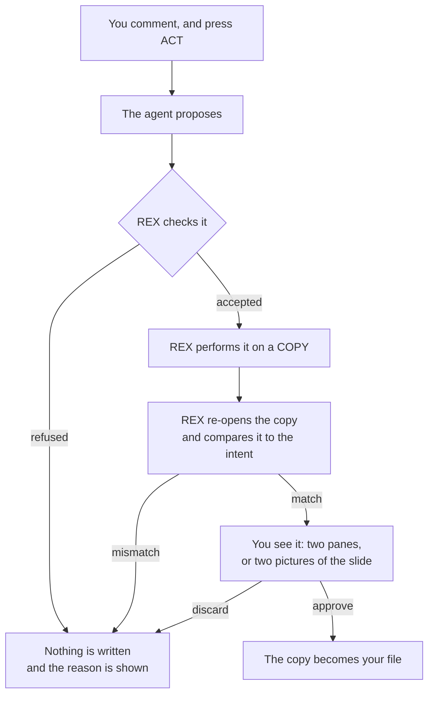

# REX and the file formats

**What this document is.** The product decision behind every file format REX
opens: what it will do, what it will not do, and why. It is written so that
nobody — a person, or an agent asked to write about REX — has to infer the
intent from the source code. The code says *what* happens. This says *why it was
chosen*, and what was deliberately left out.

**Status:** current as of 2026-08-27. Every number in it was measured on the
author's own machine against real files, and the section that states each number
says when.

**Where the detail lives.** This is the summary. The specs in
[`my-specs/`](my-specs/) carry the mechanism: spec 11 for PowerPoint, spec 15
for the working copy, spec 19 for Word.

---

## 1. The rule

REX is a **review** tool, not an editor. One sentence decides every feature in
it:

> **You say what should change. The agent changes it. You approve it.**

Four rules follow, and between them they settle every row of every table below.

1. **Read anything a reviewer argues about.** Render it faithfully enough to
   comment on it — not perfectly, faithfully enough.
2. **Never write in place.** Every change is made to a working copy, through a
   plan REX has validated, shown before and after, and kept only when the
   reviewer approves it. The reviewer's own file is not touched until then.
3. **No manual editing of document content, in any format.** This is a boundary,
   not a gap. §6 is the argument.
4. **A format is writable only when a change can be expressed as a short list of
   named, checkable operations** — or when the file is plain text, where no list
   is needed. Where neither is true, the format is read-only and §7 says why.

---

## 2. Three layers, and only one of them writes

Confusing these is the commonest way to misunderstand REX.

| Layer | What it does | Touches the file? |
|:--|:--|:--|
| **Comment** | a thread anchored to a passage, an element or a region | **No.** Comments live in REX's own database. |
| **Pen** | freehand drawing over the document | **No.** It draws on a layer above it. |
| **Edit** | the agent, through ACT | **Yes** — and only through §4. |

Two consequences worth stating plainly:

- **REX never writes its comments into the document.** It does not use Word's
  comments or PowerPoint's comments, does not read them, and cannot damage them.
  A document REX has reviewed carries no trace of REX.
- **Reviewing a document changes nothing.** Only ACT does, and only after the
  reviewer approves what it did.

---

## 3. What REX provides, by file type

| | `.md` | `.html` | `.docx` | `.pptx` | `.pdf` |
|:--|:--|:--|:--|:--|:--|
| Open and render | ✅ | ✅ as written | ✅ its prose | ✅ slides drawn | ✅ pages |
| Comment on a passage | ✅ | ✅ | ✅ | ✅ | ✅ |
| Comment on an element or region | ✅ | ✅ | ✅ | ✅ per shape | ✅ per region |
| Pen | ✅ | ✅ | ✅ | ✅ | ✅ |
| **ASK** — the agent reads and answers | ✅ | ✅ | ✅ | ✅ | ✅ |
| **ACT** — the agent changes the file | ✅ | ✅ | ✅ | ✅ | ❌ §7.1 |
| Two panes, approve / undo / discard | ✅ | ✅ | ✅ | ✅ as slides | — |
| Manual editing | ❌ | ❌ | ❌ | ❌ | ❌ |

Also accepted anywhere: `.markdown`, `.mdown`, `.mkd`, `.htm`, `.xhtml`.

**Not accepted at all:** `.doc` and `.ppt`. They are not zips; the pre-2007
binary formats need a different reader entirely, and a gate that accepted one
would fail confusingly at parse time instead of clearly at listing time.

---

## 4. What the agent can change, by format

**The further a format is from plain text, the smaller the set of changes REX
will make in it.** That is not inconsistency. It is rule 4 applied to formats of
different difficulty.

| Format | What the agent can change | Why |
|:--|:--|:--|
| `.md`, `.html` | **everything. No limit.** | Plain text. The agent edits the file directly, the same way it edits source code, and `git diff` shows every line it changed. |
| `.docx` | **10 named operations** | A zip full of XML. An agent cannot safely edit that, so REX does the writing — and REX only performs changes it can check afterwards. |
| `.pptx` | **13 named operations** | The same. |
| `.pdf` | nothing | §7.1. |

The operation lists are a **limit the format imposes**, not a feature. A text
file needs no list because nothing about editing it can go quietly wrong.

### 4.1 Markdown and HTML

Add, remove, move or change any text, heading, list, table, image, link or code
block. There are no restrictions, because there is nothing to restrict: the
agent edits lines.

### 4.2 Word — 10 operations

| Group | Can |
|:--|:--|
| **Add** | a paragraph, a table row, a picture |
| **Remove** | a paragraph, a table row |
| **Move** | a paragraph |
| **Change** | the text of a paragraph or a table cell; bold, italic, underline, size, colour, font, alignment; a heading's level; a list item's indent level |

A table cell is an ordinary paragraph with its own position, so the same
operation changes one.

### 4.3 PowerPoint — 13 operations

| Group | Can |
|:--|:--|
| **Add** | a text box, a picture, a video, speaker notes, a **copy** of a slide |
| **Remove** | any shape, any slide |
| **Move** | any shape — position and size; the slide order |
| **Change** | a shape's text; font, size, weight, colour, alignment, fill; swap one picture for another; the deck's theme font; the speaker notes |

---

## 5. How a change is made, and how it is kept

The same for every writable format, which is what makes the promise in rule 2
true rather than aspirational.

Four properties hold in every format:

1. **Nothing is written to your file until you approve it.** Not a
   write-then-revert: your file is never modified and put back.
2. **A change names what it expects to find.** *"Replace the paragraph that
   currently reads X."* If the document no longer says X, the whole run is
   refused. No half-applied edits, ever.
3. **The copy survives across runs.** You can keep talking to the agent and
   refine the same change before deciding.
4. **REX proves it changed nothing else.** After the surgery it re-opens the
   result and checks that every part the plan did not name is byte-identical.
   Measured across all 18 Word files on this machine, 2026-08-27: 18 of 18 came
   back with every part identical.

One case is a write-then-revert, by design. Since spec 22 an ACT run may edit
any Markdown or HTML file under the open workspace, not only the document you
commented on. REX cannot fork a copy for a file it does not yet know the agent
will touch, so the agent edits that file in place, and when the run ends REX
puts your bytes back and holds the agent's version as the working copy. From
there properties 1 to 3 hold exactly as above — the same two panes, the same
approve and discard. What differs is the moment inside the run when the file
on disk is the agent's; a REX killed in that moment leaves it so, and `git`
is the way back. The document you commented on is never in that state.

---

## 6. Why there is no manual editing

The most common question about REX, and the answer is a decision rather than a
missing feature.

**What it would mean.** Clicking a slide and pressing delete; selecting a
paragraph and typing over it.

**Why not.**

- **It makes REX a worse Word.** A cursor inside a `.docx` brings selection,
  undo, styles, tables, input methods and spell-check with it. Word has thirty
  years of that. REX will not win, and every hour spent trying is an hour not
  spent on reviewing.
- **It destroys the record.** An agent edit leaves a thread: the comment, the
  discussion, the reasoning. Six months later *"why is this sentence like
  this?"* has an answer. A manual edit leaves a diff and nothing else. For a
  review tool that record is the product, not a side effect.
- **The result is identical anyway.** Deleting a slide by hand and asking the
  agent to delete it produce the same bytes. What differs is the cost and the
  record — and for the changes REX exists to make, the agent is cheaper as well.

**What is genuinely lost.** For purely positional changes — *delete this slide*,
*move this one earlier* — pointing is faster than saying it, and REX makes you
say it. That is a real cost, accepted knowingly.

**If it is ever revisited**, the shape is already there and it is not "add an
editor": a gesture would write the same plan the agent writes, so validation,
the working copy, the two panes and undo would all be unchanged. The boundary
would stay exactly where it is now — **manual editing could only ever do what
the operation list can express.** That is a written, checkable limit rather than
a matter of taste.

---

## 7. What REX does not provide, and why

### 7.1 Editing a PDF — a decision, not a gap

Settled on 2026-08-27 and recorded so it is not re-argued without new evidence.

**A PDF is a picture of a page.** It is a content stream of "put this glyph at
this coordinate". There are no words, no paragraphs and no reflow. Every PDF
editor on the market, Acrobat included, reverse-engineers text runs with
heuristics, and none of them reflows the page.

Measured on 2026-08-26, over a random sample of 60 PDFs above 40 KB on this
machine, read with the PDF library REX already ships:

| Measurement | Result |
|:--|:--|
| Opened | 60 of 60 |
| Carrying a real text layer | 49 |
| Images of pages, no text at all | 11 |
| **Tagged** — carrying a structure tree | 26 of 60 (43%) |
| **Fonts on page 1 that are subsets** | **153 of 166 (92%)** |
| Files whose page-1 fonts are all subsets | 21 of 24 |

The last row decides it. A subset embeds only the glyphs the document already
used. Change *control plane* to *data plane* and the letters may not exist in
the file — the result renders as blank boxes. Embedding a replacement font
changes how the whole line looks.

**A feature that works sometimes and fails invisibly the rest of the time is the
one kind REX must not ship.** The libraries agree rather than disagree:
`pdf-lib` states it has no API for editing page text, and MuPDF's own JavaScript
documentation says it cannot edit existing page text either. There is nothing to
adopt.

What REX says instead, on the Apply button:

> Apply cannot edit a PDF. A PDF is a picture of a page — it has no paragraphs
> to change. Comment on it, and edit the document it came from.

### 7.2 The rest

| Not provided | Reason |
|:--|:--|
| **Manual editing, any format** | §6. |
| **Word tracked changes** (`w:ins` / `w:del`) | Withdrawn 2026-08-27. It stops short of *making* the change: the file comes back holding both versions, so the reviewer approves the same edit twice — once in REX, once in Word. The one case it serves is handing an edited document to somebody who does not have REX, which is a sharing problem, not an editing one. |
| **Native Word and PowerPoint comments** | REX keeps its comments in its own database (§2). It reads neither and writes neither. Of the 18 Word files on this machine, 6 carry Word comments, and every one of them is proved byte-identical after a REX edit. |
| **Word headers, footers, footnotes, page setup** | Not what a paragraph-level review changes. 9 of 18 documents carry headers; instead of editing them carefully, REX proves it did not touch them. |
| **Word tables as whole objects** | Rows can be added and removed. There is no insert-table or delete-table. |
| **A Word paragraph carrying a field, a content control, a footnote reference or a named bookmark** | Refused, never attempted: the visible text of a field is a cached result, and a content control belongs to the template. Measured 2026-08-27: this locks 16 of 6,151 paragraphs — 0.3%. |
| **Deck tables** | 3 tables across 1,643 slides on this machine. Not worth an operation. |
| **Deck charts** | 15 of 72 decks carry one. Editing a chart means editing the workbook embedded beside it, and doing half of that produces a chart whose picture and data disagree. The strongest candidate for a later spec. |
| **SmartArt** | 0 of 72 decks. |
| **Floating pictures with text wrap, in Word** | A picture goes inline, in its own paragraph. A floating one needs an anchor, a wrap polygon and a z-order. |
| **`.doc`, `.ppt`** | Not zips. |
| **Bundling LibreOffice or any office suite** | 787 MB to turn REX into a word processor with comments — precisely the thing it exists not to be. **REX depends on no office software at all**: it reads and writes the zip and the XML itself. It installs and runs on a machine with no Office and no LibreOffice. |
| **A bundled Python runtime, a message broker, an HTTP server** | Rejected at the start and still rejected. REX is one desktop app that listens on nothing. |

---

## 8. The one genuine gap

Everything in §7 is a decision. This is not:

**There is no way to add a new, blank slide.** The only way to add a slide today
is `duplicateSlide`, which copies one you already have; the agent then retypes
its text. A real `insertSlide` has to build the placeholders from the deck's
slide master, which is work nobody has done rather than work anybody rejected.

It is recorded here so that it is not mistaken for a principle.

---

## 9. In one paragraph, for anyone writing about REX

REX opens Markdown, HTML, Word, PowerPoint and PDF, and lets you comment on any
of them the way you would comment in the margin. Ask a question about a comment
and an agent answers it, having read the whole document and everything around
it. Tell it to make the change and it does — in Markdown and HTML by editing the
text, in Word and PowerPoint by performing a checked list of operations on the
file's own XML, with no Office software involved. Nothing reaches your file
until you have seen the change side by side and approved it. A PDF can be read
and commented on but never edited, because the format has no paragraphs to edit
— and REX would rather refuse than do it badly. There is no manual editing
anywhere in REX, deliberately: the tool exists to capture *why* a document
changed, and an edit nobody explained does not.
