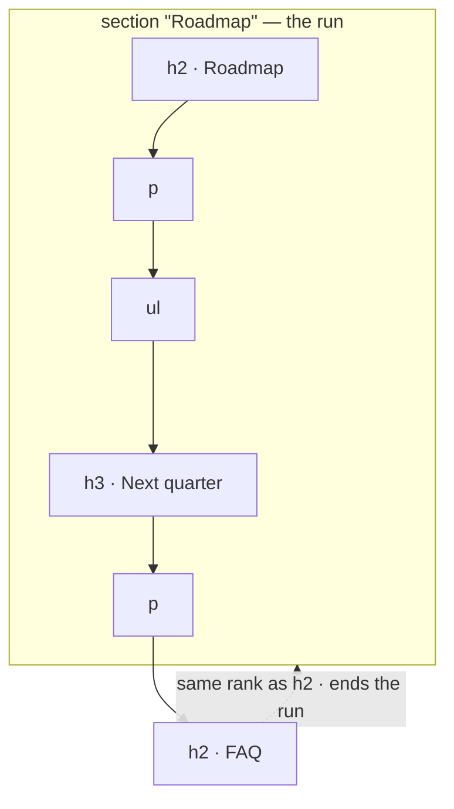

# REX 06 — the document, the section and the pen

**Version:** 1.0 · 2026-08-21
**Status:** specified, not implemented
**Depends on:** [`01-initial/SPEC.md`](../01-initial/SPEC.md),
[`03-rich-rendering/SPEC.md`](../03-rich-rendering/SPEC.md),
[`04-selection-and-shortcuts/SPEC.md`](../04-selection-and-shortcuts/SPEC.md) and
[`05-selection-as-a-phase/SPEC.md`](../05-selection-as-a-phase/SPEC.md).

> [!note]
> This document extends specs 01 to 05. It does not restate them. §2 says
> exactly what changes; everywhere else the earlier specs still govern,
> including all three invariants of spec 01 §3 and the whole anchoring model.

---

## 0. How to use this document

**If you are picking this up cold**, read in this order:

1. **§1 and §3** — the one gap all of this closes, and the three answers to it.
   §3 also says which answer to reach for when.
2. **§4.2, §4.3 and §5.4** — the three pieces of mechanism that are not obvious:
   what a section *is* when the document has no `<section>` elements, the one
   field that records both new scopes, and where a drawing's ink lives. Getting
   §4.3 wrong writes a copy of the document into the database; getting §5.4
   wrong makes the ink drift off the thing it was drawn around.
3. **§5.3** — what a drawing selects. It is the whole pen in one page, and the
   part that can be wrong silently.
4. **§7** — what the agent is told. A scope the prompt does not explain is a
   scope that changes nothing.
5. **§10** — the milestones, in order, with their acceptance checks.

**Four rules for the implementer:**

1. **Nothing here weakens the three invariants of spec 01 §3.** No listening
   port, no database handle in the renderer, and resolution stays in the
   renderer, on the live DOM. The pen draws on REX's overlay, never on the
   document — an SVG path written into the document's own tree would mutate the
   file under review and shift every offset the resolver depends on, which §6.7
   already refuses for highlights.
2. **No new dependency, and no new format pipeline.** Everything here is DOM
   walking and geometry against the tree spec 03 already produces. If a design
   seems to need a converter or a layout engine, it is the wrong design — §8.
3. **An anchor still names one thing.** A section anchor names its *heading*,
   not the 4,000 characters under it, and a drawing produces the anchors
   `create.ts` already makes. Nothing downstream — resolution, states, the
   sweep, Apply — learns a new kind of target.
4. **Everything here feeds the selection phase; nothing replaces it.** Spec 05
   exists because a transient card is the wrong home for something built up over
   time. §6.3 is the one place this document does not do as it was asked, and
   that is why.

---

## 1. What is missing

Spec 05 made a comment about many places, and pick mode made each place one
click. Both assume the same thing: **every subject is exactly one element, named
one at a time.** Three kinds of subject do not fit.

| Missing | Why it hurts |
|:--|:--|
| **The whole document** | "Is this document consistent?", "Does this still match what we shipped?", "Rewrite this in the house voice" are the questions a reviewer opens a file to ask, and REX has no way to attach one. `pick.ts` refuses it outright: `CHAIN_STOP` stops the chain at `BODY`, with the comment *"the whole page is not an anchor"*. |
| **A section** | The unit between a paragraph and a file — "§3 Findings is out of date". The reviewer's only options are to anchor to the heading, which comments on eight words, or to drag over the whole section, which stores a copy of it. |
| **This bit here** | A table, the two paragraphs under it and a picture. Five clicks today, and only if all five are single elements. In a document with no headings there is not even a section to fall back on. |

The workaround for the first is to anchor a whole-document question to whatever
paragraph happens to be on screen. It works — the read agent is given
`Document: <path>` and can read the file — but the anchor is a lie. It outlines
one paragraph, it claims the comment is about that paragraph, and it orphans
when that paragraph is edited, taking a comment that was never about it.

There is one near-miss already in the tree. A **synthesis thread** (spec 01
§8.6) has `kind: "synthesis"` and no targets at all, and it looks like a
document-level comment. It is not: `synthesisPrompt()` is built only from the
comments it references and never mentions the document. It answers "what do my
comments add up to", not "what about this file".

---

## 2. Changes to specs 01 to 05

| Spec | Change |
|:--|:--|
| 01 §4 Shared types | `Anchor.extent`, `StrokeRef`, `Thread.stroke`. §4.3, §5.4. |
| 01 §6.4 Creation | Two new ways to make an anchor, both from the existing chain. §4.3. |
| 01 §6.5 Resolution | A third resolution kind, `run`. The four layers are untouched. §4.4. |
| 01 §6.6 States | A document target is always `ok` while its document opens. It is the one anchor that cannot move. §4.5. |
| 01 §6.7 Highlighting | A run is outlined, never filled. A document target draws no box. Ink is a fourth kind of mark, and the only one that is not a rectangle. §6.4. |
| 01 §7 Overlay | A pen layer joins the pick layer, on the same terms: above the frame, mounted only while the mode is on. §5.1. |
| 01 §8.6 Prompts | `describeTarget` gains two cases; a document target adds one instruction; a drawn comment adds one line. §7.1. |
| 01 §8.7 Apply | Unchanged in mechanism. The diff dialog must say when a comment covers a whole file. §7.2. |
| 01 §9 Database | `extent` needs **nothing** — `anchor_json` is a JSON blob. `thread.stroke_json` is one guarded `ALTER TABLE` in `migrate.ts`. §4.3, §5.4. |
| 01 §10 IPC | **Unchanged.** The stroke rides inside `thread:create`'s existing payload. |
| 03 §7 PDF | Unchanged. A PDF keeps `page N`, which is a real page. It gains `document`, never gains sections, and is where the pen's floor lands. §4.1, §5.3. |
| 03 §8 DOCX | Unchanged. Sections come from the headings mammoth already emits; no converter is added. §8. |
| 04 §4 Widening | The chain gains two scopes at its wide end, outside `MAX_SCOPES`. §4.1. |
| 04 §6 Shortcuts | `N` toggles the pen. §5.1. |
| 05 §3 Selection panel | One drawing beside its one note. A drawing is a way of filling the panel, not a way round it. §6.2. |
| 05 §3.5 Selected item | Unchanged shape. A document row simply has no `rect`, which spec 05 §6 already allows. §6.2. |
| 05 §6 Highlighting | Extended by §6.4 here. |

---

## 3. Three ways to name a bigger subject

All three are additive, and a reviewer picks by what the subject *is* rather
than by what the document is made of.

| Answer | Reach for it when | Anchored on |
|:--|:--|:--|
| **`document`** | the comment is about the file | nothing inside the file — it cannot move |
| **`section`** | the subject is one heading's worth | the **heading**, which is short and often has an id |
| **the pen** | the subject is several things that share no structure | the blocks the circle enclosed, as ordinary anchors |

They are not alternatives to each other and not alternatives to the selection
panel. The panel is still what holds a comment's places while it is being built;
a section is a shortcut for the common case, and the pen is a shortcut for the
case that has no structure to shortcut through.

> [!important]
> **A section is bounded by a heading, not by what you want to group.** It
> cannot gather three rows, a table and a picture unless those things happen to
> sit under one heading. Grouping unrelated things is what the selection panel
> already does — every place clicked in pick mode becomes another target of the
> same comment — and what the pen does in one gesture instead of five clicks.

---

## 4. The document and the section

### 4.1 Where they sit in the chain

Both are appended at the **wide** end of the widening chain, so ↑ reaches them
and ↓ comes back. Every format gets `document`. Only a document with headings
gets `section`; only a PDF has `page`.

```text
Markdown   document › section "## Roadmap" › ul › li
DOCX       document › section "3. Findings" › p
HTML       document › section#retry-policy › table › tr › td
PDF        document › page 2 › line
```

Two rules govern the assembly:

1. **`section` and `document` are appended outside `MAX_SCOPES`.** The cap of 6
   applies to walked ancestors only. Without this rule a cell deep in a
   `div`-wrapped table fills the chain and loses exactly the two scopes this
   document adds — at the depth where they are most wanted. The chain may
   therefore be 8 long.
2. **A real sectioning element wins over a synthetic one.** If the heading's
   enclosing `<section>`, `<article>` or `<aside>` already contains the whole
   run and is already in the chain, that element *is* the section scope and no
   synthetic run is made. A true DOM subtree is a stronger anchor than a rule
   about siblings, and an HTML document that marks up its own sections should
   not be second-guessed.

A PDF has no headings in its DOM — PDF.js emits positioned text items, not
structure — so `section` never appears there. That is not a gap to close later:
spec 03 §7.3 already establishes that in a PDF a *place on a page* is the
honest unit.

### 4.2 What a section is

In a rendered Markdown or DOCX document the blocks are **siblings**, not nested:
`markdownPage()` puts them directly in `<body>`, and mammoth emits a flat
fragment. So a section is not a subtree and cannot be found with `closest()`.

A section is a heading, plus every following sibling up to but not including
the next heading of the **same or higher rank**.



The `h3` belongs to the `h2` above it; the next `h2` ends the run. This is the
rule every Markdown tool uses and the one the author had in mind when they typed
the heading.

Three edges, stated so they are not rediscovered:

- A heading with no blocks after it is a section of one element — itself.
- The last section of a document runs to the last element in `<body>`.
- Content **before** the first heading belongs to no section. It is reachable as
  itself and as the document, which is correct: a preamble is not a section.

### 4.3 What is stored

One optional field, and nothing else:

```ts
/** Spec 07 §4.3 — how much of the document an anchor covers. */
export type AnchorExtent = "section" | "document";

export interface Anchor {
  quote: TextQuote | null;
  position: TextPosition | null;
  element: ElementRef | null;
  region: RegionRef | null;
  source: SourceRef | null;
  /**
   * Absent — every anchor written before spec 06 — means the anchor covers the
   * thing it names and nothing more.
   */
  extent?: AnchorExtent;
}
```

`anchor_json` is a JSON blob (spec 01 §9), so this is **no migration, no new
column, and no change to any query**. An old row simply has no `extent`, which
reads as `undefined`, which is the old behaviour.

What each one carries:

| `extent` | `element` | `quote` | Means |
|:--|:--|:--|:--|
| absent | as today | as today | the thing itself |
| `"section"` | the **heading** | the heading's own text | that heading, and everything under it by §4.2 |
| `"document"` | `null` | `null` | this document, entire |

> [!important]
> **A section anchor stores its heading, not its contents.** The alternative —
> a text anchor whose quote is the whole section — fails twice. It writes
> thousands of characters into the database per comment, and it orphans the
> moment anyone edits a word inside the section, because the stored quote no
> longer matches. A heading is short, distinctive, and in Markdown carries a
> hand-written slug id (`markdown-it-anchor`, spec 03 §5.5), which is the
> strongest anchor REX has. This is the same trick `resolveRegion` already uses
> for a figure: name the thing that identifies it, not the thing you want.

A `document` anchor names nothing inside the document, so all four layers are
null. It is not a degenerate anchor — it is an anchor whose target is the file,
and the file is identified by `AnchorTarget.documentId`, which every target
already carries.

### 4.4 Resolution

`resolveAnchor` gains a third kind. Today it answers `range` or `element`; a
section is neither, because it is a run of siblings.

```ts
export type Resolution =
  | { kind: "range"; range: Range; layer: number; matchedBy: ElementMatch }
  | { kind: "element"; element: Element; layer: number; matchedBy: ElementMatch }
  /** Spec 07 §4.4 — a run of sibling blocks: a section, or a whole document. */
  | { kind: "run"; first: Element; last: Element; layer: number; matchedBy: ElementMatch };
```

The order of the layers in spec 01 §6.5 does not change. `extent` is consulted
**first**, exactly as `region` already is:

- `extent === "document"` — answer `run` over `<body>`'s first and last element
  children. It never fails while the document is open at all.
- `extent === "section"` — resolve the **heading** through the existing layers
  (id, then quote, then fuzzy, then element path), then walk siblings by §4.2 to
  find `last`. If the heading does not resolve, the section is orphaned; there
  is nothing to walk from.

The box for a run is the union of `first` and `last`'s rects. Because both are
measured live, a run resizes and re-flows exactly like every other box, which is
what spec 05 §6's re-measure already guarantees.

### 4.5 State

| Target | `ok` | `moved` | `orphaned` |
|:--|:--|:--|:--|
| `document` | always, while the document opens | never | never |
| `section` | the heading resolved by id or exact quote | the heading was re-found by fuzzy match, or the document changed | the heading is gone |

A document target that can never orphan is not a weakness in the model, it is
the point: it is the one comment whose subject cannot be edited away. A
reviewer who asks "is this file still accurate?" should find that question
waiting for them a month later, whatever happened to the prose.

### 4.6 What happens without a heading

**A document with no headings has no sections, and REX must not invent any.**
The scope simply is not in the chain; the reviewer widens from the block
straight to `document`, or reaches for the pen. Two real cases produce this:

- A Markdown file that is prose from top to bottom.
- A DOCX whose author used direct formatting instead of Word's heading styles,
  so `mammoth` emits paragraphs and no `<h*>` at all. `docx.ts` already logs
  this: *"When a DOCX renders as a wall of undifferentiated paragraphs, the
  reason is in here."*

Measured on 2026-08-21 against the documents REX is developed on, the case is
uncommon but the risk is real:

| Document | Headings | Real `<section>` |
|:--|--:|--:|
| `sample-files/sample-document.md` | 15 | — |
| `sample-files/sample-document.docx` | 12 | — |
| `documentation-sample/two/sample-report.docx` | 15 | — |
| ProtoBot `2026-08-20-architecture-explained.html` | 15 | 7 |

Both sample DOCX files convert with **zero** unmapped styles, so their headings
are real. The HTML file is the case rule 2 of §4.1 exists for: 7 of its 15
headings sit inside a real `<section>` and must offer that element, while the
other 8 get a synthetic run.

---

## 5. The pen

### 5.1 A mode, like pick

The pen is a mode, off by default, toggled by a button beside **Pick element**
and by the bare key `N` — `P` is already pick, and `N` is the free letter in
"pen". While it is on:

- the pointer draws instead of selecting text;
- the pen layer sits above the document frame and swallows pointer events, the
  same way `PickLayer` does, and scrolls and zooms the document underneath for
  the same reason (spec 04: a mode that stops you reading is a mode you leave);
- `esc` leaves without keeping anything.

One press-drag-release is one **stroke**. A drawing may be several strokes: a
circle plus an arrow, or a shape drawn in two goes. Undo and redo act on whole
strokes, never on points.

### 5.2 Ending a drawing

The drawing ends when the reviewer says so — a **done** control on the pen's own
small toolbar, or `enter`. It does not end on pointer-up, because two strokes
are one drawing.

On done, §5.3 turns the ink into targets and the panel fills. On `esc` or
**cancel**, the ink is discarded and nothing is added.

### 5.3 What a drawing selects

**A block is selected when its centre lies inside the drawing.**

That is a lasso, it is what everyone expects a circle to mean, and it is
predictable enough to aim with. Two supporting rules make it behave:

- **The path is closed before the test.** A hand-drawn circle never quite meets
  itself; the last point is joined to the first and the fill is even-odd. A gap
  of a few pixels must not change the answer.
- **The outermost match wins.** If a `td`, its `tr` and the whole `table` all
  have their centres inside, only the `table` is taken. This is the same dedupe
  `changedBlocks()` already performs for Apply's outlines, and the same
  instinct: a table inside a circle is one thing, not fifteen.

```text
1. Close the stroke set into one polygon, in document coordinates.
2. Collect candidates: every anchorable block (`smallestAnchorable`) whose
   box intersects the polygon's bounding box.
3. Keep a candidate when its centre point is inside the polygon (even-odd).
4. Drop any kept block that another kept block contains.
5. Order them the way the document does — top to bottom, then left to right.
6. Each survivor becomes a target, through the anchor `create.ts` already
   makes for that element.
```

Step 6 is the load-bearing one. A drawn target is an **ordinary element or text
anchor**: it resolves through the same four layers, it reports `ok`, `moved` or
`orphaned` the same way, and Apply treats it exactly as it treats a target that
was clicked. Nothing downstream knows the pen exists.

**When the circle encloses nothing.** A circle round a chart, an arrow in a
margin, a ring round one cell of a bitmap — none of these has a block with its
centre inside. The pen must still produce something, because refusing a gesture
the reviewer clearly meant is worse than answering it imprecisely.

The floor is **the smallest element that contains the whole drawing, cut to the
drawing's bounding box** — a region anchor, exactly the one spec 01 §6.4 already
makes. You drew inside something; that something, cropped to where you drew, is
the honest answer. In a PDF that resolves to the page, which is precisely what
spec 03 §7.3 says a PDF comment should be.

So a drawing always yields at least one target, and the reviewer can see which:
the panel row says `Region of Figure 1` rather than naming blocks.

### 5.4 What is stored

```ts
/** Spec 07 §5.4 — the reviewer's own ink, kept so the comment still shows it. */
export interface StrokeRef {
  /**
   * One entry per stroke; each is an ordered list of points.
   *
   * Fractions of the **union box of the comment's targets**, not pixels and not
   * fractions of any one element. See below — this is what makes the ink move
   * with the thing it was drawn around.
   */
  paths: Array<Array<{ x: number; y: number }>>;
  /** Pen width in CSS pixels. Ink does not get thicker when a table does. */
  width: number;
}

export interface Thread {
  // … unchanged …
  /** Absent for every comment that was not drawn. */
  stroke?: StrokeRef;
}
```

**Where it lives:** `thread.stroke_json TEXT`, added by a guarded `ALTER TABLE`
in `migrate.ts` — the same `PRAGMA table_info` shape the spec 05 migration
already uses, and idempotent for the same reason.

A column, and not a field inside `anchor_json` as §4.3 was able to use, because
**a stroke is not a property of any one anchor.** It is drawn across all of
them; storing it on target 0 would make the ink a possession of whichever block
happened to sort first, and deleting that one target would take the drawing
with it.

**Why fractions of the union box.** The stroke has to survive a reflow, a
resize, a zoom and an edit — the same list spec 05 §6 solved for selection
outlines by re-measuring every sweep. Pixels fail on the first window resize.
Fractions of one element fail as soon as the drawing spans more than that
element. Fractions of the union box of the comment's own targets are
self-correcting: resolve the targets, take the union of their boxes now, and map
the stored fractions onto it. If the paragraphs reflow, the ink reflows with
them, because the ink is defined in terms of them.

> [!warning]
> This makes the ink **approximate after an edit**, and deliberately so. If a
> paragraph inside the circle grows by two lines, the union box grows and the
> stroke stretches. It will no longer trace exactly what the reviewer drew. That
> is the correct failure: the drawing is a record of a gesture, not a
> measurement, and the *targets* — which are real anchors — are what carry the
> comment's meaning. Ink that stayed at its original pixels while the text moved
> would be far worse: it would point confidently at the wrong paragraph.

---

## 6. What the reviewer sees

### 6.1 The chain and its words

The path bar and the chips already read outside-in, so the two new scopes appear
first and read naturally:

```text
PATH   document › section "3. Findings" › p
       ↑ ↓ widen / narrow      click adds to the selection      esc leave
```

The crumb and chip words are `document` and `section`. They come from `labelOf`
directly rather than from a tag name, for the same reason a PDF page is called
`page 2` and not `div`: the tag is not what the reviewer is pointing at.

Strength, shown on the expanded row as today:

| Scope | Strength | Note |
|:--|:--|:--|
| `document` | durable | "the file itself — it cannot move" |
| `section` with a heading id | durable | "hand-written id, survives a rebuild" |
| `section` with only heading text | fair | "no id, but its heading carries it if it moves" |

### 6.2 The panel, however the places arrived

| Scope | Row label |
|:--|:--|
| `document` | `The whole document` |
| `section` | `Section · "3. Findings"` |
| drawn | one row per enclosed block, labelled as that block already is |

A document row has **no box**, so `SelectionItem.rect` is `null` — a state spec
05 §6 already defines and `DocumentView` already skips. It keeps its number in
the panel, like a row from a document that is not open.

Finishing a drawing adds its targets to the panel the same way a click does. The
note is typed where the note has always been typed, and **Ask** is the same
button. A drawing is therefore a fast way to fill the panel, not a second way to
make a comment — so everything spec 05 already provides comes free: reorder the
rows, drop one that was caught by accident, widen one with the chips, add a
sixth place by clicking, and hold the whole thing while opening another
document.

### 6.3 Where the pen departs from the sketch

The pen was requested with a picture of a floating toolbar carrying **a note
field**, undo, redo, cancel and **send** — the note and the sending both in the
bar, beside the ink.

This document keeps the bar and drops the note field and Send from it. The pen's
toolbar carries **undo, redo, cancel, done** and nothing else.

The reason is spec 05 §1, which exists because of exactly that card. A floating
field takes focus, so every bare-letter shortcut dies while it is open; it is
dismissed by a stray click, taking the work with it; and it is the wrong home
for something built up over time — and a drawing plus five targets plus a
question is very much built up over time. Rebuilding it for the pen would
reintroduce three faults that were measured, diagnosed and removed one spec ago.

The gesture from the sketch is kept whole. Only its note field moves eight
centimetres right, into the panel that already has one.

### 6.4 Highlighting

Spec 05 §6 is extended by three rules, each of which follows from what the mark
has to teach.

**A run is outlined, never filled.** The Custom Highlight API paints ranges, and
a wash over four thousand characters is a page you cannot read. A section is
drawn with the block outline every element target already uses, around the union
box of §4.4.

**A document target draws nothing in the document.** An outline around the whole
file is a rectangle whose two edges are never on screen together; it would lie
over every other mark and teach nothing. It is shown instead where a
document-wide fact belongs: its gutter marker at the top of the document, as any
target with `top = 0` has; the panel row and the card saying `The whole
document`; and when that comment is the open one, its card is the mark — the
violet of spec 05 §6 has nothing to paint here, and that is correct.

**Ink is drawn as an SVG path** on the overlay, above the document and below the
pen's own toolbar, offset by scroll like every other mark. It is shown live
while drawing; for the selection, while the panel holds it; and for a saved
comment when that comment is the open one or its row is hovered. Not always:
twelve drawings on one page, all showing at once, is a scribbled-on document
rather than a reviewed one.

> [!important]
> **The ink is red, and that narrows a rule in spec 01.** Spec 05 §6 records
> that red is spent on exactly two things — a lost anchor and the write-capable
> agent — and that a selection must never use it. The pen makes red mean a third
> thing, and it is worth it: a red pen is what marking up a document *is*, and
> no reviewer will read their own handwriting as a warning.
>
> The rule is therefore narrowed rather than broken: **red rectangles** — fills
> and outlines — still mean the agent wrote here or an anchor was lost. A
> freehand stroke is the reviewer's own hand. The two can never be confused,
> because a machine-drawn rectangle and a hand-drawn squiggle do not look alike
> at any size.

---

## 7. What the agent is told

### 7.1 Ask

`describeTarget()` gains two cases, and a drawn comment gains one line:

```text
## Highlighted passages
1. the whole document
2. Section "3. Findings" — lines 120–186
3. (no text — an element anchor: table.matrix)

The reviewer drew a circle around these, in this order.

## Comment
Does this table still match the lesson?
```

The section's line range is emitted **only when it can be computed**, from
`data-src-line` on the heading and on the block that ends the run (spec 03
§5.3). Markdown has it; DOCX does not, and there the section is named by its
heading alone. A range that had to be guessed is never printed — spec 01 §8.6
already refuses a guessed line for the same reason.

A document target adds one instruction, because "the whole document" is a phrase
with no action behind it:

```text
Read the document in full before answering. This comment is about all of it,
not about a passage.
```

Two smaller consequences:

- `askPrompt`'s `Line:` header is omitted when `targets[0]` is a document
  target. There is no line, and a wrong one sends the agent to the wrong place.
- `enclosingSection()` — the "Surrounding section" block — is skipped for a
  document target. The surrounding section of the whole document is the whole
  document, and printing it twice buys nothing.

The prompt stays text, the targets stay ordinary targets, and an agent that
never hears the word "pen" still answers correctly — which is the test of
whether §5.3 was designed properly.

### 7.2 Apply

The mechanism does not change. Apply still runs the write profile behind the
`PreToolUse` gate, still produces a diff, and still requires the reviewer to
accept it before anything lands (spec 01 §8.7 step 5). Nothing in the safety
story moves.

One thing does change, and it must be said in the dialog rather than left to be
discovered: **a comment on a whole document authorises an edit anywhere in that
file.** The diff gate is what makes that safe, but the reviewer should know what
they are about to read before they read it. The Apply dialog names the covered
scope for each file:

```text
Apply · comment 7
  report.md      the whole document      14 changed lines in 5 places
  plan.md        Section "3. Findings"    2 changed lines
```

DOCX is unaffected: spec 03 §8 already leaves it read-only, so a section,
document or drawn comment on a `.docx` can be asked but never applied.

---

## 8. Why there are no pages

This document was written in answer to a request for **pages** in the DOCX and
Markdown viewers, and it deliberately delivers sections and a pen instead. The
reasoning belongs here, because "add pages later" will otherwise look like an
obvious extension.

| Format | Does a page exist? | What REX would have to do |
|:--|:--|:--|
| PDF | **Yes.** The author paginated it. | Nothing — it already has `page N`. |
| DOCX | Yes in Word, but not in what REX has. `mammoth` converts to semantic HTML and drops layout, which `docx.ts` states outright. | Convert DOCX → PDF with LibreOffice, then render as a PDF. |
| Markdown | **No.** There is no page anywhere in a Markdown file. | Invent pages by slicing the rendered HTML at a chosen page height. |
| HTML | **No**, for the same reason. | The same slicing. |

Both routes cost more than they return:

- **Converting DOCX to PDF loses the anchoring.** Spec 03 §7.3 establishes that
  in a PDF a quote cannot lead, so every comment becomes a *region of a page*
  rather than a quote of a sentence. Reviewing prose is what REX is for, and
  this trades the good anchor for a page number. It also adds an external binary
  that a collaborator may not have.
- **Invented pages are not anyone's pages.** A page produced by slicing at a
  chosen height is stable only while that height never changes; a different
  window, font size or zoom renumbers every page in the file. An anchor to
  "page 3" would then point somewhere else, silently — the one failure mode
  spec 01 §6 exists to prevent. Worse, real pagination re-parents content into
  page containers, which changes the `element.css` path of everything and
  orphans element anchors written before the mode was turned on.

A section and a drawing cost neither. A section is the unit the author actually
wrote; a drawing is the unit the reviewer means. Both are bigger than a
paragraph and smaller than a file — which is what "page" was standing in for —
and both resolve to anchors on real content, so they survive being moved,
renumbered and reflowed.

If true Word pagination is ever genuinely needed — a print proof, a paginated
legal document — the honest shape is a separate **read-only page view** that
renders the LibreOffice PDF beside the DOCX, with comments still anchored in the
DOCX. That is a different feature, and it is out of scope (§11).

---

## 9. Where the code goes

| File | Change |
|:--|:--|
| `shared/types.ts` | `AnchorExtent`, `Anchor.extent`, `StrokeRef`, `Thread.stroke`. §4.3, §5.4. |
| `renderer/anchor/pick.ts` | `sectionRunFor()` and the two appended scopes; `labelOf` and `titleOf` words; the `MAX_SCOPES` exemption. §4.1, §4.2. |
| `renderer/anchor/create.ts` | `createSectionAnchor()` and `createDocumentAnchor()`. Both thin: one wraps the existing element anchor for the heading, the other writes four nulls and an extent. §4.3. |
| `renderer/anchor/resolve.ts` | The `run` resolution kind and the two extent branches, consulted before the four layers exactly as `region` is. §4.4. |
| `renderer/anchor/lasso.ts` | New. §5.3, and nothing else: closing the path, the point-in-polygon test, the outermost-wins dedupe, document order. Pure DOM and pure geometry, so it runs unchanged in the tier 2 preload. |
| `renderer/overlay/PenLayer.tsx` | New. The drawing surface and its toolbar — a sibling of `PickLayer.tsx`, and built from it. §5.1. |
| `renderer/overlay/anchoring.ts` | The union box for a run; no box for a document; `targetsFromDrawing()` on `DocumentSurface`, both tiers; `labelFor` words; the `rectForAnchorIn` case. §5.3, §6. |
| `renderer/overlay/App.tsx` | The pen mode, its key, the selection's stroke beside its note. |
| `renderer/overlay/DocumentView.tsx` | Mount the pen layer; draw the ink. |
| `renderer/overlay/SelectionPanel.tsx` | Two chip words. §6.1. |
| `renderer/overlay/overlay.css` | The ink and the pen toolbar. A run reuses `.rex-block-outline`. §6.4. |
| `main/db/schema.sql`, `main/db/migrate.ts`, `main/db/queries.ts` | `stroke_json`, its guarded `ALTER TABLE`, and read/write. §5.4. |
| `main/agent/prompts.ts` | `describeTarget` cases, the document instruction, the drawn line, the `Line:` and "Surrounding section" skips. §7.1. |
| `main/apply.ts`, `DiffDialog.tsx` | The covered scope per file in the dialog. §7.2. |
| `test/anchor.spec.ts`, `test/lasso.spec.ts` | Section cases; the lasso as a unit. §10. |

Note what is **not** in that list for §4: `main/db/` is untouched by the document
and section scopes, and so is every IPC channel. That is the measure of whether
that half of the design is right — two new ways to point at a document, and the
storage and the wire both stay exactly as they were.

---

## 10. Milestones

Each ends in something runnable, with a check that can actually be run. The
first three are the scopes and stand alone; the rest are the pen.

1. **The document scope, end to end.** `extent` on the type;
   `createDocumentAnchor`; the `run` resolution over `<body>`; `document` at the
   wide end of the chain; the panel row; no box.
   **Accept:** on `sample-document.md`, widen past the outermost element to
   `document`, add it, and Ask. The panel row reads `The whole document`, no
   outline is drawn, and the comment survives editing the paragraph it was
   created over — its state stays `ok`.

2. **The section scope for flat documents.** `sectionRunFor()` by §4.2; the
   heading anchor; the union-box outline.
   **Accept:** on `sample-document.md`, the chain over a table cell reads
   `document › section "## Benchmarks" › table › tr › td`. The outline covers the
   heading through the last block before `## How it works`, and not one block
   more. On `sample-document.docx`, the same holds with a `fair` strength rather
   than `durable`.

3. **Real sectioning elements win.** Rule 2 of §4.1.
   **Accept:** on
   `~/Projects/Github/redhat/ProtoBot/docs/review/2026-08-20-architecture-explained.html`,
   a heading inside an existing `<section id=…>` offers that element — one
   `section` scope in the chain, not two.

4. **Ink on the glass.** The pen mode, the layer, strokes, undo, redo, cancel,
   done. Nothing is selected and nothing is stored yet.
   **Accept:** turn the pen on, draw two strokes over `sample-document.md`,
   scroll and zoom — the ink stays on the words it was drawn over. Undo removes
   whole strokes. `esc` leaves nothing behind. `git status` in the document's
   repository is clean, and the document's own DOM is unchanged.

5. **The lasso, as a unit.** `lasso.ts` and `test/lasso.spec.ts`, with no UI
   involved: fixture boxes in, selected boxes out.
   **Accept:** an open circle selects what a closed one does; a `td`, its `tr`
   and its `table` all inside yield only the `table`; results come back in
   document order; an empty circle yields none.

6. **A drawing fills the panel.** §5.3 wired to §6.2.
   **Accept:** on `sample-document.md`, circling a table and the two paragraphs
   under it produces exactly three rows in the panel, in document order, each
   with its outline. Circling white space inside a figure produces one row
   reading `Region of …`. Ask sends all of them.

7. **The ink persists.** §5.4, the migration, and the redraw.
   **Accept:** draw, Ask, close REX, reopen it, open the comment — the circle is
   back on the same words. Widen the window: the ink follows. Running the
   migration twice changes nothing the second time.

8. **The prompts and the Apply dialog.** §7.
   **Accept:** the Ask prompt for a section names its line range on Markdown and
   omits it on DOCX; the prompt for a document target carries the read-in-full
   instruction and no `Line:` header; a drawn comment carries its one line; the
   Apply dialog names the covered scope per file.

9. **Regression net.** Section cases in `test/anchor.spec.ts`, against both
   hostile documents of spec 01 §2.
   **Accept:** every section anchor reports `ok`, `moved` or `orphaned`, and each
   classification is correct by inspection. A section whose heading was reworded
   is `moved` or `orphaned` — never silently resolved to the neighbouring
   section, which is this feature's version of the wrong-place failure.

---

## 11. Out of scope

- **Pages for Markdown, HTML or DOCX.** §8 is the reasoning, and it is a
  decision rather than a deferral.
- **A LibreOffice page view beside a DOCX.** Named in §8 as the honest shape if
  true pagination is ever needed. A separate feature with a separate dependency
  question.
- **Sections in a PDF.** There is no heading structure in a PDF's DOM to build
  them from. `page N` is already the right unit there.
- **Sending the drawing as an image.** The Agent SDK accepts images, and for a
  chart a picture would say more than any list of blocks. It changes the prompt
  from text to multipart, which touches the runner, the transcript and the cost
  accounting. A separate feature.
- **Any ink that is not a selection.** No sticky notes, no arrows that mean
  something, no text on the page, no shapes to fill in. The pen selects; that is
  its whole job. Ink that carried meaning of its own would have to be shown to
  the agent, which is the image question above.
- **More than one pen.** No colours, no widths, no highlighter. One red pen.
- **Editing a saved drawing.** A drawing belongs to the gesture that made it.
  Redo it by making a new comment.
- **A section or a drawing that spans documents.** Both belong to one file. A
  comment can still hold targets from several, because spec 05 says so — but
  each section and each gesture is one document's.
- **Drawing on a `<webview>` (tier 2).** `lasso.ts` is written to run in the
  preload so this stays possible, but a remote page has no local source file and
  therefore no Apply, and the mode is not offered there in this milestone set.
- **Automatic comments.** Nothing in REX proposes a comment. This adds scopes
  and a gesture the reviewer can choose, and nothing more.
