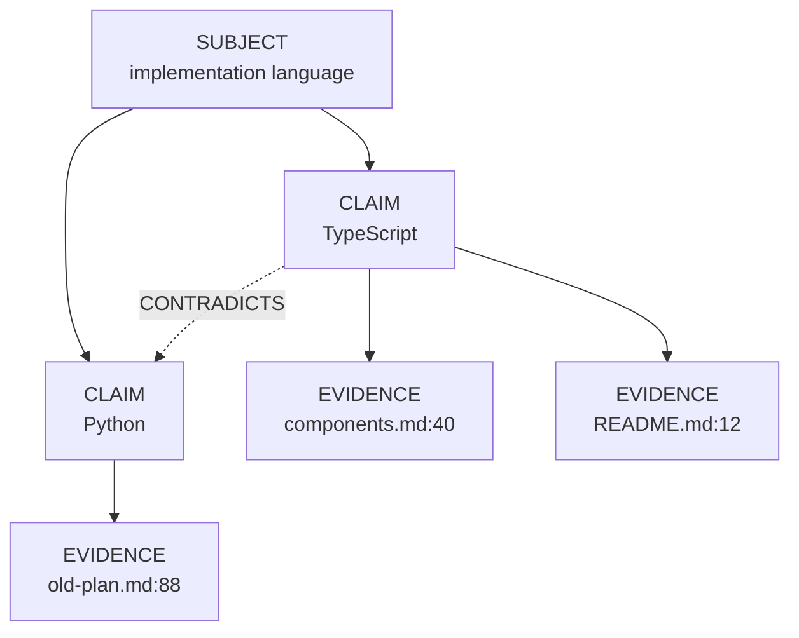
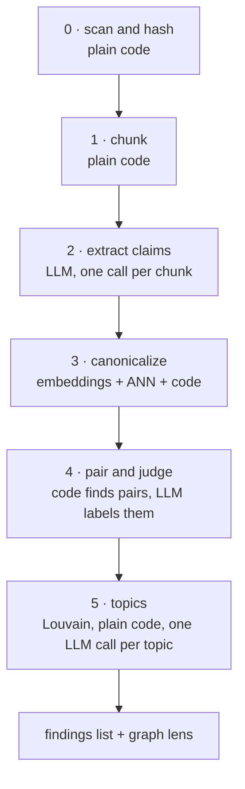

# REX 06 — the fact graph

**Version:** 1.0 · 2026-08-21
**Status:** specified, not implemented
**Depends on:** [`01-initial/SPEC.md`](../01-initial/SPEC.md),
[`02-workspace-and-graph/SPEC.md`](../02-workspace-and-graph/SPEC.md),
[`03-rich-rendering/SPEC.md`](../03-rich-rendering/SPEC.md),
[`04-selection-and-shortcuts/SPEC.md`](../04-selection-and-shortcuts/SPEC.md)
and [`05-selection-as-a-phase/SPEC.md`](../05-selection-as-a-phase/SPEC.md).

> [!note]
> This document extends specs 01 to 05. It does not restate them. §2 says
> exactly what changes; everywhere else the earlier specs still govern,
> including the anchoring model of spec 01 §6 and the Apply safety story of
> spec 01 §8.7.

> [!warning]
> This is the first feature in REX that makes **outbound network calls** — to
> the machine's local LiteLLM gateway. §5 records what that means and the
> boundary it may not cross. Read it before writing any code.
>
> It adds **no second storage engine and no second process**. §6.2 records why,
> and §6.5 records which engines were rejected and the trigger that would make
> one worth revisiting.

---

## 0. How to use this document

**If you are picking this up cold**, read in this order:

1. **§1 and §3** — what the feature is, and the data model it produces.
   Everything after §3 is a consequence of the three-level model.
2. **§4** — the pipeline. This is the bulk of the work.
3. **§5.3 and §7** — the two places where honest numbers change the design.
   A local model is free and slow, and comparison is quadratic. Skipping
   these produces something that works on 20 documents and never finishes on
   2,000.
4. **§6.1** — the one rule that decides what may be stored where. It is also
   what makes every storage decision in §6 reversible.
5. **§11** — the trust rules. They are not decoration. The feature reports
   *candidates*, and a build that claims more than that is wrong.
6. **§12** — the milestones, in order, with their acceptance checks.

**Milestone 0 (§12) is a gate**, the same way spec 01's anchor spike is a gate.
It asks one question: can the local model return the claim schema reliably? If
it cannot, nothing after it works, and that is a two-day answer rather than a
two-month one.

---

## 1. What this is

Spec 02 gave REX a graph of **documents** — what links to what. This document
gives REX a graph of **what the documents claim**.

The reviewer's question is not "which file links to which". It is:

> Do these documents agree with each other?

In a folder of 20 documents a careful human can hold that in their head. In a
folder of 2,000, written by different people over two years, nobody can. The
research is blunt about this: humans miss contradictions that sit far apart in
long text, and that is exactly the miss this feature exists to catch.

### 1.1 The one output that matters

The feature produces a **list of contradiction candidates**. Each one is:

- two quotes, from two places,
- that make different claims about the same subject,
- each with an anchor back into its document.

The graph picture (§8.2) is a second view of the same data. It is good for
seeing shape. It is bad for doing work. **The list is the product.**

### 1.2 Why this belongs in REX and not in a notes app

Because REX can act on a finding. Every claim carries an anchor, so:

```text
finding  →  jump to the sentence  →  make it a comment thread
         →  Ask  →  discuss  →  Apply  →  the document is fixed
```

Spec 05 already made a comment span several documents, which is exactly the
shape a contradiction has. A finding becomes a comment about two documents,
and everything downstream already exists.

---

## 2. What changes in specs 01 to 05

Almost nothing. This is an addition, not a rework.

| Area | Change |
|:--|:--|
| Invariant I1 (anchors resolve in the renderer) | unchanged. Evidence stores an `Anchor`; it is resolved in the renderer like every other anchor |
| Invariant I2 (only main touches storage and models) | unchanged, and extended: only main talks to the gateway |
| Invariant I3 (no HTTP server, no listening port) | **unchanged, and nothing is deviated from.** REX listens on nothing, opens no port and starts no child process. It gains one outbound HTTP client, to `localhost:24000`. §5.1 |
| Spec 01 §9 — the SQLite schema | gains nine tables (§6.3, §6.4) and one loadable extension, `sqlite-vec`. Existing tables are untouched |
| Spec 02 — the reference graph | untouched. The fact graph is a second lens in the same view (§8.2) |
| Spec 05 — comments across documents | untouched, and reused. A finding becomes one of those comments (§8.4) |
| Spec 01 §8 — the agent runner and its profiles | untouched. This pipeline does **not** use the Agent SDK. §5.2 |

---

## 3. The model

### 3.1 Three levels, not two

A flat list of "facts" does not merge and does not compare. Three levels do
both. This is the statement model — the shape Wikidata uses, and what RDF
calls reification.



Each level earns its place:

| Level | What it is | What it buys |
|:--|:--|:--|
| **Subject** | the thing being talked about | clusters into topics (§4.6); the merge key that makes comparison cheap |
| **Claim** | one value asserted about one subject | the node the user sees and counts; the thing that can contradict |
| **Evidence** | one place in one document that states the claim | the anchor back to the text; three documents saying the same thing is one claim with three evidence nodes |

The picture the user asked for falls out of this. **"The same fact in five
documents" is one claim node with five evidence edges.** And a contradiction
candidate is found by counting, before any model runs:

> a subject with two or more live claims

### 3.2 What a claim is

Extraction is not free-form. Every claim must fit this shape, and a model
output that does not fit is rejected and retried (§4.3).

```typescript
export interface ExtractedClaim {
  /** What is being talked about. A noun phrase, not a sentence. */
  subject: string;
  /** What is asserted about it. Short. */
  value: string;
  /** The exact sentence from the source. Must appear verbatim in the chunk. */
  quote: string;
  /**
   * How firmly it is stated. `decided` outranks `proposed` when two claims
   * disagree — a rejected option is not a contradiction.
   */
  modality: "decided" | "proposed" | "rejected" | "observed";
  /** A date the text itself carries, if any. ISO 8601. Drives SUPERSEDES. */
  statedAt: string | null;
}
```

Three rules the prompt must enforce, because each one is a failure mode:

1. **`subject` is a noun phrase, never a sentence.** "implementation
   language", not "the project will be written in TypeScript". If the subject
   is a sentence, nothing ever merges and the graph is fog.
2. **`quote` must appear verbatim in the chunk.** Checked in code, not
   trusted. A quote that does not match is a hallucination, and the claim is
   dropped. This is the cheapest hallucination guard available and it costs
   one string search.
3. **`modality` is required.** Without it, "we considered Python and rejected
   it" becomes a contradiction with "we use TypeScript". That single confusion
   produces more false red lines than any other cause.

### 3.3 Edges

Four kinds in version 1. No more.

| Edge | Direction | Meaning | Drawn as |
|:--|:--|:--|:--|
| `ABOUT` | claim → subject | which subject this claim is about | structural, not drawn |
| `STATES` | evidence → claim | where the claim was found | structural, not drawn |
| `CONTRADICTS` | claim ↔ claim | same subject, values that cannot both hold | red |
| `REFINES` | claim → claim | "TypeScript" → "TypeScript 5.4, strict mode" | grey |
| `SUPERSEDES` | claim → claim | the newer decision replaced the older one | amber, arrowed |
| `CO_OCCURS` | subject ↔ subject | the two subjects appear in the same chunk | not drawn; feeds §4.6 |

`CONTRADICTS` is symmetric and is stored once, from the lower claim id to the
higher one, so the pair cannot be written twice.

### 3.4 Superseding, and why it is not optional

Most apparent contradictions in a real document set are an old decision and a
new decision. Paint those red and the third one teaches the user to ignore red.

The pattern is a **bi-temporal graph**, and the reference implementation is
Graphiti. Two rules:

1. Every claim carries `validFrom` and `validTo`. `validTo` is `null` while
   the claim is live.
2. A superseding claim does not delete the old one. It **closes the old
   claim's window** by setting `validTo`.

The history stays. "What did these documents claim in March?" is answerable,
and a superseded claim is still visible with its window closed.

`SUPERSEDES` is only ever inferred from `statedAt` (§3.2) or from a document's
own modification time, never from the model's opinion about which claim sounds
newer. If neither date exists, the pair stays `CONTRADICTS`.

---

## 4. The pipeline

Six stages. Stages 0, 1 and the grouping half of 3 are plain code and cost
nothing. Only stages 2, the embedding half of 3, and 4 call a model.



### 4.1 Stage 0 — scan and hash

Walk the workspace tree (spec 02 §5). For every text document, compute a
SHA-256 of its bytes. Compare against `fact_document` (§6.4).

| State | Action |
|:--|:--|
| hash unchanged | skip the document entirely |
| hash changed | delete its evidence, then re-extract |
| document gone | delete its evidence |
| new document | extract |

A claim whose last evidence was deleted is deleted too. This is the whole
incremental story, and it is the reason extraction is per-document rather
than per-corpus.

Binary documents (PDF, DOCX) are rendered to text by the existing renderers
(spec 03) before hashing, and the hash is of the **rendered text**, not the
file bytes — a PDF re-saved with no content change must not force a re-run.

### 4.2 Stage 1 — chunk

Split each document into chunks of about **1,500 tokens**, on heading and
paragraph boundaries, never mid-sentence.

Why 1,500 and not the whole document: the gateway's aliases cap output at
**8,192 tokens** (§5.1). A 5,000-word document would need more claims than
that cap allows, and a truncated JSON reply is a wasted call. 1,500 tokens of
source yields roughly 8 to 15 claims, about 800 tokens of JSON, comfortably
inside the cap.

Every chunk keeps its character offsets in the document, so an anchor can be
built from a quote in stage 2.

### 4.3 Stage 2 — extract

One gateway call per chunk. Alias `local` (§5.1). Structured output against
the `ExtractedClaim` schema.

For each returned claim, in code:

1. **Check the quote appears verbatim in the chunk.** If not, drop the claim
   and count it. Report the count at the end of the build.
2. Build an `Anchor` from the quote's offsets, using the existing anchor
   creation of spec 01 §6.4. Evidence stores an `Anchor`, exactly like a
   comment does, so the renderer resolves it with the code that already exists.
3. Write an evidence row. The claim it points at is not known yet — that is
   stage 3.

A chunk whose call fails after two retries is recorded as failed and the build
continues. A build that ends with failures says so.

### 4.4 Stage 3 — canonicalize

This is the stage that decides whether the feature works. Extraction is easy
now; making "TypeScript", "TS" and "Typescript 5.4" line up is not. In the
literature this is **entity resolution**, and the standard method is
embedding plus approximate nearest neighbour.

For each extracted claim:

1. Embed `subject` with the `embed` alias — 768 dimensions (§5.1).
2. Search the subject vector index for the nearest existing subject
   (§6.3). If cosine similarity is at or above **0.90**, reuse that subject.
   Otherwise create a new one.
3. Inside that subject, embed `value` and compare it to the subject's existing
   claims the same way. At or above **0.93**, it is the same claim — attach
   the evidence to it. Otherwise create a new claim.

Both thresholds are configurable and both defaults are guesses. **They must be
tuned against a real folder before milestone 4 closes**, and the build report
prints the merge counts so a bad threshold is visible rather than silent. Too
low and unrelated subjects collapse into one; too high and nothing merges and
every document invents its own vocabulary.

Also in this stage: write `CO_OCCURS` between every pair of subjects that
appear in the same chunk, incrementing `count`. Stage 5 needs it.

### 4.5 Stage 4 — pair and judge

**Do not ask a model to find contradictions.** The ALICE study measured an
LLM asked to find contradictions in requirement documents at 97% accuracy,
0% precision and **0% recall** — it answered "no contradiction" nearly every
time and scored well because contradictions are rare. The same study's hybrid
method, which hands the model one candidate pair at a time, reached 94%
precision and 60% recall.

So the search is code and the judging is the model.

**Find candidates — plain SQL, no model, no cost:**

```sql
SELECT subject_id
FROM   fact_claim
WHERE  valid_to IS NULL
  AND  modality IN ('decided', 'observed')
GROUP  BY subject_id
HAVING count(*) > 1;
```

This is a group-and-count, not a traversal. It is the only "graph" query the
feature makes, and it is the reason §6.2 needs no graph engine.

Two filters do most of the work before any model runs:

- `validTo IS NULL` — superseded claims are not candidates.
- `modality IN ['decided','observed']` — a proposed or rejected option does
  not contradict a decision.

**Judge — batched, one call per batch of 20 pairs.** Alias `local-31b`
(§5.1). The model receives two quotes and the subject, and returns one label
per pair:

| Label | Meaning |
|:--|:--|
| `same` | a paraphrase. Merge the claims and correct the stage-3 threshold data |
| `refines` | one is a more specific form of the other |
| `contradicts` | they cannot both hold |
| `unrelated` | stage 3 grouped them wrongly. Split the subject |

Batching is what makes a slow local model usable here (§7.3). A batch that
returns the wrong number of labels is retried once, then split in half.

`SUPERSEDES` is applied afterwards, in code: for every pair labelled
`contradicts` where both claims carry a `statedAt`, or where both source
documents carry a modification time, the older claim's `validTo` is closed and
the edge becomes `SUPERSEDES`.

### 4.6 Stage 5 — topics

No fixed topic list. The user is right that a review tool cannot know in
advance what it will be pointed at, and the field agrees — GraphRAG derives
topics by running community detection over the graph and then asking a model
to name each community.

**Run Louvain over the co-occurrence graph, not over the claim graph.** The
claim graph is nearly edgeless — only contradictions and refinements connect
anything — and community detection over an edgeless graph returns noise. The
co-occurrence graph built in stage 3 is dense enough to have real structure.

**Run it in main memory with `graphology`.** Load `fact_co_occurrence` into a
`graphology` graph and call `graphology-communities-louvain`. At the ceiling
of §7.3 that is about 8,000 nodes and 150,000 edges — well under 100 MB, and
under a second to load. `graphology` is the graph engine in this design; SQLite
only stores the rows.

Louvain is deterministic for a fixed node order, so **sort the nodes by id
before feeding them in** or the topic ids churn between builds for no reason.

Then one gateway call per community: give it the 20 highest-degree subjects in
that community and ask for a short name. Write the topic id onto every subject
in the community.

### 4.7 Re-running

A build is a row in `fact_run` (§6.4) with a stage cursor. It is:

- **resumable** — a build killed at chunk 812 of 4,000 restarts at 812.
- **incremental** — stage 0 skips unchanged documents, so a second build over
  an unchanged folder finishes in seconds.
- **cancellable** — cancel sets a flag, the running stage finishes its current
  call and stops.

Stages 4 and 5 always re-run in full over the affected subjects. They are the
cheap end of the pipeline and a stale topic assignment is worse than a
re-computed one.

---

## 5. Models and the gateway

### 5.1 Everything goes through the local gateway

REX calls **`http://localhost:24000`** — the machine's LiteLLM gateway
(`~/Projects/Github/lukaskellerstein/ai-gateway`). It never calls a model
provider directly, and it holds no provider key. It holds one capped LiteLLM
key.

Three aliases, each chosen for a reason:

| Stage | Alias | Runs on | Why this one |
|:--|:--|:--|:--|
| Extract (§4.3) | `local` | LMStudio, `google/gemma-4-26b-a4b` | high volume, easy task. A mixture-of-experts model with ~4B active parameters is several times faster than the dense 31B, and extraction does not need the extra capability |
| Judge (§4.5), name topics (§4.6) | `local-31b` | LMStudio, `google/gemma-4-31b` | low volume, needs care. This is where a wrong answer becomes a wrong red line |
| Embed (§4.4) | `embed` | LMStudio, `text-embedding-nomic-embed-text-v1.5` | 768 dimensions, 2,048-token window. Claims are short, so the window is not a constraint |

Two facts about these aliases that the code must respect:

- **`local` is not guaranteed to stay local.** When LMStudio is down it falls
  through to OpenRouter with the same weights. Free while LMStudio is up, real
  spend when it is not. For a workspace marked confidential (§5.4) the build
  must use `local-31b`, which has no fallback chain by design, or refuse to
  start.
- **`embed` and `local-31b` are terminal.** They have no fallback. If LMStudio
  is down they fail, and the build must report that clearly rather than
  retrying for an hour.

Preflight, before every build: `GET /health/readiness` must answer
`{"status":"healthy","db":"connected"}`, and `GET /model/info` must list all
three aliases. A build that starts against a half-configured gateway wastes
hours before it fails.

### 5.2 This pipeline does not use the Agent SDK

Spec 01 §8's agent runner stays exactly as it is, for comment threads. This
pipeline uses the plain OpenAI-compatible route
(`POST /v1/chat/completions`) instead, for one reason:

> Extraction is a single-shot structured-output call. It is not an agentic
> loop. There is no tool to call, no file to read, no turn to take.

Starting an agent session per chunk would add a system prompt, a session id, a
transcript, and a gate — thousands of times over — to a call that needs none
of them. It would also be slower per call, and §7 shows that per-call time is
the whole performance story.

Spec 01 §0 rule 3 applies: where the spec is silent, prefer the simplest thing
that works.

**Consequence for the gate:** spec 01 §8.4's `PreToolUse` deny hook does not
apply here, because there are no tools. The safety property is stronger and
simpler instead — **this pipeline is read-only by construction.** It reads
document text and writes to its own two stores. It never writes a document.
Verify it the way spec 01 §8.4 verifies the read profile:

```bash
git status --porcelain   # in the document's repository, after a full build
```

### 5.3 A local model is slow, and that shapes everything

This is the number that changes the design, so it is stated before any plan
depends on it.

The gateway's own notes record LiteLLM's per-route timeout raised to
**3,600 seconds** for local aliases, after prompts were measured being
cancelled at 576 s and 590 s under the old 600 s default. A local model on
this machine answers in seconds to minutes, not milliseconds, and LMStudio
serves few requests at a time.

Working figures for planning, to be replaced by measurements at milestone 0:

| Item | Estimate |
|:--|:--|
| One extract call, 1,500-token chunk, ~800 tokens out, on `local` | 20–30 s |
| One 5,000-word document, about 4 chunks | about 2 minutes |
| One judge batch of 20 pairs on `local-31b` | 40–60 s |
| Embedding 1,000 claims on `embed`, batched | under a minute |

So a build is a **background job measured in hours**, not a spinner. §7.3 has
the totals.

### 5.4 The cloud path, and when it is allowed

The same pipeline runs against `cheap` or `standard` and finishes in an hour
instead of three days, for a few dollars (§7.3). That is a per-workspace
setting with two rules:

1. **The default is local.** REX is pointed at the user's own documents. Those
   documents leaving the machine is a decision, not a default.
2. **A workspace can be marked local-only.** Then the build uses `local-31b`
   and `embed` — the two terminal aliases — so a stopped LMStudio fails the
   build rather than quietly sending the documents to OpenRouter.

### 5.5 Structured output

Every model call uses JSON schema output. LiteLLM passes `response_format`
through to LMStudio, which constrains generation against the schema.

Two guards, because a local model is less reliable at this than a frontier one:

- Parse and validate every reply against the schema. On failure, retry once
  with the validation error appended to the prompt, then give up and count it.
- The verbatim-quote check of §4.3 runs after schema validation and is not
  negotiable.

Milestone 0 exists to find out how often these fire.

---

## 6. Storage

### 6.1 The rule everything else follows from

There is exactly one rule:

> **The fact graph is a cache. It is never a source of truth. Nothing the user
> authored is stored in it.**

Every subject, claim, evidence row and edge is derived from document text and
can be rebuilt by running the pipeline again. If the graph tables are lost,
corrupted or deleted, the cost is compute time and nothing else.

What the user authors — a verdict on a finding, a comment made from a finding —
lives in the **bookkeeping tables** of §6.4, keyed by a stable hash so a rebuilt
graph reconnects to it. Getting this backwards is the one mistake in this
document that would lose real work.

Two things follow, and both matter more than they look:

- **Durability is not a constraint on the graph tables.** They may be dropped
  and rebuilt at any time, by any code, without asking the user.
- **The storage decision of §6.2 is reversible.** Changing engine means
  rewriting one file (§10) and re-running a build. There is no migration to
  write and no data to lose. §6.5 is the trigger that would make it worth doing.

### 6.2 One store: SQLite with `sqlite-vec`

**Decision: no new database. The fact graph lives in `~/.rex/rex.db`, beside
the threads, with `sqlite-vec` loaded for the embeddings.**

The reasoning is that REX has a graph **shape** but not a graph **workload**.
Those are different things, and only the second one needs a graph engine.

| Where | Operation | What it is |
|:--|:--|:--|
| §4.4 | nearest existing subject, nearest existing claim | vector search |
| §4.5 | subjects with two or more live claims | `GROUP BY … HAVING` |
| §3.4 | close a superseded claim's window | one `UPDATE` |
| §4.6 | Louvain over co-occurrence | in-memory, `graphology` |
| §8.1 | the findings list | rows, sorted |
| §8.2 | claim → its evidence | one join, one hop |
| §8.2 | draw the lens | read all nodes and edges |

There is not one multi-hop traversal in that list. No variable-length path, no
reachability, no pattern match. A graph database would be paying for index
structures that nothing here queries.

So the three jobs split like this:

| Job | Tool | Already in the repo? |
|:--|:--|:--|
| Rows, joins, group-and-count | `better-sqlite3` | **yes** |
| Vector search | `sqlite-vec` (loadable extension) | no — the one new dependency |
| Graph algorithms | `graphology` + `graphology-communities-louvain` | no — two small pure-JavaScript packages |
| Layout | `d3-force` | **yes** |

What this buys, and it is the whole argument:

- **No second process, no port, no socket, no nested binary to code-sign.**
- **No platform gaps.** It runs wherever SQLite runs, which is wherever REX runs.
- **Invariant I3 holds with nothing to sign off on.**
- One backup, one file, one transaction boundary.

**On brute-force vector search.** `sqlite-vec` scans rather than using an
approximate index, and that is fine at this size. At the §7.3 ceiling the store
holds about 68,000 vectors of 768 dimensions. A scan is tens of milliseconds,
and canonicalization does roughly 60,000 of them — call it 30 minutes, once,
inside a build whose extraction stage already takes days. It is noise. **If it
ever stops being noise, §6.5 has the answer, and it is not a graph database.**

### 6.3 The graph tables

These are the cache. They may be dropped and rebuilt at any time (§6.1).

```sql
CREATE TABLE fact_subject (
  id             TEXT PRIMARY KEY,
  workspace_root TEXT NOT NULL,
  label          TEXT NOT NULL,
  topic_id       INTEGER,
  topic_name     TEXT
);

CREATE TABLE fact_claim (
  id         TEXT PRIMARY KEY,
  subject_id TEXT NOT NULL REFERENCES fact_subject(id) ON DELETE CASCADE,
  value      TEXT NOT NULL,
  modality   TEXT NOT NULL,     -- decided | proposed | rejected | observed
  stated_at  TEXT,
  valid_from TEXT NOT NULL,
  valid_to   TEXT               -- NULL means live. §3.4
);

CREATE TABLE fact_evidence (
  id            TEXT PRIMARY KEY,
  claim_id      TEXT NOT NULL REFERENCES fact_claim(id) ON DELETE CASCADE,
  document_path TEXT NOT NULL,
  chunk_index   INTEGER NOT NULL,
  quote         TEXT NOT NULL,
  anchor        TEXT NOT NULL   -- a serialised Anchor, spec 01 §6
);

CREATE TABLE fact_edge (
  from_claim TEXT NOT NULL REFERENCES fact_claim(id) ON DELETE CASCADE,
  to_claim   TEXT NOT NULL REFERENCES fact_claim(id) ON DELETE CASCADE,
  kind       TEXT NOT NULL,     -- contradicts | refines | supersedes
  PRIMARY KEY (from_claim, to_claim, kind)
);

CREATE TABLE fact_co_occurrence (
  subject_a TEXT NOT NULL REFERENCES fact_subject(id) ON DELETE CASCADE,
  subject_b TEXT NOT NULL REFERENCES fact_subject(id) ON DELETE CASCADE,
  count     INTEGER NOT NULL DEFAULT 1,
  PRIMARY KEY (subject_a, subject_b)
);

CREATE INDEX fact_claim_subject  ON fact_claim(subject_id, valid_to);
CREATE INDEX fact_evidence_claim ON fact_claim(id);
CREATE INDEX fact_evidence_doc   ON fact_evidence(document_path);
```

Two `sqlite-vec` virtual tables hold the embeddings. They are separate from the
row tables because `vec0` tables take a fixed-width vector column and nothing
else worth putting there:

```sql
CREATE VIRTUAL TABLE fact_subject_vec USING vec0(
  subject_id TEXT PRIMARY KEY,
  embedding  FLOAT[768]
);

CREATE VIRTUAL TABLE fact_claim_vec USING vec0(
  claim_id  TEXT PRIMARY KEY,
  embedding FLOAT[768]
);
```

Three rules the implementer must not get wrong:

1. **`fact_evidence.anchor` is stored, never resolved, in main.** It is a
   serialised `Anchor` from spec 01 §6, resolved in the renderer like every
   other anchor. Invariant I1.
2. **`fact_edge` for `contradicts` is written once**, from the lower claim id
   to the higher one, because the relation is symmetric and would otherwise be
   stored twice.
3. **`fact_co_occurrence` stores each pair once**, with `subject_a` the lower
   id. It is read as an undirected graph in §4.6.

### 6.4 The bookkeeping tables

### 6.2 FalkorDB, and the deviation it costs

**Decision: FalkorDB, embedded through `falkordblite`.**

What it gives:

| Capability | Why it matters here |
|:--|:--|
| Cypher | §4.5's candidate query is six lines. In SQL with recursive CTEs it is not |
| Built-in HNSW vector index, 1–4,096 dimensions, cosine | §4.4's nearest-neighbour search comes free. `embed` returns 768, well inside the range |
| One store for graph and vectors | **this removes the vector-database question entirely** (§6.5) |
| Graph algorithms (`algo.WCC`, `algo.pageRank`, `algo.betweenness`) | useful later; not needed for version 1 |

What it costs, stated plainly:

1. **It spawns a `redis-server` child process** with the FalkorDB module
   loaded, and connects over a **Unix socket**. Electron must start it, stop
   it, and handle it dying.
2. **`falkordblite` is young** — version 0.3.0, 9 stars, 119 commits, last
   published 2026-05-02. The remote client `falkordb` (6.7.0, published
   2026-07-30) is the mature half of the pair.
3. **Platforms**: Linux x64 and macOS arm64 ship binaries. macOS x64 needs a
   system `redis-server`. Windows needs WSL2.
4. **It is memory-resident.** 60,000 claims with 768-dimension vectors is
   roughly 200 MB of RAM on top of Electron's own.

**How invariant I3 reads.** I3 forbids REX from running an HTTP server, an
SSE stream, a message broker or a listening port. A Unix socket to a database
engine in a child process is none of those: REX still accepts no connection
from anything, and the renderer still reaches main only through
`ipcRenderer.invoke`. Redis is used here as a storage engine, not as a bus —
nothing publishes and nothing subscribes.

**This is still a deviation from the shape spec 01 describes, and it is
recorded here rather than assumed.** The boundary it may not cross:

- The socket is a Unix domain socket. Never TCP.
- Only main opens it. The renderer has no FalkorDB handle, exactly as it has
  no SQLite handle (invariant I2).
- No user-authored data goes in it (§6.1).

**The fallback if `falkordblite` fails.** `falkordblite` and `falkordb` expose
the same client API — only the import and the connection line differ. So the
code targets one thin interface (§10) and the escape hatch is to run FalkorDB
as a container beside the existing gateway stack, which this machine already
runs under `podman compose`. That is a configuration change, not a rewrite.

**GraphRAG-SDK is not a dependency.** FalkorDB's
[GraphRAG-SDK](https://github.com/FalkorDB/GraphRAG-SDK) is Python, and spec
01 §14 rules out a Python runtime. It is worth reading as a design reference —
its pipeline is the same five stages as §4, and its examples call models
through LiteLLM, which is the same gateway this document uses. Read it. Do not
import it.

### 6.3 The graph schema

```cypher
CREATE VECTOR INDEX FOR (s:Subject) ON (s.embedding)
  OPTIONS {dimension: 768, similarityFunction: 'cosine'};

CREATE VECTOR INDEX FOR (c:Claim) ON (c.embedding)
  OPTIONS {dimension: 768, similarityFunction: 'cosine'};

CREATE INDEX FOR (c:Claim) ON (c.validTo);
CREATE INDEX FOR (e:Evidence) ON (e.documentPath);
```

Node properties:

| Node | Properties |
|:--|:--|
| `Subject` | `id`, `label`, `embedding`, `topicId`, `topicName` |
| `Claim` | `id`, `value`, `embedding`, `modality`, `validFrom`, `validTo`, `statedAt` |
| `Evidence` | `id`, `documentPath`, `anchor` (JSON), `quote`, `chunkIndex` |

`Evidence.anchor` is a serialised `Anchor` from spec 01 §6. It is stored, never
resolved, in main — invariant I1.

### 6.4 The SQLite tables

Four tables in `~/.rex/rex.db`, beside the existing ones. These hold the two
things a graph rebuild must not destroy: what the user decided, and what the
build already did.

```sql
-- One row per document the pipeline has seen. Drives the incremental skip.
CREATE TABLE fact_document (
  workspace_root TEXT NOT NULL,
  path           TEXT NOT NULL,
  content_hash   TEXT NOT NULL,
  extracted_at   TEXT NOT NULL,
  chunk_count    INTEGER NOT NULL,
  PRIMARY KEY (workspace_root, path)
);

-- One row per build. Makes a build resumable and cancellable.
CREATE TABLE fact_run (
  id             TEXT PRIMARY KEY,
  workspace_root TEXT NOT NULL,
  started_at     TEXT NOT NULL,
  finished_at    TEXT,
  stage          TEXT NOT NULL,
  cursor         INTEGER NOT NULL DEFAULT 0,
  alias_extract  TEXT NOT NULL,
  alias_judge    TEXT NOT NULL,
  state          TEXT NOT NULL,      -- running | done | cancelled | failed
  dropped_quotes INTEGER NOT NULL DEFAULT 0,
  failed_chunks  INTEGER NOT NULL DEFAULT 0
);

-- The user's verdict on a finding. Survives every graph rebuild.
CREATE TABLE fact_verdict (
  finding_key TEXT PRIMARY KEY,      -- see below
  verdict     TEXT NOT NULL,         -- confirmed | dismissed
  note        TEXT,
  decided_at  TEXT NOT NULL
);

-- Links a finding to the comment thread it produced (spec 05 §5).
CREATE TABLE fact_finding_thread (
  finding_key TEXT NOT NULL,
  thread_id   TEXT NOT NULL,
  PRIMARY KEY (finding_key, thread_id)
);
```

`finding_key` is a SHA-256 of the two claims' normalised quotes and their
document paths, sorted. It is deliberately **not** a claim id: claim ids are
regenerated on every rebuild, and a verdict keyed to one would be lost. Keyed
to the quotes, a dismissed finding stays dismissed across rebuilds, which §11
requires.

### 6.5 Why not LanceDB, and why not Qdrant

Because FalkorDB already indexes vectors, a separate vector store would be a
third engine holding a copy of the same embeddings.

If FalkorDB is ever dropped, the choice between them is not close:

| | Shape | Verdict |
|:--|:--|:--|
| **LanceDB** (`@lancedb/lancedb` 0.37.1) | truly embedded, in-process, no server | the right fallback. Actively maintained |
| **Qdrant** (`@qdrant/js-client-rest` 1.19.0) | a **server**, reached over REST | wrong shape here. Another container, another port, for a store only this app reads |

Qdrant is excellent when several services share a vector store over a network.
REX is one desktop app reading its own cache. It never gets that benefit and
pays the whole cost.

`sqlite-vec` remains a third option — it would put vectors in the database REX
already has. It is only worth revisiting if FalkorDB is dropped *and* the graph
queries turn out to be simple enough for SQL after all.

---

## 7. Performance

### 7.1 Two costs, and only one of them is dangerous

**Extraction is linear.** Double the documents, double the time. Slow, but it
never surprises you.

**Comparison is quadratic.** 60,000 claims compared pairwise is 1.8 billion
comparisons. That does not finish at any speed, on any hardware, for any
money. A design that does not address this does not scale past a few hundred
documents, and it will look fine in testing.

### 7.2 What keeps comparison bounded

Three filters, applied in order, all before a model sees anything:

1. **Group by subject.** A claim is only ever compared to claims about the
   same subject. This is the whole reason for the three-level model of §3.1.
   It converts a global pairwise problem into many tiny local ones.
2. **Merge inside the subject by value similarity** (§4.4). A subject with 8
   claims usually has 2 or 3 distinct values.
3. **Filter by state and modality** (§4.5). Superseded claims and rejected
   options are dropped before pairing.

The subject index in FalkorDB is HNSW, so step 1's lookup is approximate
nearest neighbour, not a scan. This is the standard **blocking** technique
from entity resolution, and it is what the field uses to take pairwise work
from billions to thousands.

### 7.3 The numbers

Rough figures at three sizes, assuming 5,000-word documents and the §5.3
estimates. Every one of these must be replaced by a measurement at milestone 4.

| | 20 docs | 200 docs | 2,000 docs |
|:--|:--|:--|:--|
| Chunks | 80 | 800 | 8,000 |
| Claims | ~800 | ~8,000 | ~60,000 |
| Subjects after merge | ~200 | ~1,500 | ~8,000 |
| Judge batches | ~5 | ~40 | ~130 |
| **Local build, first run** | ~40 min | ~7 h | **~3 days** |
| **Local build, one document changed** | seconds | seconds | ~2 min |
| Cloud build on `cheap`, first run | minutes | ~20 min | ~2 h |
| Cloud cost on `cheap` ($0.12 in / $0.35 out per 1M) | pennies | under $1 | **about $4** |

Two conclusions the design must carry:

- **A first local build of a large folder is an overnight job.** It must be
  resumable (§4.7), it must show progress, and it must survive the app being
  closed. Anything else makes it unusable at the size the user is aiming for.
- **After the first build, everything is fast.** The incremental row is the one
  the user lives with day to day, and it is seconds.

### 7.4 Nothing is capped silently

If a build limits its own coverage, it says so in the report:

- claims dropped for a non-verbatim quote (§4.3),
- chunks that failed after retries,
- judge batches that failed,
- any subject whose claim count exceeded the pairing cap.

A build report that omits these reads as "everything was covered" when it was
not, and §11 forbids that.

---

## 8. The interface

### 8.1 The findings list

A new view, reached from the workspace. It lists contradiction candidates,
most-supported first. Each row:

- the subject,
- the two quotes, side by side, with their document paths,
- the topic name,
- a badge for `contradicts` or `supersedes`,
- three actions: **Open**, **Dismiss**, **Comment**.

**Open** jumps to the first quote's anchor in its document, with the second
document opened beside it if the workspace supports it (spec 05 §5.3).

Above the list, the build summary: counts, the aliases used, when it ran, and
whatever §7.4 requires it to admit.

### 8.2 The graph lens

The existing graph view (spec 02) gains a toggle:

| Lens | Nodes | Edges |
|:--|:--|:--|
| **Documents** (today) | documents | links |
| **Facts** (new) | subjects and claims | contradicts, refines, supersedes |

The fact lens reuses the existing `d3-force` layout with one addition: each
topic gets its own centre of gravity, so communities separate visibly instead
of by accident. Node colour is the topic. Edge colour is §3.3.

Clicking a claim node opens its evidence — every document that states it.
That is the "one fact, many documents" view the feature exists to give.

### 8.3 Confirm and dismiss

A finding is a **candidate**, never a fact. The user decides.

- **Dismiss** writes `fact_verdict` and hides the row. It stays hidden across
  rebuilds, because the key is the quotes (§6.4).
- **Confirm** keeps the row and marks it. Confirmed findings sort to the top.
- Neither action edits a document. Ever.

### 8.4 From a finding to a comment

**Comment** creates a thread (spec 05 §5) whose selection is the two quotes,
one anchor in each document, pre-filled with the subject and both values.

From that point nothing is new. The user asks, discusses and applies exactly
as spec 01 §8 and spec 05 §5.6 already describe, including the diff gate. The
row is linked to the thread through `fact_finding_thread`, so a resolved
thread can mark its finding resolved.

---

## 9. IPC

Following spec 01 §10 and `src/shared/channels.ts`.

Commands, renderer → main via `ipcRenderer.invoke`:

| Channel | Payload | Returns |
|:--|:--|:--|
| `facts:build` | `{ root, aliases?, force? }` | `FactRunSummary` |
| `facts:cancel` | `{ runId }` | `void` |
| `facts:status` | `{ root }` | `FactRunSummary \| null` |
| `facts:findings` | `{ root, filter }` | `Finding[]` |
| `facts:graph` | `{ root, topicId? }` | `FactGraph` |
| `facts:verdict` | `{ findingKey, verdict, note? }` | `void` |
| `facts:comment` | `{ findingKey }` | `Thread` |

Events, main → renderer via `webContents.send`:

| Channel | Payload |
|:--|:--|
| `facts:progress` | `{ runId, stage, done, total, message }` |

`facts:progress` fires at most once per second. A build emitting an event per
chunk would flood the renderer for hours.

---

## 10. Where the code goes

```text
src/main/facts/
  gateway.ts      OpenAI-compatible client for localhost:24000; retries, schema validation
  chunk.ts        stage 1
  extract.ts      stage 2, including the verbatim-quote check
  canonical.ts    stage 3, embeddings and thresholds
  pairs.ts        stage 4, the candidate query
  judge.ts        stage 4, batched labelling
  topics.ts       stage 5, Louvain over CO_OCCURS
  store.ts        the thin FalkorDB interface — the ONLY file that imports falkordblite
  build.ts        the resumable job and its cursor
src/renderer/overlay/
  FactsView.tsx   the findings list
  FactGraph.tsx   the fact lens for the existing graph view
```

`store.ts` is the seam that makes §6.2's fallback cheap. Nothing else in the
tree may import a graph client.

Per spec 01 §3, none of this may live in the renderer: `src/renderer/` gains no
graph handle, no gateway client and no embedding call.

---

## 11. Trust rules

These are requirements, not advice. The feature is a machine reporting on a
human's documents, and overstating it is the way it becomes useless.

1. **Say "candidates", never "all contradictions".** The best measured method
   in the literature reaches about 60% recall. This one will do worse. The UI
   text must not imply completeness, and neither must the build report.
2. **A finding is never acted on automatically.** It becomes a comment, and a
   comment becomes an edit only through Apply, which already shows a diff and
   requires acceptance (spec 01 §8.7).
3. **A dismissed finding stays dismissed** across rebuilds. §6.4 is how.
4. **Every claim shows its evidence.** No claim is ever displayed without at
   least one quote and a way to jump to it. A claim the user cannot check is
   worse than no claim.
5. **The pipeline never writes a document.** §5.2 gives the check.
6. **Say what was skipped.** §7.4.

---

## 12. Milestones

### Milestone 0 — the gate

**A standalone script. No Electron, no FalkorDB, no UI.**

Point it at
`~/Projects/Github/redhat/ProtoBot/docs/architecture/components.md` (1,063
lines) and have it extract claims from 10 chunks through the gateway.

Accept when:

- [ ] `GET /health/readiness` answers healthy, and `/model/info` lists
      `local`, `local-31b` and `embed`
- [ ] `local` returns valid `ExtractedClaim` JSON for at least 9 of 10 chunks
- [ ] at least 90% of returned quotes appear verbatim in their chunk
- [ ] subjects are noun phrases, not sentences, by inspection of 30 of them
- [ ] `embed` returns 768-dimension vectors
- [ ] the real per-call time is measured and written into §5.3

**If the quote check or the noun-phrase check fails, stop.** Fix the prompt, or
change the model, before anything else is built. Every stage after this one
assumes claims are well-formed.

> Tool calling on `local-31b` is recorded as **not yet verified** in the
> gateway's own notes, while `local` and `uncensored` are verified. This
> pipeline needs structured output, not tool calling, so it is a different
> question — but it is unverified either way, and milestone 0 is where it gets
> answered.

### Milestone 1 — extract and store

Extraction over a whole small folder, written to SQLite and a JSONL dump. No
graph database yet.

- [ ] 20 documents extract end to end without manual intervention
- [ ] a second run over an unchanged folder does zero model calls
- [ ] changing one document re-extracts only that document
- [ ] every evidence row carries an `Anchor` that the renderer resolves to the
      right place, checked by inspection on five of them

### Milestone 2 — the graph store

- [ ] `falkordblite` opens, creates the schema of §6.3 and closes cleanly
- [ ] the process is stopped when REX quits, and REX quits when it dies
- [ ] claims, subjects and evidence write and read back
- [ ] the vector index returns sensible nearest subjects for 10 hand-picked
      probes

### Milestone 3 — canonicalization

- [ ] "TypeScript", "TS" and "Typescript" merge to one subject
- [ ] a claim stated in three documents is one claim with three evidence nodes
- [ ] both thresholds are tuned against a real folder and the chosen values are
      written into §4.4
- [ ] the merge counts appear in the build report

### Milestone 4 — findings

- [ ] the candidate query returns pairs, and each one is correct by inspection
- [ ] judging labels them, batched, without a schema failure per batch
- [ ] the findings list renders, and **Open** jumps to the right sentence in
      both documents
- [ ] a deliberately planted contradiction in two test documents is found
- [ ] a deliberately planted *rejected option* is **not** reported
- [ ] the §7.3 table is replaced with measured numbers

### Milestone 5 — verdicts and comments

- [ ] Dismiss survives a full rebuild
- [ ] Comment creates a two-document thread that Ask answers
- [ ] `git status --porcelain` is clean in the document repository after a
      full build (§5.2)

### Milestone 6 — topics and the lens

- [ ] Louvain returns stable communities across two runs of the same corpus
- [ ] topic names are sensible by inspection
- [ ] the graph lens toggles, clusters visibly by topic, and paints
      contradictions red and superseding amber

---

## 13. Out of scope

Deliberately not in this document. Each was considered.

| Not doing | Why |
|:--|:--|
| **Gap detection** | dropped at the user's request. "Gap" is not yet defined well enough to build, unlike "contradiction", which §3.1 defines by counting |
| A local ONNX NLI cross-encoder as a pre-filter | it would cut judging time hard, and it is the standard tool for this. But it adds `onnxruntime-node`, a model download and a second inference path. Revisit only if §7.3's judging figure turns out to be the bottleneck |
| GraphRAG-SDK, LightRAG, Graphiti as dependencies | all Python. Spec 01 §14 rules out a Python runtime. Read them, port the ideas |
| Leiden community detection | no JavaScript implementation exists. Louvain is available and good enough (§4.6) |
| Cross-workspace fact graphs | one workspace, one graph. Merging two corpora is a different product |
| Editing a claim by hand | the graph is a cache (§6.1). A hand edit would be lost on rebuild. Correct the document instead — which is what Apply is for |
| Question answering over the graph | this is a review tool, not a chatbot. The comment thread is where questions go |

---

## 14. References

The design decisions above that came from published work, so a later reader
can check them rather than trust them.

| Claim in this document | Source |
|:--|:--|
| An LLM asked to find contradictions scored 0% recall; a hybrid pairwise method reached 94% precision, 60% recall (§4.5) | [Automated requirement contradiction detection through formal logic and LLMs](https://dl.acm.org/doi/abs/10.1007/s10515-024-00452-x) |
| Humans miss contradictions separated across long documents (§1) | [Improved Evidence Extraction and Metrics for Document Inconsistency Detection with LLMs](https://arxiv.org/pdf/2601.02627) |
| Atomic claim decomposition as the extraction unit (§3.2) | [FActScore / VeriScore](https://arxiv.org/pdf/2406.19276), [Fact in Fragments](https://arxiv.org/pdf/2506.07446) |
| Bi-temporal edges and validity windows instead of deletion (§3.4) | [Graphiti](https://neo4j.com/blog/developer/graphiti-knowledge-graph-memory/), [Zep](https://www.getzep.com/ai-agents/temporal-knowledge-graph/) |
| Embedding plus approximate nearest neighbour as the blocking method (§4.4, §7.2) | [Pre-trained Embeddings for Entity Resolution (VLDB)](https://www.vldb.org/pvldb/vol16/p2225-skoutas.pdf) |
| Communities found by algorithm, then named by a model (§4.6) | [GraphRAG](https://github.com/DEEP-PolyU/Awesome-GraphRAG), [LLM-empowered knowledge graph construction: a survey](https://arxiv.org/html/2510.20345v1) |
| FalkorDB vector index: HNSW, 1–4,096 dimensions, cosine or euclidean (§6.2) | [FalkorDB vector index docs](https://docs.falkordb.com/cypher/indexing/vector-index.html) |
| `falkordblite` spawns redis-server and connects over a Unix socket (§6.2) | [falkordblite-ts](https://github.com/FalkorDB/falkordblite-ts) |
| GraphRAG-SDK is Python and calls models through LiteLLM (§6.2) | [GraphRAG-SDK](https://github.com/FalkorDB/GraphRAG-SDK) |
| Gateway aliases, windows, timeouts and fallback chains (§5.1, §5.3) | `~/Projects/Github/lukaskellerstein/ai-gateway` — `README.md` and `NOTES.md` |
