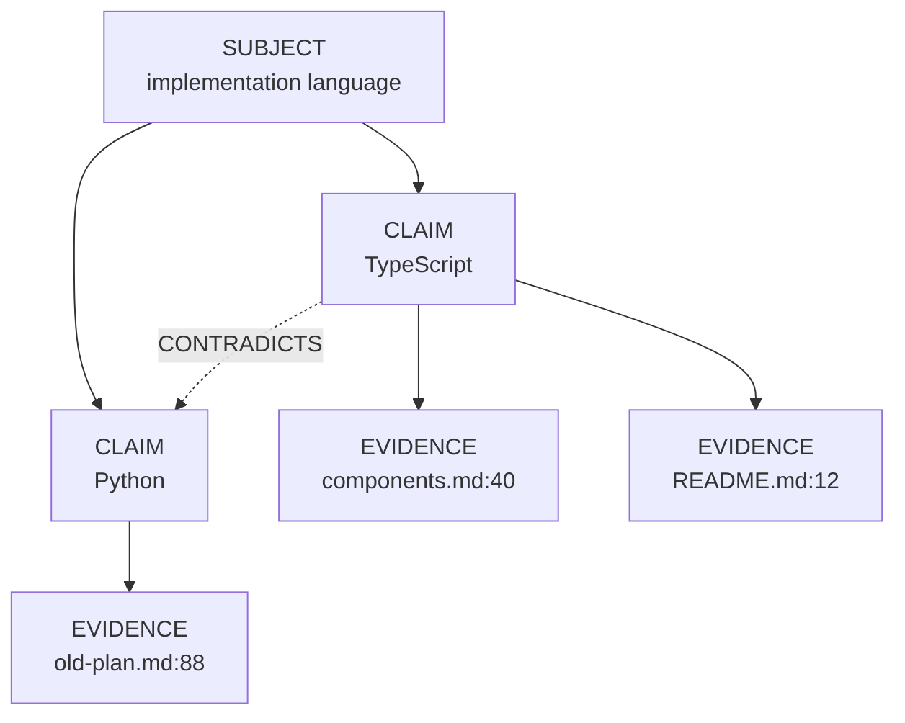
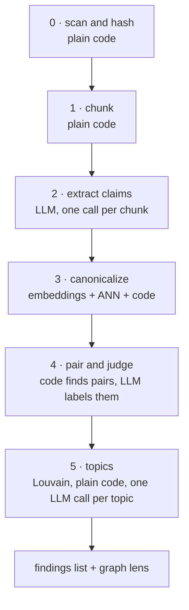
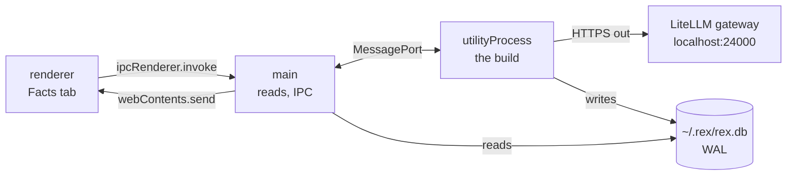

# REX 07 — the fact graph

**Version:** 1.3 · 2026-08-21
**Status:** implemented; milestone 0 passed, §12's measurements written back

> [!note]
> **1.3 is the implementation pass.** No design changed. What changed is that
> the numbers §12 asked to be measured now are, and four of them were wrong
> enough to matter:
>
> - **§4.4** — the subject threshold moves **0.90 → 0.62**. Measured, 0.90
>   rejected four of seven pairs that plainly mean the same thing. The claim
>   threshold stays at 0.93, and §4.4 now records *why* it cannot be tuned into
>   a boundary at all.
> - **§5.3** — one extract call is **301 s, not 20–30 s**, because §5.4's
>   local-only default runs the dense reasoning model rather than `local`.
> - **§5.6** — `local-31b` is **1 in flight, not 2**. LMStudio decodes one
>   request at a time, so the second buys nothing.
> - **§7.3** — gains a `local-31b` row. Three days becomes thirty.
> - **§6.2** — the scan estimate is confirmed: 47 ms at 68,000 vectors.
>
> Two places the implementation had to depart from the text, both recorded where
> they happen rather than here: stages 2 and 3 run **per chunk** (§4.3 step 3
> asks for an evidence row whose claim is unknown, which §6.3's `NOT NULL`
> forbids — see the header of `src/main/facts/build.ts`), and resume is counted
> **per document** rather than per run (a run-level cursor is meaningless once
> stage 0 shortens the document list — see `chunks_done` in `schema.sql`).
**Depends on:** [`01-initial/SPEC.md`](../01-initial/SPEC.md),
[`02-workspace-and-graph/SPEC.md`](../02-workspace-and-graph/SPEC.md),
[`03-rich-rendering/SPEC.md`](../03-rich-rendering/SPEC.md),
[`04-selection-and-shortcuts/SPEC.md`](../04-selection-and-shortcuts/SPEC.md),
[`05-selection-as-a-phase/SPEC.md`](../05-selection-as-a-phase/SPEC.md) and
[`06-document-section-and-pen/SPEC.md`](../06-document-section-and-pen/SPEC.md).

> [!note]
> **1.2 was numbered 06 and is now 07**, swapped with the document-section-and-pen
> spec, which continues spec 05's selection work and belongs first. 1.2 also
> filled the three gaps 1.1 left: **§10.1** says where the pipeline runs (an
> Electron `utilityProcess`, not the main thread and not a server), **§8.5**
> says when a build starts (clicking the Facts tab), and **§5.6** caps how many
> gateway calls run at once.

> [!note]
> **1.1 removed the graph database.** 1.0 specified FalkorDB through
> `falkordblite`, and accepted a `redis-server` child process as a deviation
> from invariant I3. Working through the queries showed that REX has a graph
> *shape* and not a graph *workload* — every operation is rows, joins, vector
> search, or an in-memory algorithm — so §6 is now SQLite plus `sqlite-vec`,
> with no second process and no deviation to accept. §6.5 records FalkorDB,
> Qdrant, Kuzu and Oxigraph, why each was rejected, and the trigger that would
> make one worth revisiting. Nothing else in the design moved.

> [!note]
> This document extends specs 01 to 06. It does not restate them. §2 says
> exactly what changes; everywhere else the earlier specs still govern,
> including the anchoring model of spec 01 §6 and the Apply safety story of
> spec 01 §8.7.

> [!warning]
> Two firsts for REX, and each has a section that fixes its boundary. Read both
> before writing any code.
>
> 1. **Outbound network calls**, to the machine's local LiteLLM gateway. §5.
> 2. **A second process** — an Electron `utilityProcess` that runs the build.
>    §10.1. It is not a server, it opens no port, and it exists because a build
>    is measured in hours (§5.3) and would otherwise stutter the main thread.
>
> It adds **no second storage engine**. §6.2 records why, and §6.5 records which
> engines were rejected and the trigger that would make one worth revisiting.

---

## 0. How to use this document

**If you are picking this up cold**, read in this order:

1. **§1 and §3** — what the feature is, and the data model it produces.
   Everything after §3 is a consequence of the three-level model.
2. **§4** — the pipeline. This is the bulk of the work.
3. **§5.3 and §7** — the two places where honest numbers change the design.
   A local model is free and slow, and comparison is quadratic. Skipping
   these produces something that works on 20 documents and never finishes on
   2,000.
4. **§6.1** — the one rule that decides what may be stored where. It is also
   what makes every storage decision in §6 reversible.
5. **§10.1 and §8.5** — where the build runs, and what starts it. Both are
   easy to get wrong in a way that only shows up on a large folder: a build on
   the main thread stutters the app for an hour, and a build started by a tab
   click can be a three-day job nobody asked for.
6. **§11** — the trust rules. They are not decoration. The feature reports
   *candidates*, and a build that claims more than that is wrong.
7. **§12** — the milestones, in order, with their acceptance checks.

**Milestone 0 (§12) is a gate**, the same way spec 01's anchor spike is a gate.
It asks one question: can the local model return the claim schema reliably? If
it cannot, nothing after it works, and that is a two-day answer rather than a
two-month one.

---

## 1. What this is

Spec 02 gave REX a graph of **documents** — what links to what. This document
gives REX a graph of **what the documents claim**.

The reviewer's question is not "which file links to which". It is:

> Do these documents agree with each other?

In a folder of 20 documents a careful human can hold that in their head. In a
folder of 2,000, written by different people over two years, nobody can. The
research is blunt about this: humans miss contradictions that sit far apart in
long text, and that is exactly the miss this feature exists to catch.

### 1.1 The one output that matters

The feature produces a **list of contradiction candidates**. Each one is:

- two quotes, from two places,
- that make different claims about the same subject,
- each with an anchor back into its document.

The graph picture (§8.2) is a second view of the same data. It is good for
seeing shape. It is bad for doing work. **The list is the product.**

### 1.2 Why this belongs in REX and not in a notes app

Because REX can act on a finding. Every claim carries an anchor, so:

```text
finding  →  jump to the sentence  →  make it a comment thread
         →  Ask  →  discuss  →  Apply  →  the document is fixed
```

Spec 05 already made a comment span several documents, which is exactly the
shape a contradiction has. A finding becomes a comment about two documents,
and everything downstream already exists.

---

## 2. What changes in specs 01 to 06

Almost nothing. This is an addition, not a rework.

| Area | Change |
|:--|:--|
| Invariant I1 (anchors resolve in the renderer) | unchanged. Evidence stores an `Anchor`; it is resolved in the renderer like every other anchor |
| Invariant I2 (only main touches storage and models) | **widened, in the letter but not the spirit.** A `utilityProcess` forked by main also holds a database handle and the gateway key. It holds no untrusted content and has no DOM, so I2's reason — "the renderer displays untrusted document content" — is untouched. The renderer still holds neither. §10.1 |
| Invariant I3 (no HTTP server, no listening port) | **unchanged.** REX listens on nothing and opens no port. The `utilityProcess` talks over a Chromium `MessagePort`, not a socket. The one outbound HTTP client goes to `localhost:24000`. §5.1, §10.1 |
| Spec 01 §9 — the SQLite schema | gains nine tables (§6.3, §6.4), two `vec0` virtual tables, and one loadable extension, `sqlite-vec`. Existing tables are untouched |
| Spec 02 — the reference graph | untouched. The fact graph is a second lens in the same view (§8.2) |
| Spec 05 — comments across documents | untouched, and reused. A finding becomes one of those comments (§8.4) |
| Spec 01 §8 — the agent runner and its profiles | untouched. This pipeline does **not** use the Agent SDK. §5.2 |

---

## 3. The model

### 3.1 Three levels, not two

A flat list of "facts" does not merge and does not compare. Three levels do
both. This is the statement model — the shape Wikidata uses, and what RDF
calls reification.



Each level earns its place:

| Level | What it is | What it buys |
|:--|:--|:--|
| **Subject** | the thing being talked about | clusters into topics (§4.6); the merge key that makes comparison cheap |
| **Claim** | one value asserted about one subject | the node the user sees and counts; the thing that can contradict |
| **Evidence** | one place in one document that states the claim | the anchor back to the text; three documents saying the same thing is one claim with three evidence nodes |

The picture the user asked for falls out of this. **"The same fact in five
documents" is one claim node with five evidence edges.** And a contradiction
candidate is found by counting, before any model runs:

> a subject with two or more live claims

### 3.2 What a claim is

Extraction is not free-form. Every claim must fit this shape, and a model
output that does not fit is rejected and retried (§4.3).

```typescript
export interface ExtractedClaim {
  /** What is being talked about. A noun phrase, not a sentence. */
  subject: string;
  /** What is asserted about it. Short. */
  value: string;
  /** The exact sentence from the source. Must appear verbatim in the chunk. */
  quote: string;
  /**
   * How firmly it is stated. `decided` outranks `proposed` when two claims
   * disagree — a rejected option is not a contradiction.
   */
  modality: "decided" | "proposed" | "rejected" | "observed";
  /** A date the text itself carries, if any. ISO 8601. Drives SUPERSEDES. */
  statedAt: string | null;
}
```

Three rules the prompt must enforce, because each one is a failure mode:

1. **`subject` is a noun phrase, never a sentence.** "implementation
   language", not "the project will be written in TypeScript". If the subject
   is a sentence, nothing ever merges and the graph is fog.
2. **`quote` must appear verbatim in the chunk.** Checked in code, not
   trusted. A quote that does not match is a hallucination, and the claim is
   dropped. This is the cheapest hallucination guard available and it costs
   one string search.
3. **`modality` is required.** Without it, "we considered Python and rejected
   it" becomes a contradiction with "we use TypeScript". That single confusion
   produces more false red lines than any other cause.

### 3.3 Edges

Four kinds in version 1. No more.

| Edge | Direction | Meaning | Drawn as |
|:--|:--|:--|:--|
| `ABOUT` | claim → subject | which subject this claim is about | structural, not drawn |
| `STATES` | evidence → claim | where the claim was found | structural, not drawn |
| `CONTRADICTS` | claim ↔ claim | same subject, values that cannot both hold | red |
| `REFINES` | claim → claim | "TypeScript" → "TypeScript 5.4, strict mode" | grey |
| `SUPERSEDES` | claim → claim | the newer decision replaced the older one | amber, arrowed |
| `co-occurs` | subject ↔ subject | the two subjects appear in the same chunk | not drawn; feeds §4.6 |

`CONTRADICTS` is symmetric and is stored once, from the lower claim id to the
higher one, so the pair cannot be written twice.

### 3.4 Superseding, and why it is not optional

Most apparent contradictions in a real document set are an old decision and a
new decision. Paint those red and the third one teaches the user to ignore red.

The pattern is a **bi-temporal graph**, and the reference implementation is
Graphiti. Two rules:

1. Every claim carries `validFrom` and `validTo`. `validTo` is `null` while
   the claim is live.
2. A superseding claim does not delete the old one. It **closes the old
   claim's window** by setting `validTo`.

The history stays. "What did these documents claim in March?" is answerable,
and a superseded claim is still visible with its window closed.

`SUPERSEDES` is only ever inferred from `statedAt` (§3.2) or from a document's
own modification time, never from the model's opinion about which claim sounds
newer. If neither date exists, the pair stays `CONTRADICTS`.

---

## 4. The pipeline

Six stages. Stages 0, 1 and the grouping half of 3 are plain code and cost
nothing. Only stages 2, the embedding half of 3, and 4 call a model.



### 4.1 Stage 0 — scan and hash

Walk the workspace tree (spec 02 §5). For every text document, compute a
SHA-256 of its bytes. Compare against `fact_document` (§6.4).

| State | Action |
|:--|:--|
| hash unchanged | skip the document entirely |
| hash changed | delete its evidence, then re-extract |
| document gone | delete its evidence |
| new document | extract |

A claim whose last evidence was deleted is deleted too. This is the whole
incremental story, and it is the reason extraction is per-document rather
than per-corpus.

Binary documents (PDF, DOCX) are rendered to text by the existing renderers
(spec 03) before hashing, and the hash is of the **rendered text**, not the
file bytes — a PDF re-saved with no content change must not force a re-run.

### 4.2 Stage 1 — chunk

Split each document into chunks of about **1,500 tokens**, on heading and
paragraph boundaries, never mid-sentence.

Why 1,500 and not the whole document: the gateway's aliases cap output at
**8,192 tokens** (§5.1). A 5,000-word document would need more claims than
that cap allows, and a truncated JSON reply is a wasted call. 1,500 tokens of
source yields roughly 8 to 15 claims, about 800 tokens of JSON, comfortably
inside the cap.

Every chunk keeps its character offsets in the document, so an anchor can be
built from a quote in stage 2.

### 4.3 Stage 2 — extract

One gateway call per chunk. Alias `local` (§5.1). Structured output against
the `ExtractedClaim` schema.

The system prompt is a starting point, not a finished artefact — milestone 0
exists to tune it, and whatever survives that tuning replaces this block:

```text
You extract claims from one passage of a document.

A claim is one thing asserted about one subject. Return every claim the
passage makes, and nothing the passage does not say.

Rules:
- subject: a short noun phrase naming what is talked about. Never a sentence.
  Good: "implementation language". Bad: "the project uses TypeScript".
- value: what is asserted about that subject. Short.
- quote: the sentence from the passage, copied exactly, character for
  character. If you cannot copy it exactly, do not return the claim.
- modality: decided | proposed | rejected | observed. An option that was
  considered and turned down is "rejected", not "decided".
- statedAt: a date the passage itself gives for this claim, ISO 8601, or null.
  Never today's date, and never a date you inferred.

Return an empty list if the passage asserts nothing.
```

The `modality` and verbatim-`quote` rules carry the most weight. Together they
prevent the two failure modes that produce false red lines: a rejected option
read as a decision, and a quote that was never in the document.

For each returned claim, in code:

1. **Check the quote appears verbatim in the chunk.** If not, drop the claim
   and count it. Report the count at the end of the build.
2. Build an `Anchor` from the quote's offsets, using the existing anchor
   creation of spec 01 §6.4. Evidence stores an `Anchor`, exactly like a
   comment does, so the renderer resolves it with the code that already exists.
3. Write an evidence row. The claim it points at is not known yet — that is
   stage 3.

A chunk whose call fails after two retries is recorded as failed and the build
continues. A build that ends with failures says so.

### 4.4 Stage 3 — canonicalize

This is the stage that decides whether the feature works. Extraction is easy
now; making "TypeScript", "TS" and "Typescript 5.4" line up is not. In the
literature this is **entity resolution**, and the standard method is
embedding plus approximate nearest neighbour.

For each extracted claim:

1. Embed `subject` with the `embed` alias — 768 dimensions (§5.1).
2. Search the subject vector index for the nearest existing subject
   (§6.3). If cosine similarity is at or above **0.62** *(was 0.90)*, reuse that
   subject. Otherwise create a new one.
3. Inside that subject, embed `value` and compare it to the subject's existing
   claims the same way. At or above **0.93**, it is the same claim — attach
   the evidence to it. Otherwise create a new claim.

**Both were tuned on 2026-08-21** against
`text-embedding-nomic-embed-text-v1.5`, and the two thresholds turned out to be
different kinds of number.

**The subject threshold is a real boundary.** The two populations separate
cleanly, and 0.90 sat *inside* the wrong one:

| | range | examples |
|:--|:--|:--|
| should merge | 0.686 – 0.913 | "build tool" ~ "build system" 0.705 · "agent permissions" ~ "agent tool permissions" 0.913 |
| should not merge | 0.345 – 0.495 | "build tool" vs "agent permissions" 0.449 |

0.90 rejected **four of seven** pairs that plainly mean the same thing — nothing
would have merged, and the graph would have been fog. 0.62 sits in the empty gap
with margin either side.

**The claim threshold is not a boundary at all**, and cannot be tuned into one —
the populations overlap:

| | range | examples |
|:--|:--|:--|
| same claim | 0.517 – 1.000 | "TypeScript" ~ "TS" **0.517** |
| different claim | 0.385 – 0.703 | "TypeScript" vs "TypeScript 5.4, strict mode" **0.703** |

So it is chosen to fail in the recoverable direction instead. A false **merge**
is permanent and silent: two claims become one, no pair is ever formed, and the
contradiction can never be reported by anything downstream. A false **split**
costs one judge call, and §4.5's `same` label exists precisely to undo it — which
is how "TypeScript" and "TS" are reunited despite scoring 0.517. The overlapping
pair is not even an error: "TypeScript" versus "TypeScript 5.4, strict mode" is
§3.3's `REFINES`, which is the judge's answer to give.

Both remain configurable, and the build report prints the merge counts so a bad
threshold stays visible rather than silent. Too low and unrelated subjects
collapse into one; too high and nothing merges and every document invents its own
vocabulary.

Also in this stage: write a `fact_co_occurrence` row for every pair of subjects
that appear in the same chunk, incrementing `count` when the pair is already
there. Stage 5 needs it, and nothing else does.

### 4.5 Stage 4 — pair and judge

**Do not ask a model to find contradictions.** The ALICE study measured an
LLM asked to find contradictions in requirement documents at 97% accuracy,
0% precision and **0% recall** — it answered "no contradiction" nearly every
time and scored well because contradictions are rare. The same study's hybrid
method, which hands the model one candidate pair at a time, reached 94%
precision and 60% recall.

So the search is code and the judging is the model.

**Find candidates — plain SQL, no model, no cost:**

```sql
SELECT subject_id
FROM   fact_claim
WHERE  valid_to IS NULL
  AND  modality IN ('decided', 'observed')
GROUP  BY subject_id
HAVING count(*) > 1;
```

This is a group-and-count, not a traversal. It is the only "graph" query the
feature makes, and it is the reason §6.2 needs no graph engine.

Two filters do most of the work before any model runs:

- `validTo IS NULL` — superseded claims are not candidates.
- `modality IN ['decided','observed']` — a proposed or rejected option does
  not contradict a decision.

**Judge — batched, one call per batch of 20 pairs.** Alias `local-31b`
(§5.1). The model receives two quotes and the subject, and returns one label
per pair:

| Label | Meaning |
|:--|:--|
| `same` | a paraphrase. Merge the claims and correct the stage-3 threshold data |
| `refines` | one is a more specific form of the other |
| `contradicts` | they cannot both hold |
| `unrelated` | stage 3 grouped them wrongly. Split the subject |

Batching is what makes a slow local model usable here (§7.3). A batch that
returns the wrong number of labels is retried once, then split in half.

`SUPERSEDES` is applied afterwards, in code: for every pair labelled
`contradicts` where both claims carry a `statedAt`, or where both source
documents carry a modification time, the older claim's `validTo` is closed and
the edge becomes `SUPERSEDES`.

### 4.6 Stage 5 — topics

No fixed topic list. The user is right that a review tool cannot know in
advance what it will be pointed at, and the field agrees — GraphRAG derives
topics by running community detection over the graph and then asking a model
to name each community.

**Run Louvain over the co-occurrence graph, not over the claim graph.** The
claim graph is nearly edgeless — only contradictions and refinements connect
anything — and community detection over an edgeless graph returns noise. The
co-occurrence graph built in stage 3 is dense enough to have real structure.

**Run it in main memory with `graphology`.** Load `fact_co_occurrence` into a
`graphology` graph and call `graphology-communities-louvain`. At the ceiling
of §7.3 that is about 8,000 nodes and 150,000 edges — well under 100 MB, and
under a second to load. `graphology` is the graph engine in this design; SQLite
only stores the rows.

Louvain is deterministic for a fixed node order, so **sort the nodes by id
before feeding them in** or the topic ids churn between builds for no reason.

Then one gateway call per community: give it the 20 highest-degree subjects in
that community and ask for a short name. Write the topic id onto every subject
in the community.

### 4.7 Re-running

A build is a row in `fact_run` (§6.4) with a stage cursor. It is:

- **resumable** — a build killed at chunk 812 of 4,000 restarts at 812.
- **incremental** — stage 0 skips unchanged documents, so a second build over
  an unchanged folder finishes in seconds.
- **cancellable** — cancel sets a flag, the running stage finishes its current
  call and stops.

Stages 4 and 5 always re-run in full over the affected subjects. They are the
cheap end of the pipeline and a stale topic assignment is worse than a
re-computed one.

---

## 5. Models and the gateway

### 5.1 Everything goes through the local gateway

REX calls **`http://localhost:24000`** — the machine's LiteLLM gateway
(`~/Projects/Github/lukaskellerstein/ai-gateway`). It never calls a model
provider directly, and it holds no provider key. It holds one capped LiteLLM
key.

Three aliases, each chosen for a reason:

| Stage | Alias | Runs on | Why this one |
|:--|:--|:--|:--|
| Extract (§4.3) | `local` | LMStudio, `google/gemma-4-26b-a4b` | high volume, easy task. A mixture-of-experts model with ~4B active parameters is several times faster than the dense 31B, and extraction does not need the extra capability |
| Judge (§4.5), name topics (§4.6) | `local-31b` | LMStudio, `google/gemma-4-31b` | low volume, needs care. This is where a wrong answer becomes a wrong red line |
| Embed (§4.4) | `embed` | LMStudio, `text-embedding-nomic-embed-text-v1.5` | 768 dimensions, 2,048-token window. Claims are short, so the window is not a constraint |

Two facts about these aliases that the code must respect:

- **`local` is not guaranteed to stay local.** When LMStudio is down it falls
  through to OpenRouter with the same weights. Free while LMStudio is up, real
  spend when it is not. For a workspace marked confidential (§5.4) the build
  must use `local-31b`, which has no fallback chain by design, or refuse to
  start.
- **`embed` and `local-31b` are terminal.** They have no fallback. If LMStudio
  is down they fail, and the build must report that clearly rather than
  retrying for an hour.

Preflight, before every build: `GET /health/readiness` must answer
`{"status":"healthy","db":"connected"}`, and `GET /model/info` must list all
three aliases. A build that starts against a half-configured gateway wastes
hours before it fails.

### 5.2 This pipeline does not use the Agent SDK

Spec 01 §8's agent runner stays exactly as it is, for comment threads. This
pipeline uses the plain OpenAI-compatible route
(`POST /v1/chat/completions`) instead, for one reason:

> Extraction is a single-shot structured-output call. It is not an agentic
> loop. There is no tool to call, no file to read, no turn to take.

Starting an agent session per chunk would add a system prompt, a session id, a
transcript, and a gate — thousands of times over — to a call that needs none
of them. It would also be slower per call, and §7 shows that per-call time is
the whole performance story.

Spec 01 §0 rule 3 applies: where the spec is silent, prefer the simplest thing
that works.

**Consequence for the gate:** spec 01 §8.4's `PreToolUse` deny hook does not
apply here, because there are no tools. The safety property is stronger and
simpler instead — **this pipeline is read-only by construction.** It reads
document text and writes to its own two stores. It never writes a document.
Verify it the way spec 01 §8.4 verifies the read profile:

```bash
git status --porcelain   # in the document's repository, after a full build
```

### 5.3 A local model is slow, and that shapes everything

This is the number that changes the design, so it is stated before any plan
depends on it.

The gateway's own notes record LiteLLM's per-route timeout raised to
**3,600 seconds** for local aliases, after prompts were measured being
cancelled at 576 s and 590 s under the old 600 s default. A local model on
this machine answers in seconds to minutes, not milliseconds, and LMStudio
serves few requests at a time.

**Measured at milestone 0 on 2026-08-21**, extracting 10 chunks of
`components.md` through the gateway, one call in flight (§5.6):

| Item | Estimate | **Measured** |
|:--|:--|:--|
| One extract call, 1,500-token chunk, on `local-31b` | 20–30 s *(assumed `local`)* | **median 301 s** · min 158 s, max 694 s |
| Completion tokens per extract call | ~800 | **median 2,214** · 1,460–3,585 |
| One 5,000-word document, about 4 chunks | about 2 minutes | **about 20 minutes** |
| Embedding a batch on `embed` | under a minute | **26–55 ms** for 2 inputs |
| One `sqlite-vec` nearest-neighbour lookup at 68,000 vectors | — | **47 ms** (§6.2) |

The extract row is **ten times** the estimate, and the reason is not the
hardware. §5.1 assigns extraction to `local`, a mixture-of-experts model with
~4B active parameters; §5.4's local-only default uses `local-31b`, which is
*dense* and a *reasoning* model. It spends 1,460–3,585 tokens thinking before
each answer, at roughly 11 tokens/second. The estimate was right about the task
and wrong about which model would do it.

Two consequences the design has to carry:

- **§7.3's totals are an order of magnitude optimistic** whenever the local-only
  default is in force. They are right for `local`; multiply by ten for
  `local-31b`.
- **Killing a build does not cancel it.** Measured: after two runs were killed,
  a bare "Say OK" sent straight to LMStudio took 206 s, because the abandoned
  generations were still decoding ahead of it. This is exactly why §4.7's cancel
  sets a flag and lets the running call finish rather than tearing the process
  down.

So a build is a **background job measured in hours**, not a spinner. §7.3 has
the totals.

### 5.4 The cloud path, and when it is allowed

The same pipeline runs against `cheap` or `standard` and finishes in an hour
instead of three days, for a few dollars (§7.3). That is a per-workspace
setting with two rules:

1. **The default is local.** REX is pointed at the user's own documents. Those
   documents leaving the machine is a decision, not a default.
2. **A workspace can be marked local-only.** Then the build uses `local-31b`
   and `embed` — the two terminal aliases — so a stopped LMStudio fails the
   build rather than quietly sending the documents to OpenRouter.

### 5.5 Structured output

Every model call uses JSON schema output. LiteLLM passes `response_format`
through to LMStudio, which constrains generation against the schema.

Two guards, because a local model is less reliable at this than a frontier one:

- Parse and validate every reply against the schema. On failure, retry once
  with the validation error appended to the prompt, then give up and count it.
- The verbatim-quote check of §4.3 runs after schema validation and is not
  negotiable.

Milestone 0 exists to find out how often these fire.

### 5.6 How many calls run at once

**Default: four in flight, and it is one number in one place.**

LMStudio serves few requests at a time (§5.3). Beyond its own limit, extra
requests queue inside LMStudio rather than finishing sooner, and a queued
request still counts against the 3,600-second route timeout — so too much
concurrency turns a slow build into a failing one.

| Alias | In flight | Why |
|:--|:--|:--|
| `local` (extract) | 4 | the volume stage. Untested — §5.4's default never selects it |
| `local-31b` (extract, judge, topics) | **1** *(was 2)* | **measured.** LMStudio decodes one request at a time on this hardware, so a second in flight buys no throughput and only adds a 31B context to hold |
| `embed` | 8, and batch 64 inputs per call | embedding is cheap. The batch matters more than the concurrency |
| any cloud alias (§5.4) | 16 | no local hardware limit. The gateway's own key ceiling is the real bound |

**How the 2 was found to be wrong**, on 2026-08-21. With two extract calls in
flight, no chunk of `components.md` finished in 15 minutes. During that window a
bare "Say OK" sent *straight to LMStudio*, bypassing the gateway entirely, also
timed out — at 120 s, for two tokens. With one in flight the same chunks answered
in 158–694 s each. The prose above this table predicted exactly this ("extra
requests queue *inside* LMStudio rather than finishing sooner"); only the number
beside it was one too high.

The limiter lives in `gateway.ts` (§10.2) and nothing else may issue a call, so
the number is changed in one place. It applies **per alias**, not globally —
embedding and extraction are different stages and never contend.

Two rules that stop concurrency from hiding failures:

- **A retry does not take a new slot.** It reuses the one it had, or a slow
  stage silently becomes a fast one that fails more.
- **A build never runs two stages at once.** Stages are ordered (§4) and stage
  3 needs every claim stage 2 produced. Overlapping them would make the cursor
  of §4.7 meaningless and the build unresumable.

---

## 6. Storage

### 6.1 The rule everything else follows from

There is exactly one rule:

> **The fact graph is a cache. It is never a source of truth. Nothing the user
> authored is stored in it.**

Every subject, claim, evidence row and edge is derived from document text and
can be rebuilt by running the pipeline again. If the graph tables are lost,
corrupted or deleted, the cost is compute time and nothing else.

What the user authors — a verdict on a finding, a comment made from a finding —
lives in the **bookkeeping tables** of §6.4, keyed by a stable hash so a rebuilt
graph reconnects to it. Getting this backwards is the one mistake in this
document that would lose real work.

Two things follow, and both matter more than they look:

- **Durability is not a constraint on the graph tables.** They may be dropped
  and rebuilt at any time, by any code, without asking the user.
- **The storage decision of §6.2 is reversible.** Changing engine means
  rewriting one file (§10) and re-running a build. There is no migration to
  write and no data to lose. §6.5 is the trigger that would make it worth doing.

### 6.2 One store: SQLite with `sqlite-vec`

**Decision: no new database. The fact graph lives in `~/.rex/rex.db`, beside
the threads, with `sqlite-vec` loaded for the embeddings.**

The reasoning is that REX has a graph **shape** but not a graph **workload**.
Those are different things, and only the second one needs a graph engine.

| Where | Operation | What it is |
|:--|:--|:--|
| §4.4 | nearest existing subject, nearest existing claim | vector search |
| §4.5 | subjects with two or more live claims | `GROUP BY … HAVING` |
| §3.4 | close a superseded claim's window | one `UPDATE` |
| §4.6 | Louvain over co-occurrence | in-memory, `graphology` |
| §8.1 | the findings list | rows, sorted |
| §8.2 | claim → its evidence | one join, one hop |
| §8.2 | draw the lens | read all nodes and edges |

There is not one multi-hop traversal in that list. No variable-length path, no
reachability, no pattern match. A graph database would be paying for index
structures that nothing here queries.

So the three jobs split like this:

| Job | Tool | Already in the repo? |
|:--|:--|:--|
| Rows, joins, group-and-count | `better-sqlite3` | **yes** |
| Vector search | `sqlite-vec` (loadable extension) | no — the one new dependency |
| Graph algorithms | `graphology` + `graphology-communities-louvain` | no — two small pure-JavaScript packages |
| Layout | `d3-force` | **yes** |

What this buys, and it is the whole argument:

- **No second process, no port, no socket, no nested binary to code-sign.**
- **No platform gaps.** It runs wherever SQLite runs, which is wherever REX runs.
- **Invariant I3 holds with nothing to sign off on.**
- One backup, one file, one transaction boundary.

**On brute-force vector search.** `sqlite-vec` scans rather than using an
approximate index, and that is fine at this size. At the §7.3 ceiling the store
holds about 68,000 vectors of 768 dimensions. A scan is tens of milliseconds,
and canonicalization does roughly 60,000 of them — call it 30 minutes, once,
inside a build whose extraction stage already takes days. It is noise. **If it
ever stops being noise, §6.5 has the answer, and it is not a graph database.**

**Measured on 2026-08-21**, 768 dimensions, cosine, median of 50 lookups —
linear in the row count, as a scan must be:

| Vectors | Per lookup |
|:--|:--|
| 1,000 | 0.54 ms |
| 10,000 | 5.9 ms |
| 68,000 *(the §7.3 ceiling)* | **47 ms** |

So the 60,000 lookups come to about **47 minutes** rather than 30 — the same
answer to the same significant figure, and still noise beside an extraction
stage measured in days (§5.3 makes that worse, not better). The argument holds
as written.

### 6.3 The graph tables

These are the cache. They may be dropped and rebuilt at any time (§6.1).

```sql
CREATE TABLE fact_subject (
  id             TEXT PRIMARY KEY,
  workspace_root TEXT NOT NULL,
  label          TEXT NOT NULL,
  topic_id       INTEGER,
  topic_name     TEXT
);

CREATE TABLE fact_claim (
  id         TEXT PRIMARY KEY,
  subject_id TEXT NOT NULL REFERENCES fact_subject(id) ON DELETE CASCADE,
  value      TEXT NOT NULL,
  modality   TEXT NOT NULL,     -- decided | proposed | rejected | observed
  stated_at  TEXT,
  valid_from TEXT NOT NULL,
  valid_to   TEXT               -- NULL means live. §3.4
);

CREATE TABLE fact_evidence (
  id            TEXT PRIMARY KEY,
  claim_id      TEXT NOT NULL REFERENCES fact_claim(id) ON DELETE CASCADE,
  document_path TEXT NOT NULL,
  chunk_index   INTEGER NOT NULL,
  quote         TEXT NOT NULL,
  anchor        TEXT NOT NULL   -- a serialised Anchor, spec 01 §6
);

CREATE TABLE fact_edge (
  from_claim TEXT NOT NULL REFERENCES fact_claim(id) ON DELETE CASCADE,
  to_claim   TEXT NOT NULL REFERENCES fact_claim(id) ON DELETE CASCADE,
  kind       TEXT NOT NULL,     -- contradicts | refines | supersedes
  PRIMARY KEY (from_claim, to_claim, kind)
);

CREATE TABLE fact_co_occurrence (
  subject_a TEXT NOT NULL REFERENCES fact_subject(id) ON DELETE CASCADE,
  subject_b TEXT NOT NULL REFERENCES fact_subject(id) ON DELETE CASCADE,
  count     INTEGER NOT NULL DEFAULT 1,
  PRIMARY KEY (subject_a, subject_b)
);

CREATE INDEX fact_claim_subject  ON fact_claim(subject_id, valid_to);
CREATE INDEX fact_evidence_claim ON fact_evidence(claim_id);
CREATE INDEX fact_evidence_doc   ON fact_evidence(document_path);
CREATE INDEX fact_subject_root   ON fact_subject(workspace_root);
```

Two `sqlite-vec` virtual tables hold the embeddings. They are separate from the
row tables because `vec0` tables take a fixed-width vector column and nothing
else worth putting there:

```sql
CREATE VIRTUAL TABLE fact_subject_vec USING vec0(
  subject_id TEXT PRIMARY KEY,
  embedding  FLOAT[768]
);

CREATE VIRTUAL TABLE fact_claim_vec USING vec0(
  claim_id  TEXT PRIMARY KEY,
  embedding FLOAT[768]
);
```

Three rules the implementer must not get wrong:

1. **`fact_evidence.anchor` is stored, never resolved, in main.** It is a
   serialised `Anchor` from spec 01 §6, resolved in the renderer like every
   other anchor. Invariant I1.
2. **`fact_edge` for `contradicts` is written once**, from the lower claim id
   to the higher one, because the relation is symmetric and would otherwise be
   stored twice.
3. **`fact_co_occurrence` stores each pair once**, with `subject_a` the lower
   id. It is read as an undirected graph in §4.6.

### 6.4 The bookkeeping tables

Four more tables, in the same file. These hold the two things a graph rebuild
must not destroy: what the user decided, and what the build already did. Unlike
§6.3, **these are never dropped.**

```sql
-- One row per document the pipeline has seen. Drives the incremental skip.
CREATE TABLE fact_document (
  workspace_root TEXT NOT NULL,
  path           TEXT NOT NULL,
  content_hash   TEXT NOT NULL,
  extracted_at   TEXT NOT NULL,
  chunk_count    INTEGER NOT NULL,
  PRIMARY KEY (workspace_root, path)
);

-- One row per build. Makes a build resumable and cancellable.
CREATE TABLE fact_run (
  id             TEXT PRIMARY KEY,
  workspace_root TEXT NOT NULL,
  started_at     TEXT NOT NULL,
  finished_at    TEXT,
  stage          TEXT NOT NULL,
  cursor         INTEGER NOT NULL DEFAULT 0,
  alias_extract  TEXT NOT NULL,
  alias_judge    TEXT NOT NULL,
  state          TEXT NOT NULL,      -- running | done | cancelled | failed
  dropped_quotes INTEGER NOT NULL DEFAULT 0,
  failed_chunks  INTEGER NOT NULL DEFAULT 0
);

-- The user's verdict on a finding. Survives every graph rebuild.
CREATE TABLE fact_verdict (
  finding_key TEXT PRIMARY KEY,      -- see below
  verdict     TEXT NOT NULL,         -- confirmed | dismissed
  note        TEXT,
  decided_at  TEXT NOT NULL
);

-- Links a finding to the comment thread it produced (spec 05 §5).
CREATE TABLE fact_finding_thread (
  finding_key TEXT NOT NULL,
  thread_id   TEXT NOT NULL,
  PRIMARY KEY (finding_key, thread_id)
);
```

`finding_key` is a SHA-256 of the two claims' normalised quotes and their
document paths, sorted. It is deliberately **not** a claim id: claim ids are
regenerated on every rebuild, and a verdict keyed to one would be lost. Keyed
to the quotes, a dismissed finding stays dismissed across rebuilds, which §11
requires.

### 6.5 The engines that were rejected, and the trigger to revisit

Recorded so a later reader does not re-open a settled question, and so the
question can be re-opened for the right reason.

**The trigger. Both halves must be true, not one:**

1. A real multi-hop question appears in the product — "everything transitively
   affected if this claim is wrong", or "chains where A supersedes B supersedes
   C" — **and**
2. the edge list stops fitting comfortably in memory. Call it 2 million edges.

If only (1) is true, load the graph into `graphology` and traverse it there.
If only (2) is true, SQLite's `WITH RECURSIVE` does transitive closure — uglier
than Cypher, but it is not a cliff.

**Graph engines, as they stand on 2026-08-21:**

| Option | State | Verdict |
|:--|:--|:--|
| **FalkorDB**, server in a container | client `falkordb` 6.7.0, published 2026-07-30. Cypher, HNSW vector index, `algo.*` procedures | the best of them **if REX stays a personal tool**. This machine already runs `podman compose` for the gateway |
| **FalkorDB**, embedded via `falkordblite` | 0.3.0, 9 stars, 119 commits. Spawns `redis-server`, Unix socket. Binaries only `@falkordblite/linux-x64` and `@falkordblite/darwin-arm64`, both pinned at 0.1.1 | fine on this machine, **not shippable**. No Windows, no Intel Mac, no Linux arm64 |
| **Kuzu** | `kuzu` and `kuzu-wasm` both frozen at 0.11.3 since 2025-10-10; the project was archived when Apple acquired the company | do not start here |
| **Oxigraph** | 0.5.9, published 2026-06-18. Embedded, in-process, alive | RDF and SPARQL, not a property graph. A different data model to learn for no gain here |
| **Neo4j, Memgraph** | servers | wrong shape for a desktop application |

**Vector stores, for the day `sqlite-vec`'s scan stops being noise:**

| Option | Shape | Verdict |
|:--|:--|:--|
| **LanceDB** `@lancedb/lancedb` 0.37.1 | truly in-process, like `better-sqlite3`. Prebuilt for macOS arm64, Windows x64 and arm64, Linux x64 and arm64 (gnu and musl) | **the fallback.** One warning: it pulls `openai` and `@huggingface/transformers` as optional dependencies, a large footprint for features REX would not use. No Intel Mac build |
| **Qdrant** `@qdrant/js-client-rest` 1.19.0 | a **server**. Prebuilt binaries exist for every platform (26–30 MB), so Docker is *not* required — you would bundle and spawn it | **no.** It binds TCP ports 6333/6334 with no Unix socket on Windows. That is a firewall prompt on first run, a port collision between two windows, and a listening port on the user's machine — the exact thing invariant I3 names |

Qdrant is excellent when several services share a vector store over a network.
REX is one desktop application reading its own cache. It never gets that
benefit and pays the whole cost.

**GraphRAG-SDK is not a dependency, under any of these choices.** FalkorDB's
[GraphRAG-SDK](https://github.com/FalkorDB/GraphRAG-SDK) is Python, and spec 01
§14 rules out a Python runtime. It is worth reading as a design reference — its
pipeline is the same five stages as §4, and its examples call models through
LiteLLM, the same gateway this document uses. Read it. Do not import it.

---

## 7. Performance

### 7.1 Two costs, and only one of them is dangerous

**Extraction is linear.** Double the documents, double the time. Slow, but it
never surprises you.

**Comparison is quadratic.** 60,000 claims compared pairwise is 1.8 billion
comparisons. That does not finish at any speed, on any hardware, for any
money. A design that does not address this does not scale past a few hundred
documents, and it will look fine in testing.

### 7.2 What keeps comparison bounded

Three filters, applied in order, all before a model sees anything:

1. **Group by subject.** A claim is only ever compared to claims about the
   same subject. This is the whole reason for the three-level model of §3.1.
   It converts a global pairwise problem into many tiny local ones.
2. **Merge inside the subject by value similarity** (§4.4). A subject with 8
   claims usually has 2 or 3 distinct values.
3. **Filter by state and modality** (§4.5). Superseded claims and rejected
   options are dropped before pairing.

Step 1 is the standard **blocking** technique from entity resolution, and it is
what the field uses to take pairwise work from billions to thousands. The
literature reaches for an approximate nearest-neighbour index here;
`sqlite-vec` scans instead, which at 68,000 vectors costs tens of milliseconds
per lookup and does not change the shape of the problem. §6.2 has the
arithmetic and §6.5 the escape hatch.

### 7.3 The numbers

Rough figures at three sizes, assuming 5,000-word documents and the §5.3
estimates. Every one of these must be replaced by a measurement at milestone 4.

| | 20 docs | 200 docs | 2,000 docs |
|:--|:--|:--|:--|
| Chunks | 80 | 800 | 8,000 |
| Claims | ~800 | ~8,000 | ~60,000 |
| Subjects after merge | ~200 | ~1,500 | ~8,000 |
| Judge batches | ~5 | ~40 | ~130 |
| **Local build on `local`, first run** | ~40 min | ~7 h | **~3 days** |
| **Local build on `local-31b`, first run** | **~7 h** | **~3 days** | **~30 days** |
| **Local build, one document changed** | seconds | seconds | ~2 min |
| Cloud build on `cheap`, first run | minutes | ~20 min | ~2 h |
| Cloud cost on `cheap` ($0.12 in / $0.35 out per 1M) | pennies | under $1 | **about $4** |

The `local-31b` row is the one that was missing, and it is the row §5.4's
local-only default actually selects. It is the `local` row multiplied by the
measured ratio in §5.3 — 301 s per chunk against an assumed 25 s. The claim
counts are unchanged and remain estimates; only the durations were measured.

**Three days becomes thirty**, and that changes what the feature is for. A
local-only build is realistic for a folder of tens of documents, not thousands.
At 2,000 documents the honest options are `local` (if LMStudio is serving it),
a cloud alias at about $4, or leaving it running for a month. §8.5's estimate on
the Build button says so before the reviewer commits.

Two conclusions the design must carry:

- **A first local build of a large folder is an overnight job.** It must be
  resumable (§4.7), it must show progress, and it must survive the app being
  closed. Anything else makes it unusable at the size the user is aiming for.
- **After the first build, everything is fast.** The incremental row is the one
  the user lives with day to day, and it is seconds.

### 7.4 Nothing is capped silently

If a build limits its own coverage, it says so in the report:

- claims dropped for a non-verbatim quote (§4.3),
- chunks that failed after retries,
- judge batches that failed,
- any subject whose claim count exceeded the pairing cap.

A build report that omits these reads as "everything was covered" when it was
not, and §11 forbids that.

---

## 8. The interface

The whole feature lives behind one **Facts** tab in the workspace view, beside
the existing explorer and graph. **Read §8.5 first.** It decides what clicking
that tab does, and it is the difference between a tab that opens instantly and
a tab that starts a three-day job.

### 8.1 The findings list

A new view, reached from the workspace. It lists contradiction candidates,
most-supported first. Each row:

- the subject,
- the two quotes, side by side, with their document paths,
- the topic name,
- a badge for `contradicts` or `supersedes`,
- three actions: **Open**, **Dismiss**, **Comment**.

**Open** jumps to the first quote's anchor in its document, with the second
document opened beside it if the workspace supports it (spec 05 §5.3).

Above the list, the build summary: counts, the aliases used, when it ran, and
whatever §7.4 requires it to admit.

### 8.2 The graph lens

The existing graph view (spec 02) gains a toggle:

| Lens | Nodes | Edges |
|:--|:--|:--|
| **Documents** (today) | documents | links |
| **Facts** (new) | subjects and claims | contradicts, refines, supersedes |

The fact lens reuses the existing `d3-force` layout with one addition: each
topic gets its own centre of gravity, so communities separate visibly instead
of by accident. Node colour is the topic. Edge colour is §3.3.

Clicking a claim node opens its evidence — every document that states it.
That is the "one fact, many documents" view the feature exists to give.

### 8.3 Confirm and dismiss

A finding is a **candidate**, never a fact. The user decides.

- **Dismiss** writes `fact_verdict` and hides the row. It stays hidden across
  rebuilds, because the key is the quotes (§6.4).
- **Confirm** keeps the row and marks it. Confirmed findings sort to the top.
- Neither action edits a document. Ever.

### 8.4 From a finding to a comment

**Comment** creates a thread (spec 05 §5) whose selection is the two quotes,
one anchor in each document, pre-filled with the subject and both values.

From that point nothing is new. The user asks, discusses and applies exactly
as spec 01 §8 and spec 05 §5.6 already describe, including the diff gate. The
row is linked to the thread through `fact_finding_thread`, so a resolved
thread can mark its finding resolved.

### 8.5 What clicking the Facts tab does

**Clicking the tab is the trigger. Nothing else is.** Opening a workspace never
starts a build — §7.3 puts a first local build of 2,000 documents at three
days, and a folder-open that quietly begins one would be indefensible.

Clicking the tab calls `facts:status` and then branches on what comes back.
Five states, and only two of them start work:

| State | What the tab shows | Does it build? |
|:--|:--|:--|
| **Never built** | the document count, the §7.3 estimate for that count and the chosen alias, and one **Build** button | **No.** The user presses Build |
| **Built, nothing changed** | the findings list, immediately | **No.** Zero model calls |
| **Built, N documents changed** | the findings list from last time, with an inline progress bar above it | **Yes, at once.** This is the incremental path — seconds to minutes (§7.3) |
| **Build running** | the progress bar and a **Cancel** button | already running; it attaches to it |
| **Build interrupted** | what was done, and a **Resume** button | **No.** The user presses Resume |

The judgment behind the first row: a build that costs seconds should just
happen, and a build that costs days must be asked for. The dividing line is
whether a previous build exists, because that is exactly what separates the
incremental path from the first one.

**The "changed" count comes from stage 0** (§4.1) — hashing every document in
the tree. That is disk I/O, not model calls, and it runs on the tab click
before anything else. On a large tree it is not instant, so the tab shows its
last findings while it hashes rather than an empty view.

#### The progress bar

Fed by `facts:progress` (§9), which fires at most once per second. It shows:

- the stage name, in words: *"Reading documents"*, *"Extracting claims"*,
  *"Merging subjects"*, *"Comparing claims"*, *"Naming topics"*,
- `done` of `total` for that stage,
- an estimate of the time left for the whole build, from the measured rate of
  the current stage rather than from the §7.3 table,
- **Cancel**.

Two things it must do that a plain progress bar does not:

1. **Survive the app closing.** A build is a separate process (§10.1) and a row
   in `fact_run` (§6.4). If REX is quit and reopened, the tab reattaches to a
   running build, or offers Resume for one that was interrupted.
2. **Never block the tab.** The findings from the previous build stay readable,
   sortable and clickable while a new build runs. A build is not a modal state.

When the build ends the bar is replaced by the build summary of §8.1, including
everything §7.4 requires it to admit.

---

## 9. IPC

Following spec 01 §10 and `src/shared/channels.ts`.

Commands, renderer → main via `ipcRenderer.invoke`:

| Channel | Payload | Returns |
|:--|:--|:--|
| `facts:build` | `{ root, aliases?, force? }` | `FactRunSummary` |
| `facts:cancel` | `{ runId }` | `void` |
| `facts:status` | `{ root }` | `FactRunSummary \| null` |
| `facts:findings` | `{ root, filter }` | `Finding[]` |
| `facts:graph` | `{ root, topicId? }` | `FactGraph` |
| `facts:verdict` | `{ findingKey, verdict, note? }` | `void` |
| `facts:comment` | `{ findingKey }` | `Thread` |

Events, main → renderer via `webContents.send`:

| Channel | Payload |
|:--|:--|
| `facts:progress` | `{ runId, stage, done, total, message }` |

`facts:progress` fires at most once per second. A build emitting an event per
chunk would flood the renderer for hours.

### 9.1 The shapes

These go in `src/shared/types.ts`, which spec 01 §4 makes the single source of
truth for every shape crossing the boundary. `ExtractedClaim` (§3.2) goes there
too, even though it never crosses — it is the contract between the prompt and
the parser, and it belongs beside the rest.

```typescript
export interface FactRunSummary {
  runId: string;
  root: string;
  state: "running" | "done" | "cancelled" | "failed";
  stage: "scan" | "chunk" | "extract" | "canonical" | "judge" | "topics";
  done: number;
  total: number;
  startedAt: string;
  finishedAt: string | null;
  aliasExtract: string;
  aliasJudge: string;
  /** §7.4 — what the build did not cover. Never omitted, even when zero. */
  droppedQuotes: number;
  failedChunks: number;
  /** §4.4 — visible so a bad similarity threshold is caught, not guessed at. */
  subjectsMerged: number;
  claimsMerged: number;
}

export interface FactSide {
  claimId: string;
  value: string;
  quote: string;
  documentPath: string;
  anchor: Anchor;
  modality: ExtractedClaim["modality"];
  statedAt: string | null;
  /** How many documents state this claim. Drives the sort in §8.1. */
  evidenceCount: number;
}

export interface Finding {
  /** §6.4 — a hash of both quotes and paths. Stable across rebuilds. */
  key: string;
  kind: "contradicts" | "supersedes";
  subject: string;
  topicName: string | null;
  /** For `supersedes`, `a` is the newer claim. */
  a: FactSide;
  b: FactSide;
  verdict: "confirmed" | "dismissed" | null;
  threadIds: string[];
}

export interface FactNode {
  id: string;
  kind: "subject" | "claim";
  label: string;
  topicId: number | null;
  topicName: string | null;
  /** Claims only: how many documents state it. Sizes the node. */
  evidenceCount: number;
  /** Claims only: false once superseded. Drawn faded. */
  live: boolean;
}

export interface FactEdge {
  source: string;
  target: string;
  kind: "about" | "contradicts" | "refines" | "supersedes";
}

export interface FactGraph {
  root: string;
  nodes: FactNode[];
  edges: FactEdge[];
  topics: Array<{ id: number; name: string; subjectCount: number }>;
}

export type FindingFilter = {
  kind?: Finding["kind"];
  topicId?: number;
  /** Default false. Dismissed findings stay hidden unless asked for. §8.3 */
  includeDismissed?: boolean;
};
```

`FactGraph` deliberately carries no co-occurrence edges. They exist to feed
Louvain (§4.6) and would make the lens unreadable.

---

## 10. Where the code runs, and where it goes

### 10.1 The build runs in a `utilityProcess`

**Decision: `utilityProcess.fork()`. Not the main thread, not a worker thread,
and not a server.**

**Why not the main thread.** Most of a build is awaited network I/O, which does
not block anything. But stage 3 (§4.4) is different: 60,000 claims, each
needing two `sqlite-vec` scans, and `better-sqlite3` is synchronous by
design — its own README calls that a feature. That is roughly an hour of
30-millisecond blocks, back to back, on the thread that also runs the window.
The app would not freeze; it would stutter for an hour, which is worse because
it looks like a bug.

**Why not `worker_threads`.** A worker shares the process. A native module that
crashes takes the whole app with it, and `better-sqlite3` plus a loadable
extension is exactly the kind of thing that can. A `utilityProcess` is a
separate operating-system process: it can die, be noticed, and be restarted.

**Why not a server.** A server means a listening port, which is invariant I3 —
plus lifecycle, plus authentication, plus something to package and code-sign.
`utilityProcess` is Electron's own answer to this problem, has full Node
integration, and **can load native modules**, which is the requirement that
rules out most alternatives.



**One writer, many readers.** The `utilityProcess` is the only writer of the
§6.3 and §6.4 tables. Main reads them to answer `facts:findings` and
`facts:graph`. WAL is already on (`src/main/db/database.ts`), and WAL exists
for exactly this shape: readers never block the writer and the writer never
blocks readers.

> [!warning]
> **Set `pragma busy_timeout` on both handles.** It is not set today. Without
> it, the two processes will meet on a write and one throws `SQLITE_BUSY`
> instead of waiting — intermittently, under load, which is the worst way to
> find a bug. 5,000 milliseconds is a sane default.

**Lifecycle, and the rules that make it safe:**

1. Main forks the process on `facts:build`, and only then. An idle REX runs one
   process, as it does today.
2. Main kills it on `before-quit`, and on `facts:cancel`.
3. On an unexpected `exit`, main marks the `fact_run` row `failed` and **leaves
   the cursor where it was**. The user sees "interrupted" and a Resume button
   (§8.5), not a lost build.
4. Only **one build at a time**, per application, not per workspace. Two builds
   would contend for the same LMStudio.
5. The process holds the gateway key and a database handle. It holds no
   document content beyond the chunk it is working on, and it never touches
   the DOM. This is what makes the I2 widening in §2 acceptable.

**Messages over the `MessagePort`**, which is a Chromium message channel and
not a socket:

| Direction | Message |
|:--|:--|
| main → worker | `{ type: "start", runId, root, aliases }` |
| main → worker | `{ type: "cancel" }` |
| worker → main | `{ type: "progress", stage, done, total, message }` |
| worker → main | `{ type: "done", summary }` |
| worker → main | `{ type: "failed", stage, error }` |

Main forwards `progress` to the renderer as `facts:progress` (§9). It does not
invent progress events of its own, so what the user sees is what the build
actually did.

**Milestone 1 must prove the native modules load there.** `better-sqlite3` is
built by `electron-rebuild` against Electron's ABI, and a `utilityProcess` runs
that same runtime — but "should work" is not "was seen to work", and this is
the kind of thing that fails only in the packaged build.

### 10.2 The file layout

```text
src/main/facts/
  supervisor.ts   MAIN — forks, kills and watches the utilityProcess (§10.1)
  reads.ts        MAIN — the queries behind facts:findings and facts:graph
  worker.ts       WORKER entry point — the utilityProcess forks into this
  gateway.ts      WORKER — client for localhost:24000; retries, schema validation,
                  and the per-alias concurrency limiter of §5.6
  chunk.ts        WORKER — stage 1
  extract.ts      WORKER — stage 2, including the verbatim-quote check
  canonical.ts    WORKER — stage 3, embeddings and thresholds
  pairs.ts        WORKER — stage 4, the candidate query
  judge.ts        WORKER — stage 4, batched labelling
  topics.ts       WORKER — stage 5, Louvain over fact_co_occurrence
  build.ts        WORKER — the stage order, the cursor, cancellation
  store.ts        BOTH — every read and write of the §6.3 and §6.4 tables
src/renderer/overlay/
  FactsView.tsx   the Facts tab: the state machine of §8.5, the progress bar,
                  and the findings list
  FactGraph.tsx   the fact lens for the existing graph view
```

The `MAIN` / `WORKER` markers are load-bearing. **No `WORKER` file may be
imported from main**, and vice versa — a stray import is how an hour of
synchronous vector scanning ends up back on the thread that draws the window,
with nothing to show it happened.

`worker.ts` must be a separate entry point in `electron.vite.config.ts`.
`utilityProcess.fork()` takes a path to a built script, so it cannot be bundled
into `out/main/index.js`.

`store.ts` is the seam that makes §6.5's trigger cheap to act on. **No other
file may issue a query against the fact tables or call `sqlite-vec`**, so
swapping the engine later touches one file and nothing else.

The schema of §6.3 and §6.4 goes in `src/main/db/schema.sql`, with a migration
step in `src/main/db/migrate.ts`, exactly as the existing tables do. The
`sqlite-vec` extension is loaded once, in `src/main/db/database.ts`, on the same
handle.

Per spec 01 §3, none of this may live in the renderer: `src/renderer/` gains no
database handle, no gateway client and no embedding call.

---

## 11. Trust rules

These are requirements, not advice. The feature is a machine reporting on a
human's documents, and overstating it is the way it becomes useless.

1. **Say "candidates", never "all contradictions".** The best measured method
   in the literature reaches about 60% recall. This one will do worse. The UI
   text must not imply completeness, and neither must the build report.
2. **A finding is never acted on automatically.** It becomes a comment, and a
   comment becomes an edit only through Apply, which already shows a diff and
   requires acceptance (spec 01 §8.7).
3. **A dismissed finding stays dismissed** across rebuilds. §6.4 is how.
4. **Every claim shows its evidence.** No claim is ever displayed without at
   least one quote and a way to jump to it. A claim the user cannot check is
   worse than no claim.
5. **The pipeline never writes a document.** §5.2 gives the check.
6. **Say what was skipped.** §7.4.

---

## 12. Milestones

### Milestone 0 — the gate

**A standalone script. No Electron, no database, no UI.**

Point it at
`~/Projects/Github/redhat/ProtoBot/docs/architecture/components.md` (1,063
lines) and have it extract claims from 10 chunks through the gateway.

Accept when:

- [ ] `GET /health/readiness` answers healthy, and `/model/info` lists
      `local`, `local-31b` and `embed`
- [ ] `local` returns valid `ExtractedClaim` JSON for at least 9 of 10 chunks
- [ ] at least 90% of returned quotes appear verbatim in their chunk
- [ ] subjects are noun phrases, not sentences, by inspection of 30 of them
- [ ] `embed` returns 768-dimension vectors
- [ ] the real per-call time is measured and written into §5.3

**If the quote check or the noun-phrase check fails, stop.** Fix the prompt, or
change the model, before anything else is built. Every stage after this one
assumes claims are well-formed.

> Tool calling on `local-31b` is recorded as **not yet verified** in the
> gateway's own notes, while `local` and `uncensored` are verified. This
> pipeline needs structured output, not tool calling, so it is a different
> question — but it is unverified either way, and milestone 0 is where it gets
> answered.

### Milestone 1 — extract and store

Extraction over a whole small folder, written to the §6.3 and §6.4 tables. No
canonicalization yet — every claim gets its own subject.

- [ ] 20 documents extract end to end without manual intervention
- [ ] a second run over an unchanged folder does zero model calls
- [ ] changing one document re-extracts only that document
- [ ] deleting a document removes its evidence, and any claim whose last
      evidence went with it
- [ ] every evidence row carries an `Anchor` that the renderer resolves to the
      right place, checked by inspection on five of them
- [ ] **the build runs in a `utilityProcess`, and `better-sqlite3` loads there**
      — in `electron-vite dev` **and** in the packaged build (§10.1)
- [ ] killing the `utilityProcess` mid-build leaves a `fact_run` row marked
      `failed` with its cursor intact, and the next run resumes from it
- [ ] the concurrency of §5.6 is tuned against this machine and the chosen
      numbers are written back into §5.6

### Milestone 2 — the vector tables

- [ ] `sqlite-vec` loads on the existing `better-sqlite3` handle, in the packaged
      build as well as in `electron-vite dev`
- [ ] the two `vec0` tables of §6.3 create and accept 768-dimension vectors
- [ ] a nearest-neighbour query returns sensible subjects for 10 hand-picked
      probes
- [ ] the scan time for one lookup is measured at 1,000 and at 10,000 vectors,
      and written into §6.2

### Milestone 3 — canonicalization

- [ ] "TypeScript", "TS" and "Typescript" merge to one subject
- [ ] a claim stated in three documents is one claim with three evidence nodes
- [ ] both thresholds are tuned against a real folder and the chosen values are
      written into §4.4
- [ ] the merge counts appear in the build report

### Milestone 4 — findings

- [ ] the candidate query returns pairs, and each one is correct by inspection
- [ ] judging labels them, batched, without a schema failure per batch
- [ ] the findings list renders, and **Open** jumps to the right sentence in
      both documents
- [ ] the Facts tab reaches all five states of §8.5, and only the two that
      should build actually build
- [ ] the findings list stays scrollable and clickable **while a build runs**,
      and the window does not stutter during stage 3
- [ ] quitting REX mid-build and reopening it offers Resume
- [ ] a deliberately planted contradiction in two test documents is found
- [ ] a deliberately planted *rejected option* is **not** reported
- [ ] the §7.3 table is replaced with measured numbers

### Milestone 5 — verdicts and comments

- [ ] Dismiss survives a full rebuild
- [ ] Comment creates a two-document thread that Ask answers
- [ ] `git status --porcelain` is clean in the document repository after a
      full build (§5.2)

### Milestone 6 — topics and the lens

- [ ] Louvain returns stable communities across two runs of the same corpus
- [ ] topic names are sensible by inspection
- [ ] the graph lens toggles, clusters visibly by topic, and paints
      contradictions red and superseding amber

---

## 13. Out of scope

Deliberately not in this document. Each was considered.

| Not doing | Why |
|:--|:--|
| **Gap detection** | dropped at the user's request. "Gap" is not yet defined well enough to build, unlike "contradiction", which §3.1 defines by counting |
| A local ONNX NLI cross-encoder as a pre-filter | it would cut judging time hard, and it is the standard tool for this. But it adds `onnxruntime-node`, a model download and a second inference path. Revisit only if §7.3's judging figure turns out to be the bottleneck |
| GraphRAG-SDK, LightRAG, Graphiti as dependencies | all Python. Spec 01 §14 rules out a Python runtime. Read them, port the ideas |
| Leiden community detection | no JavaScript implementation exists. Louvain is available and good enough (§4.6) |
| A graph database of any kind | REX has a graph shape, not a graph workload. §6.2 lists every operation; none is a traversal. §6.5 has the rejected engines and the two-part trigger to revisit |
| Cross-workspace fact graphs | one workspace, one graph. Merging two corpora is a different product |
| Editing a claim by hand | the graph is a cache (§6.1). A hand edit would be lost on rebuild. Correct the document instead — which is what Apply is for |
| Question answering over the graph | this is a review tool, not a chatbot. The comment thread is where questions go |

---

## 14. References

The design decisions above that came from published work, so a later reader
can check them rather than trust them.

| Claim in this document | Source |
|:--|:--|
| An LLM asked to find contradictions scored 0% recall; a hybrid pairwise method reached 94% precision, 60% recall (§4.5) | [Automated requirement contradiction detection through formal logic and LLMs](https://dl.acm.org/doi/abs/10.1007/s10515-024-00452-x) |
| Humans miss contradictions separated across long documents (§1) | [Improved Evidence Extraction and Metrics for Document Inconsistency Detection with LLMs](https://arxiv.org/pdf/2601.02627) |
| Atomic claim decomposition as the extraction unit (§3.2) | [FActScore / VeriScore](https://arxiv.org/pdf/2406.19276), [Fact in Fragments](https://arxiv.org/pdf/2506.07446) |
| Bi-temporal edges and validity windows instead of deletion (§3.4) | [Graphiti](https://neo4j.com/blog/developer/graphiti-knowledge-graph-memory/), [Zep](https://www.getzep.com/ai-agents/temporal-knowledge-graph/) |
| Embedding plus approximate nearest neighbour as the blocking method (§4.4, §7.2) | [Pre-trained Embeddings for Entity Resolution (VLDB)](https://www.vldb.org/pvldb/vol16/p2225-skoutas.pdf) |
| Communities found by algorithm, then named by a model (§4.6) | [GraphRAG](https://github.com/DEEP-PolyU/Awesome-GraphRAG), [LLM-empowered knowledge graph construction: a survey](https://arxiv.org/html/2510.20345v1) |
| `sqlite-vec` is a brute-force scan, and struggles only past about a million vectors (§6.2) | [sqlite-vec](https://github.com/asg017/sqlite-vec) |
| FalkorDB vector index: HNSW, 1–4,096 dimensions, cosine or euclidean (§6.5) | [FalkorDB vector index docs](https://docs.falkordb.com/cypher/indexing/vector-index.html) |
| `falkordblite` spawns redis-server on a Unix socket; binaries for `linux-x64` and `darwin-arm64` only (§6.5) | [falkordblite-ts](https://github.com/FalkorDB/falkordblite-ts) |
| Kuzu archived after the Apple acquisition; npm frozen since 2025-10-10 (§6.5) | [Kuzu's legacy and the new wave of embedded graph databases](https://gdotv.com/blog/kuzu-legacy-embedded-graph-database-landscape/) |
| Qdrant ships standalone binaries for macOS, Windows and Linux — no Docker needed (§6.5) | [Qdrant releases](https://github.com/qdrant/qdrant/releases) |
| GraphRAG-SDK is Python and calls models through LiteLLM (§6.5) | [GraphRAG-SDK](https://github.com/FalkorDB/GraphRAG-SDK) |
| `utilityProcess` has full Node integration and can load native modules; it talks over `MessagePort` (§10.1) | [Electron `utilityProcess` docs](https://www.electronjs.org/docs/latest/api/utility-process) |
| `better-sqlite3` is synchronous by design (§10.1) | its own README, line 7: *"Easy-to-use synchronous API"* |
| Gateway aliases, windows, timeouts and fallback chains (§5.1, §5.3) | `~/Projects/Github/lukaskellerstein/ai-gateway` — `README.md` and `NOTES.md` |
