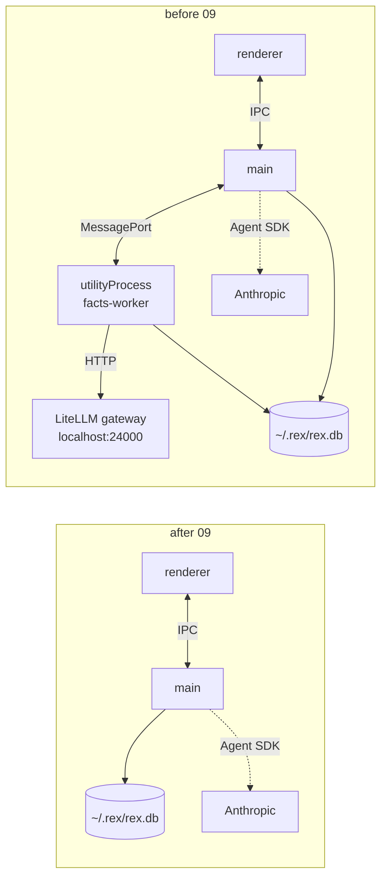

# REX 09 — removing the fact graph

**Version:** 1.0 · 2026-08-23
**Status:** proposed; no milestone started
**Depends on:** [`01-initial/SPEC.md`](../01-initial/SPEC.md),
[`02-workspace-and-graph/SPEC.md`](../02-workspace-and-graph/SPEC.md),
[`03-rich-rendering/SPEC.md`](../03-rich-rendering/SPEC.md),
[`04-selection-and-shortcuts/SPEC.md`](../04-selection-and-shortcuts/SPEC.md),
[`05-selection-as-a-phase/SPEC.md`](../05-selection-as-a-phase/SPEC.md),
[`06-document-section-and-pen/SPEC.md`](../06-document-section-and-pen/SPEC.md),
[`07-fact-graph/SPEC.md`](../07-fact-graph/SPEC.md) and
[`08-shell-redesign/SPEC.md`](../08-shell-redesign/SPEC.md).

> [!warning]
> **This spec deletes a shipped feature.** Spec 07 is withdrawn in full and spec
> 08 §8 with it. **6,334 lines are deleted outright**, about 1,100 more are cut
> out of files that stay, three dependencies are uninstalled, nine tables leave
> the schema and two more stop being created, and one credential file leaves the
> machine. Nothing here is refactoring: every line named below stops existing.

> [!note]
> **It is not a reversal of a judgment. It is spec 07 acting on its own
> measurements.** 07 §4.4 records that the claim threshold "is not a boundary at
> all, and cannot be tuned into one — the populations overlap". 07 §5.3 records
> one extract call at a median of **301 seconds**. 07 §7.3 records a first build
> of 2,000 documents at **thirty days**. Those three numbers are the whole
> argument of §1, and every one of them was written down by the spec being
> withdrawn. §14 records what would have to change for the question to be worth
> re-opening.

> [!warning]
> **The `~/.rex/rex.db` on this machine is deleted and recreated, which takes
> every comment thread with it** — not just the fact rows. That is the decision
> taken for this change (§4.3), and it is only defensible because the database
> holds development threads. Read §4.3 before running anything in §11's
> milestone 3.

---

## 0. How to use this document

**If you are picking this up cold**, read in this order:

1. **§1** — why, in three measured numbers, and §1.2 for what is *not* being
   removed. §1.2 is the section that stops this change taking the reference
   graph, the trace sheet or the comment card with it.
2. **§3** — the one rule the whole removal follows. Everything after it is that
   rule applied to a file.
3. **§10** — the false positives. A grep for `fact` matches nine places that
   have nothing to do with this feature, and deleting any of them breaks
   something unrelated. Read it *before* the first `git rm`.
4. **§4.2** — the one ordering constraint that produces a runtime failure
   rather than a compile error. Get it wrong and REX will not open a fresh
   database at all.
5. **§11** — the milestones, in order. The order is chosen so the tree
   typechecks at the end of each one.

**Everything in specs 01 to 06 is untouched.** This document does not go near
anchoring, the profiles, the gate, Apply, the pen, the section scope, or the
document renderers.

---

## 1. What this is

Spec 07 built a pipeline that reads a folder of documents, extracts what each
one claims, merges the claims that mean the same thing, and reports the pairs
that disagree. It shipped. **It does not work well enough to keep, and this
document removes it.**

Two failures, and they are independent — fixing either one leaves the other:

### 1.1 The graph is not correct, and the measurement says why

Canonicalization (07 §4.4) is the stage the whole feature rests on: "TypeScript",
"TS" and "Typescript 5.4" have to line up, or nothing merges and every document
invents its own vocabulary. The method is embedding similarity, and spec 07
measured it on 2026-08-21:

| | range | the pair that kills it |
|:--|:--|:--|
| same claim | 0.517 – 1.000 | "TypeScript" ~ "TS" — **0.517** |
| different claim | 0.385 – 0.703 | "TypeScript" vs "TypeScript 5.4, strict mode" — **0.703** |

**The populations overlap, so no threshold separates them.** 07 §4.4 says this
in its own words and then chooses to "fail in the recoverable direction
instead" — splitting rather than merging, and paying one judge call to reunite
what should not have been split. That is a sound way to live with the problem
and it is not a way to solve it: below the overlap, unrelated claims merge and
the contradiction can never be reported by anything downstream; above it, the
same subject is split across three claims and the group-and-count that finds
candidates (07 §4.5) never fires. What comes out is a graph whose shape depends
on a number that has no correct value.

### 1.2 The analysis is not fast enough to iterate on

The second failure is the one that makes the first unfixable in practice. From
07 §5.3 and §7.3, all measured rather than estimated:

| | Measured |
|:--|:--|
| One extract call, 1,500-token chunk, on `local-31b` | **median 301 s** (min 158, max 694) |
| One 5,000-word document, about 4 chunks | **about 20 minutes** |
| A first local build of 2,000 documents | **~30 days** |
| A first local build of 200 documents | **~3 days** |

07 §5.3 diagnoses it honestly — the local-only default (§5.4) selects a *dense
reasoning* model that spends 1,460–3,585 tokens thinking before each answer, at
roughly 11 tokens/second — and the diagnosis does not help. **A build measured
in days is a feature you cannot tune**, because every change to the prompt, the
chunk size or either threshold costs another build to evaluate. §1.1 needs
exactly that loop and cannot have it.

The cloud path (07 §5.4) buys speed for about $4 a build and pays for it by
sending the user's own documents off the machine, which 07 §5.4 rule 1 already
names as "a decision, not a default". Making it the default to rescue a feature
is the wrong trade in a review tool.

### 1.3 What is removed, in one sentence

**The Facts mode, the build pipeline behind it, its `utilityProcess`, its
outbound gateway client, its eleven tables and its three dependencies — all of
it, with no flag and nothing left behind.**

### 1.4 What is NOT removed

The list matters more than it looks, because most of it shares a word, a file or
a view with what is going.

| Kept | Note |
|:--|:--|
| **The reference graph** (spec 02) — `Graph` mode, `GraphView.tsx` | A different graph entirely: documents and links, no model, no build. It keeps `d3-force`, which is therefore **not** an uninstalled dependency |
| **Everything in spec 08 except §8** | The sidebar tabs, the mode strip, the comment card's meta strip and step strip, the trace sheet, the place rows. None of them touched facts |
| **Comment threads that were made from a finding** | They are ordinary threads in the `thread` table with two anchors each, indistinguishable from one a reviewer built by hand. Only the `fact_finding_thread` link is dropped — and see §4.3 for what happens to them on this machine anyway |
| **Multi-document comments** (spec 05) | 07 §1.2 reused them; it did not create them |
| **The document renderers** — `render/markdown.ts`, `render/html.ts`, `render/docx.ts` | `facts/text.ts` imported all three. The importer goes, the renderers stay |
| **`workspace/tree.ts`** | `facts/reads.ts` imported it. Same rule |
| **`busy_timeout = 5000`** in `database.ts` | Added for two writers (07 §10.1) and there is one again. It stays anyway — it costs nothing and the reason in its comment changes rather than the pragma. §4.2 |
| **The Agent SDK, the profiles, the gate, Apply** | 07 §5.2 deliberately never used any of them. There is nothing to unpick |

---

## 2. What changes in specs 01 to 08

| Spec | Section | What it said | What 09 says |
|:--|:--|:--|:--|
| 07 | all of it | The fact graph | **Withdrawn in full.** The document stays on disk with a banner; §12.2 |
| 08 | §8 | Facts is one centre mode with two presentations | **Withdrawn.** The centre segment is `Document \| Graph`. §7.2 |
| 08 | §2 row 5, row 6 | 07 §8.2's lens is replaced; topic colour is three computed hues | Both moot — there is no lens and no topic |
| 08 | §9 | `Finding` gains `topicId` | Moot; `Finding` is deleted. `targetRefs` and `mark` in the same table are **unaffected** |
| 08 | §0 | `Findings.dc.html` and `Lens.dc.html` govern §8.2–§8.5 | Those two boards no longer govern anything in the code |
| 07 | §2 | Invariant **I2** is "widened, in the letter but not the spirit" by a second privileged process | **The widening is withdrawn.** Main is the only process holding a database handle again |
| 07 | §2, §5.1 | Invariant **I3** holds, with one outbound HTTP client to `localhost:24000` | **The client is gone.** §3.1 |
| 01 | §9 | The SQLite schema | Loses the nine tables and four indexes 07 added, and stops creating its two `vec0` tables. The original tables are untouched |
| 01 | §3.2 | Declared dependencies | Loses `sqlite-vec`, `graphology`, `graphology-communities-louvain` |

Nothing in 01 §6 (anchoring), 01 §8 (the agent, the gate, Apply), 02 (the
workspace and the reference graph), 03 (rendering), 04, 05, 06 or 08 §3–§7
changes.

---

## 3. The rule this removal follows

There is exactly one rule, and every section after this is it applied to a file:

> **A removal is finished when nothing is left that only existed for the
> removed thing.** Not a feature flag. Not a hidden tab. Not an unused table, an
> unreferenced type, a dependency in `package.json`, a build entry point, a
> commented-out block, or a credential on disk.

`rules/09-code-quality.md` already says most of this — "no commented-out code
'just in case'", "remove dead code" — and this document is the case that makes
it expensive to ignore. Half a removal is worse than none: it leaves a schema
that describes a feature nobody can reach, a dependency tree that has to be
audited and updated for code that never runs, and a `Facts` string in the source
that the next reader has to investigate before learning it means nothing.

**The record goes in the specs, not in the code.** Spec 07 stays on disk, in
full, with its measurements (§12.2). That is what makes deleting the
implementation safe: the reasoning is not in the files being deleted.

### 3.1 What the invariants become

Both statements get *stronger*, and both are worth checking after milestone 4
rather than asserting.

| # | Before 09 | After 09 |
|:--|:--|:--|
| I2 | Main **and a `utilityProcess`** hold a database handle; the process holds the gateway key | **Main only.** No second privileged process, no key |
| I3 | No listening port; **one outbound HTTP client** to `localhost:24000` | No listening port, and **REX's only outbound network is the Agent SDK's own** |



---

## 4. Storage

### 4.1 What leaves `schema.sql`

Lines **123–265** — the tail of the file, 143 lines, from the
`═══ Spec 07 — the fact graph ═══` banner to the end:

| Group | Objects |
|:--|:--|
| The cache (07 §6.3) | `fact_subject`, `fact_claim`, `fact_evidence`, `fact_edge`, `fact_co_occurrence`, and the four indexes on them |
| The bookkeeping (07 §6.4) | `fact_document`, `fact_run`, `fact_verdict`, `fact_finding_thread` |
| The vectors | `fact_subject_vec` and `fact_claim_vec`, created at runtime by `facts/store.ts` rather than in this file |

`fact_finding_thread` is the only one of them that carries an `ON DELETE
CASCADE` from `thread`, so `queries.ts:420`'s comment — which lists the tables
that make `deleteThread` a one-statement function — drops it from its list.
`deleteThread` itself does not change.

### 4.2 The one ordering trap

> [!warning]
> **`addMissingColumns` must lose its two `fact_*` entries in the same commit
> that removes the tables from `schema.sql`, or a fresh database will not
> open.** `database.ts:110` runs on every open and asks `PRAGMA
> table_info(fact_run)`. On a database where that table does not exist the
> pragma returns **zero rows**, which the code reads as "the column is missing",
> and it then runs `ALTER TABLE fact_run ADD COLUMN total …` against a table
> that is not there. That throws `no such table: fact_run` — at startup, on a
> clean install, with no fact code anywhere in the process.

The two entries are `fact_run.total` (07 §6.4) and `fact_document.chunks_done`
(07 §4.7). The `thread.extra_anchors_json` entry above them stays.

It is a runtime failure and not a compile error, which is why it is called out
here rather than left to the typechecker. It is also invisible on *this*
machine if the database is deleted last — the existing `~/.rex/rex.db` still has
the tables — so it must be checked against a database created after the change,
which is what milestone 3's first acceptance check does.

The rest of `database.ts` loses: the `sqlite-vec` import, the
`loadVectorExtension(db)` call in `openDatabase`, `loadVectorExtension` itself,
the `vectorExtension` module state and `vectorSearchStatus()`. `busy_timeout`
stays; the comment above it loses its 07 §10.1 reference and keeps the pragma on
its own merits.

### 4.3 The database on this machine

**Delete `~/.rex/rex.db` and let REX recreate it.** No migration is written.

This is the standing development authorization in `.claude/CLAUDE.md`, and it is
the decision taken for this change rather than a fallback.

> [!warning]
> **This throws away every comment thread on this machine, not only the fact
> rows.** Threads, messages, targets, apply runs, the full-text index — all of
> it. There is no partial form of this option: `rex.db` is one file.
>
> If anything in it is worth keeping, **export it first** — `npm run export --
> <doc>` writes a document's threads to Markdown (spec 01, `src/cli/export.ts`)
> — or take a copy of the file. Do that before milestone 3, not during it.

**A guarded `DROP TABLE IF EXISTS` migration was considered and rejected.**
`migrate.ts` is where it would go, beside `migrateThreadTargets` and
`migrateThreadStroke`, and it would preserve the threads. It is not written
because REX has one user and one database, that database holds development data,
and a migration is code that would then exist forever to serve a machine state
that will not exist after this change. §3's rule cuts both ways: code that only
exists for the removed thing includes code written *to remove* it.

The consequence to be honest about: **any REX database that predates this change
and is opened by a later build keeps eleven dead tables.** Nothing queries them
and nothing breaks (`schema.sql` is all `CREATE TABLE IF NOT EXISTS`, so it
neither drops nor recreates what is there). If that database ever turns up
somewhere it matters, the answer is the migration above, written then, for a
reason that exists then.

---

## 5. The main process

### 5.1 Deleted outright

`src/main/facts/` — **the whole directory, 13 files, 3,846 lines.**

```text
build.ts  canonical.ts  chunk.ts  extract.ts  gateway.ts  judge.ts  pairs.ts
reads.ts  store.ts  supervisor.ts  text.ts  topics.ts  worker.ts
```

Two of them are worth naming because they look reusable and are not:

- **`text.ts`** (330 lines) turns a rendered document into plain text for the
  chunker. Its only consumers are `extract.ts`, `build.ts` and `test/text.spec.ts`,
  all of which go. It is not the renderer — `render/markdown.ts` and friends stay
  (§1.4).
- **`gateway.ts`** (649 lines) is the LiteLLM client, the per-alias concurrency
  limiter of 07 §5.6, the schema validation of 07 §5.5, and `gatewayKey()`. It is
  the only outbound HTTP client in REX (§3.1) and it goes with the rest. §8.3 has
  its credential.

### 5.2 Cut out of files that stay

| File | What goes |
|:--|:--|
| `src/main/ipc.ts` | 12 `Facts*` type imports, the three `./facts/*` module imports, and **lines 461–593** — the eight handlers, `factCommentNote()` and `currentRootFor()`. About 150 lines |
| `src/main/index.ts` | The `stopBuild` import and its call in the `before-quit` handler (07 §10.1 rule 2) |
| `src/main/db/database.ts` | §4.2 |
| `src/main/db/queries.ts` | One name in the `deleteThread` comment. §4.1 |
| `src/main/render/formats.ts` | `isFactReadablePath()` and its 07 §4.1 comment. Its only caller is `facts/reads.ts`. **`isDocumentPath()` in the same file stays** — it is the workspace scan's, not the pipeline's |

> [!note]
> **The implementation has eight fact channels, not the seven 07 §9 lists.**
> `facts:evidence` was added to satisfy 07 §11 rule 4 ("every claim shows its
> evidence") and is declared in `channels.ts:79`, not in spec 07. A removal
> driven by reading 07 §9 alone leaves it behind. Work from `channels.ts`.

---

## 6. The shared contract

Three files, and they have to move together — `channels.ts` is imported by both
sides, so removing an entry from it breaks `preload/index.ts`, `main/ipc.ts` and
`renderer/overlay/App.tsx` in the same compile.

| File | What goes |
|:--|:--|
| `src/shared/types.ts` | **Lines 391–503**, the `── The fact graph ──` block: `ExtractedClaim`, `FactStage`, `FactRunState`, `FactRunSummary`, `FactSide`, `Finding`, `FactNode`, `FactEdge`, `FactGraph`, `FindingFilter`. `OpenedDocument` at 504 stays |
| `src/shared/channels.ts` | Eight `COMMAND` entries (`factsStatus`, `factsBuild`, `factsCancel`, `factsFindings`, `factsGraph`, `factsVerdict`, `factsComment`, `factsEvidence`), the `factsProgress` `EVENT`, **lines 178–266** — the `── The fact graph ──` block, holding `FactsState` and nine request/response interfaces **including `ClaimEvidence`, which is declared here and not in `types.ts`** — and, inside `RexApi`, eight methods plus `onFactsProgress` |
| `src/preload/index.ts` | The eight `ipcRenderer.invoke` bindings and the `onFactsProgress` subscription |

Nothing else in any of the three changes. `types.ts` remains the single source
of truth for every shape crossing the boundary (spec 01 §4); it simply describes
fewer of them.

---

## 7. The renderer

### 7.1 Deleted outright

| File | Lines | Was |
|:--|--:|:--|
| `src/renderer/overlay/FactsView.tsx` | 558 | 08 §8.2 the build strip, §8.3 the findings list |
| `src/renderer/overlay/FactGraph.tsx` | 336 | 08 §8.4 the picture, §8.5 the lens panel |

`FactGraph.tsx` imports `d3-force`. **`GraphView.tsx` imports it too** — see
§10.

### 7.2 `App.tsx`

| What | Where |
|:--|:--|
| The two component imports and the `FactGraph as FactGraphData` type import | top of file |
| `type Centre = "document" \| "graph" \| "facts"` → **`"document" \| "graph"`** | ~line 62 |
| `factsView` and `factGraph` state | ~lines 134–135 |
| The `case "f": case "F":` key binding | ~lines 1312–1319 |
| The whole `centre === "facts"` JSX block — its introducing comment, the `rex-facts-mode` frame, the `VIEW · List \| Graph` switch, and both children | lines 1550–1645 |

Two things that read like they belong to facts and do not: `showCentre` (~637)
stays and simply has one fewer branch, and `sideHidden = centre !== "document"
&& selection.length === 0` (~1397) is correct unchanged with two modes.

> [!note]
> **`F` becomes a free key, and this spec does not reassign it.** It was the
> only binding on that letter — grep confirms no other handler claims `f` or
> `F` — and the sole use was `showCentre("facts")`. Handing it to something else
> in the same change would hide a removal inside a feature. `D` and `G` keep
> their modes.

### 7.3 `TopBar.tsx`

The `Facts` button and its comment go; the `centre` and `onCentre` prop types
narrow to `"document" | "graph"`. The segmented control keeps the same class and
the same behaviour with two segments.

Everything else 08 §4.4 lists the top bar as holding is unaffected: the mark,
`Open ▾`, the breadcrumb, the `FILE CHANGED` pill, the zoom chip, the running
cost and `Ask all · N`.

### 7.4 `overlay.css`

Lines **3519–3967** — the tail of the file, from the
`/* ── Spec 07 — the fact graph ── */` banner to the last rule. **449 lines and
37 class names**: everything matching `.rex-facts-*`, `.rex-fact-*` and
`.rex-finding-*`, plus four that are named differently and are still this
feature's alone — `.rex-lens` (3912), `.rex-swatch` (3904),
`.rex-pill-contradicts` (3733) and `.rex-pill-supersedes` (3742). All four are
*defined* inside the block, so they leave with it.

**The cut is clean, and this was checked rather than assumed.** Exactly two
classes used inside the block are defined outside it — `.rex-icon` (123) and
`.rex-label` (105) — and both have many other users. No token, no custom
property and no shared rule lives in the deleted range. The rule immediately
above the banner is `.rex-strength-weak` (06 §6.2, the anchor strength meter),
and milestone 0's last check is that it still renders.

---

## 8. Dependencies, build config, and the key

### 8.1 `package.json`

**Uninstall three.** Each has exactly one consumer and it is being deleted:

| Dependency | Only consumer |
|:--|:--|
| `sqlite-vec` | `db/database.ts`, and three of the deleted tests |
| `graphology` | `facts/topics.ts` |
| `graphology-communities-louvain` | `facts/topics.ts` |

**`d3-force` is not one of them.** §10.

Scripts: `test:facts`, `test:claims`, `test:build`, `test:findings` and
`gateway:key` are removed, and `dev` loses its `npm run --silent gateway:key;`
prefix — so `"dev": "electron-vite dev"`. `test:text` goes with §9.

### 8.2 `electron.vite.config.ts`

The `facts-worker` entry in `main.build.rollupOptions.input` goes, along with
its comment, leaving `input: { index: resolve("src/main/index.ts") }`. That
entry existed because `utilityProcess.fork()` takes a path to a built script
(07 §10.2) and there is no `utilityProcess` any more.

The `preload` and `renderer` blocks are untouched.

### 8.3 The gateway key

`scripts/gateway-key.ts` (212 lines) mints a capped, 30-day LiteLLM key into
`~/.rex/gateway-key`, mode 600. It exists solely so the fact build could
authenticate, and it is the only file in `scripts/`, so **the directory goes
with it.**

Three actions, and the third is the one that is easy to skip:

1. Delete `scripts/`.
2. Remove the `gateway-key` entry and its comment from `.gitignore` — an ignore
   rule for a file nothing writes is the same dead weight as the code.
3. **Delete `~/.rex/gateway-key`.** It is a live credential with a budget
   ceiling and an expiry, sitting on disk with nothing left that reads it.
   `rules/12-security.md` is direct about this: *"Never keep a plaintext
   credential file, gitignored or not."* A key that no code uses is not
   harmless — it is a key nobody will notice being used.

Revoking it at the gateway is the user's call and outside this repo. The spec
requires the file to be gone; say in the report that it was, so the revoke is a
decision someone makes rather than one nobody knows to make.

---

## 9. Tests

Five spec files are deleted, **1,382 lines**:

| File | Lines | Covered |
|:--|--:|:--|
| `test/facts.spec.ts` | 385 | Storage, both thresholds, verdicts surviving a rebuild |
| `test/claims.spec.ts` | 252 | 07 milestone 0 — extraction through the local model |
| `test/build.spec.ts` | 302 | Incremental builds, resuming an interrupted one |
| `test/findings.spec.ts` | 238 | A planted contradiction found, a planted rejected option not |
| `test/text.spec.ts` | 205 | Worker text against the renderer's live DOM |

> [!warning]
> **`test:text` goes too, and it is the one that looks like lost coverage.** Its
> subject is stated in its own header: `facts/text.ts` and
> `renderer/anchor/textIndex.ts` must normalise identically, "or every anchor
> the fact graph ever writes reports `orphaned`". It guards the agreement
> between two implementations, and one of the two is being deleted. There is no
> second implementation left to disagree with `textIndex.ts`, so there is
> nothing for the test to assert.
>
> **Anchoring's own coverage is unaffected.** `test:anchor` — the gate, against
> two real documents — does not import anything under `facts/` and does not
> change.

Nine test scripts remain: `test:anchor`, `test:gate`, `test:lasso`,
`test:links`, `test:markdown`, `test:migrate`, `test:prompts`, `test:targets`,
`test:diff`.

---

## 10. The false positives — do not delete these

A grep for `fact` across `src/` and `test/` matches nine places that have
nothing to do with this feature. Every one of them breaks something unrelated if
it is removed, and a grep-driven removal hits all nine.

| Match | What it actually is |
|:--|:--|
| `src/cli/export.ts:72–82` | A local variable named `facts` — the display facts on a thread's summary line |
| `src/renderer/overlay/CommentCard.tsx` | **`PlaceFacts`**, the shape behind 08 §7.2's place rows. Nine matches, none of them this feature |
| `src/main/threads.ts:92` | "display facts attached", in a doc comment |
| `src/renderer/overlay/SidebarTabs.tsx:5,12` | 08 §3.1's prose, which cites the `Document \| Graph \| Facts` segment as the precedent for the tab control. The **prose** needs an edit (§12.3); the component does not |
| `src/renderer/overlay/TraceSheet.tsx:11` | Same — 08 §6.1's argument for a sheet names that segment |
| `src/renderer/overlay/ModeStrip.tsx:5` | "the top bar holds facts about the document" — 08 §4.3 |
| `src/renderer/overlay/Explorer.tsx:151` | "Both are the same fact" |
| `src/renderer/overlay/App.tsx:76,529` | `setZoomFactor`, `zoomBy(factor)` |
| `test/migrate.spec.ts:84` | "which every row written before the column existed in fact was" |

And one dependency:

> [!warning]
> **`d3-force` stays.** It is imported by `FactGraph.tsx`, which is deleted —
> and by `GraphView.tsx`, which is spec 02's reference graph and is not.
> Uninstalling it takes out the `Graph` mode this document explicitly keeps.

---

## 11. Milestones

Ordered so the tree typechecks at the end of each one. Removals invert the build
order: the leaves first, the contract next, the implementation after it.

### Milestone 0 — the UI surface

`FactsView.tsx` and `FactGraph.tsx` deleted; `App.tsx`, `TopBar.tsx` and
`overlay.css` cut (§7).

- [ ] The centre segment reads `Document | Graph` and nothing else.
- [ ] `F` does nothing. `D` and `G` still switch modes.
- [ ] `Graph` mode draws the reference graph, with its links and its review
      overlay, exactly as before.
- [ ] `npm run typecheck` is clean — everything behind the UI is now unreachable
      but still compiles.
- [ ] The anchor strength meter still renders (`.rex-strength-weak` survived the
      CSS cut).

### Milestone 1 — the contract and the wiring

`types.ts`, `channels.ts`, `preload/index.ts`, `ipc.ts`, `index.ts` (§5.2, §6).

- [ ] `channels.ts` declares no `facts:*` command and no `facts:progress` event.
- [ ] `window.rex` exposes no `facts*` method — check in the running app's
      devtools, not only in the type.
- [ ] `npm run typecheck` is clean.
- [ ] Opening a document, writing a comment, **Ask**, and **Apply** all still
      work end to end. Milestone 1 is the one that could plausibly break IPC
      registration; this is the check that it did not.

### Milestone 2 — the pipeline and its tests

`src/main/facts/` deleted, the five spec files deleted, `formats.ts` cut
(§5.1, §9).

- [ ] `src/main/facts/` does not exist.
- [ ] `grep -rn "facts/" src test` returns nothing.
- [ ] The nine remaining test scripts all pass, `test:anchor` included.
- [ ] `isDocumentPath` still has its callers and the workspace scan still lists
      documents.

### Milestone 3 — storage

`schema.sql`, `database.ts`, `queries.ts` (§4), then the database itself.

- [ ] **First:** anything worth keeping is exported or the file is copied
      (§4.3).
- [ ] `~/.rex/rex.db` deleted, REX launched, and **the app opens** — this is the
      §4.2 trap, and it only fires against a database created after the change.
- [ ] `sqlite3 ~/.rex/rex.db ".schema"` lists no `fact_*` table.
- [ ] A comment written, answered and resolved against the fresh database.
- [ ] `npm run test:migrate` passes — the migrations run twice against a real
      database and neither one references a fact table.

### Milestone 4 — dependencies, build, and the key

`package.json`, `electron.vite.config.ts`, `.gitignore`, `scripts/`, and the
credential (§8).

- [ ] `npm ls sqlite-vec graphology graphology-communities-louvain` reports none
      of the three; `npm ls d3-force` still reports it.
- [ ] `npm run build` succeeds and **`out/main/facts-worker.js` does not exist**.
- [ ] `npm run dev` starts without minting a key.
- [ ] `~/.rex/gateway-key` is gone, and `scripts/` is gone.
- [ ] With the app open on a workspace, no `facts-worker` process exists —
      `lukas-ps --json rex` shows one Electron tree with its normal helpers.

### Milestone 5 — documentation

README, spec 07, spec 08 (§12).

- [ ] The README describes REX as it is: no `## The fact graph` section, no
      `facts/` in the source tree, four fewer command rows, three fewer test
      paragraphs.
- [ ] Spec 07 carries its withdrawal banner and is otherwise unedited.
- [ ] Spec 08 §8 carries its own, and 08's §0, §2, §10, §11 and §12 no longer
      point at code that exists.
- [ ] `nvim-tools --json --all` adds no finding against the baseline.

---

## 12. Documentation

### 12.1 `README.md`

| Where | Change |
|:--|:--|
| The spec list (~line 52–60) | Gains 09; every earlier link stays, 07 included |
| Commands table | Loses `test:facts`, `test:build`, `test:claims`, `test:findings`, `test:text` |
| "The tests, and why these ones" | Loses the `test:facts`, `test:claims`, `test:findings` and `test:text` paragraphs |
| The `src/` tree | Loses the `facts/` line |
| `## The fact graph` (~line 276 to the end of the section) | **Deleted.** It is the longest prose section in the README and it describes something that will not exist |

The README is a description of what REX is, not a history of what it was. The
history is §12.2's job.

### 12.2 Spec 07 — withdrawn, not deleted

A banner at the top of `docs/my-specs/07-fact-graph/SPEC.md`, immediately under
the `**Status:**` line, and **no other edit to the file**:

```markdown
> [!warning]
> **Withdrawn on 2026-08-23 by [09 — removing the fact graph](../09-removing-the-fact-graph/SPEC.md).**
> Nothing below is implemented any more: the code, the tables, the dependencies
> and the gateway client were all deleted. It is kept in full because its
> measurements are the reason it was withdrawn — §4.4 (the claim populations
> overlap, so no threshold separates them), §5.3 (301 s per extract call) and
> §7.3 (thirty days for 2,000 documents). Spec 09 §14 records what would have to
> change for this to be worth revisiting.
```

**Do not edit anything else in 07.** Its `Status: implemented` line and its
version notes are a record of what was true when it was written, and correcting
them in place would make the document less useful, not more. The banner is the
correction.

### 12.3 Spec 08

08 is otherwise entirely current, so it is amended in place rather than
banner-ed as a whole:

| §  | Change |
|:--|:--|
| §0 | The board table loses the `Findings.dc.html` and `Lens.dc.html` rows |
| §1 | The closing line — "And one that follows from them: **Facts becomes one centre mode…**" — is marked withdrawn |
| §2 | The two 07 rows are marked withdrawn by 09 |
| §8 | A banner at the head of the section: withdrawn by 09, the code deleted, the argument kept |
| §9 | The `topicId` row is marked withdrawn. **`targetRefs` and `mark` are untouched** |
| §10 | `FactsView.tsx` and `FactGraph.tsx` leave the tree |
| §11 | Milestone 5 is marked withdrawn |
| §12 | The "fourth topic colour" and "tooltip for a finding's notes" rows are moot |
| §13 | The reference to 07 §8 and §11 gains a note that both are withdrawn |

Three pieces of 08 prose cite the `Document | Graph | Facts` segment as the
precedent for a control (`SidebarTabs.tsx:5`, `TraceSheet.tsx:11`, 08 §3.1 and
§6.1). **The arguments stay and the wording is corrected to `Document | Graph`.**
The reasoning did not depend on there being three segments.

### 12.4 `.claude/`

`CLAUDE.md` and `rules/01-project-config.md` describe the repo as
pre-implementation and are stale for reasons that have nothing to do with this
change. **09 does not touch them.** Bringing the scaffold up to date is its own
task, and folding it into a removal would hide one inside the other.

---

## 13. Non-goals

| Rejected | Why |
|:--|:--|
| A feature flag, or hiding the tab and keeping the code | §3. A flag is a promise the feature will come back; §1 is the argument that it should not in this form |
| Keeping `gateway.ts` for a future local-model feature | 861 lines and a credential, for a consumer that does not exist. YAGNI, and `rules/12-security.md` on the key specifically |
| Keeping `text.ts` / `chunk.ts` as general document utilities | Same. Their only callers are deleted, and the renderers they wrap stay |
| A `DROP TABLE` migration | §4.3 — code written to remove a feature is code that only exists for the removed thing |
| Uninstalling `d3-force` | §10. It is the reference graph's layout |
| Deleting spec 07 | §12.2. Its measurements are the argument for this document |
| Reassigning the `F` key | §7.2. A free key is a visible removal; a reused one hides it |
| Replacing Facts with something else in the same change | A removal that ships a feature is two changes reviewed as one |
| Updating `.claude/CLAUDE.md`'s stale status | §12.4 |

---

## 14. What is lost, and the trigger to revisit

Recorded so this is not re-opened for the wrong reason, and can be for the right
one — the same shape as 07 §6.5's own trigger.

**What genuinely goes.** 07 §8.5 point 3 — *one fact, and every document that
states it* — was the view the feature was asked for, and nothing in REX replaces
it. The reference graph says what links to what; it does not say what anything
claims. A reviewer who wants to know whether 200 documents agree is back to
reading them. That is the cost, and it is real.

**The trigger. Both halves must be true, not one:**

1. **A canonicalization method whose populations actually separate.** 07 §4.4
   measured that embedding similarity over claim *values* does not — "TypeScript"
   ~ "TS" at 0.517 sits below "TypeScript" vs "TypeScript 5.4" at 0.703. A
   cross-encoder, an NLI model, or a judge-first design that never depends on a
   similarity threshold would each be a different answer, not a tuned one. **And**
2. **A model that extracts a 1,500-token passage in seconds.** Not minutes. 07
   §5.3's 301-second median is what made §1.1 unfixable, because every attempt
   at (1) costs a build to evaluate. A build measured in minutes makes the
   experiment cheap; anything slower repeats this outcome.

If only (1) is true, the idea is right and unaffordable to develop. If only (2)
is true, it is affordable to develop something that produces a graph nobody can
trust — which is the worse of the two, because it looks like it is working.

Spec 07 stays on disk for whoever gets both.

---

## 15. References

- [07 — the fact graph](../07-fact-graph/SPEC.md), withdrawn by this document —
  §4.4, §5.3 and §7.3 are the measurements §1 rests on, and §6.1, §6.3, §6.4,
  §9, §10.1 and §10.2 are the inventory §4 to §8 delete.
- [08 — the shell redesign](../08-shell-redesign/SPEC.md) §8 — the Facts mode as
  it was last specified, and §2 for what it had already overridden in 07.
- [02 — workspace and graph](../02-workspace-and-graph/SPEC.md) — the reference
  graph, which is **kept** and is the thing most likely to be broken by a
  careless removal (§10).
- `rules/09-code-quality.md` — "remove dead code", "no commented-out code just
  in case". §3 is that rule applied at the scale of a feature.
- `rules/12-security.md` — "Never keep a plaintext credential file, gitignored
  or not". §8.3.
