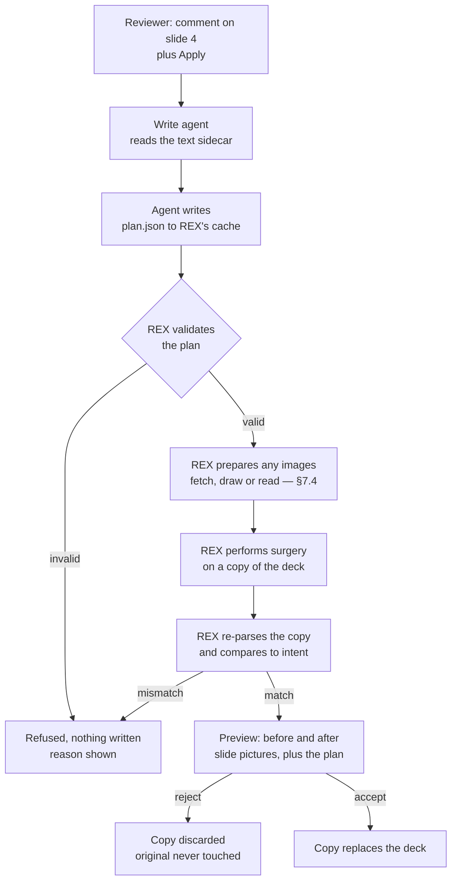

# REX 11 — PowerPoint

**Version:** 1.0 · 2026-08-24
**Status:** not implemented. Every number in §2 was measured before this spec was
written; everything else is a design that has not yet been run.
**Depends on:** [`01-initial/SPEC.md`](../01-initial/SPEC.md),
[`02-workspace-and-graph/SPEC.md`](../02-workspace-and-graph/SPEC.md),
[`03-rich-rendering/SPEC.md`](../03-rich-rendering/SPEC.md),
[`05-selection-as-a-phase/SPEC.md`](../05-selection-as-a-phase/SPEC.md),
[`06-document-section-and-pen/SPEC.md`](../06-document-section-and-pen/SPEC.md)
and [`10-figure-preview-and-exclusions/SPEC.md`](../10-figure-preview-and-exclusions/SPEC.md).

> [!important]
> **This spec has two halves that share nothing but a file format.**
> §4–§6 make a `.pptx` readable and commentable. §7 makes it editable. They are
> in one spec because splitting PowerPoint across two would leave neither half
> able to state its own acceptance bar.

> [!warning]
> **The write half is the first time REX edits a file it cannot diff.**
> `git diff` on a `.pptx` prints `Binary files differ`. Spec 01 §8.7 step 5 —
> show the change and wait — is REX's entire safety story for Apply, and a
> binary diff turns that step into a rubber stamp. §7.7 is what replaces it, and
> it is not optional decoration: without it, Apply on a deck is less safe than
> Apply on Markdown, not equally safe.

> [!warning]
> **The agent never fetches an image, never draws one, and never touches the
> zip.** §7.2 and §7.4. The write profile's hook allows every tool (`gate.ts`
> `buildHooks` returns allow for `write`), so an agent asked to insert a picture
> *could* `curl` an arbitrary URL and splice bytes into the user's deck with
> nothing between it and the file. Instead the agent writes a **plan**, and REX
> validates it, performs it on a copy, and shows the result. This is the shape
> spec 01 §8.7 already has — the agent proposes, the user accepts, REX performs
> — applied to bytes instead of prose.

> [!note]
> **Twelve edit operations, because a review is wide.** §7.2.1. A tool that can
> only retype a sentence sends the reviewer back to PowerPoint for *"move slide
> 7 earlier"*, *"make this heading bigger"* and *"replace this paragraph with a
> diagram"* — which is most of what is said about a deck. The breadth is safe
> because of §7.7 and §7.8, not because each operation is small: every one is
> surgical, every one names what it expects to find, and every one is checked by
> re-parsing the result and confirming that **nothing it did not name changed**.

> [!note]
> **Native PowerPoint comments are out of scope, by decision.**
> REX renders a deck and holds its own comments in its own database. It does
> **not** write `ppt/comments/` parts, does not read existing ones, and does not
> try to round-trip PowerPoint's review model. §8 records what that costs.

---

## 1. Why

**A deck is a review document and REX cannot open one.** `formats.ts` accepts
Markdown, HTML, PDF and DOCX. Everything a reviewer actually argues about in a
company — the proposal, the investor deck, the architecture briefing — is
frequently a `.pptx`, and today REX shows it in the explorer as a file it
refuses to render.

**There are 144 `.pptx` files on this machine.** That is not a hypothetical
format. It is the format the documents REX exists to review are already in.

**A deck is the one format where "comment on this element" is the natural
unit.** Prose is a stream and a comment on it is a passage. A slide is a set of
boxes, and a comment on a slide is almost always about one box — this title,
that card, this photograph. REX's `Anchor` already models exactly that
(`ElementRef`, `RegionRef`), and until now no document type has used it as its
primary unit.

---

## 2. What was measured before this was designed

This section is evidence, not narrative. Everything below was run against real
decks on this machine on 2026-08-24. It is here because the design is only
defensible if the numbers hold, and a later reader must be able to check them.

### 2.1 What is actually in a deck

Forty decks, 861 slides, 6,149 shapes:

| Feature | Decks carrying it |
|:--|:--|
| Speaker notes | 23 / 40 |
| Non-rectangular geometry | 23 / 40 |
| Rotation | 14 / 40 |
| Embedded objects | 7 / 40 |
| Groups | 1 / 40 |
| Charts | 1 / 40 |
| Tables | 0 / 40 |
| **SmartArt** | **0 / 40** |

Only eight preset geometries appear across all of them: `rect`, `roundRect`,
`ellipse`, `line`, `chevron`, `arc`, `triangle`, `rightArrow`. OOXML defines
about 187. **The hard cases are hard in theory and absent in practice**, and
that is what makes this spec affordable.

11.5% of shapes (707 of 6,149) carry no geometry of their own and must inherit
it from the slide layout or the master.

### 2.2 The reader

`pptxtojson` 2.1.0, MIT, 6.8 MB unpacked, dependencies `jszip`, `tinycolor2`
and `txml`.

| Measurement | Result |
|:--|:--|
| Decks parsed | **29 of 30** |
| Throughput | **142 ms** per deck |
| Coverage | 614 slides, 4,135 elements |
| Geometry accuracy | **exact** |
| Layout / master inheritance | **resolved correctly** |
| Unicode | correct |

**Geometry accuracy** means this: slide 4 of `Onion-AI-Agrofert-EN.pptx` has a
title whose raw EMU offsets compute to `left 36pt, top 25.2pt, width 648pt,
height 50.4pt`. The library reports `36 / 25 / 648 / 50`. Independently derived,
same answer.

**Inheritance** was the main risk and it is not one.
`multi_database_ecommerce_presentation.pptx` has **51 of its 52 shapes with no
`<a:xfrm>` of their own** — every position has to come from the layout chain.
The library placed all 52. Zero fell to the origin.

**The one apparent defect is not one.** 10.33% of parsed elements report a zero
width or height. All 408 in the worst deck are `shapType: "line"` — vertical
rules, correctly zero-width — and **none of them carries text**. A renderer must
draw a line shape as a border rather than a box, and nothing else follows.

**The one real failure**: `onion_ai_investor_sample_deck…pptx` throws
`Cannot read properties of null (reading 'Relationships')`. It is a hard throw,
not a degraded parse. §4.7 is the response.

### 2.3 The renderer

A 70-line throwaway renderer over that JSON, screenshotted in Chromium and
compared against LibreOffice's render of the same slide:

- Positions, fills, gradients, shadows, corner radii, the orange accent bar, the
  three cards, the numbered circles, the footer — all correct.
- A full-bleed background photograph with a gradient overlay renders correctly.
- One heading wrapped to one line where LibreOffice wrapped it to two. Font
  metrics. That was the entire visible difference.

Two bugs found in those 70 lines, both worth writing down because they will
recur in the real one:

1. **`&nbsp;` prevents wrapping.** The library emits non-breaking spaces between
   words. Left alone, body text does not wrap and is clipped. §4.5.
2. **A missing `<meta charset="utf-8">` produced mojibake** — `Onion · Machina`,
   `Česká pošta`. The library's own output is correct UTF-8; the page
   declaring its encoding is what was missing. Czech text makes this visible
   immediately.

### 2.4 The writer

**Surgical editing works.** One `<a:t>` changed in `Onion-AI-Agrofert-EN.pptx`:

| | Before | After |
|:--|:--|:--|
| Parts in the package | 132 | **132** |
| Parts lost | — | **0** |
| Parts added | — | **0** |
| `slide4.xml` | 14,882 bytes | 14,901 bytes |

The result re-parses with `pptxtojson`, converts with LibreOffice, and renders
slide 4 with the new title. Verified by looking at the picture.

**`pptx-automizer` was evaluated and rejected.** MIT, maintained, and the
obvious candidate — but it is a generator, and a round-trip of
`VOLAREZA_-_Onion_Machina_-_v4_obsahove_upravy.pptx` shows why:

| | Source | After round-trip |
|:--|:--|:--|
| Parts | 139 | **255** |
| Size | 4,542 KB | **6,414 KB** (+41%) |
| Slides | 27 | **54** |

It lost nothing. It rebuilt everything. Apply must change one sentence in a file
the user did not ask REX to re-manufacture, so the write half is REX's own code.

### 2.5 What was not measured

Stated so that a later reader does not mistake silence for a pass:

- **Tables, charts and SmartArt on the read path.** The corpus has one table,
  one chart and no SmartArt, so there was nothing to test against. The library
  claims all three. REX has not seen it.
- **`<p:pos>` units in a native comment.** Irrelevant now that §8 puts native
  comments out of scope, but recorded because the obvious reading is wrong: a
  real comment in a real deck reads `<p:pos x="384" y="736"/>` on a slide
  9,144,000 EMU wide, so the unit is not EMU.
- **Any deck larger than about 7 MB, or with more than 27 slides.**

---

## 3. Dependencies

Three added, all MIT, all pure JavaScript, none native. Spec 01 §3.2 does not
name them, so they were approved explicitly before this spec was written.

| Package | For | Note |
|:--|:--|:--|
| `pptxtojson` | reading a deck (§4) | 6.8 MB. Node entry is `pptxtojson/dist/index.js` — the package has no `exports` map and its `main` is a UMD bundle, so a bare `import … from "pptxtojson"` fails under Node ESM with *does not provide an export named 'parse'*. Import the path. |
| `jszip` | the package, read and written (§7) | Already arrives under `pptxtojson`. **Declared directly anyway** — REX must not build on a transitive dependency it does not own. |
| `@xmldom/xmldom` | building XML nodes (§7) | String surgery is adequate for replacing text and inadequate for inserting a `<p:pic>` or rewriting a `.rels` part. |

No LibreOffice, no `soffice`, no external binary, no Python. **REX stays
self-contained**, which is the constraint that ruled out the convert-to-PDF
design this spec replaced.

> [!note]
> **`pptxtojson` reads and cannot write.** There is no writer half to it. Every
> byte REX puts back into a deck is written by code in this repository.

---

## 4. Reading a deck

### 4.1 The format gate

`src/main/render/formats.ts` gains one predicate and two lines:

```ts
export function isPptxPath(path: string): boolean {
  return extname(path).toLowerCase() === ".pptx";
}
```

`isPptxPath` joins `isDocumentPath`. `unopenableReason` becomes *"REX renders
Markdown, HTML, PDF, DOCX and PPTX."*

`.ppt` — the pre-2007 binary format — is **not** included and must keep saying
so. It is not a zip, `pptxtojson` cannot read it, and a gate that accepts it
would fail at parse time with a confusing message instead of at listing time
with a clear one.

`applyDisabledReason` returns `null` for `.pptx`. **This is the first binary
format where Apply is enabled**, and §7 is the argument for why that is honest.

### 4.2 Parsing happens in main

Per invariant I2 and following the DOCX precedent in `render/docx.ts`:
`mammoth` runs in main, produces HTML, and hands static HTML to the iframe. A
deck takes exactly that path.

```ts
// src/main/render/pptx.ts
export async function renderPptx(path: string): Promise<RenderedPptx>
```

The renderer process is not modified. **Not one line.** That is the payoff of
emitting HTML rather than a new presentation kind: a deck arrives as
`presentation: { kind: "html", html }`, and the anchor resolver, the highlight
painter, the pen layer, the selection panel and the figure preview all work on
it because they work on any HTML.

### 4.3 The slide HTML contract

This is the part every other section depends on, so it is stated as a contract
rather than as a suggestion.

```html
<article class="rex-deck" style="--slide-w: 720pt; --slide-h: 405pt">
  <section class="rex-slide" id="slide-4" data-slide="4">
    <div class="rex-shape" id="slide-4-shape-2"
         data-name="Shape 0" data-kind="shape"
         style="left:0pt; top:0pt; width:11pt; height:405pt; …"></div>
    <div class="rex-shape" id="slide-4-shape-3"
         data-name="Text 1" data-kind="text"
         style="left:36pt; top:25pt; width:648pt; height:50pt; …">
      <p>Onion: the group data plane</p>
    </div>
    …
  </section>
  …
</article>
```

Rules, each of which exists because breaking it breaks something named:

1. **One `<section class="rex-slide" id="slide-N">` per slide**, numbered from
   1, in presentation order. `slide-N` is the structural anchor target — the
   same role `page-N` plays for a PDF in spec 03 §4.2 rule 6.
2. **One element per shape, id `slide-N-shape-M`.** `M` is the element's index
   within the slide as the library returns it, counting from 1. §5.2 is the
   whole argument about why this id is weaker than it looks and what carries the
   weight instead.
3. **`data-name` carries the shape's PowerPoint name** verbatim. It is what the
   selection panel and the agent prompt call the shape, because "Text 7" is
   meaningless to a reviewer and *"the card titled 250+ subsidiaries"* is not.
4. **Positions are absolute, in `pt`, inside a slide box sized in `pt`.** The
   library reports points and the slide box is points; no conversion, no
   rounding, no drift. The deck scales to the pane with a CSS `transform` on
   `.rex-deck`, never by recomputing the numbers — spec 04's zoom already works
   this way and the anchor geometry is stored as fractions regardless.
5. **A `line` shape is drawn as a border, not as a box.** §2.2 — it legitimately
   has zero width or height, and a zero-size box is invisible and unclickable.
6. **REX's own elements carry `data-rex-overlay`**, per spec 01 §6.3 rule 2. The
   only ones this spec adds are the failure notice in §4.7 and the "no text on
   this slide" notice.
7. **The page declares `<meta charset="utf-8">`.** §2.3. This is a one-line rule
   with a disproportionate failure mode.

Slides are laid out vertically, one under another, so a deck scrolls like a
document. A reviewer moving through 23 slides is reading, not presenting.

### 4.4 Media

Images are **not** inlined as `data:` URIs. A 3.4 MB deck would become a far
larger HTML string crossing IPC, and spec 03 §7.1 already established the
pattern for this: main extracts `ppt/media/` into a per-document cache directory
under `~/.rex/`, calls `allowDirectory` on it, and the HTML references
`rex-doc://` URLs.

The cache directory is keyed by the deck's content hash, so a deck that has not
changed is not re-extracted, and a deck that has changed cannot serve a stale
picture.

### 4.5 Text, and the two traps in it

**The library emits `&nbsp;` between words.** Two consequences that pull in
opposite directions, and both must be handled:

- **For layout it is a bug.** A non-breaking space does not wrap, so body text
  overflows its card and is clipped. Measured in §2.3. `renderPptx` replaces
  `&nbsp;` with a normal space before emitting, and the slide stylesheet sets
  `white-space: normal`.
- **For anchoring it is already safe.** `textIndex.ts` collapses whitespace with
  `const WHITESPACE = /\s/`, and JavaScript's `\s` matches U+00A0. A
  non-breaking space that did reach the DOM would already normalise to a single
  space, so quote anchors were never at risk.

The second point is recorded because the first one makes it look otherwise.

**Text is rich HTML, and it is untrusted.** It comes from a file the reviewer
was sent. It goes through the same sanitiser the HTML renderer already uses
(`render/html.ts`) before it is emitted. A deck is not more trustworthy than a
web page because it has a corporate template.

### 4.6 Speaker notes

23 of 40 decks have them and the library returns them. They are rendered as a
`<footer class="rex-notes">` inside the slide's section, collapsed by default.

They are **part of the text index**, not overlay chrome: a speaker note is
something the author wrote and something a reviewer may legitimately want to
comment on. They are therefore not marked `data-rex-overlay`.

### 4.7 A deck that will not parse

One deck in thirty throws. REX catches it and reports it the way spec 02 §4.2
reports a limit — visibly, in place of the document, never as a blank pane:

> **REX could not read this presentation.**
> `Cannot read properties of null (reading 'Relationships')`
> The file may use a PowerPoint feature REX's reader does not handle. The file
> itself has not been touched.

The last sentence matters. A reviewer whose deck fails to open needs to know
immediately that the failure was a read failure.

`applyEnabled` is `false` for a deck that did not parse. REX must never offer to
edit a file it could not read.

### 4.8 What the reader does not do

Recorded so nobody assumes otherwise from silence:

- **No slide animations, transitions or timings.** A review tool shows a slide,
  not a performance. A shape that flies in on click is drawn where it lands.
- **No audio playback.** An audio shape is drawn as a labelled placeholder box.
- **Charts and SmartArt are whatever the library gives.** Untested (§2.5). If a
  chart renders as an empty box, that is a known gap and not a bug to chase —
  the box is still anchorable and still commentable.

**Video and animated GIF are the exception, and this was measured rather than
assumed.** The obvious expectation is that they cannot work: spec 03 §7 records
that Chromium never composites a `<canvas>` inside a frame sandboxed without
`allow-scripts`, which is exactly how spec 01 §5.4 requires the document iframe
to be sandboxed. Moving pictures look like the same class of thing.

They are not. Measured on 2026-08-24, in a frame with
`sandbox="allow-same-origin"` and no `allow-scripts`:

| | Result |
|:--|:--|
| Animated GIF in an `` | **animates** — frames advanced between two screenshots 900 ms apart |
| `<video autoplay muted loop playsinline>` | **plays** — the picture painted and the progress bar advanced |

Neither needs script. The canvas failure was about compositing a surface a script
draws into; decoding a media file is the user agent's own work, and the sandbox
does not touch it.

So the reader draws both:

- **An animated GIF is an ``** and needs no special handling at all.
- **A video is a `<video>`** with `controls`, `muted` and `preload="metadata"`,
  served over `rex-doc://` like every other media part. It does **not** autoplay
  in REX — a reviewer scrolling a deck should not be ambushed by five clips
  starting at once. The poster frame is drawn until they press play.
- Both are ordinary elements, so both are anchorable and commentable. A comment
  on a video is a comment on the shape, and its region anchor is the poster
  frame's box.

---

## 5. Anchoring a comment to a slide

### 5.1 Nothing new is invented

`Anchor` already carries every field a deck needs, and `src/shared/types.ts` is
**not modified by this spec**:

| Field | On a deck |
|:--|:--|
| `quote` + `position` | words inside a shape — the ordinary text anchor |
| `element` | `{ id: "slide-4-shape-6" }` — the shape itself |
| `region` | a box drawn on a slide, as fractions of `#slide-N` |
| `source` | `null` — there is no source line in a zip |
| `extent` | a whole slide, via `#slide-N` (spec 06 §4.3) |

"Comment on the whole slide" is `element: { id: "slide-4" }` with a section
extent. That is the gesture §7.4 is driven by — *select the slide, ask for a
background image* — and it needs no new anchor kind.

### 5.2 The shape id is weak, and the fingerprint is what holds

`slide-4-shape-6` is derived from the element's index in the parsed slide,
because **the library does not expose the OOXML shape id**. It returns `name`
and `order` and no `id`.

That id is stable while the deck is not edited, and wrong the moment a shape is
added before it. It is a convenience, not a guarantee, and this spec does not
pretend otherwise.

What actually carries the weight is the mechanism spec 01 already built for
exactly this failure. `RegionRef.fingerprint` exists because *geometry always
resolves* — a box at 5%/27% lands somewhere on any slide, reports success, and
is silently about the wrong thing. Every element and region anchor on a deck
therefore stores a fingerprint of the shape it was cut from, and a mismatch on
resolve is **`orphaned`**, not a quiet relocation.

The order of resolution for a deck anchor:

1. **Quote** — the words, if the anchor has any. Survives a shape being moved,
   renamed, restyled or re-indexed.
2. **Element id plus fingerprint** — the shape, if the fingerprint still
   matches.
3. **Element name plus fingerprint** — `data-name` is stable across
   re-indexing where the id is not.
4. **Region on `#slide-N`**, fingerprint checked.
5. **`orphaned`** — and the comment is kept, with its quote, per spec 01 §6.6.

**A reworded slide must be `moved` or `orphaned` and never silently resolved
elsewhere.** That is the same bar `rules/06-testing.md` sets for prose, and a
deck does not get an easier one.

### 5.3 The deck's content hash

`sha256` of the `.pptx` bytes, as for every other file. A deck re-saved by
PowerPoint changes its hash even when nothing visible changed — PowerPoint
rewrites metadata and recompresses — so the hash tells REX to re-resolve, never
that the content differs. That is already how §6.6 treats a hash change and no
special case is added.

---

## 6. The agent's view of a deck

### 6.1 A `.pptx` is opaque to the agent, and that is a bug today

`prompts.ts` hands the agent an absolute path and lets it use `Read`. That works
for Markdown, HTML and PDF. **A `.pptx` is a zip: `Read` fails, and the agent
answers from the reviewer's comment alone while appearing to have read the
document.** That is the invisible failure mode `gate.ts` already warns about in
a different context, and it is worse here because nothing reports it.

### 6.2 The text sidecar

`renderPptx` already extracts every string. It writes a Markdown sidecar into
the same content-hash-keyed cache directory as the media:

```markdown
# Onion-AI-Agrofert-EN.pptx

## Slide 1
[Shape 0]
[Text 1] Onion · Machina
[Text 2] A group-level Control Center for Agrofert
…

### Notes
Open with the group-level framing, not the product.

## Slide 2
…
```

The prompt names this file instead of the `.pptx`. Shape names are included
because §7's edit plan addresses shapes by name, so the agent must see the same
names REX will accept back.

The sidecar is a **read artifact and never an edit target**. It is regenerated
from the deck, it is outside every repository, and nothing REX does ever writes
from the sidecar back into the file.

### 6.3 Ask, and checking a claim against the world

Most comments on a deck are questions, not edit requests — *"is this number
still right?"*, *"do we actually say this elsewhere?"*, *"is this the current
product name?"*. Those go through Ask and never reach §7 at all.

**The read profile may already research on the web, and should say so on
purpose.** `gate.ts` `gateDecision` refuses three things: the write tools, a
Bash command that is not read-only inspection, and any un-allowlisted MCP tool.
Everything else returns `null` and is allowed — so `WebSearch` and `WebFetch`
pass today. That is true by construction rather than by decision, and this spec
makes it deliberate:

> A `read`-profile agent may search and fetch the web to check a claim in the
> document. It may not write anything, anywhere, by any route. The two are
> independent, and `gate.ts` already enforces the second one at runtime.

This is not specific to decks. It is true of every document REX opens, and it is
recorded here because a deck is the format where "check this claim" is the most
common comment — a slide asserts a number with no room for the paragraph that
would have justified it.

The read profile's guarantee is unchanged and is still checked the way spec 01
§8.4 requires: after a read session, `git status --porcelain` in the document's
repository is clean.

### 6.4 The skills a deck session is given

Spec 01 §8.3 already loads marketplace plugins into an agent, and
`pluginsForRepository` already loads only the ones a repository has a marker
for. A deck is a marker like any other.

#### 6.4.1 The rule for choosing one

**A skill that supplies judgment or sources helps. A skill that supplies a
procedure for a different pipeline hurts.**

This is not a general principle, it is a fact about REX's design. The write
agent's output is a **JSON plan** (§7.2), and REX performs it. A skill whose
instructions say *"write a Node script with PptxGenJS"* or *"run
`python3 pack.py`"* is telling the agent to do the one thing this spec exists to
stop it doing. It would not merely be unhelpful — it would fight the plan
format, and the agent would follow the more specific instruction.

**`office-plugin` is therefore excluded, despite being about PPTX.** Its `pptx`
skill is a deck *generator*: PptxGenJS, `unpack.py`, `pack.py`, `validate.py`,
`markitdown`, LibreOffice thumbnails. Its knowledge shaped §7 of this spec —
read by a human, ported into REX's own TypeScript — and that is the right way
for it to reach the agent. Loading it would not be.

#### 6.4.2 What is loaded

Measured by counting `mcp__` references in each skill, because a skill that
needs an MCP server REX does not have will instruct the agent to call a tool
that is not there:

| Plugin · skill | `mcp__` refs | Why it earns its place |
|:--|:--|:--|
| `media-plugin` · `visual-planning` | **0** | The gate that decides *whether* a visual is warranted and what one thing it must say. The highest-value skill here, and it needs no tool at all. |
| `media-plugin` · `image-sourcing` | **0** | Unsplash, Pexels, Pixabay through `WebSearch`/`WebFetch` — **no API key for basic search**. It is `source: { from: "web" }` (§7.4.1) done properly, with a licence attached instead of a random image off a search page. |
| `media-plugin` · `graph-generation` | **0** | Routing judgment: what kind of diagram a claim deserves. Its Mermaid path is §7.4.2's. |
| `media-plugin` · `icon-library` | **0** | Lucide, Heroicons and Tabler over `WebFetch`. A card with an icon is the commonest thing a slide wants and the commonest thing an agent draws badly. |
| `media-plugin` · `svg-mastery` | **0** | Vector knowledge, no tooling. |
| `design-plugin` · `design-system` | 0 | **WCAG contrast, as an inline function.** Directly answers the question `setStyle` raises every time: is this text readable on that fill (§7.5). |
| `design-plugin` · `design-review` | 0 | Critique of an existing design — which is what *"is this slide any good?"* is, and it belongs to the **read** profile. |

Both plugins load **only when the document is a `.pptx`**, extending the marker
logic in `pluginsForRepository`. A Markdown review pays nothing for them.

Profiles differ, because the two agents do different jobs:

| Profile | Gets | Why |
|:--|:--|:--|
| `read` | `design-plugin` | Ask critiques a deck. It never makes a picture. |
| `write` | `design-plugin` + `media-plugin` | Apply sources and specifies images. |

#### 6.4.3 The generation skills — loaded, but only with a key

A deck is not a film, and that was the wrong reason to leave these out. **A slide
wants a short loop**: a product moving, a process animating, a three-second clip
behind a title. PowerPoint has always supported both, and §4.8 measured that REX
can now *show* both. So these three are in:

| Skill | Needs | Gives |
|:--|:--|:--|
| `image-generation` | `mcp__media-mcp__generate_image` | a picture no stock library has |
| `video-generation` | `mcp__media-mcp__generate_video` | mp4 and GIF, text-to-video and **image-to-video** — animating a still already on the slide |
| `media-prompt-craft` | — | the prompt quality the other two live or die by. Loading either without it is what produces the garbled output `visual-planning` exists to prevent. |

All three need `uvx media-mcp` and `GEMINI_API_KEY`, so all three are **off
unless the key is set**. That is a deliberate line: REX stays self-contained, and
a missing key means the feature is *absent*, never half-working. §6.4.4 is the
switch.

**REX sets `MEDIA_OUTPUT_DIR`** to the deck's cache directory. The skill's own
notes say that without it the server returns the media as base64 in the
response — which for a video means a multi-megabyte blob in the agent
transcript, stored in SQLite, replayed on every thread open.

**GIF is nearly free; video is not.** §7.4.5 is the difference, and it is worth
knowing before planning the work: a GIF is an image part and takes the ordinary
picture path, while a video needs a second media part, a poster frame, two
relationships and an extension element PowerPoint checks before it will play
anything.

#### 6.4.4 The MCP problem this exposes, and the change it forces

`media-plugin`'s `plugin.json` declares **five MCP servers**: `media-mcp`
(`uvx`, Gemini key), `ElevenLabs` (key), `mermaid` (**a remote HTTP endpoint at
`mcp.mermaid.ai`**), `drawio` (`npx @drawio/mcp`, which opens an interactive
editor), and `media-playwright` (a second headless browser).

A plugin is loaded whole. Its skills cannot be cherry-picked through
`resolvePluginRefs`, so loading `media-plugin` declares all five.

That collides with a gap this spec found in `gate.ts`:

> **The `write` profile has no gate at all.** `buildHooks` returns `allow` for
> every tool. The `read` profile denies un-allowlisted MCP tools through
> `MCP_ALLOW`; the write profile denies nothing, because spec 01 §8.7 step 5 —
> show the diff and wait — was the whole protection.

Three of those five servers are things a deck agent must not silently reach: one
opens a GUI editor in a headless session, one spawns a second browser, and one
**sends slide content to a third party over the network**. REX draws Mermaid
itself, locally (§7.4.2), so that last one is redundant as well as leaky.

**So this spec requires the write profile to gain an MCP allowlist**, using the
mechanism `read` already has:

```ts
// gate.ts — write profile
const WRITE_MCP_ALLOW = new Set<string>();   // empty by default
```

Every tool other than MCP stays allowed for `write`, so nothing about Apply
changes. Only MCP becomes deny-by-default in both profiles, which is what
spec 01 §8.4 already says it wanted: *"an MCP server added later must be allowed
explicitly rather than silently gaining access."* That sentence is true of the
read profile today and false of the write profile, and adding a plugin with five
servers is what makes the difference matter.

The generation skills are then switchable on honestly. When `GEMINI_API_KEY` is
set, REX adds exactly two entries to `WRITE_MCP_ALLOW`:

```ts
"mcp__media-mcp__generate_image"
"mcp__media-mcp__generate_video"
```

and loads `image-generation`, `video-generation` and `media-prompt-craft`. The
other four servers stay refused whether the key is set or not — `ElevenLabs`,
`drawio`, `media-playwright` and the remote `mermaid` endpoint are never wanted
here, and an allowlist that names two tools is a much smaller thing to reason
about than one that names a server.

No key means the skills are not loaded and the tools are not allowed. REX stays
self-contained and the feature is absent rather than broken.

#### 6.4.5 One instruction the prompt must carry

`graph-generation`'s Mermaid row ends *"→ Playwright MCP screenshot at high
DPI"*. That is how the skill rasterises, and it is not how REX does it. The
write prompt must say so plainly:

> Write Mermaid **source** into the plan. Do not render it, screenshot it, or
> produce an image file. REX draws it (§7.4.2).

Without that line the agent follows the skill, reaches for a Playwright MCP that
the allowlist refuses, and reports failure on a path that works.

> [!note]
> **Previously observed, and worth re-checking before relying on §8.3 at all:**
> in an Agent SDK session the four `lsp-*` plugins appear to load while the
> `LSP` tool never registers — costing memory and delivering nothing. If that
> holds, the plugin budget a deck session spends here is being paid already, for
> nothing, and `pluginsForRepository` should stop loading them. That is a change
> to spec 01 §8.3, not to this spec, and it needs measuring first.

---

## 7. Apply — editing a deck

### 7.1 The shape of the problem

`apply.ts` today works like this: run the write agent in the document's
repository, ask git what changed, diff it, show the diff, and `git checkout` it
if the reviewer says no.

Three parts of that do not survive contact with a `.pptx`:

| Step | On Markdown | On a deck |
|:--|:--|:--|
| The agent edits the file | `Edit` on text | zip surgery — unreasonable to ask of an agent |
| REX diffs what changed | unified diff | `Binary files differ` |
| The reviewer accepts | reads the diff | reads nothing |

So Apply on a deck **inverts who does the writing**. The agent produces a plan.
REX performs it. The reviewer accepts a rendering of the plan, not a diff of
bytes.



The reviewer's guarantee is stronger than on Markdown, not weaker: **the
original file is not modified at any point before acceptance.** There is no
write-then-revert, so there is no window in which a rejected Apply has already
changed the file.

### 7.2 The edit plan

The agent writes one JSON file into REX's cache directory — outside every
repository, so nothing the agent writes can be committed by accident.

```json
{
  "deck": "/abs/path/Onion-AI-Agrofert-EN.pptx",
  "operations": [
    { "op": "setText",
      "slide": 4, "shape": "Text 1",
      "from": "Onion: the group data plane",
      "to": "Onion: the group control plane" },

    { "op": "insertImage",
      "slide": 4, "placement": "background",
      "source": { "from": "web",
                  "query": "red sports car on an open road",
                  "url": "https://images.unsplash.com/photo-…",
                  "credit": "Photo by A. Namesmith on Unsplash",
                  "licence": "Unsplash License" },
      "alt": "A red sports car on an open road at dusk" }
  ]
}
```

### 7.2.1 The twelve operations

Grouped by what they touch. The set is wide because a review is wide — *"replace
this vague paragraph with a diagram"*, *"move slide 7 before slide 5"*, *"make
this heading bigger"* are all ordinary review comments, and a tool that can only
retype a sentence sends the reviewer back to PowerPoint for everything else.

| Group | Operation | Does | Touches |
|:--|:--|:--|:--|
| **Text** | `setText` | replace a shape's text | `<a:t>` across merged runs (§7.3) |
| | `insertTextBox` | a new text box at a box | a new `<p:sp>` in the `spTree` |
| **Picture** | `insertImage` | a new picture — **animated GIF included** | four parts (§7.4) |
| | `replaceImage` | new bytes, same box | one media part |
| | `insertVideo` | a video, with its poster frame | six things (§7.4.5) |
| **Shape** | `moveShape` | a new box — move or resize | one `<a:xfrm>` |
| | `setStyle` | font, size, weight, colour, alignment, fill | `<a:rPr>`, `<a:pPr>`, `<a:bodyPr>`, `<p:spPr>` (§7.5) |
| | `deleteShape` | remove a shape | one `<p:sp>` or `<p:pic>` |
| **Slide** | `reorderSlides` | a new slide order | `<p:sldIdLst>` only (§7.6) |
| | `duplicateSlide` | copy a slide | a new slide part, rels, content types |
| | `deleteSlide` | remove a slide | `<p:sldIdLst>` plus orphan cleanup |
| **Deck** | `setThemeFont` | the deck's heading and body font | `<a:fontScheme>` in the theme (§7.5.4) |

A worked example of the gesture that motivated most of this — *select the
left-hand paragraph, "this is too vague, replace it with a diagram"*:

```json
{ "op": "deleteShape", "slide": 6, "shape": "Text 4" },
{ "op": "insertImage", "slide": 6,
  "box": { "x": 0.05, "y": 0.28, "w": 0.42, "h": 0.55 },
  "source": { "from": "diagram", "engine": "mermaid",
              "source": "flowchart LR\n  Ingest --> Normalise --> Serve" },
  "alt": "Three-stage data path: ingest, normalise, serve" }
```

### 7.2.2 Rules on the plan

1. **`from` is required on every operation that changes something that exists.**
   `setText`, `setStyle`, `moveShape`, `deleteShape` and `replaceImage` all name
   what they expect to find, and REX refuses the operation if the shape does not
   currently hold it. This is the anchor fingerprint idea (§5.2) applied to
   edits: an operation that names its expectation cannot silently act on
   something else.
2. **Shapes are addressed by name, not by the `slide-N-shape-M` id.** §5.2 — the
   id is an index and the name is not.
3. **Slides are addressed by their current 1-based position**, and a plan that
   both reorders slides and edits them is **refused**. Position means nothing
   halfway through a reorder, and resolving that ambiguity by guessing is how an
   edit lands on the wrong slide. Reorder in one Apply, edit in another.
4. **Boxes are fractions of the slide, never points.** A deck can be 16:9 or
   4:3, and a plan written in points silently misplaces everything on the other
   one. REX converts to EMU on the way in.
5. **An unparseable or schema-invalid plan fails the run.** No partial
   application, ever.
6. **A plan may touch many slides.** There is no cap, because the protection is
   not a limit on size — it is §7.7, which shows every affected slide before and
   after. A cap would only teach the agent to split a bad change across two
   runs.

### 7.3 The surgery

Per §2.4, and never a rebuild:

1. Load the `.pptx` with `jszip`.
2. Modify only the parts the plan names.
3. Write every other entry back **byte-identical, with its original compression
   method**. §2.4 recorded a 7% size change from `jszip` re-deflating parts it
   had no reason to touch; a deck REX barely edited should not come back a
   different size.
4. Emit to a temporary file. Never over the original.

**The run-merge problem** is the one piece of real XML work. PowerPoint splits a
sentence across many `<a:r>` runs, each with its own formatting, so "replace
this sentence" is rarely one `<a:t>`. The rule:

- Concatenate the `<a:t>` values of a paragraph to find the match.
- Write the replacement into the **first** run of the matched span and empty the
  rest.
- Keep the first run's `<a:rPr>`.

This loses mid-sentence formatting — a bolded word inside a replaced sentence
becomes unbolded. That is a real cost, it is stated in the preview (§7.7), and
it is preferable to the alternative of guessing how formatting should be
redistributed across rewritten words.

**Do not touch a shape carrying a layout `idx`** without also understanding what
it inherits. Those are placeholders whose geometry comes from the layout, and
rewriting their `spPr` is how a deck loses its template.

### 7.4 Images, and the three places they come from

Two gestures motivated this, and they need different sources:

> Select the whole slide → *"add a background image with a car"*
> Select a paragraph → *"this is too vague, replace it with a diagram"*

`insertImage` and `replaceImage` both take a `source`, which is one of three:

```json
{ "from": "web",       "query": "…", "url": "…", "credit": "…", "licence": "…" }
{ "from": "diagram",   "engine": "mermaid", "source": "flowchart LR\n  A --> B" }
{ "from": "file",      "path": "/abs/path/chart.png" }
{ "from": "generated", "engine": "image" | "video",
                       "prompt": "…", "path": "/rex/cache/…/gen1.png" }
```

`from: "generated"` is the one that needs reconciling with the rule at the top
of this spec, because the agent **does** call a tool to make the file. The rule
is unchanged and it was always about the deck, not about the agent's own
scratch space:

> **REX is the only thing that writes into the deck.** The agent may produce a
> file on disk through an allowlisted tool (§6.4.4). It never opens the zip, and
> REX still checks the type, the size and the magic bytes before anything of it
> reaches a slide.

`prompt` is required and is **shown in the preview**. A reviewer about to put a
picture in a customer deck must be told it was generated, and by what
instruction — provenance is not a footnote when the deck leaves the building.

#### 7.4.1 `from: "web"`

**The agent chooses the URL. It never downloads it.** The plan carries the
query it searched for, the URL it chose, and the credit and licence it found.

The `image-sourcing` skill (§6.4.2) is what makes the licence field real rather
than aspirational: it points the agent at Unsplash, Pexels and Pixabay, which
publish terms, instead of at whatever a general image search returns. This does
not turn REX into a licence checker — see the warning below — but it changes the
default from *unknown* to *stated*.

REX fetches the bytes, in main, with hard limits: **10 MB**, a content type of
`image/(png|jpeg|gif|webp)` confirmed by **sniffing the magic bytes** rather than
by trusting the header, and a redirect cap. A fetch failing any check fails the
operation with a reason and writes nothing.

#### 7.4.2 `from: "diagram"` — the agent writes source, not a picture

This is the better half of the *"replace it with a graph"* gesture, and it is
better precisely because **the agent produces Mermaid source rather than an
image**. Source is reviewable text, it draws in REX's own house style, it stays
regenerable when the numbers change, and it cannot arrive with someone else's
watermark on it.

Every piece already exists in this repository:

1. Main asks the renderer to draw the diagram.
2. `mermaid.render` produces SVG. **This must happen in the renderer** — spec 03
   §5.8 records why: Mermaid appends a temporary element to the document and
   measures text with a real layout, so it cannot run in main.
3. The renderer rasterises that SVG to PNG at 2× with a canvas in **its own**
   document, exactly as `pdf.ts` already does with `canvas.toDataURL`. Not in
   the document iframe, which never composites a canvas.
4. The PNG bytes go back to main and are inserted like any other picture.

The Mermaid source is kept in the operation, so the preview shows the reviewer
both the diagram and the text that produced it.

PNG, not SVG. PowerPoint's SVG support needs an `<asvg:svgBlip>` extension
*and* a raster fallback, which is two representations to keep in step for a
sharpness gain that a 2× PNG mostly closes.

#### 7.4.3 `from: "file"`

A path already on this machine — a chart the reviewer exported, an approved logo.
The same size and type checks apply. The path is shown in the preview.

#### 7.4.4 What REX writes, whatever the source

An image lives in **four** places, and missing any one of them is what makes
PowerPoint report the file as corrupt. All four are written, or none is:

1. `ppt/media/imageN.<ext>` — the bytes.
2. A `<Relationship>` in the slide's `.rels`.
3. A `<Default>` or `<Override>` in `[Content_Types].xml`.
4. A `<p:pic>` in the slide's `spTree`.

`placement: "background"` inserts the picture as the **first** child of the
`spTree`, sized to the slide box, so every existing shape paints over it.
Anything else is placed at the `box` the operation names, in slide fractions.

`alt` is required and becomes the picture's `<p:cNvPr descr>`. A deck REX has
edited should not be less accessible than the one it was handed.

The preview shows the actual picture before anything is accepted (§7.7).

#### 7.4.5 A GIF is a picture, a video is not

This is the sentence that decides how much work moving pictures cost, and the
two cases are much further apart than they look.

**An animated GIF is an image part and nothing else.** `image/gif` is already in
the accepted type list, `<p:pic>` is already how a picture is referenced, and
§4.8 measured that REX's reader animates it for free. `insertImage` handles it
with **no new code at all** — PowerPoint animates it in slideshow mode and REX
animates it in the pane.

**A video is `insertVideo`, a twelfth operation, because it is six things at
once:**

1. `ppt/media/mediaN.mp4`, with a `video/mp4` content type.
2. **A poster frame image** — its own media part, its own content type. A video
   with no poster is a black rectangle in the editing view.
3. Two relationships on the slide: one of type `…/video` for the file, one of
   type `…/image` for the poster.
4. A `<p:pic>` whose `<p:nvPicPr><p:nvPr>` carries `<a:videoFile r:link="rIdN"/>`.
5. **A `<p:extLst>` holding the `p14:media` extension.** This is the part that
   decides whether PowerPoint treats the shape as a playable video or as an
   inert picture of one, and it is the piece most easily left out because the
   file opens either way.
6. A `<p:timing>` entry so the media node exists on the slide.

Roughly double an image insert, and step 5 fails silently. It gets its own
milestone (§9) and its own acceptance check (§10).

**Limits.** The 10 MB cap in §7.4.1 stands for images and GIFs. Video gets its
own cap of **50 MB**, and the preview states the size — a deck that gains three
clips gains tens of megabytes, and a reviewer emailing it afterwards should not
find that out from a bounce message.

**REX does not convert media.** The `video-generation` skill converts mp4 to GIF
with `ffmpeg`, which is the agent's business in its own scratch directory, not a
capability REX grows. Whatever the agent produces arrives as a path, and REX
inserts it as what it is.

> [!warning]
> **An image from the internet carries a licence, and REX cannot verify one.**
> The plan records what the agent claims. The preview shows that claim to the
> reviewer. REX does not check it, cannot check it, and must not imply that it
> has. A deck that goes to a customer with a stock photograph in it is the
> reviewer's decision, made with the credit line in front of them — which is
> precisely why the credit is a required field on the operation and is shown
> rather than logged.

### 7.5 Changing style

*"Make this heading bigger", "this blue is wrong", "use Georgia for the titles"*
are ordinary review comments, and a tool that cannot act on them sends the
reviewer back to PowerPoint for half of what they wanted.

`setStyle` names a shape, a scope, and only the properties it wants to change:

```json
{ "op": "setStyle", "slide": 4, "shape": "Text 1",
  "scope": "shape",
  "from": { "fontSize": 24 },
  "set": { "fontSize": 32, "bold": true, "color": "accent1", "align": "left" } }
```

| Property | Written as |
|:--|:--|
| `fontFace` | `<a:latin>`, `<a:ea>` and `<a:cs>` `typeface` in `<a:rPr>` |
| `fontSize` | `sz` in `<a:rPr>`, in **hundredths of a point** — `3200` is 32pt |
| `bold` / `italic` / `underline` | `b="1"` / `i="1"` / `u="sng"` |
| `color` | `<a:solidFill>` in `<a:rPr>` |
| `align` | `algn` in `<a:pPr>` |
| `vAlign` | `anchor` in `<a:bodyPr>` |
| `lineSpacing` | `<a:lnSpc><a:spcPct>` — `1.2` is `val="120000"` |
| `fill`, `borderColor`, `borderWidth` | `<p:spPr>` |

`scope` is `"shape"` (every run), `"paragraph"` with an `index`, or `"run"` with
an `index` — the last being how *"bold just that one word"* is expressed.

Four rules make this safe enough to enable. They exist because style is the
operation class most able to ruin a deck quietly.

#### 7.5.1 Named properties only, never a replacement

`setStyle` **adds or overwrites the properties the plan names and touches
nothing else.** It never rewrites an `<a:rPr>` or `<a:pPr>` wholesale.

A shape in a deck usually inherits most of its formatting from the layout and
the master. An operation that replaces the properties block flattens that
inheritance: the slide looks identical today and stops following the template
forever. The damage is invisible at the moment it is done, which is what makes
it worth a rule.

#### 7.5.2 A theme colour is written as a theme reference

**If the requested colour matches one in the deck's theme, REX writes
`<a:schemeClr val="accent1"/>` and not the hex.**

`pptxtojson` returns `themeColors`, so REX knows the deck's palette at parse
time and can do this substitution without asking. It closes the one failure mode
that made this operation look too dangerous to include: a hardcoded hex looks
right today and is wrong the moment the deck is re-themed or the template is
updated, and nothing about the slide shows it.

A colour that is *not* in the theme is written as `<a:srgbClr>`, and the preview
says so — because a colour outside the palette is a design decision and the
reviewer should see that they are making one.

#### 7.5.3 A font must already be in the deck, or be declared new

`pptxtojson` returns `usedFonts`. If `fontFace` is not among them, the operation
is still allowed but requires `"allowNewFont": true`, and the preview flags it.

Silent font substitution is the classic way a deck degrades: the machine that
edits it has the font, the machine that opens it does not, and PowerPoint
quietly swaps in something with different metrics. One of the decks in §10
carries a native comment complaining about exactly this, in Czech, about a font
that does not support Czech diacritics.

#### 7.5.4 `setThemeFont` is how a whole deck changes font

Changing every shape one at a time would be a hundred operations and would
flatten the inheritance §7.5.1 protects. The correct edit is one:

```json
{ "op": "setThemeFont", "major": "Georgia", "minor": "Inter" }
```

`major` is the heading font, `minor` the body font. It rewrites `<a:fontScheme>`
in `ppt/theme/themeN.xml`, and every shape that inherits — which is most of
them — follows. Shapes with a hardcoded `<a:latin>` do not, and the preview
shows that by rendering the result rather than by claiming success.

#### 7.5.5 What REX can and cannot check

The mechanical result is checkable and is checked: §7.8 re-parses the deck and
confirms the property is what the plan said. What REX **cannot** judge is
whether the result looks right. That is taste, it is the reviewer's call, and
§7.7 is what puts it in front of them — which is why style operations make the
picture preview more load-bearing, not less.

The specific thing to watch: **increasing a font size is the most likely way to
overflow a shape.** PowerPoint only shrinks text when `<a:normAutofit/>` is set.
When a `setStyle` raises `fontSize` on a shape without it, the preview marks the
operation, and the before-and-after pictures show the result.

### 7.6 Slide-level operations

#### 7.6.1 `reorderSlides` — the cheapest operation in this spec

Slide order lives entirely in `<p:sldIdLst>` in `ppt/presentation.xml`. Moving
slide 7 before slide 5 is a reorder of `<p:sldId>` elements. **No part is added,
removed, renamed or rewritten** — `slide7.xml` keeps its name and its contents,
and the file numbering never has to match the presentation order.

```json
{ "op": "reorderSlides", "order": [1, 2, 3, 7, 4, 5, 6, 8] }
```

`order` is a full permutation of the current positions. A partial list is
refused: "move 7 to position 4" reads as an instruction whose meaning depends on
what else moved, and a full permutation cannot be ambiguous.

Per §7.2.2 rule 3, a plan may not both reorder and edit.

#### 7.6.2 `duplicateSlide`

Copies a slide, its `.rels` and its media references, registers the new part in
`[Content_Types].xml`, and inserts a `<p:sldId>` with a fresh id after the
source slide.

This, followed by `setText` and `insertImage`, is **how a new slide is made** —
and it produces a better slide than building one from a layout would, because it
starts from a slide a human already approved. Creating a slide from a bare
layout means resolving placeholder inheritance to work out where anything goes,
for a worse result. It is not in this spec.

#### 7.6.3 `deleteSlide`

Removes the `<p:sldId>`, then cleans up: the slide part, its `.rels`, its
`[Content_Types].xml` override, and any media part no remaining slide
references. **The orphan sweep is the part that is easy to skip** — a deck that
keeps the media of deleted slides grows every time it is edited, and nothing
about it looks wrong.

### 7.7 The preview that replaces the diff

`git diff` prints `Binary files differ`. This is what the reviewer sees instead,
and it is the section that keeps Apply on a deck as safe as Apply on prose.

**Two parts, both required:**

1. **The plan, in words.** One line per operation, naming the slide and the shape
   by its `data-name`. What each kind shows:

   | Operation | The line shows |
   |:--|:--|
   | `setText` | old text and new text |
   | `setStyle` | each property, from → to; a **new-font** flag (§7.5.3); an **off-palette colour** flag (§7.5.2); a **may overflow** flag (§7.5.5) |
   | `insertImage` / `replaceImage` | the picture itself at a readable size, plus the source: query, credit and licence for `web`; **the Mermaid source** for `diagram`; the path for `file`; **the prompt, labelled as generated**, for `generated` |
   | `insertVideo` | the **poster frame**, the clip playable in place, its duration and **its size in MB** (§7.4.5) |
   | `moveShape` | the old box and the new one |
   | `deleteShape` | the text or description of what is being removed |
   | `reorderSlides` | the old order and the new one, as slide titles |
   | `duplicateSlide` / `deleteSlide` | which slide, by title |
   | `setThemeFont` | old and new heading and body fonts |

2. **The slide, before and after.** REX already renders a deck to HTML (§4). It
   renders the edited copy the same way and shows every affected slide side by
   side. For `reorderSlides` and `setThemeFont`, "affected" is the whole deck,
   shown as a strip of thumbnails.

The second part is what catches the failures the first part cannot express, and
there are now three of them:

- **Text overflow.** PowerPoint does not shrink text unless `<a:normAutofit/>`
  is set, so a lengthened sentence — or a raised `fontSize` — produces a deck
  that validates, parses, renders, and has a paragraph running off its card.
- **A style that is mechanically right and visually wrong.** §7.5.5. REX
  confirms the property was written as asked and has no opinion beyond that.
- **A diagram or photograph that does not suit the slide.** No check can hold
  this. A picture can.

A words-only diff reads as correct in all three cases. The pictures do not.

`ApplyResult.tsx` and `DiffDialog.tsx` gain a deck branch. The accept and reject
buttons, the run record and the thread message are unchanged — this is a
different rendering of §8.7 step 5, not a different flow.

### 7.8 The validator

Full XSD validation is not available. The reference implementation in
`~/Projects/Github/lukaskellerstein/claude-my-marketplace/plugins/office-plugin`
uses `lxml` against the ISO-IEC29500 schemas, and Node has no equivalent that
does not pull in a native module or a Java runtime — both barred by spec 01 §12.

That costs less than it appears, because reading that plugin's own
`validators/pptx.py` shows its valuable checks are **structural, not schema**.
All of these port directly:

| Check | Catches |
|:--|:--|
| Every `r:id` resolves to a `<Relationship>` | the commonest corruption |
| Every part is declared in `[Content_Types].xml` | an added image PowerPoint cannot open |
| Shape ids unique within a slide | a duplicated `<p:pic>` |
| Exactly one `slideLayout` relationship per slide | a broken template link |
| Every `<p:sldId>` points at a slide that exists | a dangling reference after `deleteSlide` |
| `<p:sldIdLst>` is a permutation of what it was, unless a slide was added or removed | a `reorderSlides` that lost one |
| No media part is referenced by nothing | the orphan sweep §7.6.3 skipped |

Two ideas are taken from that plugin outright:

**Report only *new* problems.** Its validator takes `--original` and reports
only what was not already wrong in the source. This is the honest guarantee for
Apply: REX cannot promise a deck is valid — many real decks are not — but it can
prove **it did not break anything that was working**. It is the same reasoning
as the `nvim-tools` baseline in `rules/02-understand.md`.

**Round-trip re-parse.** After surgery, REX parses the edited copy with
`pptxtojson` and compares it to what the plan intended. This catches corruption
no schema would, and it reuses a library already in the build.

| The plan said | The re-parse confirms |
|:--|:--|
| `setText` | the new text is there, and every shape the plan did **not** name holds exactly the text it held before |
| `setStyle` | the named properties read back as asked, and no unnamed property changed (§7.5.1) |
| `insertImage` / `replaceImage` | an image element exists at the named box, and its bytes hash to what REX fetched, drew or was handed |
| `insertVideo` | the media part, **the poster part**, both relationships and **the `p14:media` extension** are all present — step 5 of §7.4.5 is the one that fails silently, so it is checked explicitly rather than inferred from the file opening |
| `moveShape` | the shape's box is the new one, to within rounding |
| `deleteShape` | the shape is gone, and no other shape on that slide is |
| `reorderSlides` | the deck's slides, by content, are the same set in the new order |
| `duplicateSlide` | slide count is one higher and the copy's shapes match the source's |
| `deleteSlide` | slide count is one lower and every remaining slide is unchanged |
| `setThemeFont` | the theme's font scheme reads back, and slide **count and text are untouched** |

The recurring half of every row is the one that matters: **not only that the
change happened, but that nothing else did.** A surgical edit that quietly
altered a slide it was not asked about would pass every structural check in the
table above it.

Any check failing means the copy is discarded and the run fails. The original
was never touched.

---

## 8. What is deliberately not here

| Not built | Why |
|:--|:--|
| **Native PowerPoint comments** | Decided against. REX's comments live in REX. Writing `ppt/comments/` parts would mean owning PowerPoint's review model — authors, ids, replies, resolution state — and reconciling it with REX's threads on every open. Only 1 of 40 decks uses them. |
| Reading existing native comments | Same decision. A deck's own comments are invisible to REX, which is a real gap and is stated rather than hidden. |
| `.ppt`, `.odp`, Keynote | Not zips of OOXML. A different reader each. |
| Creating a deck from nothing | REX reviews documents. `pptxgenjs` is what makes decks. |
| Creating a slide from a bare layout | `duplicateSlide` plus `setText` gets there from a slide a human already approved, without resolving placeholder inheritance. §7.6.2. |
| Animations, transitions, embedded media playback | §4.8. |
| Editing charts or SmartArt | Untested even on the read path (§2.5). Refuse clearly rather than corrupt quietly. |
| Rendering to PDF, or any `soffice` dependency | §3. REX stays self-contained. |

---

## 9. Milestones

Each ends in something runnable, per spec 01 §13.

| # | Ends with | Gate |
|:--|:--|:--|
| **11.0** | `pptxtojson` in `package.json`; a `node --test` spec parsing three decks and asserting slide count, shape geometry and text | Runs without Electron. Geometry matches §2.2. |
| **11.1** | A deck opens in REX and renders. No anchoring yet. | All 40 decks open or fail cleanly per §4.7. |
| **11.2** | Media over `rex-doc://`, speaker notes, the failure notice | A photo slide renders. No `data:` URI in the HTML. |
| **11.3** | Comments anchor to slides and shapes; fingerprints stored | §10 anchoring criteria. |
| **11.4** | The text sidecar; Ask works on a deck; §6.3 made deliberate | The agent quotes slide content it was not given in the comment, and checks a claim on the web. |
| **11.5** | Apply end to end with **`setText` only** — the plan, the surgery, the §7.7 preview, the §7.8 validator | The whole safety path exists and is exercised by the cheapest operation. |
| **11.6** | Shape operations: `insertTextBox`, `moveShape`, `deleteShape` | A shape can be added, moved and removed. |
| **11.7** | Pictures: `insertImage`, `replaceImage`, all three sources including Mermaid; the §6.4 skills and the §6.4.4 write-profile MCP allowlist | The *"replace this text with a diagram"* gesture works, and no MCP server starts that was not allowed. |
| **11.8** | Style: `setStyle`, `setThemeFont` | §7.5's four rules hold, flags appear in the preview. |
| **11.9** | Slide operations: `reorderSlides`, `duplicateSlide`, `deleteSlide` | Slides move, copy and go, with the orphan sweep. |
| **11.10** | Generated media: `from: "generated"`, the key-gated skills, `MEDIA_OUTPUT_DIR` | An image and a GIF are generated and land on a slide. No key means the feature is absent, not broken. |
| **11.11** | `insertVideo` | §10 in full, including the `p14:media` check. |

**11.3 is the gate.** If a deck's anchors cannot survive the deck being edited
and re-saved, the rest is not worth building — the same reasoning that makes
milestone 0 a gate in spec 01 §13.

**11.5 is the second gate, and the order inside Apply is deliberate.** It builds
the entire safety path — plan validation, surgical write to a copy, the picture
preview, the round-trip validator — and wires it to the one operation whose
mechanics are already proven (§2.4). Every milestone after it adds operations to
a path that has been exercised. Building the operations first and the preview
last would mean the dangerous ones arrive before the thing that makes them safe.

---

## 10. Acceptance

Run against real decks on this machine, not fixtures. `rules/06-testing.md`
names two hostile documents for prose; these are this spec's equivalents, chosen
because §2 showed each one breaking something:

- `~/Projects/Github/onion-ai-eu/executive-management/customers/agri-chem/agrofert/presentation/Onion-AI-Agrofert-EN.pptx`
  — 23 slides, full-bleed photos, gradients, cards, one table, Czech text
- `~/Downloads/VOLAREZA_-_Onion_Machina_-_v4_obsahove_upravy.pptx`
  — 27 slides, carries native PowerPoint comments REX must ignore without harm
- `~/Documents/onion-ai-governed-decision-layer-v2-design---…pptx`
  — 408 zero-size `line` shapes
- `~/Documents/onion_ai_investor_sample_deck---…pptx`
  — **the deck that does not parse.** Its acceptance criterion is the error
  message, not the render.

### Reading

- [ ] All four decks either render or show the §4.7 notice. None shows a blank pane.
- [ ] Slide 4 of the Agrofert deck matches its LibreOffice reference render:
      title, subtitle, three cards, numbered circles, orange bar, footer.
- [ ] Body text **wraps** inside its card and is not clipped. (§2.3 trap 1)
- [ ] `Onion · Machina` and `Česká pošta` render correctly. (§2.3 trap 2)
- [ ] The 408 `line` shapes draw as rules, not as invisible zero-size boxes.
- [ ] No `data:` URI in the emitted HTML; every picture arrives over `rex-doc://`.
- [ ] Speaker notes appear, collapsed, and are selectable.
- [ ] The failing deck shows its message, and Apply is disabled for it.

### Anchoring

- [ ] A quote anchor inside a shape resolves `ok` on reopen.
- [ ] An element anchor on a shape resolves `ok` on reopen.
- [ ] A region drawn on a slide resolves `ok` on reopen.
- [ ] A whole-slide anchor via `#slide-N` resolves `ok`.
- [ ] **Rewrite one shape's text in PowerPoint, re-save, reopen:** that anchor is
      `moved` or `orphaned`, and **never silently resolved to another shape**.
- [ ] **Insert a shape before an anchored one, re-save, reopen:** the anchor
      still finds its shape, or orphans. It must not follow the index onto the
      new shape. (§5.2)
- [ ] A deck re-saved by PowerPoint with no edits does not orphan anything.

### The agent

- [ ] Ask on a deck comment produces an answer citing slide content that was not
      in the comment — proving the sidecar was read.
- [ ] After a `read`-profile session, `git status --porcelain` in the deck's
      repository is clean. (spec 01 §8.4)

### Apply

- [ ] `setText` changes one shape. The written deck has **the same part count as
      the original**, and zero parts lost. (§2.4)
- [ ] The written deck re-parses, and every shape the plan did not name holds
      exactly the text it held before. (§7.8)
- [ ] The preview shows the affected slide **before and after, as pictures**.
- [ ] A `setText` whose `from` no longer matches is **refused**, and the file is
      not written.
- [ ] Rejecting an Apply leaves the original byte-identical. Verify by hash.
- [ ] **A `setText` that overflows its shape is visible in the preview.** Write
      one deliberately. (§7.7)
- [ ] A deliberate attempt to make the **read** agent edit a deck is denied.
      (spec 01 §13 milestone 3)

### The skills

- [ ] `media-plugin` and `design-plugin` load for a `.pptx` and **not** for a
      Markdown document. (§6.4.2)
- [ ] **No MCP server starts that was not allowed.** With `WRITE_MCP_ALLOW`
      empty, a write session on a deck reaches neither `mcp.mermaid.ai`, nor a
      draw.io editor, nor a second Playwright. Check the process list.
      (§6.4.4)
- [ ] A write agent asked for a diagram puts **Mermaid source** in the plan and
      does not try to screenshot it. (§6.4.5)
- [ ] A write agent asked for a photograph returns a URL **with a licence and a
      credit**, not a bare image link. (§6.4.2, `image-sourcing`)
- [ ] `office-plugin` is **not** loaded, and no plan ever mentions PptxGenJS,
      `pack.py` or LibreOffice. (§6.4.1)
- [ ] With no `GEMINI_API_KEY` set, nothing anywhere offers generation and no
      error is shown. Absent, not broken. (§6.4.3)
- [ ] With the key set, **only** `generate_image` and `generate_video` become
      reachable. `ElevenLabs`, `drawio`, `media-playwright` and the remote
      `mermaid` endpoint stay refused. (§6.4.4)
- [ ] `MEDIA_OUTPUT_DIR` is set, and no generated media appears as base64 in the
      thread transcript. Check the SQLite row. (§6.4.3)

### Moving pictures

- [ ] **An animated GIF animates in the pane** and needs no code beyond
      `insertImage`. (§4.8, §7.4.5)
- [ ] A deck with a GIF, opened in PowerPoint, animates in slideshow mode.
- [ ] A video renders in the pane with its poster frame and **does not
      autoplay**. It plays on click. (§4.8)
- [ ] `insertVideo` produces a deck PowerPoint opens **and plays**. Not merely
      opens — a missing `p14:media` extension opens fine and never plays.
      (§7.4.5 step 5)
- [ ] The video's poster frame exists and is not a black rectangle.
- [ ] The preview shows the poster, the duration and **the size in MB**.
- [ ] A video over 50 MB is refused with a reason. (§7.4.5)
- [ ] A comment anchored to a video shape resolves `ok` after reopening.
- [ ] A generated picture's preview is **labelled as generated and shows its
      prompt**. (§7.4)

### Apply — pictures

- [ ] `insertImage` with `placement: "background"` on a whole-slide comment
      produces a deck PowerPoint opens **without a repair prompt**. That prompt
      is what a missing one of the four parts looks like. (§7.4.4)
- [ ] The preview shows the picture, the credit and the licence before
      acceptance. (§7.4.1)
- [ ] A URL returning HTML instead of an image fails the operation with a reason,
      and writes nothing.
- [ ] A URL whose header claims `image/png` but whose bytes are not fails too —
      the check is on the magic bytes. (§7.4.1)
- [ ] **The diagram path end to end**: comment on a paragraph, ask for a diagram,
      and the deck comes back with a Mermaid-drawn PNG in that paragraph's place.
- [ ] The preview shows the **Mermaid source** as well as the drawn picture.
- [ ] Every inserted picture has a non-empty `descr`. (§7.4.4)

### Apply — style

- [ ] `setStyle` changes only the properties it names. Read the shape's `<a:rPr>`
      before and after: nothing unnamed moved. (§7.5.1)
- [ ] A colour that **is** in the deck's theme is written as `<a:schemeClr>`,
      not as a hex. (§7.5.2)
- [ ] A colour that is **not** in the theme is written as `<a:srgbClr>` and is
      flagged in the preview.
- [ ] A `fontFace` not in `usedFonts` is refused without `allowNewFont`, and
      flagged in the preview with it. (§7.5.3)
- [ ] `setThemeFont` changes the deck's fonts and **changes no slide's text**.
      Verify by comparing every slide's text before and after.
- [ ] A `fontSize` increase on a shape without `<a:normAutofit/>` is flagged
      **may overflow**, and the before-and-after pictures show whether it did.
- [ ] `scope: "run"` bolds one word and leaves the rest of the paragraph alone.

### Apply — slides

- [ ] `reorderSlides` changes the order and **adds, removes and rewrites no
      part**. Part count and every slide part's bytes are identical. (§7.6.1)
- [ ] A partial or non-permutation `order` is refused.
- [ ] A plan that both reorders and edits is refused. (§7.2.2 rule 3)
- [ ] `duplicateSlide` produces a deck PowerPoint opens, with the copy directly
      after its source and its pictures intact.
- [ ] `deleteSlide` removes the slide **and its orphaned media**. Compare part
      counts: media referenced by nothing must be gone. (§7.6.3)
- [ ] After every slide operation, anchors on the slides that were **not** the
      subject still resolve `ok`.

---

## 11. What this adds

| Area | Change |
|:--|:--|
| `src/main/render/formats.ts` | `isPptxPath`; `.pptx` in `isDocumentPath`; `unopenableReason`; `applyDisabledReason` returns `null` |
| `src/main/render/pptx.ts` | **new** — parse, emit slide HTML, extract media, write the sidecar |
| `src/main/render/pptxStylesheet.ts` | **new** — slide box, shape boxes, notes, scaling |
| `src/main/render/index.ts` | one branch, mirroring the DOCX branch |
| `src/main/pptx/plan.ts` | **new** — the plan schema and its validation (§7.2) |
| `src/main/pptx/edit.ts` | **new** — surgery: text and run merging, shape geometry, delete |
| `src/main/pptx/style.ts` | **new** — `setStyle`, the theme-colour rule, `setThemeFont` (§7.5) |
| `src/main/pptx/media.ts` | **new** — the four image sources, fetch limits, the four-place insert |
| `src/main/pptx/video.ts` | **new** — the six-part video insert and its poster frame (§7.4.5) |
| `src/main/pptx/slides.ts` | **new** — reorder, duplicate, delete, orphan sweep (§7.6) |
| `src/main/pptx/validate.ts` | **new** — structural checks, new-errors-only, round-trip re-parse |
| `src/main/apply.ts` | the plan branch for a deck |
| `src/main/agent/prompts.ts` | name the sidecar; describe the plan format and the twelve operations; the §6.4.5 Mermaid instruction |
| `src/main/agent/profiles.ts` | `media-plugin` and `design-plugin`, gated on the document being a deck (§6.4.2) |
| `src/main/agent/gate.ts` | **an MCP allowlist for the `write` profile** (§6.4.4) — the one change here that touches spec 01's contract |
| `src/main/ipc.ts` | one channel: main asks the renderer to draw a diagram (§7.4.2) |
| `src/renderer/overlay/mermaid.ts` | a second entry point — draw a diagram from source and return a PNG |
| `src/renderer/overlay/DiffDialog.tsx` | the deck preview (§7.7) |
| `src/shared/types.ts` | **unchanged** |
| `src/renderer/anchor/` | **unchanged** |

Two of those rows are the point of the whole design. `types.ts` is unchanged
because `Anchor` already modelled a shape on a slide, and `anchor/` is unchanged
because a slide is HTML like everything else REX renders.
