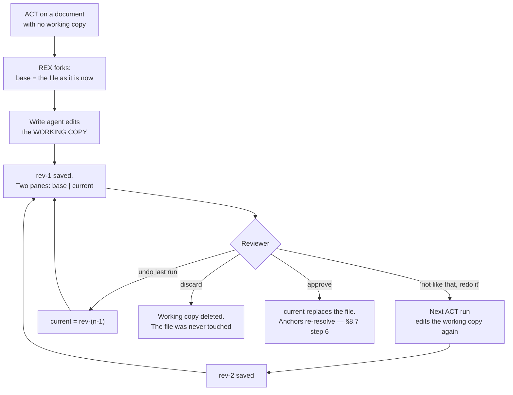

# REX 15 — the working copy, and the two panes

**Version:** 2.2 · 2026-08-26
**Status:** **built.** Every section is implemented and every automated
acceptance point in §11 passes. The measured failure of §1.1 was reproduced in a
scratch repository and is fixed; §12 records the five places the build departed
from version 2.0 and why.

| § | What | Status |
|:--|:--|:--|
| §3 | the working copy | **done** — `npm run test:work`, 22 tests |
| §4 | a run edits the working copy | **done** — proven against the app, twice over |
| §5 | iterating | **done** — a second ACT run built on the first, file untouched |
| §6 | the two panes | **done** — both halves, both tints, the control, the patch |
| §7 | approve, undo, discard | **done** — approve wrote the file; undo stepped back a run |
| §8 | the marks in the margin | **done**, revised in 2.2 — the lane moved to the pane's edge and the number moved inside the bar (§8.2, §8.3). Built at 2.1; the revision is not yet built |

**Depends on:** [`01-initial/SPEC.md`](../01-initial/SPEC.md) §6.7 (the highlight
API) and §8.7 (Apply, steps 1–7),
[`05-selection-as-a-phase/SPEC.md`](../05-selection-as-a-phase/SPEC.md) §5.6 and
§5.6.1 (Apply across documents, and the change shown in the document),
[`08-shell-redesign/SPEC.md`](../08-shell-redesign/SPEC.md) §7.2 (where a place's
number is drawn), [`11-powerpoint/SPEC.md`](../11-powerpoint/SPEC.md) §7.1 and
§7.7 (the deck flow, whose guarantee this spec generalises), and
[`12-ask-and-act/SPEC.md`](../12-ask-and-act/SPEC.md) §4.2 (ACT routes through
`startApply`).

> [!warning]
> **This spec replaces the mechanism behind REX's only safety promise.** Spec 01
> §8.7 step 5 — *the change is shown and nothing is kept until you accept* — is
> today implemented with three git commands: `git status` to see what moved,
> `git diff` to draw it, `git checkout` to undo it. All three are silent on a
> file git does not track, and on 2026-08-25 that silence let an ACT run change
> a document with no diff shown, no way back, and a stale view. The promise does
> not change. The thing that keeps it does.

> [!note]
> **Version 2 was rewritten after the reviewer read version 1.** Version 1 kept
> one copy per Apply *run*: the agent edited the real file, REX moved the change
> aside and put the original back. That fixed the fault but kept two things the
> reviewer does not want — a window in which their file holds a change they have
> not seen, and a change that must be accepted or rejected **one run at a time**.
>
> Version 2 turns the copy round. The agent never touches the reviewer's file at
> all: it edits a **working copy**, which survives across runs, so the reviewer
> can say *"I do not like that, do it again"* and keep iterating. The original is
> replaced only when the whole new version is approved. §6 adds the two panes,
> and §8 replaces the marks that made the document hard to read.

---

## 1. Why

### 1.1 What was measured

2026-08-25, 22:56. A reviewer selected a margin note in a Markdown document, set
the switch to ACT, and typed *"REmove this"*. The run finished in 7.4s and cost
$0.328. The trace shows the agent reading the file, calling `Edit`, and
answering *"Removed the LUKAS margin note … Docs-only change; nothing to run."*

Four things were then true at once:

| Where | What it said |
|:--|:--|
| the file on disk | the line was **gone** — the agent did edit it |
| the document view | the line was **still there** |
| the thread | `Applied to 0 file(s).` |
| `apply_run` | `status='applied'`, `diff=''`, `files_json='[]'` |

No diff was ever shown. Nothing was accepted, because there was nothing to
accept. The change stayed.

### 1.2 One cause

`startApply` learns what the agent touched by comparing `git status --porcelain`
before the run with the same command after it (`main/apply.ts:347` and `:370`).
Anything new in the second list is this run's work.

The document lived in a workspace whose whole `docs/` tree is **untracked**. For
a tree like that, `git status --porcelain` prints one line:

```text
?? docs/
```

That line is the same before the edit and after it. There is no second list
entry to find, so `introduced` is empty, and every step that follows is skipped
in a way that reads exactly like *"the agent changed nothing"*.

### 1.3 Four consequences, from that one cause

| # | Consequence | Where |
|:--|:--|:--|
| 1 | **Detection.** An edit to an untracked file is invisible | `main/apply.ts:370` |
| 2 | **The diff.** `git diff` prints nothing for an untracked path, so even a *detected* new file shows an empty patch | `main/git.ts:50` |
| 3 | **Undo.** `git checkout -- <path>` fails on a path git does not track — there is no committed version to restore | `main/git.ts:61` |
| 4 | **The view.** The renderer re-renders the open document only when it is named in `event.files`, so an empty list leaves the reader looking at text the file no longer holds | `overlay/App.tsx:987` |

Consequence 4 is what the reviewer reported. Consequences 1 to 3 are why it
happened, and 3 is the serious one: for the whole class of files git does not
track, **REX had no way back at all**, and it did not say so.

### 1.4 Three more faults the same reviewer named

| # | Fault | Answered by |
|:--|:--|:--|
| 5 | There is no way to see the old text and the new text **together**. The reviewer gets a patch in a bar and a document that has silently become the new one | §6 |
| 6 | A change can only be taken or dropped **in one gesture, per run**. *"I do not like that, rewrite it"* has nowhere to happen, because by then the file is already changed and the run is over | §3, §5 |
| 7 | A commented passage is **washed and underlined**, and a document with six comments in it is a document you cannot read. The numbered rail beside the page is a second place to look for the same information | §8 |

### 1.5 Why the obvious fixes are not enough

| Idea | Why not |
|:--|:--|
| `git status --porcelain -uall`, so each untracked file is listed | It fixes the *listing*, not the *comparison*. An untracked file that is edited is `?? path` before and `?? path` after — the status of an untracked file does not move when its content does |
| Refuse to ACT on an untracked file | Keeps the promise and is 20 lines. But it makes ACT unusable on any document that is not committed, which is the normal state of a document being reviewed |
| Snapshot each run, keep write-then-revert (**version 1 of this spec**) | Fixes 1 to 4. Leaves faults 5 and 6, and leaves a window in which the reviewer's file holds a change they have not seen |

---

## 2. The shape of the fix

**The agent never edits the reviewer's file.** REX forks a **working copy** the
first time a document is changed, and every ACT run after that edits the working
copy. The reviewer reads both versions side by side, keeps talking to the agent
until the new version is right, and only then approves it — at which point the
working copy replaces the original.



Three things follow, and each answers a fault in §1:

1. **The original is not modified at any point before approval.** Not for a
   moment, not in a window, not on a crash. This is spec 11 §7.1's guarantee,
   which was written about decks and was true only of decks.
2. **git stops being load-bearing.** REX compares its own two files, so an
   untracked document is no different from a committed one.
3. **A change is a conversation, not a verdict.** The working copy survives the
   run that made it.

---

## 3. The working copy

### 3.1 Where

```text
~/.rex/work/<documentId>/
```

Outside every repository, like the database (spec 01 §9) and the deck cache
(spec 11 §7.2), so nothing REX writes can be committed by accident.

The word is `work`, not `tmp`. `~/.rex/scratch` and `~/.rex/cache` already exist
and mean *"nobody minds if this is deleted"*. This directory holds work the
reviewer has not approved yet and **cannot get back**, and a name that invites a
cleaner to delete it would be a name that loses work.

`REX_WORK_PATH` overrides the root, so a test never writes into the reviewer's
own store — the same escape hatch `REX_DB_PATH` and `REX_CACHE_PATH` already
have.

### 3.2 What is in one

```text
~/.rex/work/9a1f…/
  meta.json
  components.original.md   the file exactly as it was when the fork happened
  components.v1.md         after the first ACT run
  components.v2.md         after the second
  components.new.md        a copy of the newest revision — what the right pane shows
```

The extension is the original's, so every renderer that dispatches on it
(`render/formats.ts`) works on a working copy with no special case.

**Every name is the document's own.** The first version of this called them
`base.md`, `current.md` and `rev-1.md`, and that leaked: ASK reads the working
copy (§5), so the agent answered *"the joke at `current.md:31`"* and the reviewer
read it as some **other file entirely**. Reported on 2026-08-26. `.original` and
`.new` are the words the two pane headers already use (§6), so the files and the
screen agree.

A working copy outlives the REX that made it, so `migrateWorkingCopyNames()`
renames what is already on disk at start-up — the bytes, the revisions and the
comments all survive the change. A rename that cannot be made is left alone: the
old file is the reviewer's only copy of work they have not approved.

```json
{
  "documentId": "9a1f…",
  "path": "/abs/path/repo/docs/architecture/components.md",
  "baseSha256": "9f2b…",
  "forkedAt": "2026-08-25T20:56:33.505Z",
  "revisions": [
    { "n": 1, "applyRunId": "8dd7…", "threadId": "3fd1…", "at": "…", "sha256": "…" }
  ]
}
```

`baseSha256` is the hash of the reviewer's file at the moment of the fork. §7.3
compares it again before approving, and that one field is what stops REX
overwriting an edit the reviewer made in their own editor meanwhile.

### 3.3 Its life

| Event | What happens |
|:--|:--|
| first ACT run on a document | forked from the file. `base` is written before the agent starts |
| every later ACT run | a new `rev-n`, and `current` points at it |
| **undo last run** | `current` goes back to `rev-(n-1)`, or to `base` at n=1. The revision file is kept, so undo is not destruction |
| **discard** | the whole directory is removed. The file was never touched, so there is nothing else to undo |
| **approve** | `current` is written over the file, then the directory is removed |
| the document has no working copy | REX behaves exactly as it does today |

A working copy survives a restart. That is the point of it being a directory and
not a variable, and it is what makes *"I will look at this tomorrow"* safe.

### 3.4 What is copied, and the cap

The working copy itself is one file per revision — small. The **before-set** of
version 1 stays, for the one job §4.3 leaves it: putting back a file the agent
wrote that it had no business writing.

Taken before each run, per repository root: every path
`git status --porcelain --untracked-files=all` reports, plus the run's target
files. **Capped at 32 MB.** Above the cap the run is refused before the agent
starts, naming the three largest paths:

> Apply would have to copy 480 MB before it could promise to undo itself —
> `build/` is 471 MB of that. Add it to `.gitignore`, or commit it, and try
> again.

A refusal before anything runs costs a reviewer one message. Any other answer
costs them the ability to undo.

---

## 4. A run edits the working copy

### 4.1 What the agent is told

`writePrompt` today lists the document's real paths under *"Files you may
edit:"*. It now lists the **working copy** paths, and says what they are:

```text
Files you may edit:
- ~/.rex/work/9a1f…/components.new.md

That file is the current version of docs/architecture/components.md. Edit it in
place. Do not edit the original — the reviewer has not accepted these changes
yet, and REX will put back anything you write outside the list above.
```

The agent's working directory stays the document's repository, so every read it
needs — sibling documents, code the document describes, `git log` — works
exactly as it does now. Only what it may **write** moves.

### 4.2 What changed inside the working copy

The rule is unchanged from version 1 and it is the honest one: **a file is
changed when its content hash moved.** `current` is hashed before the run and
after it. A rewrite with identical bytes is not a change.

### 4.3 What the agent wrote that it should not have

The write profile allows `Bash` (spec 11 §6.4.4), so an agent can write outside
the list whatever the prompt says. Two sources catch it:

- **`RunAgentOptions.onWrote`** — a new callback fired with `file_path` for
  every `Edit`, `Write` and `NotebookEdit` call. `runner.ts` already reads that
  field to draw the `diff` step (`main/agent/runner.ts:79` and `:92`). Exact,
  and it needs no git.
- **the before-set** (§3.4) — re-hashed after the run, which catches a `sed -i`
  no tool call named.

Anything found outside the working copies is **put back** — from the before-set
copy, or with `git checkout --` for a tracked file that was clean when the run
started — and reported on the thread in one line:

> The agent also changed `docs/README.md`. REX put it back: a change outside
> this comment's documents cannot be reviewed here.

This is stricter than today, where such a file would silently ride along in the
diff. A file the reviewer did not comment on is not part of this review.

---

## 5. Iterating

This is fault 6, and after §3 it needs almost no machinery — only that nothing
in the flow ends the conversation.

- **ASK reads the working copy.** While one exists, it is the current version of
  the document, so `askPrompt`'s passages and the file the agent reads are the
  working copy's. Asking *"is this better?"* about a version the agent cannot
  see would be worse than useless.
- **A second ACT run is an ordinary reply.** *"I do not like that, make it
  shorter"* goes through `thread:apply` exactly as the first one did. §4.1's
  prompt hands it the working copy, and the transcript before it is the context —
  which is already how spec 12 §4.2 builds a write prompt.
- **Comments are made on the current version.** The document pane's right-hand
  side is the working copy (§6), so a selection is a selection in it, and a new
  comment anchors to it. That is what makes *"this new paragraph is wrong"*
  expressible at all.
- **Undo is one run**, not one edit. §3.3.

> [!note]
> **An anchor is stored against the document, not against a revision.** A
> comment written on the working copy anchors to the document exactly as one
> written on the file does, and it re-resolves after approval like every other
> anchor (§8.7 step 6). Nothing in this spec adds a revision number to an
> anchor: an anchor that meant something different depending on which version
> was on screen is the silent-failure class this codebase is most careful about.

---

## 6. The two panes

### 6.1 The layout

While the open document has a working copy, the document pane splits:

```text
┌───────────────────────────┬───────────────────────────┐
│  ORIGINAL                 │  NEW VERSION  · 3 changes │
│  (read-only)              │  ← comments live here     │
│                           │                           │
│  …the file on disk…       │  …the working copy…       │
└───────────────────────────┴───────────────────────────┘
```

A three-position control in the top bar decides what is on screen — `Original`,
`Both`, `New` — and `Both` is the default the moment a working copy exists.
`New` alone is what a reviewer wants once they have read the change, and
`Original` alone is how they check what a passage used to say.

Both sides are real rendered documents, each in its own frame, by the renderers
that already exist. The left one is read-only: no selection panel, no comment
gestures, no marks. **Comments belong to the new version**, because that is the
version that will exist.

### 6.2 How the change is drawn

Like `git diff`, in the document rather than in the source:

| Where | Drawn as |
|:--|:--|
| a block only in the original | red bar in the left margin, and the block tinted red |
| a block only in the new version | green bar in the right margin, and the block tinted green |
| a block changed | both, at the same height, so the eye pairs them |

The mapping from a diff hunk to a rendered block is machinery this repo already
has: `changedRegions` turns a unified diff into source-line ranges
(`main/diff.ts`), and the renderer widens a line to the block that contains it
through the `data-src-line` stamps (spec 05 §5.6.1). This spec points that same
pipeline at two documents instead of one.

The panes scroll together, aligned on the changed blocks where both sides have
`data-src-line` stamps and proportionally where they do not.

> [!note]
> **A document with no source-line stamps still gets both panes.** It gets no
> block tints, because REX would have to guess which rendered paragraph a hunk
> belongs to, and a wrong outline is worse than none — that is the same rule
> spec 05 §5.6 already applies to `ChangedRegion`. The patch below carries the
> exact change for those.

### 6.3 The patch itself

Under the panes, collapsed, is the unified diff — the same text the review bar
shows today, drawn by `git diff --no-index` between `base` and `current`:

```bash
git diff --no-index --src-prefix=a/ --dst-prefix=b/ -- <base> <current>
```

Two mechanical notes, both measured:

- **It exits 1 when the files differ**, which is the normal case. `execFileSync`
  throws on a non-zero exit, so the patch is read from the error's `stdout`.
  Reading only the success path would silently produce an empty diff — the same
  failure this spec exists to end.
- **The header names the copies**, so the three header lines (`diff --git`,
  `---`, `+++`) are rewritten to `a/<rel>` and `b/<rel>` against the repository
  root. `changedRegions` reads `+++ b/<path>` to decide what to outline, and
  `tallyByFile` reads the same line for the per-file counts
  (`overlay/DiffDialog.tsx`). Both keep working unchanged, and that is the test
  of whether the rewrite is right.

### 6.4 Formats that are not text

| Format | The two panes are |
|:--|:--|
| Markdown, HTML, plain text | two rendered documents, as above |
| `.docx` | the same — it renders to HTML (spec 03) |
| `.pptx` | **no working copy, and no panes.** Spec 11 §7.7's own before-and-after slide preview is untouched and is still accepted through `apply:confirm` (§10). Two review surfaces for one file would be two answers to one question, and the deck's is the one that was designed for it |
| PDF | **no working copy.** `applyEnabled` is false for a PDF (`render/index.ts:149`), so no ACT run can start on one and there is nothing to show |

---

## 7. Approve, undo, discard

### 7.1 Per document, and all at once

A comment can span documents (spec 05 §5.6), so one ACT run can fork several
working copies. Both gestures exist:

- **Approve this document** — on the head of the right-hand pane, for the
  document on screen.
- **Approve all (N)** — in the top bar while more than one working copy exists.
  It approves each in turn and reports the total.

Discard has the same pair. Undo is per document only: *"undo the last run"* has
no meaning across documents whose runs interleaved.

### 7.2 What approving does

1. Write `current` over the file.
2. Re-hash the document row (§6.6's `ok` versus `moved` depends on it).
3. Re-resolve every anchor in the renderer — spec 01 §8.7 step 6, unchanged.
4. Remove the working copy directory.
5. Report what moved: *"3 files approved. 1 comment is now orphaned — «the
   paragraph about retries»."* Step 7's report is unchanged.

### 7.3 The one refusal

**If the file changed since the fork, REX will not approve.** `baseSha256` is
compared against the file, and a mismatch means the reviewer edited the document
in their own editor while a working copy existed.

> `components.md` has changed on disk since REX made this copy. Approving would
> throw your own edit away. Discard the copy and ask again, or open the two
> versions and copy across what you want.

REX does not merge. A three-way merge that silently resolves a conflict inside a
document under review is the same class of failure as an anchor that resolves to
the wrong place: it succeeds, it reports success, and it is wrong.

### 7.4 The review bar changes meaning

Today `apply:ready` opens a bar with **OK** and **Undo**, and the run is not
finished until one is pressed (spec 05 §5.6.1). That bar was the whole of step
5, and after this spec it is not: the two panes are.

So the bar becomes a **notice**, not a gate:

> **3 changes** in `components.md` — shown on the right. `Approve` · `Undo this
> run` · `Discard`

It can be dismissed. Nothing is waiting on it, because nothing is pending: the
reviewer's file already holds what it held before the run, and it will keep
holding it until §7.2 runs.

---

## 8. The marks in the margin

This is fault 7, and it is a change to how **every** comment is drawn, not only
one under Apply.

### 8.1 What is wrong with today's marks

A commented passage gets a background wash **and** a 1.5px underline, painted
through the Custom Highlight API (`anchor/highlight.ts`). Six comments on one
screen is six tinted, underlined blocks: the marks stop saying *"there is a
comment here"* and start saying *"this document is unreadable"*.

Beside the page, a 32px rail carries a numbered disc per comment at its anchor's
height (`overlay/Gutter.tsx`). It is a second place to look for information the
passage already implies, it costs a column REX now needs for the second pane
(§6), and it cannot say which of two adjacent passages a disc belongs to.

### 8.2 What replaces them

**A coloured vertical bar in a lane down the side of the pane, level with the
passage. Nothing on the text itself.**

```text
┌──┬──────────────────────────────────────────────────────────
│▐3│  1. Drafting Table — The environment where the human and an
│  │     AI agent collaborate during Sketching and Dimensioning…
│  │
│  │  2. Specification Toolkit — The portable set of skills…
│▐2│  4. WMS Adapter — A thin, pluggable integration layer over
│  │     the chosen work management backend…
│▐1│  6. Job Site — The autonomous execution engine that runs…
└──┴──────────────────────────────────────────────────────────
```

| Property | Value |
|:--|:--|
| position | **one fixed lane down the left of the pane**, outside the paper. Every bar starts at the same x |
| width | **18px** — wide enough to carry its number inside it (§8.3) |
| height | the passage's own vertical extent — `CheckedTarget.bar`, the box of the BLOCK the place sits in |
| colour | the state vocabulary, unchanged: steel `ok`, amber `moved`, drained `resolved`, red `orphaned`, violet `active` |
| stacking | one bar per comment, side by side in the lane, in comment-number order |

> [!note]
> **Version 2.2 moved the lane.** Version 2.0 put each bar at its own block's
> left edge, `block.x - 14`. Measured on 2026-08-26 against a numbered list: a
> list item's bar sat 40px right of a paragraph's, so the marks formed a ragged
> staircase instead of a column, and the reviewer's answer was *"they should be
> on the most left side of the document"*. A block's indent is information about
> the prose, not about the comments, and a mark that inherits it is saying
> something it does not mean.
>
> The height still comes from the block, so a bar still says **which** paragraph.
> Only the x is fixed.

Drawn in the overlay over the pane, exactly as `.rex-block-outline` already is,
so invariant I1 and spec 01 §6.7 are untouched: no `<mark>`, no wrapper, no
mutation of the document under review.

Spec 16 §7.2 gives the second pane its own lane, on the same rule.

### 8.3 The number goes inside the bar

The bar is 18px wide because that is what it takes to hold a number, and the
number sits **inside it**, at the top, in the bar's own colour.

> [!note]
> **Version 2.2 put the number in the bar rather than on it.** Version 2.0 drew
> a 3px bar with a 16px chip overlapping it, and two stacked chips then covered
> each other — a lane 5px wide cannot separate marks 16px across. Version 2.1
> staggered them 18px down, which worked and read as a stack of discs beside a
> hairline rather than as numbered bars. Widening the bar to the number's own
> width removes the chip, the overlap and the stagger together.

Clicking anywhere on a bar opens its comment, which is what clicking the rail's
disc used to do.

### 8.4 The text is painted only on demand

| State | The text |
|:--|:--|
| a comment exists here | **nothing** — the bar is the mark |
| the comment is open (active) | the violet underline and wash it has today |
| the row or the bar is hovered | the same, softly |

This is what makes the document readable again while keeping the precision:
which exact words a comment is about is a question you ask about **one** comment,
and asking it is what lights them up.

### 8.5 The rail goes away

`Gutter.tsx` and `.rex-gutter` are deleted, and the pane gets its 32px back.

The orphans it pinned to its foot move to the comment list, which already counts
them (`.rex-count-orphaned`) and already shows each one's state in words. An
orphan has no place in the document by definition, so the margin is the one
place it could never have belonged.

---

## 9. What this adds

| | |
|:--|:--|
| Dependencies | **none** |
| IPC channels | four — `work:list`, `work:approve`, `work:discard`, `work:undo`. `doc:open` gains an optional `version` argument (`original` or `current`); `apply:ready` becomes a notice and carries the working-copy paths |
| Tables | none. The working copy is a directory with a `meta.json`, because it must survive a database that was deleted and a REX that was killed |
| Columns | none |
| Shapes | `WorkingCopy`, `WorkingRevision`, `PaneMode`; `ApplyReadyEvent` gains `working`; `RunAgentOptions` gains `onWrote` |
| New files | `main/work.ts` (fork, revise, approve, discard, undo, the before-set), `main/workDiff.ts` (the patch and the two block maps), `renderer/overlay/OriginalPane.tsx`, `renderer/overlay/MarginBars.tsx`, `renderer/overlay/frame.ts`, `renderer/overlay/syncPanes.ts`, `renderer/overlay/lineMap.ts`, `test/work.spec.ts` |
| Changed | `main/apply.ts`, `main/diff.ts`, `main/git.ts`, `main/ipc.ts`, `main/agent/runner.ts`, `main/render/index.ts`, `shared/channels.ts`, `shared/types.ts`, `shared/tokens.ts`, `preload/index.ts`, `overlay/App.tsx`, `overlay/DocumentView.tsx`, `overlay/anchoring.ts`, `overlay/wash.ts`, `overlay/CommentCard.tsx`, `overlay/DiffDialog.tsx`, `overlay/overlay.css`, `anchor/highlight.ts` |
| Deleted | `overlay/Gutter.tsx` and `.rex-gutter` (§8.5); `refuseDirtyTargets` (§10.1); `revertAll`'s use inside `apply.ts`; three of the four highlight registries (§8.4) |
| Scripts | `npm run test:work` |

Invariant I1 is untouched — anchors are still created and resolved in the
renderer on the live DOM, and §8.2 draws in the overlay rather than in the
document. I2 is untouched — the store is main's, and §6 lets the renderer name a
version, never a path. I3 is untouched — four more `invoke` channels, no port.

---

## 10. Two refusals: one goes, one stays

### 10.1 "already has uncommitted changes" goes

```text
docs/architecture/components.md already has uncommitted changes. Commit or
stash them first — rejecting this Apply would discard them too.
```

That refusal exists only because the undo was `git checkout`, which throws away
everything since the last commit. The agent no longer edits the reviewer's file
at all, so a dirty file is not even touched. `refuseDirtyTargets` is deleted.

This is a real gain, not a tidy-up: reviewing a document you are in the middle of
editing is the ordinary case, and REX refused it.

### 10.2 "must be in a git repository" stays

The reason in today's message is now false, and the refusal is still right for a
different one: **outside a repository §4.3 has only one of its two sources**, so
REX cannot put back a file the agent wrote that no tool call named. The message
is rewritten to say the true reason. Lifting it is §12.

---

## 11. Acceptance

The fixture is a scratch git repository with **one committed file and one
untracked directory holding a Markdown document**. That is §1.1 reduced to its
cause, and it must never be a real review repository — a test that edits
somebody's working tree is its own bug.

### 11.1 The measured failure

- [x] ACT on a document inside the untracked directory reports **1 file**, not
      0, and the thread does not say `Applied to 0 file(s).`
- [x] The right pane shows the change; the left pane shows the old text.
- [x] The file on disk is **byte-identical** to what it was before the run, and
      stays so until approval. `sha256` before, during and after.
- [x] Approve: the file holds the change and `~/.rex/work/<id>/` is gone.
- [x] Discard: the file is still byte-identical and the directory is gone.

### 11.2 Iterating

- [x] A second ACT run on the same document produces `rev-2`, and the right pane
      shows it. The file is still untouched.
- [x] *"I do not like that, make it shorter"* reaches the agent **with the
      working copy as the file it may edit**, not the original.
- [ ] ASK on the same document quotes the working copy's text, not the file's.
      *(Built — `thread:ask` resolves through `readMeta`/`currentPath` — but not
      yet proven with a live ASK run.)*
- [x] Undo the last run: the right pane goes back to `rev-1`, and `rev-2` is
      still on disk.
- [ ] A comment made on a paragraph the agent **added** anchors, resolves and
      survives approval. *(Not yet run: it needs a working copy whose change is
      an addition, and the two runs measured were a deletion and a heading
      rename.)*
- [x] Quit REX with a working copy open, restart: the working copy and both
      panes come back.

### 11.3 The two panes

- [x] The control switches `Original` / `Both` / `New`, and `Both` is the
      default when a working copy exists.
- [x] A changed block is tinted red on the left and green on the right, at the
      same height.
- [x] The panes scroll together.
- [ ] A document with no `data-src-line` stamps shows both panes and **no**
      block tints, and the patch below carries the change. *(Not yet run: it
      needs an HTML document with a working copy.)*
- [x] A `.pptx` gets no working copy and no panes: spec 11 §7.7's own preview is
      untouched, and `npm run test:pptx-edit` passes unchanged (45 tests). §6.4.
- [ ] Selecting text in the left pane offers no comment gesture. *(Structural —
      `OriginalPane` attaches no `mouseup` listener and hands up no surface — but
      not yet exercised by hand.)*

### 11.4 The marks

- [x] A commented passage has **no wash and no underline** until its comment is
      open or hovered.
- [x] The bar's height matches the passage's height, and it sits in the margin,
      never over the text.
- [x] Two comments on one passage draw two bars side by side, numbered, with the
      second chip pushed down.
- [x] A `moved` comment's bar is amber, an `orphaned` one has no bar, and a
      `resolved` one is drained — the same vocabulary as the cards. *(The
      orphaned case was seen live; the other two are `markerClass`, which
      `npm run test:comments` covers.)*
- [x] Clicking a chip opens that comment.
- [x] The document DOM is unchanged by drawing them. Measured in the live frame:
      zero `<mark>` elements, zero REX classes, zero REX attributes. The
      highlight CSS is still an `adoptedStyleSheets` entry rather than a node.
- [x] `.rex-gutter` is gone from the CSS and from the DOM.

### 11.5 The store, and safety

- [x] `base` exists on disk **before** the agent's first tool call.
- [x] The agent writing outside the working copy is put back, and the thread
      says which file. *(Unit-tested; not provoked against a live agent.)*
- [x] Editing the file in another editor while a working copy exists makes
      approval refuse, with §7.3's message, and nothing is written.
- [x] A before-set over 32 MB refuses the run and no agent starts.
- [x] Killing REX mid-run leaves the reviewer's file untouched — there is no
      window to catch.
- [x] `REX_WORK_PATH` is honoured, and the suite writes nowhere else.
- [x] `nvim-tools --json --all` adds no finding.

### 11.6 What the build did differently, and why

| Version 2.0 said | Built as | Why |
|:--|:--|:--|
| `renderer/overlay/TwoPanes.tsx` | **`OriginalPane.tsx`, plus `frame.ts`, `syncPanes.ts` and `lineMap.ts`** | `DocumentView` already *is* the right-hand half — it owns the surface, the selection, the pick and pen layers and every overlay mark. A component that owned both halves would have had to own all of that too. So the left half became its own small read-only component, and what the two genuinely share — the srcdoc, the base href, the zoom — moved into `frame.ts` where both call it. `lineMap.ts` and `syncPanes.ts` are §6.2's alignment, split out because the line arithmetic is pure and testable and the listeners are not |
| the marks span `CheckedTarget.mark` | **a new `CheckedTarget.bar`** | `mark` is where a place's NUMBER is drawn, and for a text target it is the range's own box — which starts mid-line for a comment on one sentence. A bar drawn at that x stands in the middle of the prose. §8.2 asked for a line beside the *block*, so the resolver now reports the block too: it walks out of inline elements to the enclosing paragraph, list item or cell |
| a chip pushed down when another sits at the same height **in its lane** | **when another sits at the same height, in any lane within a chip's width** | Measured on 2026-08-26: a chip is 16px across and a lane is 5px, so two chips in adjacent lanes drew one readable number with the second hidden behind it. Height alone decides now, with an x test wide enough to notice |
| §7.4 — the review bar "becomes a notice" | **the bar is not drawn at all for a working-copy run** | The head of the new-version pane already IS the notice, with the counts, the three answers and the conflict. Keeping the old bar as well put two answers on screen, and its words were now false: it offered OK and Undo, and it said "Undo restores every file with `git checkout`". A deck run still has it, because spec 11's pipeline is untouched |
| — | **the overlay's coordinate root moved to `.rex-half-body`** | Not in the spec, and required by it. Every mark is drawn at `box.y - scroll.y`, which is a frame coordinate; putting a head above the frame made every outline, bar and badge exactly the head's height too high. Measured on 2026-08-26 — the changed-block outline landed on the paragraph above the one it belonged to |

`.rex-change-outline` also turned green (§6.2). It was the write agent's red, which
was right while there was one document on screen and wrong the moment there were
two: the pair has to say which way round the change goes.

Invariant I1 is untouched — anchors are still created and resolved in the
renderer on the live DOM, and §11.4 measured that the document's own tree is
unchanged by the new marks. I2 is untouched — the store is main's, and the
renderer names a version, never a path. I3 is untouched — four more `invoke`
channels, no port.

---

## 12. Non-goals

| Not doing | Why |
|:--|:--|
| Merging a working copy with an edit made meanwhile | §7.3 — a silent three-way merge inside a document under review is the same failure class as an anchor resolving to the wrong place |
| A working copy per branch, or more than one at a time per document | One document, one version in progress. Two would need a name, a picker and a merge |
| Apply outside a git repository | §10.2 — without git, a collateral write nobody named cannot be put back. Worth its own spec |
| Protecting files git **ignores** | An ignored path is invisible to `git status`, so only `onWrote` sees it. Ignored files are build output, not review documents; naming the hole is the honest answer |
| Editing the document in REX by hand | REX is a review tool. The reviewer's editor is where a document is written, and §7.3 is what keeps the two out of each other's way |
| A word-level diff inside a paragraph | Block-level is what `data-src-line` supports honestly. The patch below the panes carries the exact characters |
| Keeping revisions after approval | The change is in the reviewer's tree at that point, and versioning it is git's job |
