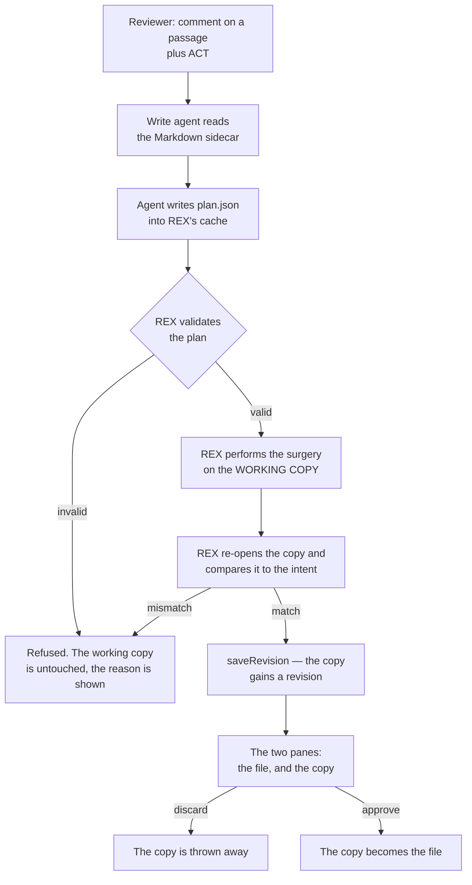

# REX 19 — the Word document, and the notes on a slide

**Version:** 1.0 · 2026-08-27
**Status:** proposed. Every number in §2 was measured on this machine before this
spec was written; everything else is a design that has not yet been run.
**Depends on:** [`01-initial/SPEC.md`](../01-initial/SPEC.md) §5.2 (why Apply was
refused on a DOCX) and §8.7 (Apply, steps 1–7),
[`03-rich-rendering/SPEC.md`](../03-rich-rendering/SPEC.md) §8 (DOCX through
mammoth), [`11-powerpoint/SPEC.md`](../11-powerpoint/SPEC.md) §6.2 (the text
sidecar), §7.2 (the plan), §7.3 (the surgery), §7.7 (the preview) and §7.8 (the
validator), [`12-ask-and-act/SPEC.md`](../12-ask-and-act/SPEC.md) §4.2 (ACT
routes through `startApply`), [`15-the-working-copy/SPEC.md`](../15-the-working-copy/SPEC.md)
§3 (the working copy), §5 (iterating) and §7 (approve, undo, discard),
[`16-the-two-versions/SPEC.md`](../16-the-two-versions/SPEC.md) §4 (the blocks a
change added), and [`17-stopping-a-run/SPEC.md`](../17-stopping-a-run/SPEC.md) §3
(a run can be stopped).

> [!important]
> **This spec invents no mechanism. It ports one.** Spec 11 §7 already answered
> "how does an agent change a file it cannot diff": the agent writes a **plan**,
> REX validates it, REX performs it, and the reviewer accepts the result rather
> than a diff of bytes. That answer was written for a deck. A `.docx` is the same
> kind of file — a zip of XML — and gets the same treatment, on the copy spec 15
> already forks for every run.

> [!important]
> **PDF stays read-only, by decision, and §8 is the record of why.** It is not an
> omission and it is not "not yet". A PDF has no paragraphs to edit and, measured
> on this machine, 92% of its fonts cannot spell a word that is not already on
> the page. §8 exists so that this is decided once.

> [!note]
> **A deck is already editable — this spec adds one operation to it.** Spec 11's
> twelve operations shipped. The measured gap is speaker notes: 33 of the 72
> decks on this machine carry them, 642 notes slides in all, and nothing can
> change one. §7 adds the thirteenth operation and the one preview change it
> forces.

> [!warning]
> **The half of this spec that can be cut is §6, tracked changes.** Word has a
> native review model and REX is a review tool, so writing `<w:ins>` and
> `<w:del>` instead of overwriting prose is the one thing REX could do for a
> Word file that it cannot do for Markdown. It is also the most expensive
> milestone here and it is deliberately last. §5 must work before §6 is started.

---

## 1. Why

**REX renders a Word file and then refuses to change it.** `formats.ts` says so
in one line — *"Apply cannot edit a DOCX — REX renders its prose, not its
document model"* — and that sentence was true when it was written, because the
only write path was "edit the file by line, diff it with git". A zip has no
lines.

It stopped being true on the day spec 11 shipped. There is now a second write
path in the codebase, built for exactly this shape of problem, with a validator,
a refusal path and a preview. It is pointed at one format.

**A Word file is the format a review comment is most often about.** A deck is
argued about slide by slide; a Word file is argued about sentence by sentence,
which is the gesture REX was built around. Rendering one and then sending the
reviewer to Word to make the change is the same failure spec 11 §7.2.1 named:
*a tool that can only retype a sentence sends the reviewer back to PowerPoint for
everything else.*

**And a deck's notes are a review document nobody can reach.** 642 notes slides
sit on this machine, the agent already reads them in the sidecar (spec 11 §6.2),
the reviewer can already comment on them — and no operation can change one.

---

## 2. What was measured before this was designed

Everything below was run on this machine on 2026-08-27, against every real file
of each kind. It is here because the design is only defensible if the numbers
hold, and a later reader must be able to check them.

### 2.1 The corpus

Files outside `node_modules`, `.venv` and `site-packages`:

| Format | Files | What they are |
|:--|--:|:--|
| `.pptx` | **72** | 1,643 slides |
| `.pdf` | **78** | over 40 KB, so real documents rather than exported plots |
| `.docx` | **18** | 6,140 paragraphs, 6,955 runs |

Eighteen is not many. It is also every Word file the reviewer owns, and it is
the whole population rather than a sample.

### 2.2 A Word file is easier to edit than a deck

The two problems spec 11 had to solve — text split across runs, and addressing a
thing that has no stable id — both exist in WordprocessingML and both are milder.

| Measurement | All 18 files |
|:--|--:|
| Paragraphs whose text is split across more than one `<w:t>` | **865 of 6,140 — 14.1%** |
| Most runs in any single paragraph | **12** |
| Paragraphs of 25 characters or more that are **unique by their text alone** | **2,651 of 2,713 — 97.7%** |
| Files mammoth converted without throwing | **18 of 18** |

For comparison, spec 11 §7.3 had to write the run-merge rule because PowerPoint
splits a sentence across *many* runs as a matter of course. Word does it in one
paragraph in seven, and never across more than twelve runs. **The rule REX
already wrote is enough**, and it is applied less often.

The 97.7% is what makes §4.4's addressing safe. The remaining 2.3% is short
repeated text — `"12"`, `"Assessment"`, `"1"` — which is why the plan carries a
position **and** the text, and refuses when they disagree.

### 2.3 REX's own zip module already handles a `.docx` unchanged

`src/main/pptx/package.ts` was written for spec 11 §7.3 and contains nothing
about slides. Opening all 18 Word files with it and writing them straight back
out, with no edit staged:

| Measurement | Result |
|:--|--:|
| Files where **every part came back byte-identical** | **18 of 18** |
| Parts lost | **0** |
| Parts added | **0** |
| Largest change in **container** size | −9.68% |

The same run over 20 decks: 20 of 20 with every part byte-identical, largest
container change −4.21%.

Two things follow, and both matter.

1. **The module moves to `src/main/ooxml/` and is shared.** It is not deck code.
   §3.1.
2. **The invariant is "every part is the bytes that were there", not "the file
   is the same size".** The container differs — zip local headers carry
   timestamps, and jszip's deflate level is not Word's — while every part inside
   it is identical. Spec 11 §2.4 phrased this as a size measurement; the honest
   statement is the part-level one, and it is what §5.6 checks.

### 2.4 What a Word file actually carries

Of the 18 files, how many carry each thing at all:

| Feature | Files | What it means here |
|:--|--:|:--|
| Numbering (`numbering.xml`) | **17** | lists are the norm, so `setListLevel` is worth having |
| Tables | **15** | a table is not an exotic case in Word, unlike in a deck (§2.5) |
| Headers / footers | **9** | never edited by this spec — §9 |
| Existing Word comments | **6** | must survive untouched, and §2.3 proves they do |
| Images | **6** | four places again, exactly as spec 11 §7.4.4 |
| Hyperlinks | **3** | structure inside a paragraph — §5.5 |
| Fields (`fldChar` / `instrText`) | **2** | page numbers, cross-references, a table of contents |
| Content controls (`w:sdt`) | **2** | structure a template owns |
| Footnote references | **1** | |
| Bookmarks | **1** | |
| Text boxes (`txbxContent`) | **0** | |
| **Tracked changes already present** | **0** | §6 never has to reconcile with someone else's revisions |

The four rare ones — fields, content controls, footnotes, bookmarks — are the
hazards. They appear in **at most 2 files in 18**, which is what makes §5.5's
rule affordable: an operation whose paragraph contains one is **refused**, not
attempted.

### 2.5 The gap in the deck, measured over 72 decks

| Feature | Decks carrying it | Total |
|:--|--:|--:|
| **Speaker notes** | **33 of 72** | **642 notes slides** |
| Charts | 15 of 72 | — |
| Tables | 2 of 72 | **3 tables in 1,643 slides** |
| Groups | 1 of 72 | — |
| SmartArt | **0 of 72** | — |
| Embedded video | 0 of 72 | — |

Spec 11 §2.1 measured 40 decks and found notes in 23 of them; the wider corpus
says the same thing more loudly. **Notes are the gap and tables are not.** Three
tables across 1,643 slides does not justify an operation, and §9 records that.

Charts moved: spec 11 measured 1 deck in 40, this measures 15 in 72. That is
worth knowing and still does not change the answer — §9.

---

## 3. What this changes in the earlier specs

| Spec | Section | Change |
|:--|:--|:--|
| 01 | §5.2 | Apply is no longer refused on a DOCX. The sentence about "no source line" now applies to PDF alone. |
| 03 | §8 | unchanged. mammoth stays the **reader**, and gains no role in the write path — §4.3. |
| 11 | §7.2.1 | twelve operations become **thirteen**: `setNotes`. §7. |
| 11 | §7.3, §7.7 | `package.ts` and `xml.ts` move to `src/main/ooxml/`; `DeckSlidePreview` gains the notes text. §3.1, §7.2. |
| 15 | §3 | the working copy gains a second kind of writer: REX's own surgery, not only the agent's `Edit` tool. §4.2. |
| 17 | §3 | a DOCX run is stopped the same way. Nothing new. |

Nothing here is a breaking change to a stored shape. No migration.

### 3.1 The file map

Moved, because §2.3 proved they are not deck code:

```text
src/main/ooxml/
├── package.ts        was pptx/package.ts — open, stage, write back
└── xml.ts            was pptx/xml.ts — the string-surgery primitives
```

Both keep their spec 11 §7.3 citations, with a line saying where they came from
and that two formats now use them. Every import in `src/main/pptx/` is updated;
nothing else changes.

New:

```text
src/main/docx/
├── document.ts       the paragraph map — read word/document.xml (§4.1)
├── text.ts           the sidecar the agent reads (§4.3)
├── plan.ts           the plan, its schema and its refusals (§4.4)
├── edit.ts           the surgery (§5)
├── validate.ts       the re-parse and the comparison (§5.6)
└── run.ts            the flow, on the working copy (§4.2)

test/docx.spec.ts         the paragraph map and the sidecar
test/docxEdit.spec.ts     every operation, and every refusal
```

Changed: `render/formats.ts` (§10), `agent/prompts.ts` (a Word write prompt),
`apply.ts` (dispatch), `shared/channels.ts` (the notes fields), and
`src/main/pptx/{plan,edit,validate,run}.ts` for `setNotes`.

---

## 4. Editing a Word file

### 4.1 What an element is

A `.docx` is a zip whose main part is `word/document.xml`: one flat stream of
`<w:p>` paragraphs, each holding `<w:r>` runs, each holding a `<w:t>`. There is
no geometry, no page, no z-order. **The unit is the paragraph.**

That single difference removes six of spec 11's twelve operations — everything
that is about where a box sits on a slide — and adds four that a deck had no use
for. §4.5 is the list.

A table is a `<w:tbl>` holding `<w:tr>` rows holding `<w:tc>` cells, and a cell
holds paragraphs. So a cell is addressed as a paragraph inside a table, and
needs no separate model.

### 4.2 The flow, and why it is not the deck's flow



A deck runs its own pending copy (spec 11 §7.1) because a deck cannot be shown
as text: the reviewer has to be given a **picture** of every affected slide, and
that picture is produced once, held, and thrown away or kept.

A Word file is prose. Spec 15 §6 already puts the file and its working copy side
by side and spec 16 §4 already marks the blocks a change added and removed —
against mammoth's HTML, which REX already renders for a DOCX. **So there is
nothing to invent for the preview, and nothing to hold in a second place.**

Three things follow from riding the working copy instead of a second pending
copy:

1. **Iteration is free.** Spec 15 §5 — a second ACT run builds on the first. The
   deck flow cannot do that today; a Word file can, from the first milestone.
2. **Approve, undo and discard are free.** Spec 15 §7, unchanged.
3. **The reviewer's file is untouched until they approve it.** Spec 15 §3 already
   guarantees this for every format, so the guarantee spec 11 §7.1 had to build
   for itself is inherited rather than rebuilt.

The one thing that changes in spec 15: the working copy is written by **REX**,
not by the agent's `Edit` tool. `saveRevision` takes bytes and does not care
where they came from, so this is a new caller, not a new mechanism.

> [!warning]
> **The agent must not be able to write the `.docx` itself.** The write profile
> allows every tool. An agent asked to change a Word file *could* unzip it, edit
> the XML and rezip it, with nothing between it and the reviewer's document. The
> prompt (§4.6) says REX is the only thing that writes; the plan is the only
> channel; and §5.6 refuses anything REX did not perform itself. This is the same
> reasoning spec 11 §7.2 recorded, and it holds for the same reason.

### 4.3 The sidecar the agent reads

A `.docx` is opaque to an agent — spec 11 §6.1 recorded the same fault for a
deck. So the same answer: one Markdown file in REX's cache, keyed by the
document's content hash, regenerated when the hash changes.

**It is built from `word/document.xml`, never from mammoth's HTML.** mammoth
drops empty paragraphs, merges consecutive ones under some style maps, and has no
positional map back to the XML. A sidecar built from it would number paragraphs
differently from the surgery, and an off-by-one in a plan is an edit landing on
the wrong sentence.

```markdown
# Syllabus_Vibe_Coding_Agentic_Engineering_EN.docx

[1] {Title} Vibe Coding & Agentic Engineering
[2] {Heading1} Course outline
[3] This course teaches the practice of working with coding agents…
[4] {ListParagraph·1} Week 1 — the loop
[5] {ListParagraph·1} Week 2 — tools
[T1] {table 4×3}
[T1r1c1] {Heading4} Week
[T1r1c2] {Heading4} Topic
[T1r2c1] 1
```

Rules on the sidecar:

1. **The number in brackets is the paragraph's position in the body, counting
   from 1**, and it is what the plan addresses. A table cell's key is derived,
   never a second numbering scheme.
2. **The style name in braces is what Word calls it**, resolved through
   `word/styles.xml`. It is there so the agent can say "make this a Heading 2"
   using a name the file already contains.
3. **An empty paragraph is listed and numbered.** It is a paragraph, and a plan
   that inserts after it must be able to name it.
4. **A paragraph carrying a field, a content control or a footnote reference is
   marked** — `[17] {Body·locked} …` — so the agent can see, before it writes a
   plan, that §5.5 will refuse to edit it.

### 4.4 The plan

One JSON file, written by the agent into REX's cache directory — outside every
repository, so nothing the agent writes can be committed by accident. The shape
is spec 11 §7.2's, with `deck` replaced by `document`.

```json
{
  "document": "/abs/path/Syllabus_Vibe_Coding_Agentic_Engineering_EN.docx",
  "operations": [
    { "op": "setText",
      "at": 3,
      "from": "This course teaches the practice of working with coding agents…",
      "to": "This course teaches the practice of working with coding agents in a team." },

    { "op": "insertParagraph",
      "after": 3,
      "text": "Every week ends with a piece of work you can show.",
      "style": "Body" }
  ]
}
```

**Addressing is a position and a text, and both must agree.** `at` is the
sidecar's number; `from` is what that paragraph currently says. If the paragraph
at that position says something else, the operation is refused and nothing is
written. §2.2 measured why both are needed: 97.7% of substantial paragraphs are
unique by text, so the text alone is nearly enough — and the 2.3% that are not
are exactly the short ones an agent is most likely to mis-target.

Rules on the plan, carried over from spec 11 §7.2.2 with one addition:

1. **`from` is required on every operation that changes something that already
   exists** — `setText`, `setStyle`, `setHeadingLevel`, `setListLevel` and
   `deleteParagraph`. An operation that names its expectation cannot silently act
   on something else.
2. **Positions are the ones in the sidecar the agent was given**, and REX
   re-derives them from the working copy before performing anything. If the
   working copy has moved on since the sidecar was written, the run is refused
   whole and a fresh sidecar is produced. No partial application, ever.
3. **Every position in one plan refers to the document as it is now**, not to
   the document as earlier operations in the same plan will leave it. REX applies
   operations **back to front** so that an insertion cannot renumber the
   paragraph a later operation names. A plan is a set of edits to one state, not
   a script.
4. **An unparseable or schema-invalid plan fails the run.**
5. **A plan may touch as much as it likes.** The protection is §5.6 and the two
   panes, not a cap.

### 4.5 The ten operations

| Group | Operation | Does | Touches |
|:--|:--|:--|:--|
| **Text** | `setText` | replace a paragraph's text | `<w:t>` across merged runs (§5.2) |
| | `insertParagraph` | a new paragraph after a named one | a new `<w:p>` |
| | `deleteParagraph` | remove a paragraph | one `<w:p>` |
| | `moveParagraph` | move one paragraph to another position | node position only |
| **Shape** | `setStyle` | bold, italic, size, colour, alignment | `<w:rPr>`, `<w:pPr>` |
| | `setHeadingLevel` | promote or demote a heading | `<w:pStyle>` |
| | `setListLevel` | indent or outdent a list item | `<w:numPr>` |
| **Table** | `setCellText` | one cell's text | the paragraph inside a `<w:tc>` |
| | `insertRow` / `deleteRow` | a table row | one `<w:tr>` |
| **Picture** | `insertImage` | a picture at a paragraph | four parts — §5.4 |

Ten, not twelve, and each one is surgical, names what it expects to find, and is
checked by re-opening the result.

### 4.6 What the agent is told

A Word write prompt beside `DECK_WRITE_SYSTEM_PROMPT` in `agent/prompts.ts`,
with the same three loads: you do not edit the file, you write a plan, a plan
that names something the document does not contain is refused. It lists the ten
operations verbatim and says that there are ten.

Two instructions the deck prompt does not need:

- **Address a paragraph by the number in the sidecar and quote its text in
  `from`.** Both, always.
- **Do not open the `.docx` yourself.** It is a zip; reading it with a shell tool
  produces XML the plan must not be written against, because the sidecar's
  numbering is the contract.

---

## 5. The surgery

### 5.1 The rule

Per spec 11 §7.3, and never a rebuild:

1. Load the working copy with the shared `ooxml/package.ts`.
2. Modify only `word/document.xml`, and any part an operation explicitly names.
3. Write every other entry back byte-identical, with its original compression
   method. §2.3 measured that this already holds for all 18 files.
4. Emit into the working copy through `saveRevision`. Never over the reviewer's
   file.

String surgery, not a DOM round-trip — `ooxml/xml.ts` exists because
re-serialising a part rewrites attribute order, namespace declarations and
entity choices, and §5.6 can only say "nothing it did not name changed" if the
bytes it did not name are the bytes that were there.

### 5.2 The run-merge rule

Word splits a paragraph across runs whenever formatting, spell-check state or a
revision id changes mid-sentence. §2.2 measured it: one paragraph in seven, up
to twelve runs. The rule is spec 11 §7.3's, unchanged:

- Concatenate the `<w:t>` values of the paragraph to find the match.
- Write the replacement into the **first** run of the matched span, and empty the
  rest.
- Keep the first run's `<w:rPr>`.

**This loses mid-sentence formatting.** A bolded word inside a replaced sentence
comes back unbolded. That is a real cost, it is the same one spec 11 accepted,
and §5.7 requires it to be stated in the preview rather than discovered.

`xml:space="preserve"` is carried over onto the run REX writes into, always. A
replacement with a leading or trailing space silently loses it otherwise.

### 5.3 Paragraph properties, and what a style name means

`setHeadingLevel` and `setListLevel` change `<w:pPr>`, not text. Two rules:

1. **A style is applied by its `styleId`, resolved through `word/styles.xml`.**
   A plan naming a style the document does not define is refused. REX does not
   create styles — a document that has no `Heading2` cannot be given one, and
   saying so is better than inventing a definition that does not match the
   template.
2. **`setListLevel` changes `<w:ilvl>` inside the existing `<w:numPr>`.** A
   paragraph that is not in a list has no `numPr`, and making one requires a
   `numId` that points at a real numbering definition — so it is refused, with
   a message that says the paragraph is not a list item.

### 5.4 Pictures

Identical to spec 11 §7.4.4, with Word's part names: the bytes at
`word/media/…`, a `<Relationship>` in `word/_rels/document.xml.rels`, a
`<Default>` or `<Override>` in `[Content_Types].xml`, and a `<w:drawing>` in the
paragraph. All four are written or none is.

**The agent never fetches, draws or generates an image.** Spec 11 §7.4's rule and
its reasoning apply here word for word: the source is declared in the plan, REX
resolves it, and the media code in `pptx/media.ts` is reused unchanged.

An image goes **inline in its own new paragraph**, sized to the text width. Word
has floating pictures with anchors and wrap polygons; this spec does not write
one. §9.

### 5.5 The four hazards, and the rule for them

A paragraph is **locked** — every operation on it is refused, with a message
naming what is in it — when it contains any of:

| In the paragraph | Why refused |
|:--|:--|
| A field (`<w:fldChar>`, `<w:instrText>`) | The visible text is a cached result. Replacing it detaches the field from what it computes, and Word rewrites it on the next update. |
| A content control (`<w:sdt>`) | The template owns the content. Editing inside one silently breaks whatever binds it. |
| A footnote or endnote reference | The reference is a pointer into another part. The run-merge rule would drop it. |
| A bookmark that starts or ends inside the replaced span | A cross-reference elsewhere in the document points at it. |

§2.4 measured the cost of this rule: at most 2 files in 18 carry any of them, so
refusing is nearly free and getting one wrong is not.

A **hyperlink** (`<w:hyperlink>`) is different and is not refused: it is
structure the paragraph carries, and `setText` on a paragraph containing one
replaces the text **outside** the hyperlink and leaves the link's own runs
alone. If the match spans the hyperlink, the operation is refused.

### 5.6 The validator

Spec 11 §7.8's shape: the edited copy is re-opened and compared to what the plan
said it would do, and **every check has two halves — the change happened, and
nothing else did.**

**S1–S5, structural, on the whole package:**

1. `word/document.xml` parses, and every `<w:p>` is closed.
2. Every `r:id` referenced in `document.xml` exists in `document.xml.rels`.
3. Every part in the package has a content type.
4. **No part was lost.** §2.3's measurement is the baseline: parts in equals
   parts out, plus exactly the ones an `insertImage` added.
5. `word/comments.xml`, headers, footers, footnotes and numbering are
   **byte-identical to the input**, always. Nothing in §4.5 may touch them.

**I1–I3, intent, on the paragraph map:**

1. Every paragraph the plan named holds what the plan said it would.
2. **Every paragraph the plan did not name holds exactly what it held before**,
   keyed by its own text rather than by position — so an insertion does not make
   every paragraph below it look changed.
3. The paragraph count moved by exactly the number of insertions minus
   deletions.

A failure at any point discards the edited bytes and reports the reason. The
working copy is not advanced, so there is nothing to undo.

### 5.7 What the reviewer sees

The two panes of spec 15 §6 and the block marks of spec 16 §4, over mammoth's
HTML of each side. No new preview surface.

One addition, and it is required: **the operation list, with its costs stated.**
Above the panes, one line per operation — what it did, and where — and, when
§5.2 dropped mid-sentence formatting, a line saying so. Spec 11 §7.7 made the
same requirement of the deck preview, for the same reason: a cost the reviewer
finds later is a cost REX hid.

---

## 6. Tracked changes — the last milestone

**Deferred by design. §5 must ship and be used before this is started.**

Word's review model is `<w:ins>` and `<w:del>`: an insertion is a run wrapped in
`<w:ins>`, a deletion is a run whose `<w:t>` becomes `<w:delText>` inside
`<w:del>`, and each carries an author and a date. Word then draws REX's change as
a tracked change the reviewer accepts or rejects **in Word**.

Why it is worth a milestone: it is the one thing REX can do for a Word file that
it cannot do for Markdown, and it fits what REX is. A review tool that suggests
is better than one that overwrites.

Why it is last: it roughly doubles §5. Every operation grows a second form, the
validator grows a second set of expectations, and mammoth does not render
revisions — so the preview needs a decision that §5 does not need.

The design, when it is built:

- The plan gains one field: `"mode": "overwrite" | "suggest"`, defaulting to
  `"overwrite"`. A plan written before this milestone keeps working unchanged.
- The author is `REX`, and the date is the run's timestamp.
- **A document that already contains revisions is refused in `suggest` mode**
  until reconciliation is designed. §2.4 measured 0 of 18 files carrying any, so
  this refusal costs nothing today.
- `@ansonlai/docx-redline-js` (MIT, v0.2.1) does exactly this job and is worth
  reading for its handling of `w:rPrChange` and list fallbacks. It is 13 stars
  and v0.2 — read it, do not depend on it.

---

## 7. The deck's thirteenth operation

### 7.1 `setNotes`

```json
{ "op": "setNotes", "slide": 7,
  "from": "Mention the pilot here.",
  "to": "Mention the pilot, and that it ran for six weeks." }
```

The notes for slide N live in `ppt/notesSlides/notesSlideN.xml`, related from the
slide part, and hold an ordinary shape tree whose body placeholder carries the
text. So the operation is `setText` against a different part, and it reuses the
run-merge rule unchanged.

Three rules:

1. **`from` is required**, as for every operation that changes something that
   exists. An empty string means "the slide currently has no notes".
2. **A slide with no notes part gets one**, with its relationship, its content
   type and its `notesMaster` reference — the four-places rule again. A missing
   content-type override is what makes PowerPoint offer to repair a deck.
3. **The notes text is what the sidecar already shows** (spec 11 §6.2 `### Notes`),
   so the agent addresses it with text it has already read.

### 7.2 The preview has to change

Spec 11 §7.7's preview is a picture of the slide before and after. **A notes
change does not appear on the slide.** A preview that showed two identical
pictures would be a rubber stamp — the exact failure §7.7 exists to prevent.

So `DeckSlidePreview` gains two fields:

```ts
export interface DeckSlidePreview {
  slide: number;
  before: string | null;
  after: string | null;
  /** Spec 19 §7.2 — the speaker notes, when this run changed them. */
  notesBefore: string | null;
  notesAfter: string | null;
  widthPt: number;
  heightPt: number;
}
```

Both are `null` on a slide whose notes the run did not touch, and the preview
draws the notes block only when they are not. A slide whose *only* change is its
notes still appears in the preview, with both pictures and the notes text below
them.

### 7.3 The validator

`affectedSlides` includes a slide named by `setNotes`. `intentProblems` gains one
check with the usual two halves: the notes say what the plan said, and **the
slide itself is unchanged** — a `setNotes` that altered the slide part is a bug,
and it is exactly the kind that looks fine in a picture.

---

## 8. PDF stays read-only

**This is a decision, not a gap.** It was researched on 2026-08-26 and settled on
2026-08-27, and this section exists so it is not re-opened without new evidence.

### 8.1 The format has nothing to edit

A PDF is a page description: a content stream of "place this glyph at this
coordinate". It has no words, no paragraphs and no reflow. Adobe's own
documentation says its editor reverse-engineers text fragments with heuristics
and that adjacent blocks do not reflow when one is edited.

### 8.2 Measured on this machine, 2026-08-26

A random sample of 60 PDFs over 40 KB, read with the `pdfjs-dist` REX already
ships:

| Measurement | Result |
|:--|--:|
| Opened | 60 of 60 |
| Carrying a real text layer | 49 |
| Images of pages, with no text | 11 |
| **Tagged** — carrying a structure tree | **26 of 60 (43%)** |
| **Fonts on page 1 that are subsets** | **153 of 166 (92%)** |
| Files whose page-1 fonts are *all* subsets | 21 of 24 |

The last row is the one that decides it. A subset embeds only the glyphs the
document already used. Change *control plane* to *data plane* and the letters may
not exist in the file — the result renders as blank boxes. Embedding a
replacement font changes how the whole line looks.

**A feature that works sometimes and fails invisibly the rest of the time is the
one kind REX must not ship.** It is the same reasoning as spec 01 §13 Milestone
0: an anchor that resolves to the wrong place and reports `ok` is worse than one
that reports `orphaned`.

### 8.3 The libraries agree

| Library | Says |
|:--|:--|
| `pdf-lib` | edits form fields; **no API for editing page text**. Last release Nov 2021, repo untouched since Jul 2024. |
| `mupdf.js` | pages, annotations, redaction; **cannot edit existing page text**. AGPL-3.0 or commercial. |

Neither offers the missing feature, so there is nothing to adopt.

### 8.4 What REX does instead

`applyDisabledReason` keeps refusing a PDF, with a message that says what the
format is rather than what REX lacks:

> Apply cannot edit a PDF. A PDF is a picture of a page — it has no paragraphs
> to change. Comment on it, and edit the document it came from.

---

## 9. What is deliberately not here

| Not built | Why |
|:--|:--|
| **PDF editing of any kind** | §8. Decided, with the measurement that decided it. |
| **Exporting REX's comments as PDF annotations** | Asked about on 2026-08-27 and declined: PDF is a read-only format in REX, and a write path that writes annotations is still a write path to maintain. |
| **Word headers, footers and footnotes** | 9 of 18 files carry headers. None of them is what a review comment is about, and each is a separate part with its own numbering. §5.6 check S5 makes them provably untouched instead. |
| **Native Word comments** (`word/comments.xml`) | Spec 11 §8 made the same call for a deck: REX holds its own comments in its own database. 6 of 18 files carry Word comments and this spec's job is to leave them exactly as they are. |
| **Sections, columns, page setup** | Page layout is not what a paragraph-level review changes. |
| **Floating images with wrap polygons** | §5.4 writes an inline picture. A floating one needs an anchor, a wrap polygon and a z-order — spec 11's geometry problem, in the format that has no geometry. |
| **Deck tables** | §2.5 — 3 tables in 1,643 slides. |
| **Deck charts** | 15 of 72 decks carry one, so this is the strongest candidate for a later spec. Editing a chart means editing the embedded workbook beside it, and getting that half-right produces a chart whose picture and data disagree. |
| **A `.doc` reader** | Not a zip. Same reasoning as spec 11 §4.1 for `.ppt`. |
| **Moving decks onto the working copy** | The right end state — one flow, one preview surface, iteration for decks too. It is a refactor of shipped, tested code and it is not what this spec is about. |
| **LibreOffice as a preview renderer** | Measured at 1.06 s per file and installed on this machine, so a pixel-true "after" pane is possible. It is a 787 MB soft dependency for a fidelity upgrade over mammoth, and mammoth is what the reviewer already reads. Revisit if the preview proves too coarse to judge a change. |

---

## 10. Milestones

Each ends in something runnable, with criteria that can be run rather than
argued.

### 19.1 — the shared package, and the paragraph map

Move `package.ts` and `xml.ts` to `src/main/ooxml/`; update every import in
`src/main/pptx/`. Write `docx/document.ts` — the paragraph map — and
`docx/text.ts`, the sidecar.

**Done when:** `npm run test:pptx-edit` and `npm run test:pptx` still pass
unchanged; `test/docx.spec.ts` opens all 18 Word files on this machine, writes
each back with nothing staged, and asserts **every part byte-identical**; the
sidecar for a known file names every paragraph, numbers them from 1, and marks
the locked ones.

### 19.2 — the plan, and the refusals

`docx/plan.ts`: the schema, and every rule in §4.4. Nothing performs anything
yet.

**Done when:** a plan naming a position that does not exist, a `from` that does
not match, a style the document does not define, or an operation that is not one
of the ten, is refused with a message naming the cause — one test each.

### 19.3 — the surgery and the validator

`docx/edit.ts` and `docx/validate.ts`: the ten operations, the run-merge rule,
the locked-paragraph rule, and the eight checks of §5.6.

**Done when:** every operation has a test that performs it on a copy of a real
file and asserts both halves — the change happened, and every other paragraph is
untouched; a deliberately wrong plan is refused after the surgery and the copy is
discarded; `word/comments.xml` and every header are byte-identical after a run
against the 6 files that carry them.

### 19.4 — ACT on a Word file

`docx/run.ts`, the write prompt, the `apply.ts` dispatch, and the one-line change
in `formats.ts` that stops refusing DOCX.

**Done when:** a comment on a passage in a real Word file, with ACT, changes that
passage in the working copy and nothing else; the two panes show it; approve
writes the file; discard leaves it exactly as it was; the run can be stopped
(spec 17) and a stopped run leaves the working copy untouched; and
`git status --porcelain` in the document's repository is clean after a run that
was not approved.

### 19.5 — the notes on a slide

`setNotes`, the preview fields, and the validator check.

**Done when:** a comment on the notes of a slide, with ACT, changes those notes
and leaves the slide part byte-identical; the preview shows the notes text before
and after; a deck with no notes part gains a valid one and PowerPoint opens the
result without offering to repair it.

### 19.6 — tracked changes

§6. Only after 19.4 has been used on a real document.

**Done when:** a `suggest`-mode run produces a file Word opens showing REX's
change as a tracked change with the author `REX`; accepting it in Word yields
exactly what an `overwrite` run would have produced, byte-compared; a document
that already carries revisions is refused with a message saying so.

---

## 11. Acceptance

Beyond each milestone's own criteria, the whole spec is accepted when all of the
following hold.

### The file

- [ ] A Word file REX has never edited is byte-identical, part for part, after
      being opened and written back. All 18 on this machine.
- [ ] After any run, every part the plan did not name is byte-identical to the
      input.
- [ ] No run of any kind modifies the reviewer's own file before they approve it.
- [ ] A refused plan leaves the working copy exactly where it was, with no
      revision added.

### The edit

- [ ] Every one of the ten operations changes what it names and nothing else,
      proven by re-opening the result.
- [ ] A paragraph carrying a field, a content control or a footnote reference is
      refused, and the message says which.
- [ ] A replacement that spans a hyperlink is refused; one that does not, leaves
      the hyperlink intact.
- [ ] A run that loses mid-sentence formatting says so in the preview.

### The reviewer

- [ ] The two panes show the change against the file, using the renderer REX
      already has.
- [ ] Approve, undo and discard behave exactly as spec 15 §7 describes, with no
      DOCX-specific path.
- [ ] A second ACT run on the same document builds on the first.

### The deck

- [ ] `setNotes` changes the notes and leaves the slide part byte-identical.
- [ ] A notes-only change is visible in the preview.
- [ ] The twelve existing operations behave exactly as before — the spec 11 suite
      passes unchanged.

### The PDF

- [ ] Apply is refused on a PDF, with the §8.4 message.
- [ ] Nothing in this spec adds a code path that writes a PDF.

---

## 12. What this adds

| | Before | After |
|:--|:--|:--|
| Markdown, HTML | edited by the agent, diffed, approved | unchanged |
| **PPTX** | twelve operations, no notes | **thirteen — the notes are reachable** |
| **DOCX** | rendered, commented, **refused by Apply** | **ten operations, on the working copy** |
| PDF | rendered, commented, refused by Apply | unchanged, and now on purpose |

Two of the four formats REX opens could be changed by a comment. This makes it
three, and records why the fourth never will be.
