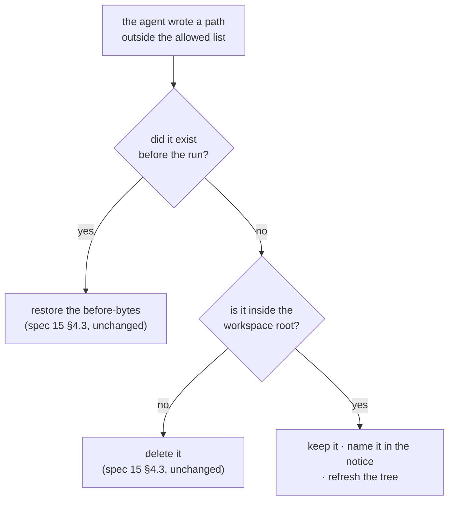

# REX 21 — the file the agent creates

**Version:** 2.2 · 2026-08-31
**Status:** **built.** All five milestones are done and driven in a live window
(§9). §12 records the three places the build departed from version 2.0, one of
which is a destructive bug it found in spec 15's put-back (§2.3). **§13 is a
second report against the shipped feature**: the rule was right and the address
was missing, so the agent created its file inside REX's own store.
**Depends on:** [`15-the-working-copy/SPEC.md`](../15-the-working-copy/SPEC.md)
§4.3 (put-back), [`02-workspace-and-graph/SPEC.md`](../02-workspace-and-graph/SPEC.md)
§4 (the tree), [`12-ask-and-act/SPEC.md`](../12-ask-and-act/SPEC.md) §2 (ASK and
ACT).

> [!note]
> **Version 2.0 threw away most of version 1.0.** 1.0 held a created file in a
> working copy with an empty original, behind Approve and Discard, restricted to
> Markdown and HTML. The reviewer's answer was simpler and better: *the agent
> writes a file, and REX shows it in the left sidebar.* §10 records what that
> removed and what it costs.

---

## 1. Why

An ACT run that creates a file has the file deleted, and the sidebar never
moves.

On 2026-08-30 a reviewer asked a run to *"write it into a new file
`EARS_example.md`, and provide a real world example for ecommerce app"*. The
agent wrote 9,511 bytes at `docs/architecture/EARS_example.md`. `putBack`
(`main/apply.ts:727`) saw a path outside the allowed list, `restoreFromBeforeSet`
(`main/work.ts:406`) found no before-bytes for it, and the restore was `rmSync`.
The reviewer got a yellow bar, an unchanged sidebar, and no file.

### 1.1 The two acts, and why one rule cannot cover both

| The agent… | Is it destructive? | Right answer |
|:--|:--|:--|
| **modifies** a file nobody commented on | yes — the reviewer's bytes are gone | put it back |
| **creates** a file that was not there | no — there were no bytes to lose | keep it, and show it |

Spec 15 §4.3's sentence is *"a file the reviewer did not comment on is not part
of this review"*. For a modification it is exactly right. For a creation it is a
category error: nobody can comment on a file that does not exist, so the rule
refuses every file it was ever going to refuse.

### 1.2 The sidebar never moved either

Independent of the delete, and it would have hidden the file even if the delete
were fixed first: `onApplyReady` (`overlay/App.tsx:1280`) calls
`refreshWorking()`, `refreshChangeBoxes()` and `docOpen`, and never
`refreshTree()`. A run cannot add a file today, so nothing has ever depended on
it. This spec makes something depend on it.

---

## 2. The rule

> **A file the agent creates inside the workspace stays where it wrote it, and
> REX shows it in the tree.** Everything else `putBack` does is unchanged.

Nothing is held, nothing is copied, nothing is staged. The file is a file, at
its real path, from the moment the agent writes it.



### 2.1 Why this is safe, stated plainly

Everything spec 15 protects is a byte the reviewer already had. A creation has
none. The three things that can go wrong, and what answers each:

| Worry | Answer |
|:--|:--|
| The agent creates a file nobody wanted | It is visible in the tree, it is untracked in git, and deleting it is one gesture. Nothing was lost to make room for it |
| The agent overwrites something by "creating" it | Then the path was in the before-set, so it is a **modification** and the first branch owns it. Unchanged |
| The reviewer created the same path mid-run | Same answer — it was in the before-set. The window between the before-set and the write is real and is §7's one accepted risk |

### 2.2 What REX does with it

Three things, and no fourth:

1. Does not delete it.
2. Names it in the notice (§4.2).
3. Refreshes the tree, so the row appears without a reload (§4.1).

It does **not** get a working copy, a document row, an `Approve` button, or a
pane split. It is a file. Opening it, commenting on it and running ACT on it all
work through the paths that already exist, because from REX's side there is
nothing special about it.

### 2.3 "Did it exist?" needs two sources, and the build found out why

**Found while building 21.2, and it is a destructive bug that predates this
spec.** The obvious test for a creation is *"the path is not in the
before-set"*. It is wrong, and wrong for the commonest kind of file there is.

The before-set (spec 15 §3.4) holds what `git status --porcelain -uall`
reported, plus the run's targets. A **tracked, clean** file is in neither list,
so it is absent from the before-set — and `restoreFromBeforeSet` reads "no bytes
to put back" as "it was never there", whose restore is `rmSync`.

So before this spec, an agent that edited a committed file outside the comment's
documents had that file **deleted**, under a notice saying REX had put it back.
The bytes survived in the stash (§4.3), and git still had the file, so nothing
was permanently lost — but nothing said so either.

The question therefore has two sources, and neither is enough alone:

| Source | Answers "it existed" for | Blind to |
|:--|:--|:--|
| the before-set | everything git reported dirty or untracked, plus the targets | tracked, clean files |
| `git ls-files --error-unmatch` | everything git tracks | everything untracked |

Together they miss exactly one case: a path that is **git-ignored** and was
already there. For that one, `keep` is still the best available answer — its old
bytes are gone from the disk either way, REX never had a copy, and `git checkout`
has nothing to restore. Deleting would lose both versions instead of one.

The decision is `classifyStray` in `main/workspace/created.ts`, kept pure and
tested on its own: it is where REX decides whether to delete one of the
reviewer's files, and a decision of that weight should be readable in one place.

---

## 3. What "inside the workspace" means

The reviewer's condition was *"if the created file is on the path of the
workspace"*. Main cannot answer that today: `applyThread` groups by **repository**
root, and the workspace root lives in the renderer.

`ThreadApplyRequest` gains it:

```ts
export interface ThreadApplyRequest {
  threadId: string;
  note: string;
  /** Spec 21 §3 — the open workspace, so a created file can be scoped to it. */
  root: string | null;
}
```

Nullable, because a document can be opened without a workspace (`rex <file>`,
spec 02 §7). Null keeps nothing: REX cannot show a file in a tree that is not on
screen, and a file it cannot draw is the silent case this spec exists to end.

There is precedent one interface above it: `GroupListRequest`'s own comment says
*"groups belong to a workspace root, so every call names one"*. The renderer
holds the root in `workspace` state and passes it to `workspaceTree` already.

The test is a path-prefix containment check against the resolved root, so a
symlink or a `..` cannot walk out of it. Three paths are still deleted:

- outside the workspace root,
- inside `workRoot()` — REX's own store, already skipped by `putBack`,
- inside a `SKIP_DIRECTORIES` name (`node_modules`, `dist`, `.git`, and the
  rest of `workspace/tree.ts:15`). The tree does not draw those, so keeping a
  file there would keep a file nobody can see — which is the bug this spec is
  fixing, in a new place.

### 3.1 No cap

Version 1.0 capped a run at 8 created files. Dropped. A cap protects a store,
and there is no store any more — the files are in the reviewer's tree, where
`git status` lists them and one `rm` removes them. A number that has to be
guessed and then explained is worse than no number.

---

## 4. What the reviewer sees

### 4.1 The tree

The new file appears as an ordinary row, at its real place, immediately —
`onApplyReady` calls `refreshTree()` (§1.2). No chip and no special styling: it
is a file in the workspace, which is what every other row is.

`scanWorkspace` needs no change. It reads the filesystem, and the file is on the
filesystem.

> [!note]
> **Green would be wrong here.** Spec 18 gives the tree's `+n` badge to a
> working copy's changed blocks. A created file has no working copy and no
> earlier version, so it has no block count — and borrowing the badge would
> claim a comparison that was never made. The row is plain, and correct.

### 4.2 The notice

The yellow bar keeps today's sentence for a put-back and gains one for a
creation. Both can appear in one run, and then both are said:

> The agent created `docs/architecture/EARS_example.md`. It is in your
> workspace now.

`ApplyReadyEvent` gains `created: string[]` beside `restored: string[]`, and
§13 adds a third, `misplaced: string[]`:

> The agent wrote `~/.rex/work/ce0de02e…/EARS_example.md` into REX's own store,
> not into your workspace. It is not in your file tree. Move it where you want
> it, or ask again and name the path.

**And the pending-apply bar stands down for a created file.** Found in the live
run: a run that only creates a file makes no working copy, so spec 15 §7.4's bar
opened underneath the notice and said *"This document was not changed. The agent
changed no files."* Both sentences were true and together they read as a
contradiction. The bar is now suppressed when `created` is non-empty, for the
same reason spec 17 §3.4 suppresses it for a stopped run: the run has already
said what happened, somewhere the reviewer is looking.

### 4.3 The put-back notice names the stash

Separate from the rest of this spec, and overdue. `work.ts:404` says *"the
message names the directory"*. The message (`overlay/App.tsx:1305`) does not,
and `restoredDir` has no caller outside `work.ts`. So the only copy of what a
put-back removed sits somewhere the reviewer is never told about — which is how
§1's report started.

The notice gains the path, and `ApplyReadyEvent` gains
`restoredDir: string | null`, set when `restored` is non-empty:

> The agent also changed `docs/README.md`. REX put it back — a change outside
> this comment's documents cannot be reviewed here. What it wrote is in
> `~/.rex/work/_restored/2ed13506…/`.

---

## 5. What the prompt says

`writePrompt` (`main/apply.ts:208`) gains a paragraph after the editable list.
**Version 2.1's wording is in §13 with the run that broke it** — it said "inside
this workspace" and named no directory, and the only directory the prompt showed
was REX's store. The paragraph is now built by `createParagraph`, and it names
both:

```text
If the reviewer asked you to create a NEW file, write it under
<workspaceRoot> — the workspace open in REX. Use the path they named,
relative to that root. It appears in their file tree when the run ends.

Never write a new file beside the working copies above. Their directory,
<workRoot()>, is REX's own store and is not the workspace: the file tree does
not draw it, and nothing you leave there ever reaches the reviewer.

Do not create files they did not ask for, and do not use a new file to work
around the list above: a file you write over the top of an existing path is put
back, whatever you called it.
```

With no workspace open the paragraph is replaced rather than dropped, because
§3's answer for that case is that nothing is kept:

```text
No workspace is open in REX, so a new file has nowhere to appear and REX will
remove it. Do not create one. Answer in the discussion instead, and say what
the file would have held.
```

The sentence about anything outside the list being put back stays. The
paragraphs are consistent — creation is the one carve-out, and it is stated as
one.

---

## 6. Extensions

**Every extension, from day one.** Version 1.0 allowed only `.md` and `.html`;
the restriction existed because REX had to hold the bytes and render an empty
original beside them. REX holds nothing now, so it has no opinion about the
format.

What follows from that, rather than from a rule:

| The agent creates | What happens |
|:--|:--|
| `.md`, `.html` | a document row in the tree. Opens, renders, takes comments |
| `.ts`, `.json`, `.png`, anything else | a plain row, like every other non-document file in the tree. `unopenableReason` says why it does not open, exactly as it does for a file that was always there |
| `.docx`, `.pptx` | a document row that **fails to open**, because an agent cannot hand-write a valid OOXML zip |

The last line is a limit of the agent, not of REX, and it is visible the moment
the reviewer clicks the row. Making it *work* means a create operation in the
DOCX and deck pipelines (spec 19 §4.2, spec 11 §7), where REX writes the bytes
from a plan. That is a separate spec and this one does not block it: the file
will land in the same place through the same rule.

---

## 7. What this gives up

**There is no Undo for a created file.** It is on disk from the moment the agent
writes it, so a reviewer who does not want it deletes it.

This is the one place where a created file is treated differently from every
other change REX makes, and it is worth being explicit rather than discovering
it later. The reasoning:

- Nothing was destroyed, so there is nothing to restore.
- It is untracked in git, so `git status` and `git clean` already see it.
- The sidebar shows it, which was the whole complaint in §1.

If that turns out to be wrong in use, the smallest answer is a **Delete** item
on the tree row's context menu, beside the exclude gesture that is already
there. Not built now — YAGNI, and a delete that REX offers is a delete REX can
get wrong.

---

## 8. What this does not do

- **Deleting a file.** An agent that deletes a file the reviewer did not comment
  on is still put back from the before-set, exactly as today.
- **Renaming or moving.** A rename reads as a delete plus a create, so the
  put-back restores the original and this spec keeps the new name. The reviewer
  ends with both files, which is visible and fixable — and is better than a
  half-done rename that looks finished.
- **Creating a working DOCX or PPTX.** §6.
- **Creating a file outside the workspace.** §3.

---

## 9. Milestones

| # | What | Status |
|:--|:--|:--|
| 21.1 | `ThreadApplyRequest.root`, threaded to `applyThread` and into `putBack` | **done** — `npm run typecheck` clean |
| 21.2 | `putBack` keeps a created path inside the workspace root | **done** — `npm run test:created` (17) and `npm run test:stray` (11) |
| 21.3 | `ApplyReadyEvent.created` and `.restoredDir`, the notices (§4.2, §4.3), the prompt paragraph (§5) | **done** — live run |
| 21.4 | `refreshTree()` in `onApplyReady` | **done** — live run |
| 21.5 | §13 — `createParagraph` names the root, and a write into the store is reported | **done** — `npm run test:stray` (15) and two live runs |

21.4 is one line and is the milestone that closes §1's report. It is last
because until 21.2 there is no file for it to draw. 21.5 is a second report
against the shipped feature, and §13 is its whole account.

### 9.1 How it was tested

**Not** against a reviewed repository — every one is read-only for an agent
working on REX, and §1's incident is the argument for not pointing a create-files feature at a
repository nobody may write to. A throwaway git repository was used instead, so
the write agent could run without any real document at risk.

Two layers, because the decision and the file operations fail differently:

| Layer | Where | What it proves |
|:--|:--|:--|
| the decision, pure | `test/created.spec.ts`, 17 tests | `classifyStray` and the containment rule, including a sibling directory sharing a name prefix and a **file** named `build` |
| the operations, real | `test/stray.spec.ts`, 11 tests | real files, a real `git init`, a real before-set. A tracked clean file survives; a dirty one comes back as the reviewer's own edit, not as HEAD; a creation survives; `~/.rex/work` is untouched |

The live run is §1's own case replayed, in a window on its own CDP port
(`PW_CDP_PORT=9444 REX_CDP_PORT=9444`, so the reviewer's instance on 9334 was
never driven). ACT was asked for *"a NEW file docs/checkout-failure.md"* and it
ended with:

- the file on disk, 963 bytes, at the path the instruction named,
- `git status` showing exactly one untracked addition, `overview.md` unchanged,
- the notice reading *"The agent created docs/checkout-failure.md. It is in your
  workspace now."*,
- the sidebar going from `["overview.md"]` to
  `["checkout-failure.md", "overview.md"]` **with nothing asking it to rescan** —
  which is 21.4, and is the half of §1's report that a fixed delete alone would
  not have fixed.

> [!note]
> **One line is covered by types and inspection rather than by the live run.**
> The renderer sends `workspaceRef.current?.root`, and the live run called
> `thread:apply` over IPC with the root passed explicitly, because ACT can only
> be pressed through the shadow-root UI. `workspaceRef` is the same ref
> `setExcluded` and `toggleShowSkipped` already read.

---

## 10. Rejected

| Idea | Why not |
|:--|:--|
| **Version 1.0's whole design** — a working copy with an empty original, behind Approve and Discard | It bought an undo for the one kind of change that destroys nothing, and paid for it with `WorkingMeta.created`, a `document` row for a path with no file at it, a capture step with its own race, a disabled `Original` pane, and a Markdown-and-HTML-only rule. §7 is the honest cost of dropping it, and it is one `rm` |
| A *"may create files"* switch on the ACT box | It asks the reviewer to decide before they can see what they are deciding about. ACT already means *this agent may write* (§11); a second permission inside the first one is a question with no new information in it |
| A staging directory the agent mirrors paths into | Relative links break. The file in §1 opens with `[Overview](overview.md)`, which is correct only where the file will live — a staged file carries a link that resolves in staging and dangles afterwards |
| A `NEW` chip on the tree row | §4.1 — the row is not special, and marking it green would borrow spec 18's badge for a comparison nobody made |
| Cap the number of created files per run | §3.1 |

---

## 11. ASK cannot do any of this

Stated because it is the first question this spec provokes, and because the
answer is a guarantee rather than a setting.

| Mode | Profile | Can it create a file? |
|:--|:--|:--|
| **ASK** | `read` | **No.** Never, under any instruction |
| **ACT** | `write` | Yes — that is what ACT means |

`profiles.ts:73` removes `Write`, `Edit` and `NotebookEdit` from the read
profile's context, and `gate.ts` enforces it at runtime on every tool call,
subagents included. Bash cannot route around it: the gate is an **allowlist** of
binaries with a decidable "this invocation writes" test, which is why `python`,
`sh`, `node` and `make` are absent from it and always will be.

So this spec widens what ACT may do, and leaves ASK exactly where it was.

---

## 12. Where the build departed from version 2.0

Three, and the first is the one that matters.

### 12.1 The put-back had a destructive bug, and this spec had to fix it

§2.3 in full. Version 2.0 assumed "not in the before-set" meant "created". It
does not: a tracked, clean file is absent from the before-set too, and the
restore for a path with no before-bytes is `rmSync`. So a run that touched a
committed file outside the comment's documents **deleted** it and reported that
it had put it back.

It was not optional to fix. This spec keys the whole keep-or-delete decision on
exactly that test, so shipping it unfixed would have turned the bug from
"deletes a committed file" into "silently keeps an unreviewed change to one",
which is worse. `git ls-files --error-unmatch` is the second source, and
`revert()` — which spec 15 §4.3 always named and the code never called — is the
restore for it.

### 12.2 `putBack` moved into `main/stray.ts`

`apply.ts` imports the Agent SDK and therefore `electron`, which a `node --test`
process cannot load — so nothing in that file can be tested without launching an
app. For the function that decides whether to delete a reviewer's file, that was
the wrong place to sit. The pure decision is `workspace/created.ts`, the file
operations are `stray.ts`, and both are tested directly.

### 12.3 The pending-apply bar had to stand down

§4.2. Only visible once a live run was watched: a created-file run makes no
working copy, so spec 15 §7.4's bar opened under the notice and said the agent
had changed no files. Not predicted by version 2.0, and not findable by any test
that did not put the two sentences on one screen.

---

## 13. The second report — "inside this workspace" named no workspace

**2026-08-31, against the shipped feature.** The reviewer asked an ACT run for
EARS examples in a new file. The agent reported that it had written one. There
was no new file in the tree and none on disk, and the run's own verdict was
*"Applied to 0 file(s)"*.

The file existed. It was 9,511 bytes at
`~/.rex/work/ce0de02e-…/EARS_example.md` — inside REX's own store, beside the
working copies. The agent said, in the same message: *"this time inside the REX
workspace, so it survives the run and lands in your file tree."*

### 13.1 Why the agent believed that

§5's paragraph said *"write it at the path they named, inside this workspace"*
and named no directory. The prompt's only absolute paths are the working copies:

```text
Files you may edit:
- /Users/…/.rex/work/ce0de02e-…/overview.new.md
  — the current version of docs/architecture/overview.md
```

So the one directory the agent could see was the store, and "this workspace"
resolved to it. The instruction was followed exactly and produced the opposite
of what it meant.

Two things made it more likely, and both are worth recording because neither is
a fault in the agent:

- **The put-back rule is stated in the same prompt**, and stated first: anything
  written outside the list is put back. A model reading both sentences looks for
  the safe place, and the only place the prompt has ever pointed at is the store.
- **The transcript carried yesterday's belief back in.** The same thread's
  earlier run wrote *"the only file REX gave me is `overview.new.md` — anything
  written elsewhere gets reverted"*. That was TRUE before this spec — it is §1's
  bug, described by the agent that suffered it — and the prompt gave the next run
  nothing to correct it with.

### 13.2 The store is skipped, and skipping was silent

`putBack` has always begun with *"never REX's own store"* (`stray.ts:69`), for a
good reason that has not changed: `base` lives in that directory and is the only
copy of the reviewer's original bytes, and a "restore" of a path with no
before-bytes is `rmSync` (§2.3).

But `continue` is not only *do not touch* — it was also *do not mention*. So the
file was not put back, not kept, not deleted, and not named. Every channel REX
has for telling the reviewer what a run did stayed quiet, which is the exact
failure §1 exists to end, one directory to the left.

### 13.3 What changed

Two changes, one for the cause and one for the silence.

| # | Change | Where |
|:--|:--|:--|
| 1 | The prompt names the workspace root and the store, as absolute paths | `createParagraph`, `main/apply.ts` |
| 2 | A write into the store is reported as `misplaced` — still never touched | `putBack` → `StrayFiles.misplaced` → `ApplyReadyEvent` → the notice |

`writePrompt` gains `workspaceRoot`, which `startApply` already held for
`putBack` and had never printed. §5 has the wording.

### 13.4 Why REX does not move it

Moving the file into the workspace is the obvious repair and it is the wrong
one. REX would have to guess the path the reviewer meant, and a guess that
writes into their tree can overwrite a file nobody named — the one act this
whole spec is built to avoid (§1.1). Deleting it is worse: the bytes in the
store are the only copy.

So the third act is neither. REX says where the file is, in full, and the
reviewer moves it or asks again. That is the same answer §4.3 gives for the
put-back stash, and for the same reason.

### 13.5 The pending-apply bar stands down for this too

§4.2's rule, extended one case. A run that wrote only into the store changes no
working copy, so the bar would open under the notice and say *"The agent changed
no files"* — true, and the least useful of the two sentences on screen.

### 13.6 How it was tested

Not against a reviewed repository (§9.1). The same throwaway git repository, an isolated
database and store (`REX_DB_PATH`, `REX_WORK_PATH`), on its own CDP port
(`REX_CDP_PORT=9455`), so the reviewer's instance on 9334 was never driven.

| Layer | What it proves |
|:--|:--|
| `test/stray.spec.ts`, 15 tests (4 new) | a store write is reported and left on disk; REX writes nothing into the workspace for it; the allowed working copy is **not** reported, so the notice cannot fire on every run; a `base` overwrite is reported too |
| live run A, prompt as shipped here | ACT asked for a new file → `docs/ears-examples.md` on disk at the named path, `created` naming it, `misplaced` empty, `overview.md` byte-identical, the store holding only its own three files |
| live run A′ | the same run instructed to write *at an absolute path inside the store* — the agent **refused**, and said why: *"that directory isn't drawn in your file tree, and anything left in it is discarded"* |
| live run B | the create paragraph removed for one run, so the agent obeyed the same instruction. `misplaced` carried the absolute path, `NOTES.md` survived in the store, `overview.original.md` was untouched, and the notice read *"The agent wrote … into REX's own store, not into your workspace. It is not in your file tree."* |

Run A′ is the interesting one. The fix works well enough that the failure it
guards against could not be reproduced through the agent while the fix was in
place — which is why run B removed the paragraph rather than accepting an
untested notice.
