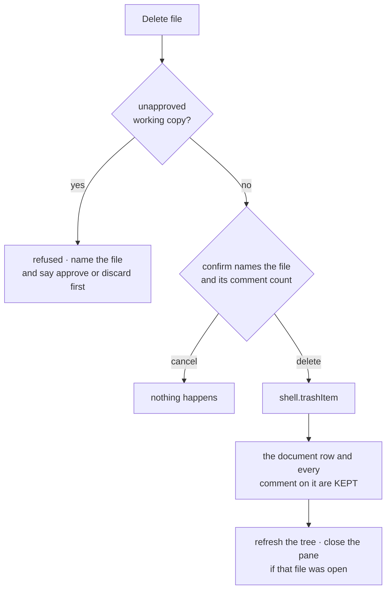

# REX 23 — renaming and deleting a file

**Version:** 1.1 · 2026-08-31
**Status:** **built, and driven in a live window.** All four milestones are done
(§9), 20 tests pass under `node --test`, and §11 records the four places the
build departed from version 1.0.
**Depends on:** [`02-workspace-and-graph/SPEC.md`](../02-workspace-and-graph/SPEC.md)
§4 (the tree), [`10-figure-preview-and-exclusions/SPEC.md`](../10-figure-preview-and-exclusions/SPEC.md)
§3 (the tree's menu, and exclusions), [`15-the-working-copy/SPEC.md`](../15-the-working-copy/SPEC.md)
§3 (the working copy) and §7 (approve and discard),
[`21-the-file-the-agent-creates/SPEC.md`](../21-the-file-the-agent-creates/SPEC.md)
§3 (what "inside the workspace" means).

> [!important]
> **This spec moves REX's oldest boundary.** Until now REX wrote into the folder
> under review through exactly one door: Apply, behind a diff the reviewer
> accepted (spec 01 §8.7). A comment in `db/schema.sql` says so out loud — *"REX
> writes files there only through Apply's diff gate"*. This spec opens a second
> door, and the whole of §2 is about why that door is a different kind of door:
> the agent is not holding it. The reviewer is.

---

## 1. Why

The tree lists every file in the workspace and cannot change one of them.

The reviewer's words, 2026-08-31: *"I should be able to rename and delete files
in the left sidebar. When I right-click on the file, it should not show only
copy path and select file but also delete file and rename file."*

### 1.1 What the menu has today

`Explorer.tsx:430`, four items, none of which touch the disk:

| Item | Acts on | Writes |
|:--|:--|:--|
| Copy path | the clipboard | nothing |
| Select file | REX's selection panel | nothing |
| Exclude / include from review | the `workspace_rule` table | the database |

So a reviewer who wants a file gone leaves REX, finds it in Finder or a
terminal, deletes it there, comes back and presses `reload`. Every one of those
steps is REX's own information — it drew the tree, it knows the absolute path,
and it is the only thing on screen that knows the file has eleven comments on
it.

### 1.2 The real cost is not the trip to Finder

It is that **the database does not follow**. A file renamed outside REX takes
every comment on it with it: `document` is keyed by path (`kind`, `value` —
`db/schema.sql`), so `docs/api.md` renamed to `docs/API.md` becomes a document
row nothing points at, plus a new row with no comments the first time it is
opened. The comments are not deleted. They are worse than deleted — they are in
the database, invisible, attached to a name that no longer exists.

That is the argument for putting the rename **inside** REX rather than
documenting a workaround: the file act and the database act have to be one act,
and REX is the only thing that can make them one.

---

## 2. The rule

> **The tree's menu can rename any file or folder in the workspace, and can
> move any file to the system Bin. REX does the same act to its own record of
> that path in the same transaction, so every comment written on a file
> survives its rename.**
>
> Apply is untouched. The agent gains nothing: no new tool, no new path, no new
> permission. This is a gesture the reviewer makes, one file at a time, with
> their hand on the mouse.

### 2.1 Why this is not Apply, stated plainly

Apply's gate exists because **an agent proposes a change the reviewer has not
seen**. Every part of it — the diff, the accept step, the working copy, the
put-back — is machinery for reviewing somebody else's intention.

None of that applies here. There is no proposal, no author to check, and nothing
to read: the reviewer picked the row, typed the name, and pressed the item. A
diff of "this file no longer exists" adds nothing a confirm does not.

| Worry | Answer |
|:--|:--|
| REX can now delete the reviewer's files | It moves one to the **Bin**, after a confirm that names it. Put-back is the Finder gesture everybody already has (§3) |
| The agent could reach this | It cannot. The channel is IPC from the overlay, and the overlay is REX's own React. Document content is served over `rex-doc://` into a frame with scripting off, and the Agent SDK has no IPC surface at all |
| A rename could strand comments | It is the one thing this spec exists to prevent. §4.1 lists the five records that move, and the rename fails as a whole if any of them cannot |
| A mis-click destroys work | The one destructive case — a file with an unapproved working copy — is refused outright, not confirmed (§3.1) |

### 2.2 The renderer names, main decides

Invariant I2 unchanged: the renderer sends a path and a name, and main does
every check and every write. The request shape is the one spec 10 already uses
for exclusions — `{ root, path }` plus what is being asked — because the tree
already sends the root it is drawing and main already refuses to trust it.

Main's checks, in order, for both acts:

1. `root` is a workspace root main has scanned in this session. A root that was
   never on screen is not a root the reviewer is looking at.
2. `isInsideWorkspace(root, path)` (`workspace/created.ts:45`) — resolved paths,
   never a string prefix, so a symlink or a `../..` is not "inside".
3. No path segment is in `SKIP_DIRECTORIES` (`created.ts:20`). `.git` is in that
   list, and a rename inside `.git` is a corrupted repository.
4. The path exists, and is the kind the act needs — a file for delete, either
   for rename.

A failed check returns a sentence, and the tree draws it in the notice bar. It
never throws into the renderer's error path: "you cannot delete that" is an
answer, not a fault.

---

## 3. Delete — to the Bin, and the comments stay

`shell.trashItem(path)` — Electron 43, macOS Bin, and the reviewer's own
`Put Back` is the undo. REX never calls `unlink`.



### 3.1 What is refused

| Case | Why |
|:--|:--|
| a **folder** | Not offered at all — see §8. One click cannot be allowed to take a `docs/` tree |
| a file with an **unapproved working copy** (spec 15 §3) | The `.new` bytes are the agent's work, they are not in the file, and the Bin would not hold them. Approve or discard first — the notice says which file |
| anything failing a §2.2 check | As §2.2 |

The working-copy check is `readMetaByPath` (`work.ts:132`), which is already how
the two panes find a document's copy.

### 3.2 The comments are kept, and why

The `document` row stays. Every `thread`, `thread_target` and `message` on it
stays. Nothing cascades.

This is deliberate, and it is the opposite of tidy:

- The file is in the Bin, not gone. Put it back and REX still holds all eleven
  comments, still keyed to that path, still opening as they always did. A
  cascade delete would make "Put Back" restore bytes and lose the review.
- A comment is the reviewer's work, and REX has no Bin for one. Spec 14's
  `Delete all comments` is the only thing in REX that destroys comments, it says
  `This cannot be undone`, and deleting a file is not the reviewer asking for
  that.

The cost is a document row nothing lists, and the comment count in the sidebar
still counting it. §7 records that.

The confirm names the count for exactly this reason:

```text
Move "components.md" to the Bin?
Its 11 comments are kept — put the file back and they return.
```

---

## 4. Rename — the file, and everything keyed by its path

One name, not a path: the row's own basename, changed in place. Moving a file to
another folder is §8.

### 4.1 The five records that move

All of it in one SQLite transaction, after the disk rename has succeeded. A
rename that half-lands is the bug this spec is about.

| # | Record | What moves |
|:--|:--|:--|
| 1 | the file | `renameSync(old, new)` — the disk act, first, because the database must never describe a rename that did not happen |
| 2 | `document.value` | the exact path, for a file. Every `thread`, `thread_target` and `message` follows for free — they key on `document.id`, which does not change |
| 3 | `workspace_rule.path` | so an exclusion the reviewer wrote is still about the same file (`db/schema.sql`, `PRIMARY KEY (root, path)`) |
| 4 | `meta.path` in `~/.rex/work/<documentId>/meta.json` | so an unapproved working copy approves onto the **new** path. The directory is keyed by document id and does not move |
| 5 | the tree, and the open pane | §5.4 |

For a **folder**, 2, 3 and 4 are a prefix update: every row whose path is under
`old/` becomes `new/` + the rest. Nothing else differs, which is why folders are
in for rename and out for delete — a prefix update is not a recursive delete.

### 4.2 What is refused

| Case | Why |
|:--|:--|
| a name holding `/`, `\`, or a null byte | A rename is not a move (§8) |
| `.`, `..`, or an empty name | Not names |
| a name already taken **by a different file** | The disk would silently replace it. `renameSync` overwrites, and this is the one check standing between a typo and a lost file |
| a name whose `document` row already exists | The `UNIQUE (kind, value)` on `document` would reject the update — but the file would already be renamed. So it is checked **before** the disk act, and the sentence says why: *"REX still holds 4 comments written on a file called that. Choose another name, or delete those comments first."* |
| anything failing a §2.2 check | As §2.2 |

**A case-only rename is allowed, and needs the exists check to be exact.**
macOS is case-insensitive by default, so `existsSync("foo.md")` is true when
`Foo.md` is what is there — a naive check refuses `README.md` → `Readme.md`,
which is a rename people really make. The check therefore compares the target's
inode with the source's (`statSync(...).ino`): the same file is not "already
taken". `renameSync` performs the case change itself — verified on this
machine's APFS volume, 2026-08-31.

### 4.3 Changing the extension is allowed

`notes.md` → `notes.txt` is a rename REX has no business refusing. What it costs
is that REX may no longer be able to open the file (`isDocumentPath`,
`render/formats.ts:47`), and the row becomes a greyed `other` row in the tree —
which is exactly what the tree already does for a file it cannot render, and it
says why in the tooltip. If that file was the open document, the pane closes
with a notice rather than failing to re-render (§5.4).

The comments are still kept. Rename it back and they are still there.

---

## 5. What the reviewer sees

### 5.1 The menu

Two new items in `Explorer.tsx`, below `Select file`, above the exclusion rule:

```text
Copy path
Select file
────────────
Rename…            ⏎ on the row
Move to Bin        files only, drawn in the danger colour
────────────
Exclude from review
```

`Rename…` carries the ellipsis because it opens a box rather than acting.
`Move to Bin` is the macOS wording — "Delete" reads as permanent, and this is
not. It uses `rex-menu-danger`, the class spec 14 added for `Delete all
comments` (`overlay.css:579`), so the one item in the menu that removes
something looks like it.

### 5.2 The rename box

Inline, in the row, over the name. It is `NameBox` (`overlay/NameBox.tsx`) with
one change: **the selection covers the name without its extension**, the way
every file manager does it, so typing replaces `components` and leaves `.md`.
Enter renames, Escape cancels and writes nothing, blur saves what is there —
spec 14 §3.3's rules, unchanged, because renaming is one act and REX should not
have two boxes that nearly agree.

`window.prompt` is not an option and not a preference: Electron does not
implement it.

### 5.3 The confirm

`window.confirm`, as spec 14's `Delete all comments` does
(`SidebarTabs.tsx:102`). The text is §3.2's. No confirm for a rename — it is
reversible by renaming back, and a dialog on every rename is the kind of
friction that gets a feature turned off.

### 5.4 After the act

| The act | The tree | The open pane |
|:--|:--|:--|
| rename, any row | re-scanned (`refreshTree`, `App.tsx:1084`) | if the renamed file **was** open: reopened at the new path (`reopenDocument`, `App.tsx:1191`), so the path bar says the new name. If REX can no longer open it (§4.3): closed, with a notice |
| rename of a folder holding the open file | re-scanned | reopened at the new path |
| delete | re-scanned | if that file was open: closed, with the notice from §3.2 |
| either | the reference graph is dropped (`setGraph(null)`), exactly as `setExcluded` (`App.tsx:1110`) does | — |

The tree is **re-scanned, never patched**, for spec 10 §3.4's reason: what a
path ends up as is main's answer to give, and a renderer that predicted it would
be right until the first time it was not.

---

## 6. Where the code goes

| File | Change |
|:--|:--|
| `src/main/workspace/files.ts` | **new.** The guards, the disk act, the database update. Testable under `node --test`: it imports `node:fs`, and `electron`'s `shell` is injected by the caller, so the tests run against a fake Bin |
| `src/shared/paths.ts` | **new.** `movedPath` — where a path lands when it, or a folder above it, is renamed. Shared because main moves the rows and the renderer has to know whether the open document was one of them |
| `src/main/ipc.ts` | two handlers beside `workspaceExclude`, and `workspaceTree` records the root it scanned |
| `src/shared/channels.ts` | `workspace:rename`, `workspace:delete`, their request types, `WorkspaceFileResult`, two `RexApi` methods |
| `src/preload/index.ts` | two lines, beside `workspaceExclude` |
| `src/main/work.ts` | `moveWorkingCopies(from, to)` — `meta.path` **and** the files named after it |
| `src/main/db/queries.ts` | `documentsUnder`, `moveDocumentPaths`, `moveWorkspaceRulePaths` — all three prefix-aware, all three used by §4.1 |
| `src/renderer/overlay/Explorer.tsx` | the two menu items, the inline box, the confirm |
| `src/renderer/overlay/NameBox.tsx` | a `selection` prop, so a file's box opens on the stem (§5.2) |
| `src/renderer/overlay/App.tsx` | `afterFileAct`, two callbacks, wired into `<Explorer>` |
| `test/workspaceFiles.spec.ts` | **new.** §9's milestone 0 — 20 tests |

---

## 7. What this gives up

| Given up | Why it is acceptable |
|:--|:--|
| A deleted file's comments are listed by a sidebar that cannot open them | The alternative is destroying them. A row that opens nothing is recoverable; a deleted comment is not. §8 records the tidy-up that would fix it |
| The Bin is macOS's, so REX cannot undo the delete itself | `Put Back` is one gesture in the Finder and it is the gesture people already know. An in-app undo would mean a second store of files REX cannot show |
| A rename is not a `git mv` | git detects a rename by content similarity at commit time, so `git status` shows it either way. Running git for this would put REX's file acts on a repository's index, which is a much larger claim than the reviewer made |
| Two files renamed at once is two acts | The tree has no multi-select. Adding one for this is a bigger feature than this one |

---

## 8. What this does not do

| Not doing | Why |
|:--|:--|
| **Delete a folder** | One click, a whole tree, and the comments on every file in it. If it is wanted it gets its own decision, with its own confirm naming the file count |
| **Move a file** (drag, or a path in the box) | The box takes a name. Drag-and-drop in the tree is a different feature with its own drop targets, and a path in a rename box is a trap: `../x.md` reads as a rename and acts as a move |
| **New file / new folder** | Nothing asked for it. The agent creates files (spec 21), and the reviewer has a terminal |
| **Tidy up a deleted file's comments** | §7's first row. A `Delete the N comments too` checkbox in the confirm is the obvious answer and it is deliberately not in 1.0 — it destroys comments, and that deserves its own look |
| **Rename from anywhere but the tree** | The path bar and the comment list both name documents. Neither is a file manager |

---

## 9. Milestones

Numbered on from spec 22's, which ended at 3.

| # | Ends in | Acceptance | Status |
|:--|:--|:--|:--|
| **0** | `workspace/files.ts` with its guards, and `test/workspaceFiles.spec.ts` green | Every §2.2 and §4.2 refusal is a test. A rename outside the root, into `.git`, onto an existing name, and with a `/` in it are all refused **and the file is untouched** | **done** — 20 tests |
| **1** | Rename works end to end | Rename a document with comments on it in a live window; reopen it; the comments are still there and still resolve. The `document` table shows the new path and no orphan row | **done** |
| **2** | Delete works end to end | `Move to Bin` on a commented file: the file is in the Bin, the tree has lost the row, the comments are still held | **done** |
| **3** | The refusals are visible | A file with an unapproved working copy refuses to delete and names itself. A rename onto a name REX already holds comments for refuses and says so | **done** |

### 9.1 How each was checked

Milestone 0 is `npm run test:workspace-files` — a temporary workspace, a real
in-memory database on the repo's own `schema.sql`, and a fake Bin that records
rather than deletes. 20 tests, all passing.

Milestones 1–3 were driven in a live window on 2026-08-31, per
`rules/06-testing.md`. Port 9334 was answering **without** the `pw-agent`
marker — the reviewer's own REX — so the run used an isolated second instance:
`REX_DB_PATH`, `REX_WORK_PATH` and `REX_CDP_PORT=9444` on a scratch workspace,
driven by a hand-written CDP client because the Playwright MCP is pinned to
9334. The workspace held three Markdown files and a database seeded with two
comments on `docs/guide.md`.

What the run showed, in order:

1. The menu on a document: `Copy path · Select file │ Rename… · Move to Bin │
   Exclude from review`. On a folder: no `Move to Bin`, and no `Select file`.
2. The rename box opened on `guide.md` with characters 0–5 selected — the stem,
   not the suffix (§5.2).
3. `guide.md` → `handbook.md`: the file moved on disk, the `document` row moved
   with it, and both comments stayed on it. Opening it drew the document and
   resolved both anchors in the right places.
4. `handbook.md` → `manual.md` **while it was open**: the path bar followed to
   `docs / manual.md` and the document stayed on screen (§5.4).
5. `Move to Bin` on `manual.md` with a working copy seeded: refused, with §3.1's
   sentence, and the Bin was never asked.
6. The copy discarded, `Move to Bin` again: the confirm read *"Move "manual.md"
   to the Bin? Its 2 comments are kept — put the file back and they return."*,
   the file arrived in `~/.Trash`, the tree lost the row, the pane closed with
   §3.2's notice, and both comments were still in the panel and still in the
   database.
7. `notes.md` → `manual.md`, the name the deleted file's comments still hold:
   refused with §4.2's sentence, and `notes.md` was not renamed.

`window.confirm` is a native modal in Electron — while it is up every
`Runtime.evaluate` hangs and CDP cannot dismiss it — so the confirm was stubbed,
and the stub recorded the sentence it was asked. That sentence is the one under
test, so nothing was lost by it.

`Put Back` in the Finder is the one step that cannot be driven. The file's
arrival in `~/.Trash` was checked instead, which is what makes Put Back
available.

---

## 10. Rejected

| Rejected | Why |
|:--|:--|
| **Permanent delete (`unlink`)** | Faster to write, unrecoverable to use. A review tool that can silently destroy a document under review has no business being one |
| **A working copy for the delete, held behind Approve** | Spec 15's machinery is for reviewing an *agent's* change. Making the reviewer approve their own deletion is ceremony, and it would leave the file half-deleted until they did |
| **Cascade-delete the comments with the file** | §3.2. It makes `Put Back` restore the bytes and lose the review |
| **Do the rename in the renderer over `rex-doc://`** | It is a write, and the renderer holds no such power by invariant I2. There is nothing to discuss |
| **`git mv` when the file is tracked** | §7. REX would be writing to the index, which no one asked for, and the result in `git status` is the same |
| **A modal dialog for the rename** | The tree row is where the name is. A modal takes the name away from the file it belongs to and adds a second place to press Escape |
| **Refuse a rename that changes the extension** | §4.3. It is a real thing people do, and the tree already knows how to draw a file REX cannot open |

---

## 11. Where the build departed from version 1.0

### 11.1 The confirm text is the renderer's, not main's

1.0 put the §3.2 sentence in `workspace/files.ts`, so the count and the wording
would be tested where the rule lives. That cannot be: the renderer would have to
import from `main/`, which invariant I2 forbids outright.

So the sentence is built in `Explorer.tsx`, beside the item that was pressed —
which is where spec 14 already builds `Delete all comments`'s confirm
(`SidebarTabs.tsx:102`). One house pattern instead of two, at the cost of the
sentence being checked by eye in the live run rather than by a unit test.

### 11.2 A working-copy refusal arrives after the confirm

The reviewer confirms the Bin, and only then is told the file has a new version
waiting (§3.1). It reads back-to-front, and it is deliberate: the rule belongs to
main, and a renderer that greyed the item out would be a second copy of the rule,
right until the two disagreed.

The cost is one wasted confirm on a file with unapproved work. The sentence says
exactly what to do about it, and nothing happened in the meantime.

### 11.3 `movedPath` became a shared module

1.0's file map put the prefix arithmetic in main. Both processes need it —
main moves the rows, the renderer decides whether the open document was one of
them — so it is `src/shared/paths.ts`, with no `node:path` import, because the
renderer has no Node built-ins. `shared/targets.ts` already reasons about paths
the same way.

### 11.4 A rename that half-lands is undone

1.0 said the file and its records "land together or not at all" and did not say
how. The build does the disk act first and puts the file **back** if the rows
cannot be moved, because a database that describes a rename which did not happen
is worse than one that has not caught up. If the rename-back also fails — a
filesystem that has gone away underneath — the reviewer is told the old name and
asked to do it by hand, which is the only honest answer left.
