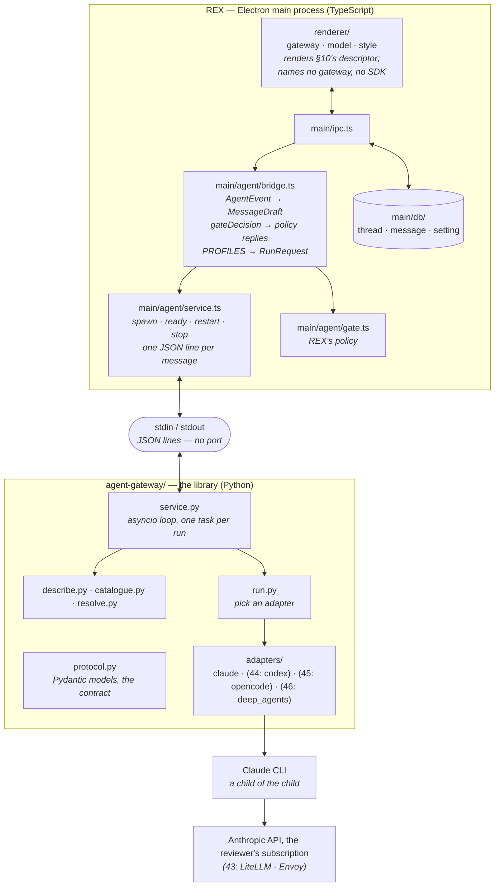

# REX 42 — the agent library

**Version:** 3.0 · 2026-09-04
**Status:** **built, and driven in a live window.** All three milestones are in
the tree. `npm run test:library` is green — 44 TypeScript tests across
`test/service.spec.ts`, `test/bridge.spec.ts` and `test/protocol.spec.ts`, and
135 `pytest` tests in `agent-gateway/` — every one of the 41 `*.spec.ts` files
passes, `npm run typecheck` passes, and `nvim-tools --json --all` adds no
finding (`ruff` and `basedpyright` now run, on §12's two marker files, and are
clean). Driven on 2026-09-04 against an isolated database: one ASK answered
through the pipe at $0.1377, one reply that **resumed** the same session with no
replay, a gate refusal recorded as `denied` beside a plain `Bash` call recorded
as neither, a hand-killed child restarted once and serving again in 275 ms, an
`lsof` on the child showing no socket at all, and a scratch `uv` project calling
`run()` directly (criterion 17). §17 records what the build changed. **Not yet
driven live: ACT, DOCX and PPTX** — all three are `write`-profile runs, and they
are the remainder of milestone 1's acceptance.
**Depends on:** [`01-initial/SPEC.md`](../01-initial/SPEC.md) §3 (the main-process
boundary — **this spec keeps I1–I3 and changes §1.2 and §12**), §8 (one thread,
one agent, one session), §8.4 (the gate), §8.5 (session replay), §11 (the Vex
adapter); [`12-ask-and-act/SPEC.md`](../12-ask-and-act/SPEC.md) §6 (the safety
gate); [`13-debugging/SPEC.md`](../13-debugging/SPEC.md) §4 (the debug report);
[`17-stopping-a-run/SPEC.md`](../17-stopping-a-run/SPEC.md) §2 (cancellation);
[`25-choosing-the-model/SPEC.md`](../25-choosing-the-model/SPEC.md) (the model
probe); [`31-how-the-agent-writes/SPEC.md`](../31-how-the-agent-writes/SPEC.md)
(output styles); [`38-the-trace-block/SPEC.md`](../38-the-trace-block/SPEC.md)
(what the transcript draws).
**Extended by:** [`43-the-local-gateway/SPEC.md`](../43-the-local-gateway/SPEC.md)
(gateways with a URL), [`44-the-codex-agent/SPEC.md`](../44-the-codex-agent/SPEC.md),
[`45-the-opencode-agent/SPEC.md`](../45-the-opencode-agent/SPEC.md),
[`46-the-deep-agent/SPEC.md`](../46-the-deep-agent/SPEC.md) (one adapter each).

> [!note]
> **The question this answers.** The reviewer, 2026-09-03:
>
> > Is this part about handling AI gateways going to be separated, so I can reuse
> > it in another project where I will need to use also Claude Agent SDK, Codex,
> > OpenCode and make them talk to AI gateways? […] I don't want this code to be
> > tightly coupled with our REX project.
>
> And on 2026-09-04, the language:
>
> > I'm thinking if it would be beneficial to switch to Python for the whole
> > agentic work for the REX. […] all these libraries, in my opinion, are better
> > in Python, including deep agents and the boundary. The separation would be
> > way much stronger than having it only as a library within the same
> > TypeScript. […] my other projects would be in Python.
>
> Then, after the trade-off was laid out: **"ok, let's go with python"**; an own
> HTTP client for OpenCode's server is fine; packaging can wait.
>
> **So the library is a Python package, and it runs as one child process of
> REX's main process.** Main talks to it over the child's own stdin and stdout,
> one JSON object per line. No NATS, no HTTP, no listening port — invariant I3
> holds, because a pipe is not a port. It is the same shape REX already has:
> the Claude CLI under today's SDK is a child that speaks JSON over pipes.
>
> **What changed in 3.0.** Version 2.0 was a sealed TypeScript directory,
> `src/agent-gateway/`. The reviewer chose Python on 2026-09-04, so the
> directory becomes a package, `agent-gateway/`, and the seam becomes a
> process. Everything else — `AgentEvent`, `ToolPolicy`, the session shape, the
> descriptor, the four rules — survives with the same names, now as Pydantic
> models with generated TypeScript mirrors. This spec **changes spec 01 §1.2's
> "TypeScript only" and §12's "Bundled Python runtime" rows**, on that decision,
> and §1.1 says why the reasons that produced them no longer apply.

---

## 1. Why

REX has one agent implementation, and it is welded to one SDK in one language.
`src/main/agent/runner.ts` imports `query` from `@anthropic-ai/claude-agent-sdk`,
`capabilities.ts` asks that SDK what models and styles exist, `gate.ts` builds
that SDK's `PreToolUse` hook, `transcript.ts` reads that SDK's session cache,
and `profiles.ts` names that SDK's tools.

Four SDKs and two gateways are coming, and the reviewer's other projects are
Python:

| Coming | Spec | Python package | The reviewer's samples |
|:--|:--|:--|:--|
| LiteLLM and Envoy as gateways for Claude | 43 | — | `ai-gateway/` |
| Codex SDK | 44 | `openai-codex` 0.147.0, official | `vibe-coding-course/03_Codex_SDK/python/` |
| OpenCode | 45 | none usable; an own HTTP client (§1.2) | `vibe-coding-course/50_opencode_sdk/python/` — itself an own client |
| Deep Agents (LangChain) | 46 | `deepagents` 0.7.13, the original | `ai-agents-course/…/3_deepagents/`, all Python |
| Claude Agent SDK | this spec | `claude-agent-sdk` 0.2.152, official | Vex's adapter, 1,317 lines of it |

Three things follow, and they are the reviewer's reasons in order:

1. **Reuse.** A Python package is what his other projects can `uv add`. A
   TypeScript directory is not.
2. **The libraries.** LangChain and Deep Agents are Python first; the npm port
   is a separate, younger codebase. Vex's Claude adapter is Python and comes
   back with its lessons instead of being ported a second time.
3. **The boundary.** A biome rule and a test keep a TypeScript directory sealed.
   A process in another language cannot import REX at all.

**The line: the library knows about SDKs and gateways, and nothing about
documents, comments, threads or databases.** It now also knows nothing about
Electron, because it cannot.

### 1.1 What spec 01 §12 rejected, and why that does not apply here

Spec 01 §12 rejected "NATS or any message broker", "HTTP server, SSE, any
listening port" and "Bundled Python runtime", each with the reason "one
producer, one consumer — IPC is enough" or "TypeScript only". The first two
rejections stand. Only the third moves, and it moves because the reason was a
consequence of Vex's shape, not of Python.

Vex's Python backend is a FastAPI server on port 8420, fed by a `nats-server`
on ports 4222 and 4223, with a Chrome extension as a third client. §15.1 lists
what Vex's own specs record about that: fatal port clashes, two health-poll
chains at startup, events lost on reconnect, a subject nobody subscribes to,
untyped dicts on one side and `Promise<any>` on the other. **Every one of those
is a broker or a port problem.** None is a Python problem, and none survives a
child on a pipe.

So this spec keeps I3 to the letter — no server, no broker, no port — and
drops one row of §12. The rule files that repeat "TypeScript only"
(`.claude/rules/10-tech-stack.md`, `.claude/CLAUDE.md`) are repository
configuration and are updated in milestone 0, not here.

### 1.2 OpenCode, without a wrapper

PyPI's `opencode-ai` is a stale alpha. OpenCode's server is plain HTTP and
SSE, and the reviewer's own course drives it with a hand-written `httpx`
client rather than a package. The reviewer, 2026-09-04: "having our own Python
client for this OpenCode HTTP server is fine with me. I don't need to have
some wrapper library just to communicate via HTTP." Spec 45 writes that
client; it is about 300 lines for what REX needs.

---

## 2. The architecture



Read it as five rules:

1. **REX imports no agent SDK and makes no model call.** After this spec,
   `grep -rn "claude-agent-sdk" src/ package.json` finds nothing. Main's whole
   agent code is a pipe client and a mapping.
2. **The library imports nothing of REX, and cannot.** It has no database, no
   window, no logger of REX's, and no way to reach one.
3. **`service.ts` and `bridge.ts` are the only files that know the protocol.**
   `service.ts` moves bytes and processes; `bridge.ts` moves meaning. Together
   they are REX's whole agent-independent abstraction, and they are small.
4. **The UI names no gateway and no SDK.** The descriptor (§10) comes over the
   pipe, and spec 43's sheet and spec 44's agent control render it.
5. **A pipe is not a port.** The child is spawned by main, reads only its own
   stdin, and nothing else on the machine can reach it. I3 holds.

### 2.1 What crosses the boundary

| Direction | What | §4.2 message |
|:--|:--|:--|
| REX → library | the descriptor request | `describe` |
| REX → library | a `ResolvedRoute`, a prompt, a session, a working directory, the host's instructions | `run` |
| REX → library | the policy's answer to one tool call | `policy_reply` |
| REX → library | stop this run | `stop` |
| library → REX | one tool call to judge | `policy` |
| library → REX | `AgentEvent`s as they happen, and one `RunResult` at the end | `event`, `result` |

Nothing else. No SDK type, no database handle, no React element, no file path
REX did not supply — and, new in 3.0, nothing that is not JSON.

---

## 3. The package

### 3.1 Where it lives

```text
agent-gateway/                  a sibling of src/, not inside it
  pyproject.toml                name "agent-gateway", module agent_gateway, Python >=3.12
  uv.lock
  .python-version               3.12
  ruff.toml                     the marker nvim-tools gates ruff on
  pyrightconfig.json            the marker it gates basedpyright on
  README.md                     how another project uses it (§3.3)

  src/agent_gateway/
    __init__.py                 the public surface, re-exported
    __main__.py                 `python -m agent_gateway` — the service entry
    protocol.py                 §4.2 — every message, as Pydantic models; the contract
    service.py                  §4 — the asyncio loop: read lines, dispatch, write lines
    types.py                    §5 — AgentSdk, GatewayKind, AgentAuth, GatewayRoute,
                                AgentGateway, ResolvedRoute, AgentSession, ModelChoice,
                                RouteCapabilities
    events.py                   §7 — AgentEvent, RunResult
    policy.py                   §8 — CommonTool, ToolCall, the policy round trip
    describe.py                 §10 — list_sdks(), list_kinds(), build_routes(), validate_gateway()
    catalogue.py                §10 — the kinds and their route templates
    resolve.py                  §5.3 — resolve_route(), validate_base_url()
    run.py                      §6 — pick an adapter, run it, stream its events

    adapters/
      base.py                   AgentAdapter, RunInput
      claude/
        adapter.py              §9 — ClaudeSDKClient behind the interface
        events.py               SDK messages → AgentEvent
        tools.py                Claude tool names ↔ CommonTool
        errors.py               classify_error(), the three phrase patterns
        models.py               name_models() and the capability probe
        sessions.py             the ~/.claude/projects lookup behind session_exists()

  tests/
    test_protocol.py            every message round-trips; the schema is stable
    test_service.py             the loop, driven through a pipe pair: ready, run, stop, crash
    test_catalogue.py           every kind fills every route from its fields
    test_policy.py              every Claude tool name maps; unknown names stay None
    test_events.py              SDK fixtures → AgentEvent
    test_boundary.py            no import of anything outside the package's declared deps
```

`protocol.py` is the contract and `service.py` is the loop. `types.py`,
`events.py` and `policy.py` are declarations, `catalogue.py` and `describe.py`
are tables, `resolve.py` is pure functions, and `adapters/claude/` carries every
line that is genuinely hard — which is where `runner.ts` and Vex's
`claude_code_sdk.py` already put it.

The tooling is `uv` and nothing else: `uv sync` makes `.venv`, `uv run pytest`
runs the tests, `uv add` adds a dependency. `pip` is never called directly —
Vex's rule, kept for the same reason: package managers are not
interchangeable.

### 3.2 What it must never import, and never own

- nothing of REX — it cannot, and `test_boundary.py` asserts the declared
  dependencies are the only imports;
- no HTTP server framework, no NATS client, no socket listener;
- no database. Everything stateful stays with the host: no session store, no
  gateway store, no cache that outlives a run.

Two things look like state and are not: an SDK's own cache (Claude's transcript
files; in spec 45 an OpenCode server's data directory), which the library reads
the way the SDK does; and the running OpenCode server process of spec 45, which
is OpenCode's process and not REX's data.

It may spawn processes, read the environment it is handed, and read files an
SDK keeps, because that is what running an agent SDK is.

### 3.3 Reuse in another project

The package is usable the day milestone 0 lands, with no publishing:

```bash
uv add --editable ~/Projects/Github/lukaskellerstein/rex/agent-gateway
```

and later, when it has its own repository, `uv add agent-gateway @ git+…`. A
consumer that is itself Python calls `run()` directly and never starts the
service; the pipe protocol is for a host in another language, which is what
REX is. `README.md` in the package shows both.

### 3.4 The boundary is a process

The seal is not a lint rule any more. The library runs in its own interpreter,
started by main, and the only bytes that cross are §4.2's messages. What that
buys, beyond the reviewer's reuse: a crash in an SDK cannot take the window
down, a leaked file handle cannot reach SQLite, and a slow import cannot block
the renderer. What it costs is §4 — a protocol, a lifecycle, and generated
types — and §12's second toolchain.

---

## 4. The transport

One child, one pipe each way, one JSON object per line. Main spawns
`python -m agent_gateway` once, at app start, and keeps it for the app's
lifetime. Every message is a UTF-8 line ending in `\n`; a message never
contains a raw newline.

**File descriptor 1 is the protocol, and nothing else may write to it.** At
startup `service.py` duplicates fd 1 for its own writer and rebinds
`sys.stdout` to `sys.stderr`, so a stray `print()` in an SDK or a LangChain
deprecation notice lands in `rex.log` and never in the stream — the same
trick every MCP stdio server plays. Every process the library spawns itself
(spec 45's `opencode serve`) is given pipes that the launcher drains into
`stderr`; the CLIs the SDKs spawn read their own pipes and never see fd 1. A
line on fd 1 that is not valid JSON is therefore a bug in the service, and it
kills the child with the offending line in `rex.log` (§4.1).

Why this and not Vex's shape:

| | Vex | REX |
|:--|:--|:--|
| commands | HTTP REST to uvicorn on 8420 | a line on stdin |
| events | NATS on 4222 and 4223, `nats-server` vendored per platform | a line on stdout |
| clients | Electron main **and** a Chrome extension | main only |
| health | HTTP poll, 30 × 500 ms | one `ready` line |
| port clash | fatal, with `lsof` instructions | no port |
| reconnect | events lost, full re-fetch | no connection to lose |
| contract | prose in `contracts/*.md`, `dict`s and `any` | Pydantic models, generated TypeScript, a drift test |

Vex needed a broker because three processes shared events. REX has one
producer and one consumer, which is spec 01's reason for I3, and a pipe is
what that reason recommends.

### 4.1 Lifecycle, in `service.ts`

1. **Locate the interpreter.** In development, `agent-gateway/.venv/bin/python`;
   if it is missing, refuse with one sentence — "Run `uv sync` in
   `agent-gateway/`" — before any window opens an agent control. In a packaged
   app, `Resources/python/bin/python` (§14, later). Never `python` from `PATH`:
   a Mac app started from the Dock has a stunted `PATH`, which is why Vex
   carries `system-path.ts`.
2. **Spawn** with `stdio: ["pipe", "pipe", "pipe"]`, `cwd` the package root,
   and an environment that is `process.env` plus `PYTHONUNBUFFERED=1`. Nothing
   else is added: routing and credentials travel in `run` messages, per run,
   never in the child's own environment (§5.3).
3. **Wait for `ready`** — the child's first line, carrying its version and
   `sys.version`. Twenty seconds, then a named failure. This is the health
   check, and it is the only one.
4. **Route lines.** `stdout` is the protocol; every line is parsed and
   dispatched by `type`. `stderr` is not the protocol; every line goes to
   `rex.log` as `agent-service`, so a Python traceback is where every other
   error already is.
5. **Restart on exit.** If the child exits without a `shutdown` having been
   sent, every open run receives one `error` event — "The agent service exited
   (code N)" — and ends with `stopped: false`; then the child is respawned. At
   most three restarts in one minute; the fourth failure stays down and the
   agent controls say so. Vex has `restartProcess` and nothing calls it; here
   the call site is the point.
6. **Stop on quit.** Send `shutdown`, wait five seconds for the child to end
   its runs and exit, then `SIGTERM`, then `SIGKILL`. `before-quit` waits for
   this, as Vex's does.

Concurrency is the child's: one `asyncio` loop, one task per run, and REX's
five-agent cap is enforced where it is today, in `runs.ts`. A run's messages
all carry its `run_id`, so nothing in the child is global.

### 4.2 The messages

All in `protocol.py`, all Pydantic, all with a literal `type` field. Requests
carry an `id` that the reply echoes; run-scoped messages carry `run_id`.

Main → service:

| `type` | Fields | Answer |
|:--|:--|:--|
| `describe` | `id` | `reply` with `sdks`, `kinds` (§10) |
| `capabilities` | `id`, `route`, `cwd` | `reply` with `RouteCapabilities` (§9.4) |
| `session_exists` | `id`, `route`, `cwd`, `session_id` | `reply` with `exists` |
| `run` | `run_id`, and every field of `RunRequest` (§6) | `event`s, then one `result` |
| `stop` | `run_id` | the run ends with a `stopped` event and a `result` |
| `policy_reply` | `id`, `reason: string \| null` | — (answers a `policy`) |
| `shutdown` | — | the child exits 0 after its runs end |

Service → main:

| `type` | Fields | Meaning |
|:--|:--|:--|
| `ready` | `version`, `python` | the loop is up; sent once, first |
| `reply` | `id`, `ok`, `value` or `error` | answers `describe`, `capabilities`, `session_exists` |
| `event` | `run_id`, `event: AgentEvent` | one thing happened in a run (§7) |
| `result` | `run_id`, `result: RunResult` | the run is over; nothing more for this `run_id` |
| `policy` | `id`, `run_id`, `call: ToolCall` | judge this tool call before it runs (§8) |
| `log` | `level`, `text` | a line for `rex.log`; never a credential |

A `run` has no `reply`: its acknowledgement is its first `event`, and its
completion is its `result`. Two runs interleave freely; `run_id` is what keeps
them apart, on both sides.

### 4.3 One contract, generated once

The models in `protocol.py` are the source of truth. A script exports their
JSON Schema and generates `src/shared/agent-protocol.ts`, which is committed:

```bash
uv run python -m agent_gateway.protocol --schema > agent-gateway/schema.json
npx json-schema-to-typescript agent-gateway/schema.json > src/shared/agent-protocol.ts
```

`test/protocol.spec.ts` regenerates into a temporary file and fails if it
differs from the committed one, so a model edited on one side cannot be missed
on the other.

**On the wire and in the generated types, every field is camelCase.** The
models set `alias_generator=to_camel` with `populate_by_name=True`, serialise
`by_alias=True`, and export the schema by alias — so `run_id` in Python is
`runId` on the pipe and in TypeScript, with no hand-written mapping anywhere.
Vex's `models/batch.py` does exactly this. The tables in §4.2 and the code in
§5 to §7 name the Python fields; read them with that rule. This is the direct answer to Vex's drift: its contract was prose,
its Python side published `dict`s, its TypeScript side typed them `any`, and one
subject was published for two years to nobody.

`json-schema-to-typescript` is a dev dependency outside spec 01 §3.2's list;
`CLAUDE.md` makes it a confirmation before it is installed.

### 4.4 What is never on the pipe

A credential value crosses exactly once, inside a `run` message's
`route.token`, going down. It is never in a `log`, never echoed in a `reply`,
never in an `event`. `service.ts` logs protocol traffic only at debug level
and redacts `token` before it does; `service.py` does the same for its own
tracing. Spec 43 §6.1 is where tokens come from.

---

## 5. The vocabulary

### 5.1 The four SDKs and the four kinds

```python
AgentSdk = Literal["claude-agent", "codex", "opencode", "deep-agents"]
GatewayKind = Literal["original", "litellm", "envoy", "custom"]
AgentAuth = Literal["inherit", "none", "environment"]
```

**All four SDK names exist from this spec on**, so that specs 44 to 46 add an
adapter and change no type. `list_sdks()` (§10) returns only the SDKs that have
an adapter, which after this spec is one. A `run` naming an SDK with no adapter
gets a `result` with `error: "No adapter for 'codex'"` before anything spawns.

`GatewayKind` likewise carries every kind, and `catalogue.py` holds one entry —
`original` — until spec 43 fills in the rest. The three auth values:

| `AgentAuth` | Meaning |
|:--|:--|
| `inherit` | give no gateway credential; the SDK uses its normal login — `claude login`, the reviewer's subscription |
| `none` | a local endpoint that checks nothing; the adapter configures the SDK not to demand a login |
| `environment` | `credential_env` names a variable; **the host** resolves it into `token` immediately before a run |

### 5.2 A gateway is a named set of routes

```python
class GatewayRoute(BaseModel):
    base_url: str | None          # None for the SDK's own official endpoint
    auth: AgentAuth
    credential_env: str | None
    models: list[str]             # empty means "ask the SDK" (§9.4)

class AgentGateway(BaseModel):
    id: str
    name: str
    kind: GatewayKind
    routes: dict[AgentSdk, GatewayRoute]
```

A gateway holds one route **per SDK**, because the base URL is a function of
the gateway *and* the SDK: each SDK speaks a different wire protocol, and a
gateway serves each protocol at a different path. Spec 43 §3 is the
measurement. A gateway with no route for an SDK does not offer that SDK.

The library defines the shape and never stores one. Where a gateway row lives
is the host's business, and spec 43 §2 is REX's answer. The TypeScript mirrors
of these models are the generated ones of §4.3, in camelCase (`baseUrl`,
`credentialEnv`), which the generator produces from Pydantic aliases.

### 5.3 A `ResolvedRoute` is what a run is given

```python
class ResolvedRoute(BaseModel):
    sdk: AgentSdk
    gateway_name: str
    base_url: str | None
    auth: AgentAuth
    token: str | None             # the credential VALUE — §4.4

def resolve_route(gateway: AgentGateway, sdk: AgentSdk, env: Mapping[str, str]) -> ResolvedRoute: ...
def validate_base_url(url: str) -> str: ...
```

`resolve_route` exists on both sides: in Python for a Python consumer, and in
`bridge.ts` for REX, because it is main that holds `process.env` and main that
must never send an unresolved name and hope. Both refuse, by name, a route
whose `credential_env` is unset or empty, and a route whose SDK has no adapter.
Both take the environment as an argument rather than reading the process's,
so a test can hand them a fake.

`validate_base_url` accepts an absolute `http:` or `https:` URL, trims
whitespace and one trailing slash, and **appends no path**. It refuses a
username, password, query or fragment. Spec 43 §3.1 has the rest, because in
this spec every route's `base_url` is null.

### 5.4 The `Original` gateway

`ORIGINAL_GATEWAY` is the one `original`-kind gateway: a route for every SDK,
**no `base_url` on any of them**, `auth: inherit`. It is what REX does today,
and with this spec built it is the only gateway REX has. Spec 43 makes it a
database row that cannot be edited or deleted.

### 5.5 The session is a shape, not a nullable string

`runner.ts` today carries `sessionId: string` **and** `resume: boolean`, and its
callers use four combinations:

| Caller | Today | Means |
|:--|:--|:--|
| `threadAsk` | `sessionIdFor(threadId)`, `resume: false` | seed a new session with a deterministic id |
| `threadReply`, session alive | stored id, `resume: true` | continue it |
| `threadReply`, SDK cache gone | fresh `uuidv4()`, `resume: false` | a new session, seeded with `replayPrompt` |
| `apply`, `docx`, `pptx` | `sessionIdFor(runKey)`, `resume: false` | a one-shot run whose id is never stored |

A single nullable id cannot tell the first from the second and has no shape
for the third, so the input carries a discriminated union:

```python
class SeedSession(BaseModel):   mode: Literal["seed"]; id: str      # start, and use this id
class ResumeSession(BaseModel): mode: Literal["resume"]; id: str    # continue this one
class NewSession(BaseModel):    mode: Literal["new"]                # start, and let the SDK name it
AgentSession = SeedSession | ResumeSession | NewSession
```

An adapter that cannot accept a supplied id maps `seed` to `new` and returns
the id the SDK chose. Claude accepts one — `ClaudeAgentOptions.session_id`,
which Vex already used — so `sessionIdFor` keeps working and every existing
caller keeps its deterministic id.

---

## 6. `run` — the one door

```python
class RunRequest(BaseModel):
    run_id: str
    route: ResolvedRoute
    cwd: str
    prompt: str
    session: AgentSession
    model: str | None
    style: str | None
    system_prompt: str            # the host's instructions; how an adapter installs them is its own business (§9.1)
    disallowed: list[CommonTool]  # tools the model must not see, in the common vocabulary (§8)
    plugins: list[str]            # absolute plugin directories, opaque; refused where supports_plugins is false
    max_turns: int | None         # a runaway guard, not a budget; None is the SDK's own default

class RunResult(BaseModel):
    session_id: str
    cost_usd: float | None
    duration_ms: int | None
    denials: list[Denial]
    error: str | None
    stopped: bool
```

`run.py` looks at `route.sdk`, picks the adapter, and hands the request over
with two callbacks: `emit(event)` and `ask_policy(call) -> str | None`. It
adds nothing of its own. Three inputs are named for what they mean rather than
for what one SDK calls them, and that is the whole difference between this and
`runner.ts`:

- **`system_prompt` is text.** REX passes `READ_SYSTEM_PROMPT` or
  `WRITE_SYSTEM_PROMPT` exactly as today, and the Claude adapter appends it to
  the `claude_code` preset exactly as today (§9.1).
- **`disallowed` is a list of common tools.** REX's read profile passes
  `["write", "edit"]`; the Claude adapter turns that into
  `disallowed_tools=["Write", "NotebookEdit", "Edit"]`, which is the list
  `profiles.ts` carries today, so nothing the model sees changes.
- **`plugins` are paths.** `pluginsForRepository()` stays in REX and resolves
  the marketplace refs; what crosses is the list of directories it produced.
  The Claude adapter wraps each as `{"type": "local", "path": path}`.

### 6.1 The adapter interface

```python
class AgentAdapter(Protocol):
    sdk: AgentSdk
    def validate(self, route: ResolvedRoute) -> str | None: ...
    async def run(self, request: RunRequest, emit: Emit, ask_policy: AskPolicy, stop: asyncio.Event) -> RunResult: ...
    async def capabilities(self, route: ResolvedRoute, cwd: str) -> RouteCapabilities: ...
    async def session_exists(self, route: ResolvedRoute, cwd: str, session_id: str) -> bool: ...
```

`stop` is an `asyncio.Event` the service sets when a `stop` message arrives
for that `run_id`; each adapter turns it into its SDK's own cancellation.
`run.py` holds one map from `AgentSdk` to adapter. Adding an adapter is one
entry in that map and one directory under `adapters/`, and specs 44 to 46 each
say so.

---

## 7. `AgentEvent` — the general message

The single most important decision here. The library emits its own union;
`bridge.ts` maps it to `MessageDraft`.

```python
class Started(BaseModel):    type: Literal["started"]; session_id: str; model: str | None; style: str | None
class Text(BaseModel):       type: Literal["text"]; text: str
class Thinking(BaseModel):   type: Literal["thinking"]; text: str
class ToolCall(BaseModel):   type: Literal["tool_call"]; id: str; name: str; common: CommonTool | None; input: Any
class ToolResult(BaseModel): type: Literal["tool_result"]; id: str; name: str | None; text: str; is_error: bool; denied: bool
class Diff(BaseModel):       type: Literal["diff"]; path: str; before: str | None; after: str
class Wrote(BaseModel):      type: Literal["wrote"]; path: str
class Denied(BaseModel):     type: Literal["denied"]; name: str; reason: str; subagent_id: str | None = None
class Error(BaseModel):      type: Literal["error"]; text: str
class Stopped(BaseModel):    type: Literal["stopped"]
class Completed(BaseModel):  type: Literal["completed"]; cost_usd: float | None; duration_ms: int | None
                             input_tokens: int | None; output_tokens: int | None
AgentEvent = Annotated[Started | Text | … | Completed, Field(discriminator="type")]
```

Five properties matter, and each is a rule the adapters must keep:

1. **No SDK type appears in it.** A caller cannot tell Claude from Codex by the
   shape of an event — only by the `sdk` it asked for.
2. **`cost_usd: None` means "not reported", never zero.** A host draws None as
   unknown; it never draws `$0.00` for a run whose SDK said nothing.
3. **`tool_call` carries both names** — the SDK's own (`Bash`, and later
   `command_execution` or `bash`) and the common one (`shell`), so a host can
   display the real name and decide on the mapped one.
4. **`tool_result.denied` is set by the library**, because only the library
   can: the policy ran before the tool, so every refusal is already known when
   its result arrives, and the SDK hands the reason back verbatim. That is
   `runner.ts`'s `deniedBy()`, moved with its `SDK_REFUSAL` pattern.
5. **Unknown SDK events are dropped, not guessed.** An adapter never invents a
   `text`.

`started` carries what the SDK **resolved** — the model and style it will
actually use — so the host can log a disagreement with what it asked for.
Today that line is written by `runner.ts` straight into `log.ts`; the library
has no logger of REX's, so it says it as an event and `bridge.ts` writes the
line.

REX's mapping is mechanical: `text` → an assistant `text` row, `diff` → the
`diff` row `diffStep()` draws today, `denied` → the `Denial` list, `completed`
→ the `completed` row with its tokens. Every REX-specific decision — which
kinds are replay noise, what the foot says, how a diff is drawn — stays in REX.

---

## 8. The policy — the gate stays with the host, across the pipe

`gateDecision()` (`src/main/agent/gate.ts:891`) matches `Write`, `Edit`,
`NotebookEdit`, `Bash` and `mcp__*`, reads `toolInput.command`, and carries a
shell-stage parser that took a spec of its own to get right. It stays exactly
where it is, in TypeScript. The library never decides; it asks.

```python
CommonTool = Literal["read", "list", "search", "fetch", "write", "edit", "shell", "mcp", "task"]

class ToolCall(BaseModel):
    name: str                     # as the SDK gave it — Bash, bash, command_execution
    common: CommonTool | None     # mapped, or None when the library cannot
    input: Any
    subagent_id: str | None = None
```

The round trip: the adapter maps the SDK's tool name (§8.1), the service sends
`policy { id, run_id, call }`, `bridge.ts` answers `policy_reply { id, reason }`
from `policyFor(profile, sdk)`, and the adapter turns the answer into its SDK's
own veto — for Claude, the `PreToolUse` hook's deny. A local pipe answers in
well under a millisecond; the SDK's hook was already an `async` callback, so
nothing about the SDK's timing changes.

**If main does not answer, the call is denied.** A `policy` that gets no
`policy_reply` within thirty seconds is a bug in main, and a bug in main must
never become a write. The denial names the timeout so the bug is visible.

### 8.1 The Claude mapping

The library owns the **mapping** — it is SDK knowledge. `adapters/claude/tools.py`:

| Claude tool | `CommonTool` |
|:--|:--|
| `Read` | `read` |
| `LS`, `Glob` | `list` |
| `Grep` | `search` |
| `WebFetch`, `WebSearch` | `fetch` |
| `Write`, `NotebookEdit` | `write` |
| `Edit` | `edit` |
| `Bash` | `shell` |
| `mcp__*` | `mcp` |
| `Task`, `Agent` | `task` |
| anything else | `None` |

The same table runs backwards for `disallowed` (§6): `write` becomes `Write`
and `NotebookEdit`, `edit` becomes `Edit`.

> [!warning]
> **`common: None` means the library could not map the name.** What a host does
> with it is the host's decision, and REX makes two different ones on purpose:
>
> - **For Claude, REX's policy keeps today's decision exactly.** `gateDecision()`
>   already reasons in Claude's own names and already allows `TodoWrite`,
>   `Skill`, `AskUserQuestion` and every other name it does not list, because
>   the SDK's `disallowed_tools` and the write-tool denials are the whole read
>   guarantee. Denying unmapped names here would change behaviour, and this
>   spec changes none.
> - **For every later SDK, REX's policy denies `None`.** Specs 44 to 46 each
>   bring a closed mapping, and an unmapped name is a visible refusal with a
>   name in it, not a silent hole. The fall-through direction is the whole
>   difference between a gate and a decoration.
>
> `test_policy.py` asserts the library's half: a new tool name arrives as `None`
> and is never guessed into a `CommonTool`.

REX's side is a short function in `bridge.ts`:

```ts
function policyFor(profile: Profile, sdk: AgentSdk): (call: ToolCall) => string | null {
  return (call) => {
    if (sdk !== "claude-agent" && call.common === null) {
      return `REX does not know the ${sdk} tool '${call.name}', so it is not allowed.`;
    }
    return profile === "write"
      ? writeGateDecision(call.name)
      : gateDecision(call.name, call.input);
  };
}
```

`gate.ts` is untouched, and `test/gate.spec.ts` is untouched. What leaves it
is only `buildHooks()` — the SDK-shaped wrapper — which becomes the Claude
adapter's business in Python, because a hook is how *Claude* asks a policy.

---

## 9. The Claude adapter

`adapters/claude/adapter.py` is a port **back** into Python: Vex's
`claude_code_sdk.py` supplies the SDK mechanics, and `runner.ts` supplies the
rules REX added on top of it. Neither is copied whole.

| From Vex (`claude_code_sdk.py`) | Kept |
|:--|:--|
| `ClaudeSDKClient` + `ClaudeAgentOptions`, one client per run | yes |
| `receive_response()` loop with per-block dispatch (`:479`) | yes |
| `HookMatcher(matcher=".*", hooks=[…])` for `PreToolUse` (`:1275`) | yes — the hook body asks the policy instead of returning `_ALLOW` |
| `session_id=` to seed, `resume=` to continue (`:393-394`) | yes — driven by §5.5 |
| `interrupt()` to stop (`:296`) | yes |
| `_emit_diff_step`, `_emit_write_step`, `_classify_error` | yes, as `events.py` and `errors.py` |
| `from claude_agent_sdk._internal.sessions import …` (`:1115`) | **no** — a private import; `sessions.py` computes the path as `transcript.ts` does |
| `nats_service.publish`, `AgentFileLogger`, `_inject_playwright_auth`, the `SubagentStart`/`PostToolUse` hooks that write Vex's tables | **no** — spec 01 §11's drop list, still |

| From REX (`runner.ts`) | Kept |
|:--|:--|
| the four session shapes, `sessionIdFor` | yes — §5.5 |
| `hintFor()`'s three phrase patterns: `EXECUTABLE_FAILURE`, `MODEL_NEEDS_NEWER_CLI`, `SDK_REFUSAL` | yes, verbatim, in `errors.py` |
| `deniedBy()` — the gate's refusal told apart from a tool's failure | yes — §7 rule 4 |
| `WRITE_TOOLS` → `wrote` for `Write`, `Edit`, `NotebookEdit` | yes |
| the `stopped`-versus-`answered` race at the end of a run | yes |
| the init log line: resolved model, style, tools, plugins | yes, as the `started` event |

### 9.1 What the adapter decides by itself

| Choice | Value | Why it is the adapter's |
|:--|:--|:--|
| `system_prompt` | `{"type": "preset", "preset": "claude_code", "append": request.system_prompt}` | the preset is what makes the SDK behave as Claude Code; a host writes the append |
| `setting_sources` | `["project"]` | the repository's own `.claude/` is part of what "run in this directory" means |
| the child environment | **nothing passed** for a route with no URL | today's behaviour exactly — the CLI inherits the service's environment and uses `claude login`. Spec 43 §6 is where an `env=` is built |
| the output style | `settings=json.dumps({"outputStyle": style})` when a style is chosen | the Python SDK has no `output_style` option; `settings` is the CLI's `--settings`, which takes a JSON string — **verified in milestone 1** |
| stop | `interrupt()`, then `disconnect()` | `ClaudeSDKClient` always runs in the streaming mode `interrupt()` needs; REX's `AbortController` was the workaround for the TS `query()` form |

One thing the Python SDK does differently from the TypeScript one, and it
simplifies spec 43: `ClaudeAgentOptions.env` is documented as "merged on top of
the inherited process environment". The TypeScript `Options.env` replaced it,
which is why spec 43 §6.2 carried a warning. Milestone 1 tests the merge with a
canary variable and records it.

### 9.2 Errors

`classify_error()` and `hint_for()` carry the three phrase patterns, translated
line for line. The rule they implement does not change: the SDK's original
text always survives, and REX may put one sentence in front of it, never in its
place. A Python traceback from the adapter itself goes to `stderr` and so to
`rex.log`; the `error` event carries its last line.

### 9.3 The session lookup

`transcript.ts` today does two unrelated jobs, and the seam splits them:

| Function | Knows about | Goes to |
|:--|:--|:--|
| `configDir`, `projectDirName`, `sessionFilePath`, `sessionRecord`, `sessionExists` | where the Claude CLI keeps its transcripts | `adapters/claude/sessions.py`, behind `session_exists` |
| `renderTranscript`, `eventsSinceLastAnswer`, `replayPrompt` | REX's `Message` rows | stay in `src/main/agent/transcript.ts` |

The first half reads `~/.claude/projects/<cwd-hash>/<session>.jsonl`, which is
an SDK's own cache and exactly the kind of file §3.2 allows.

### 9.4 Capabilities

```python
class ModelChoice(BaseModel):       value: str; display_name: str; description: str
class RouteCapabilities(BaseModel):
    models: list[ModelChoice]; styles: list[str]
    supports_styles: bool; supports_plugins: bool; supports_cost: bool
    supports_ask: bool; supports_act: bool; supports_resume: bool
    error: str | None
```

`capabilities.ts`'s probe — a client that completes the CLI handshake and sends
the model nothing — becomes `connect()` with no prompt, `get_server_info()`,
`disconnect()`, in `adapters/claude/models.py`, with `name_models()` and its
"named apart" rule translated whole. For a route with no URL it answers as
today: the account's own model list, the CLI's style list, and every
`supports_*` flag true.

Which fields `get_server_info()` returns — whether it carries the same
`models` and `available_output_styles` the TypeScript `initializationResult()`
does — is milestone 1's first measurement. If it does not, the probe reads the
`init` `SystemMessage` of a `receive_messages()` stream instead, which Vex's
`_log_agent_init` already parses.

The library **performs** the probe. `bridge.ts` **caches** it, because a cache
is state and §3.2 says the library holds none: today's module-level promise in
`capabilities.ts` becomes a map keyed by `(sdk, gatewayId)` — a shape spec 43
§8 needs and this spec merely prepares.

`supports_plugins` is new, and it exists for §6: REX passes plugin paths only
to an adapter that advertises them. A non-empty list sent to an adapter that
does not is refused, never silently dropped — the same rule spec 43 §4.4 states
for styles.

---

## 10. The descriptor — the UI renders itself

The reviewer's requirement is that the UI config for gateway and model is
handed to the library. The library cannot ship React, so the split is:

> **The library describes the configuration. The host renders it.**

```python
class SdkDescriptor(BaseModel):  id: AgentSdk; label: str; supports_styles: bool
class ConfigField(BaseModel):    key: str; label: str; kind: Literal["url", "text", "textarea", "select", "env-var"]
                                 required: bool; placeholder: str | None = None; help: str | None = None
                                 options: list[Option] | None = None
class KindDescriptor(BaseModel): id: GatewayKind; label: str; fields: list[ConfigField]
                                 routes: dict[AgentSdk, RouteNote]     # protocol, note
                                 unverified: str | None = None          # set until measured against a live server

def list_sdks() -> list[SdkDescriptor]: ...
def list_kinds() -> list[KindDescriptor]: ...
def build_routes(kind: GatewayKind, values: dict[str, str]) -> dict[AgentSdk, GatewayRoute]: ...
def validate_gateway(kind: GatewayKind, values: dict[str, str]) -> list[FieldError]: ...
```

Over the pipe, `describe` returns `list_sdks()` and `list_kinds()` in one
reply. `build_routes()` and `validate_gateway()` are template substitution over
the catalogue, so the catalogue is also exported as data — `catalogue.json`,
committed beside `schema.json` and covered by the same drift test — and
`bridge.ts` carries a forty-line `buildRoutes()` and `validateGateway()` over
that data, so the sheet previews a route without a round trip.
`test/protocol.spec.ts` feeds both sides the same fixtures and fails if they
disagree. After this spec `list_kinds()` returns `original` alone and
`list_sdks()` returns Claude alone. Nothing renders them yet.

> [!warning]
> **The descriptor is data, and it is rendered as UI.** Every string in it comes
> from the library's own source, never from a gateway, a model, or a config
> file the host did not write. A descriptor field is never built from a server
> response, because a label that a remote server can set is a remote server
> writing REX's interface.

---

## 11. How REX consumes it

```text
src/main/agent/
├── service.ts      NEW — §4.1: spawn, ready, restart, shutdown; send(); one listener per run_id
├── bridge.ts       NEW — runAgent(): today's input → RunRequest; AgentEvent → MessageDraft;
│                   policyFor(); resolveRoute(); the capability cache; listCapabilities()
├── gate.ts         unchanged — gateDecision(), writeGateDecision(), mcpAllowed(),
│                   allowGenerationTools(); buildHooks() leaves
├── prompts.ts      unchanged — READ and WRITE system prompts, passed in as text
├── profiles.ts     unchanged — PROFILES (its disallowedTools become CommonTool[]),
│                   sessionIdFor, resolvePluginRefs, pluginsForRepository
├── transcript.ts   renderTranscript, eventsSinceLastAnswer, replayPrompt; the file lookup leaves
└── runs.ts         unchanged — the cancellation registry; stopRun() now also sends `stop`

src/shared/
└── agent-protocol.ts   GENERATED — §4.3; never edited by hand
```

`runner.ts` and `capabilities.ts` are deleted; their contents live in
`agent-gateway/src/agent_gateway/adapters/claude/`.

`bridge.ts` exports `runAgent(input)` with **today's** `AgentRunInput` shape —
`cwd`, `profile`, `prompt`, `sessionId`, `resume`, `model`, `style`,
`systemPrompt?`, `documentPath?`, `onMessage`, `signal?`, `onWrote?` — so that
`ipc.ts`, `apply.ts`, `docx/run.ts` and `pptx/run.ts` change **one import path
and nothing else**. Inside, it:

1. builds the `RunRequest` — `ORIGINAL_GATEWAY` resolved for `claude-agent`,
   the profile's prompt, `disallowed` and `maxTurns`, the plugin paths, and
   `session` from `sessionId` + `resume`;
2. registers `policyFor(profile, sdk)` as the answerer for this `run_id`, and
   `signal` as the sender of `stop`;
3. sends `run`, and maps every `event` onto the `MessageDraft` `onMessage`
   expects, calls `onWrote` for every `wrote`, writes the `started` line to
   `log.ts`, and resolves on `result`.

Spec 43 then widens `runAgent`'s input to carry a route, which is the one
change it needs to make here.

---

## 12. Development and tooling

- **Python 3.12**, pinned in `agent-gateway/.python-version`. The machine has
  3.14.5 on `PATH` and `uv` 0.11.15; 3.14 is too new for some wheels, and `uv`
  installs 3.12 itself.
- **`uv sync` once**, in `agent-gateway/`. `npm run dev` spawns `.venv/bin/python`
  and refuses with the `uv sync` sentence if it is missing (§4.1).
- **Two test runners, one command each.** `uv run pytest` in the package;
  `node --test` for `test/service.spec.ts` (the TypeScript client, driven
  against a fake child written in a few lines of Node), `test/bridge.spec.ts`
  (event mapping against recorded fixtures) and `test/protocol.spec.ts` (the
  drift guard). `package.json` gains `test:library`, which runs all three and
  `uv run pytest`.
- **`nvim-tools`** runs `ruff` and `basedpyright` on the package as soon as
  `ruff.toml` and `pyrightconfig.json` exist — the same gate it applies to
  `biome.jsonc`. Both files come from `mac-setup`'s templates, as Vex's did;
  on a machine without `mac-setup`, copy Vex's own two files from its root.
- **`.gitignore`** gains `agent-gateway/.venv/`, `__pycache__/` and
  `agent-gateway/schema.json`'s sibling build output, if any. `schema.json`,
  `catalogue.json` and the generated `agent-protocol.ts` are **committed**,
  because the drift test compares against them.
- **Debugging.** The child's `stderr` is in `rex.log` under `agent-service`.
  The app-wide debug report (spec 13 §4) gains a block: interpreter path,
  package version, pid, uptime, restarts this session, open runs.

---

## 13. Acceptance criteria

1. `agent-gateway/` imports nothing of REX and nothing outside its declared
   dependencies; `test_boundary.py` fails if that changes. It contains no HTTP
   server, no NATS client and no socket listener.
2. REX imports no agent SDK. `grep -rn "claude-agent-sdk" src/ package.json`
   finds nothing, and `package.json`'s dependencies lose it.
3. Nothing in REX listens. `lsof -p <electron pid> -i` and the same for the
   child show no listening socket that was not there before this spec.
4. The contract is one file: `src/shared/agent-protocol.ts` is generated from
   `protocol.py`, and `test/protocol.spec.ts` fails when they differ.
5. REX's gate is asked over the pipe and stays in `src/main/agent/gate.ts`;
   `test/gate.spec.ts` is unchanged.
6. An unmapped Claude tool name reaches the policy with `common: None`, and
   `test_policy.py` asserts it is never guessed into a `CommonTool`.
7. REX's Claude policy allows exactly what `gateDecision()` allows today, and
   denies exactly what it denies today — including every name it does not list.
8. A `policy` that main does not answer within thirty seconds is denied, and
   the denial says so.
9. `disallowed: ["write", "edit"]` produces `disallowed_tools=["Write",
   "NotebookEdit", "Edit"]`, and the read profile's context is unchanged.
10. Every `MessageDraft` REX stores for a run is byte-for-byte what it stored
    before this spec, for the same SDK stream — proved with recorded fixtures
    replayed through a fake child.
11. `cost_usd` is None when the SDK reported no cost, and nothing substitutes
    zero.
12. The child is spawned once, answers `ready` within twenty seconds, is
    restarted on an unexpected exit with every open run ending in one `error`
    event, and is stopped on quit within five seconds.
13. Two runs interleaved on one pipe cannot exchange events, policy answers or
    results.
14. No credential value appears in `rex.log`, a `log` message, a `reply`, or a
    debug report — the child's `stderr` included.
15. The library holds no session, gateway or cache that outlives a run; the
    capability cache is in `bridge.ts`.
16. Every existing REX agent, model, run, prompt, gate, stop, debug, DOCX and
    PPTX test is unchanged and green.
17. Another project can `uv add --editable` the package and run one turn on
    the reviewer's subscription by calling `run()` directly, with no service
    and no pipe.
18. With this spec built, a reviewer can tell no difference: same composer,
    same models, same styles, same subscription, same transcript.

---

## 14. Deliberately out of scope

- **Any gateway with a URL.** The child environment, the three model slots,
  the session-per-gateway rule and the message evidence are spec 43.
- **Any adapter but Claude.** Codex, OpenCode and Deep Agents are specs 44, 45
  and 46, one each.
- **Any change on screen.** No new control, no new sheet, no new foot line.
- **Bundling a Python runtime into a packaged app.** REX is not packaged today.
  When it is, Vex's `electron-app/scripts/bundle-python.mjs` is the model:
  `uv python install`, copy the standalone runtime into `extraResources`,
  `uv pip install` the package into it, spawn `Resources/python/bin/python`.
  About 200 lines, macOS arm64, and it worked; it was the broker that did not.
- Publishing to PyPI. `uv add --editable` and a git dependency are enough
  until a third project exists.
- A broker, an HTTP server, a socket, or a second client of the service.
- Owning sessions, storage, or any UI.

---

## 15. Evidence

### 15.1 Vex, read 2026-09-04

What Vex's design is, from its code:

| Fact | Where |
|:--|:--|
| commands: HTTP REST to uvicorn on 8420; events: NATS on 4222 (TCP) and 4223 (WebSocket) | `electron-app/src/main/index.ts:74,499-514`; `agent-orchestrator/…/services/nats_service.py:17-23` |
| a third client, the Chrome extension, on the same NATS and HTTP | `chrome-extension/src/shared/messages.ts:104-105` |
| `nats-server` vendored per platform, ~15 MB each, in git | `electron-app/bin/`; `.claude/CLAUDE.md` calls it "permanent cost" |
| Python spawned as `python -m uvicorn agent_orchestrator.main:app --port 8420`; `.venv/bin/python` in dev, `Resources/python/bin/python` packaged | `electron-app/src/main/process-manager.ts:293-335` |
| health: 30 × 500 ms HTTP polls after 10 × 500 ms NATS polls | `process-manager.ts:19-20,206-230,337-367` |
| a busy port is fatal, with `lsof` instructions | `process-manager.ts:249-255,278-286` |
| `restartProcess` exists; nothing calls it | `process-manager.ts:49-72,381-391` |
| the contract is prose; Python publishes `dict`s; TypeScript types are `Promise<any>` | `specs/*/contracts/nats-*.md`; `claude_code_sdk.py:507-512`; `electron-app/src/renderer/electron.d.ts:32-113` |
| a subject published for nobody: `vex.generate.request.*` has no subscriber | `EditMode.tsx:627`; `nats_service.subscribe()` has zero call sites |
| Python bundling: `uv python install`, copy, strip `EXTERNALLY-MANAGED`, `uv pip install`, `extraResources` | `electron-app/scripts/bundle-python.mjs:20-81`; `electron-app/package.json` `build.mac.extraResources` |

What Vex's own specs record as pain, and which shape each belongs to:

| Recorded | Where | Broker, port, or Python? |
|:--|:--|:--|
| "high CPU usage (fans spinning) because of 7+ `setInterval` polls … all hitting HTTP endpoints" | `docs/my-specs/spec-008.md:5` | HTTP |
| "NATS events during disconnection are lost (no persistence/replay)" | `specs/008-nats-pubsub-polling/research.md` R4 | broker |
| "uvicorn `--reload` destroys in-memory state, orphaning child processes … it fundamentally cannot hold PIDs reliably" | `specs/004-dev-server-github-onboarding/plan.md:81` | server |
| "Agent interrupted by server restart. No execution trace is available." | `agent-orchestrator/…/main.py:118` | server, no restart |
| the pre-kill of stale processes on 4222, 4223, 8420, 5199, 9222 on every dev launch | `dev-setup.sh:151-168,206-210,233-237` | ports |

Not one row is about Python.

### 15.2 The Python Claude Agent SDK, read 2026-09-04

From `code.claude.com/docs/en/agent-sdk/python` and Vex's use of it:

- `ClaudeAgentOptions` carries `env` ("merged on top of the inherited process
  environment"), `cwd`, `model`, `system_prompt` as a preset with `append`,
  `setting_sources`, `disallowed_tools`, `plugins: list[SdkPluginConfig]`,
  `max_turns`, `hooks: dict[HookEvent, list[HookMatcher]]`, `session_id`,
  `resume`, `settings: str | None`.
- `ClaudeSDKClient`: `connect(prompt=None)`, `query(prompt, session_id)`,
  `receive_response()`, `interrupt()`, `get_server_info()`, `disconnect()`.
- Messages: `AssistantMessage`, `UserMessage`, `SystemMessage`, `ResultMessage`
  with `total_cost_usd`, `duration_ms`, `usage`, `subtype`; blocks `TextBlock`,
  `ThinkingBlock`, `ToolUseBlock`, `ToolResultBlock` with `is_error`.
- The `PreToolUse` hook returns
  `{"hookSpecificOutput": {"hookEventName": "PreToolUse", "permissionDecision": "allow" | "deny", "permissionDecisionReason": …}}`
  — Vex's `_ALLOW` at `claude_code_sdk.py:1126-1131`.
- Vex seeds with `session_id=` and continues with `resume=`
  (`claude_code_sdk.py:230,393-394`), stops with `interrupt()` (`:296`), and
  streams with `receive_response()` (`:479`).
- PyPI, 2026-09-04: `claude-agent-sdk` 0.2.152 (Python ≥3.10); `openai-codex`
  0.147.0; `deepagents` 0.7.13 (≥3.11, <4.0); `opencode-ai` 0.1.0a36, stale.

### 15.3 Evidence to add while building

- `get_server_info()`'s actual fields at the pinned version (§9.4).
- Whether `settings=json.dumps({"outputStyle": …})` sets the style, read back
  from the `init` message's `output_style` (§9.1).
- The `env` merge, tested with a canary variable and recorded for spec 43 §6.2.
- The exact `SdkPluginConfig` shape at the pinned version.
- Startup: time from spawn to `ready`, cold and warm, on this machine.
- The recorded SDK streams of §13 criterion 10, captured from today's
  `runner.ts` before it is deleted: add a temporary `REX_RECORD_SDK=<file>`
  switch to `runner.ts` that appends every `SDKMessage` as one JSON line, run
  one ASK with a tool call, one with a denial, one stopped mid-turn and one
  that errors, commit the four files under `agent-gateway/tests/fixtures/`,
  and remove the switch with `runner.ts` in milestone 1.
- The `lsof` output of criterion 3.

---

## 16. Milestones

### 0 — the package and the pipe

Create `agent-gateway/` with `pyproject.toml`, `.python-version`, `ruff.toml`,
`pyrightconfig.json`, `protocol.py`, `service.py` and an echo-only `run.py`;
write `service.ts`; generate `agent-protocol.ts`; update the two rule files
that say "TypeScript only".

*Tests:* `test_protocol.py`, `test_service.py` (ready, a fake run's events and
result, stop, a forced exit), `test_boundary.py`; `test/service.spec.ts`
against a fake child; `test/protocol.spec.ts`.

*Done when:* `npm run dev` spawns the child, `rex.log` shows `ready`, killing
the child by hand shows one restart, and quitting ends it cleanly; and REX
does not yet send it a real run.

### 1 — the Claude adapter behind the interface

Port `runner.ts`, `capabilities.ts`'s probe, `transcript.ts`'s file half and
`buildHooks()` into `adapters/claude/`, on Vex's `ClaudeSDKClient` mechanics;
write `bridge.ts`; point `ipc.ts`, `apply.ts`, `docx/run.ts` and `pptx/run.ts`
at it; delete `runner.ts` and `capabilities.ts`; drop
`@anthropic-ai/claude-agent-sdk` from `package.json`.

*Tests:* `test_events.py` and `test_policy.py` against the recorded fixtures;
`test/bridge.spec.ts`; and the whole existing suite, unchanged.

*Done when:* criteria 1 to 16 hold, and one real ASK turn, one reply, one ACT,
one DOCX and one PPTX run on the reviewer's subscription each produce the same
transcript they did before — read from `rex.db`, not from the screen.

### 2 — prove the seam is real

Criterion 17: a scratch `uv` project that adds the package and runs one turn
by calling `run()`; and criterion 3's `lsof` audit.

*Done when:* the scratch project's turn answers, and the audit is empty.

---

## 17. What the build changed

Written after milestones 0 to 2, on 2026-09-04. Nothing here contradicts §1 to
§16; each entry is a place where following the spec exactly would have broken
one of its own acceptance criteria, or a measurement §15.3 asked for.

### 17.1 Four message shapes grew a field

| Shape | Gained | Forced by |
|:--|:--|:--|
| `Started` (§7) | `tools: int \| None`, `plugins: list[str]` | §9's "the init log line: resolved model, style, tools, plugins — yes, as the `started` event". The line prints four numbers; the event has to carry four. |
| `Error` (§7) | `cost_usd`, `duration_ms` | Criterion 10. `runner.ts` put both on the error row when the failure arrived as an unsuccessful `ResultMessage`. Without them a failed run draws no cost — and a failed run's cost is the one most worth seeing. |
| `Stopped` (§7) | `cost_usd`, `duration_ms` | The same, for `reportStopped()`. |
| `ready` (§4.2) | `library: str`, `sdks: dict[str, str]` | The debug report's version line read the npm manifest for `agent-sdk <version>`. After this spec no such manifest exists, so the number has to come from the interpreter that actually imported the SDK. |

### 17.2 `session_exists` answers with a shape, not a boolean

§4.2 gives the reply an `exists` field and §6.1 gives the adapter
`session_exists(...) -> bool`. Both became `SessionState` — `exists`, plus the
SDK's `summary` and `last_modified`, plus the transcript's `path` and `size`.

The reason is spec 13's debug report, which prints the SDK's **record** and the
**file** on separate lines and says why in its own comment: they can disagree,
and every way they disagree is a different bug. A record with no file means the
store moved; a file with no record means §8.5's replay is what will actually
happen. A boolean collapses both into "resumable: yes", which is what hid them.
The adapter's method is therefore `session_state`, because a method named
`_exists` that returns a struct is a lie about itself.

### 17.3 Two test files moved to Python, against criterion 16

Criterion 16 asks that every existing test be unchanged. §11 deletes
`runner.ts` and `capabilities.ts`. Two test files import from them, so the two
cannot both hold:

- **`test/errors.spec.ts` → `agent-gateway/tests/test_errors.py`**, case for
  case. `classifyError` and `deniedBy` are `errors.py` now.
- **`test/models.spec.ts`** keeps its settings and migration tests, changes one
  import to `bridge.ts`, and gains an `after()` that quits the child. Its
  `nameModels` block moved to `agent-gateway/tests/test_models.py`.

One assertion changed deliberately. The version-gate hint (§9.2) said *"npm
install @anthropic-ai/claude-agent-sdk@latest"*, and after this spec that
package is installed nowhere. It now says `uv add claude-agent-sdk@latest` in
`agent-gateway/`. Naming a dependency that is not there is precisely the class
of false diagnosis `EXECUTABLE_FAILURE` and `MODEL_NEEDS_NEWER_CLI` exist to
stop — keeping the sentence verbatim would have been keeping it wrong.

Everything else is untouched and green, `test/gate.spec.ts` included.

### 17.4 The TypeScript is generated from the models, not from the schema

§4.3 names `json-schema-to-typescript`, and notes that `CLAUDE.md` makes it a
confirmation. The reviewer chose the other option on 2026-09-04: a
`--typescript` flag on `agent_gateway.protocol`, about 250 lines in
`codegen.py`, reading the Pydantic models directly.

It adds no npm dependency, and it gets the two hard parts right by
construction — a discriminated union stays a union of named interfaces, and
every field keeps its camelCase alias. `schema.json` is still generated and
still committed; only the path from it to `.ts` is gone.

Two consequences worth knowing:

- **The catalogue is inlined into `agent-protocol.ts`** as
  `export const CATALOGUE`. §10 wants the host to preview a route with no round
  trip, which means the data has to be reachable from the host's own code; a
  JSON file imported across the package boundary would need a bundler rule, a
  loader attribute and a path that is right in both a build and a bare
  `node --test` run. `catalogue.json` still exists beside `schema.json`.
- **`src/shared/agent-protocol.ts` is excluded from biome**, with
  `schema.json` and `catalogue.json`. The generator keeps the file inside
  `lineWidth` itself; a formatter rewrapping a union would fail the drift test
  for a reason nobody could act on, and would fail again on every biome bump.

### 17.5 `RunRequest` lives in `types.py`

§3.1 implies it belongs with `run()`. It cannot: `adapters/base.py` needs it to
declare the interface, `run.py` imports the adapter registry, and the registry
imports the adapters — so `run.py` holding `RunRequest` is an import cycle.
`types.py` is where the other declarations of §5 already are.

### 17.6 The measurements §15.3 asked for

All against `claude-agent-sdk` 0.2.152 on 2026-09-04, on this machine.

| Question | Answer |
|:--|:--|
| Does `get_server_info()` carry `models` and `available_output_styles`? | **Yes, both**, in the CLI's own initialize response. §9.4's `init`-message fallback is not needed and was not built. |
| Does `settings=json.dumps({"outputStyle": …})` set the style? | **Yes.** Read back from `output_style`: `Explanatory` with the setting, `Busy Lukas` without it. |
| Does `ClaudeAgentOptions.env` replace or merge? | **Merges.** `subprocess_cli.py:809-813` builds `{**inherited_env, …, **options.env}` (`CLAUDECODE` stripped), and a canary `CLAUDE_CONFIG_DIR` reached the CLI through an `env` naming something else entirely. **Spec 43 §6.2's warning is about the TypeScript binding and does not apply here** — an empty `env` is exactly today's behaviour. |
| The exact `SdkPluginConfig` shape | `{"type": "local", "path": str}`, as §6 assumed. |
| Startup, spawn to `ready` | About 480 ms cold, 275 ms on a restart. The capability probe answers in about 1.3 s through the pipe, so §9.4's ten-second budget was left alone. |
| Criterion 3's `lsof` | The child has **no socket at all**. Electron's only listener is 9334, the debugger, which predates this spec. |

The recorded-SDK-stream fixtures of §15.3's last row were not captured. The
`REX_RECORD_SDK` switch would have had to be added to `runner.ts` before it was
deleted, and criterion 10 is covered without it by splitting the path in two:
`agent-gateway/tests/test_events.py` asserts SDK blocks become the right
`AgentEvent`s, and `test/bridge.spec.ts` asserts each `AgentEvent` becomes the
row `runner.ts` wrote, field by field.
