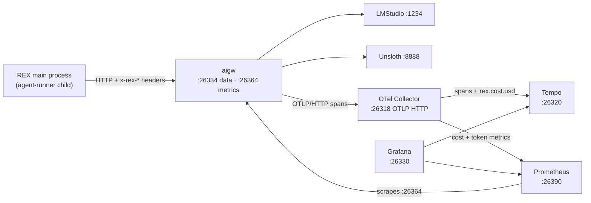

# REX 45 — watching the gateway

**Version:** 1.2 · 2026-09-05
**Status:** **built and verified on 2026-09-05, §6 included.** Every
measurement, probe and acceptance check in this spec was run on this machine
against REX's own gateway. REX now sends the three headers and a comment card
links to its own traffic — §6.1 records what that took.
**Depends on:** [`43-the-local-gateway/SPEC.md`](../43-the-local-gateway/SPEC.md)
(the gateway REX talks to, and the per-message gateway choice);
[`42-the-agent-library/SPEC.md`](../42-the-agent-library/SPEC.md) §4 (the pipe,
and why the library holds no server);
[`01-initial/SPEC.md`](../01-initial/SPEC.md) §3 (invariant I3 — REX listens on
nothing), §12 (the forbidden list).

> [!note]
> **This spec adds no code to `src/` and no dependency to `package.json`.** It is
> three containers beside the gateway in `infra/`, plus one environment variable
> on the gateway and one HTTP header REX already can send. REX stays a client of
> a port, so invariant I3 is untouched.

---

## 1. What this is for

The gateway in `infra/envoy/` answers requests and forgets them. `AIGW_DEBUG=true`
puts the full prompt and response in the container log, which is enough to debug
one call and useless for every other question: what did this cost, which model
was slow, which run spent the tokens, what did the agent actually send an hour
ago.

This spec gives that gateway a memory and a screen:

- **Every request and response**, readable, searchable, kept.
- **Cost per request**, from a price table you edit in one file.
- **Who did it** — which REX run, which thread, which profile.
- **How it behaved** — latency, time to first token, tokens per model.

It is development infrastructure, exactly as `infra/envoy/` is. It ships nothing
to a user and it is not part of the app.

### 1.1 Why this shape and not a product

The alternatives were measured on this machine on 2026-09-05, idle, with
`podman stats`:

| Option | Containers | RAM | Idle CPU |
|:--|--:|--:|--:|
| **Prometheus + Tempo + Grafana** | 3 | 627 MB | 3.5% |
| OpenObserve | 1 | 304 MB | 1.7% |
| Arize Phoenix | 1 | 514 MB | 9–11% |
| Langfuse | 6 | 3,511 MB | 7.3% |

Grafana is 573 MB of that 627 MB; Prometheus costs 32 MB and Tempo 22 MB.

OpenObserve is the smallest and ships a price table for 92 models. It was not
chosen. The reviewer's stated criterion for the gateway itself was longevity —
Envoy over LiteLLM because Envoy is the data plane of the cloud-native world —
and the same criterion picks Prometheus and Grafana here. They are the pair
every other system on this machine already speaks, and the dashboards, the query
language and the habits transfer to everything else. Paying 320 MB for that is
the same trade, one layer up.

Langfuse was rejected on size: six containers and 3.5 GB, and its own
self-hosting guide asks for 4 cores and 16 GiB. Phoenix reads a prompt better
than anything else here and remains the right answer for someone who wants only
that; it does not do metrics, dashboards or cost.

---

## 2. What was verified first

Everything in this section was run against REX's own gateway image on
2026-09-05. It is here because three of these facts contradict what the
documentation implies, and an implementer who trusts the docs will lose an hour
to each.

### 2.1 The gateway exports OTLP over HTTP, never gRPC

`OTEL_EXPORTER_OTLP_ENDPOINT` pointed at a gRPC receiver on 4317 produces this,
once per request, in the gateway log — and no trace anywhere:

```text
traces export: Post "http://host:4417/v1/traces": net/http: HTTP/1.x transport
connection broken: malformed HTTP response "\x00\x00\x06\x04\x00\x00\x00..."
```

The endpoint **must** be the OTLP **HTTP** port. The gateway appends
`/v1/traces` itself, so the variable carries scheme, host and port and no path.
This is the single most likely way to get a silent empty dashboard.

### 2.2 Prompts and responses are in the span already

No flag turns this on. One `POST /v1/chat/completions` produced one span, named
`ChatCompletion`, carrying:

| Attribute | Example value |
|:--|:--|
| `openinference.span.kind` | `LLM` |
| `llm.system` | `openai` |
| `llm.model_name` | `google/gemma-4-e4b` (the **upstream** model, not the alias) |
| `input.value` | the entire request JSON |
| `output.value` | the entire response JSON |
| `llm.input_messages.0.message.content` | `Reply with exactly: PROBE OK` |
| `llm.input_messages.0.message.role` | `user` |
| `llm.output_messages.0.message.role` | `assistant` |
| `llm.token_count.prompt` | `23` |
| `llm.token_count.completion` | `23` |
| `llm.token_count.completion_details.reasoning` | `21` |
| `llm.token_count.total` | `46` |

**Per-request token counts are on the span.** That is what makes per-request
cost possible at all, and it is why cost is computed in the trace pipeline
rather than only from metrics.

> [!warning]
> **The convention on the trace is OpenInference (`llm.*`), and the convention
> on the metrics is OpenTelemetry GenAI (`gen_ai_*`).** They are different
> names for the same quantities and nothing translates between them. A panel
> written against the wrong one returns no data and no error. §5 states which
> source each panel uses.

### 2.3 A request header can become a span attribute

`OTEL_AIGW_REQUEST_HEADER_ATTRIBUTES=x-rex-user:rex.user` plus a request sent
with `x-rex-user: lukas` produced `rex.user: Str(lukas)` on the span. The
mapping is `header:attribute`, comma-separated for more than one.

**This is the whole of "which user did it".** The gateway authenticates nobody
and has no concept of a user; attribution is a header the caller chooses to
send, and nothing more. §6 says what REX sends.

### 2.4 Prometheus can already scrape the gateway

A stock Prometheus pointed at `host.containers.internal:26364` reported the
target `up` and ingested 16 `gen_ai_client_token_usage_sum` series from the
running REX gateway, with `gen_ai_original_model`, `gen_ai_request_model`,
`gen_ai_response_model`, `gen_ai_token_type` and `gen_ai_provider_name` labels.
`gen_ai_token_type` splits into `input`, `output`, `reasoning`, `cached_input`
and `cache_creation_input`.

The gateway exposes **five** metric families and **no cost metric**:
`gen_ai_client_token_usage`, `gen_ai_server_request_duration_seconds`,
`gen_ai_server_time_per_output_token_seconds`,
`gen_ai_server_time_to_first_token_seconds`, `target_info`. Cost is therefore
always something this stack computes, never something it reads.

---

## 3. What it must do

| # | Requirement |
|:--|:--|
| R1 | One command in `infra/` starts the gateway **and** the stack. One command stops both. |
| R2 | `infra/envoy/` keeps working alone, unchanged in behaviour, when the stack is not running. |
| R3 | Every request through the gateway appears as a trace with its full prompt and full response. |
| R4 | Every trace carries a cost in USD, computed from a price table in **one** file. |
| R5 | Every trace carries the REX run, thread and profile that caused it, when REX sent them. |
| R6 | Dashboards are provisioned from files. A fresh `up` shows populated panels with no clicking. |
| R7 | Nothing listens on a port REX's app uses, and REX's app still listens on nothing. |
| R8 | The stack costs under 1 GB of RAM at idle. |

---

## 4. The shape



### 4.1 Why a collector and not three containers

The collector is the only place that holds the price table. It reads
`llm.token_count.*` off each span, multiplies by the price for that model, and
writes `rex.cost.usd` back onto the span before Tempo stores it. The same
component then derives the cost metrics Prometheus keeps.

Without it there are two price tables — one in Prometheus recording rules for
the aggregates, one in a Grafana transformation for the per-request figure — and
they drift the first time a price changes. One table is worth 70 MB.

Prometheus still scrapes the gateway directly, because time to first token and
time per output token are histograms the gateway computes and a span cannot
reproduce.

### 4.2 Ports

The `263xx` band, mirroring the gateway's own `26334` and `26364`. None collides
with 9334, 5334, or the reviewer's `ai-gateway` on 26000/26064.

| Port | Service | For |
|:--|:--|:--|
| 26318 | collector | OTLP **HTTP** in, from the gateway (mirrors 4318) |
| 26320 | Tempo | Grafana's trace queries (mirrors 3200) |
| 26330 | Grafana | **the UI you open** |
| 26390 | Prometheus | Grafana's metric queries, and your own PromQL |

Publish every one of them on `127.0.0.1` explicitly. Podman's forwarder binds
`*` by default — measured on this machine, where `gvproxy` holds `*:24000`,
`*:26000`, `*:3100` and six more — and the gateway authenticates no caller.

---

## 5. The files to create

```text
infra/
├── up.sh                       NEW — starts both projects
├── down.sh                     NEW — stops both
├── envoy/                      exists; compose.yml gains 2 env vars
└── observability/              NEW
    ├── compose.yml             collector, tempo, prometheus, grafana
    ├── README.md               what each port is, how to add a model price
    ├── collector.yaml          OTLP in, price table, cost out
    ├── prometheus.yml          scrape aigw + the collector
    ├── tempo.yaml              OTLP in, local blocks
    └── grafana/
        ├── datasources.yml     Prometheus + Tempo, provisioned
        ├── dashboards.yml      points Grafana at the folder below
        └── dashboards/
            ├── traffic.json    the operational view
            ├── cost.json       the money view
            └── requests.json   the request-and-response view
```

### 5.1 The price table

One block in `collector.yaml`, in USD per **1 million** tokens, keyed by the
alias the caller asked for. Local engines are `0` and stay `0` — the table
exists so that pointing an alias at a hosted model is a one-line change and not
a redesign.

The collector computes, per span:

```text
rex.cost.usd = llm.token_count.prompt      / 1e6 * price_input(model)
             + llm.token_count.completion  / 1e6 * price_output(model)
```

A model missing from the table gets `rex.cost.usd = 0` and the attribute
`rex.cost.known = false`, so an unpriced model is visible as unpriced rather
than as free. Cost panels must show that count beside the total.

### 5.2 The three dashboards

**`traffic.json`** — is it working, and how fast. Prometheus only.

| Panel | Source |
|:--|:--|
| Requests per minute, by model | `gen_ai_server_request_duration_seconds_count` |
| Error rate | same, by status |
| Latency p50 / p95 / p99 | `gen_ai_server_request_duration_seconds_bucket` |
| Time to first token, p95 | `gen_ai_server_time_to_first_token_seconds_bucket` |
| Time per output token, p95 | `gen_ai_server_time_per_output_token_seconds_bucket` |
| Tokens per minute, by type | `gen_ai_client_token_usage_sum` |

**`cost.json`** — what it costs. Collector metrics, with the unpriced count.

| Panel | Grouped by |
|:--|:--|
| Spend, total, selected range | — |
| Spend over time | model |
| Spend | `rex.thread`, then `rex.profile` |
| Tokens against spend | model |
| Requests with an unknown price | model |

**`requests.json`** — what was actually said. Tempo, and the reason this exists.

- A table of recent requests: time, model, `rex.thread`, `rex.profile`, tokens,
  cost, duration, status. One row is one request.
- Click a row, open the trace, read `input.value` and `output.value` in full.
- Filters on the table: by model, by thread, by profile, by minimum cost, and
  free text over the prompt.

TraceQL for the table selects `{ openinference.span.kind = "LLM" }`.

---

## 6. What REX must send

Attribution is a header and nothing else (§2.3). The gateway's environment maps
three of them:

```text
OTEL_AIGW_REQUEST_HEADER_ATTRIBUTES=x-rex-thread:rex.thread,x-rex-run:rex.run,x-rex-profile:rex.profile
```

REX's side of this is **one place**: the HTTP client in `agent-runner/` that
already builds the request to the gateway route from spec 43. It adds three
headers when the route's base URL is a REX gateway:

| Header | Value | Why |
|:--|:--|:--|
| `x-rex-thread` | the thread id | which comment thread spent this |
| `x-rex-run` | the run id | which Ask or Apply this belonged to |
| `x-rex-profile` | `read` or `write` | how much a write run costs against a read one |

**No document text, no file path, no user identity goes in a header.** A header
lands in a span, a span is stored, and the point of the `read`/`write` split is
that a document's content is the thing being protected. The thread id is a
uuid; it names a row in `~/.rex/rex.db` and says nothing on its own.

### 6.1 How each SDK carries a header — measured, not assumed

There is no common mechanism. Each SDK spawns a CLI child, so the headers are
installed the way that child reads them, and both were verified on 2026-09-05:

| SDK | Mechanism | Shape |
|:--|:--|:--|
| Claude | `ANTHROPIC_CUSTOM_HEADERS` in the child's env | `Name: Value`, **one per line** |
| Codex | `http_headers` on the model provider | a table in `config.toml` |

`attribution.py` builds the dict once and each adapter installs it, so the two
cannot drift.

> [!warning]
> **A newline in a header value is header injection here, not a formatting
> slip.** In `ANTHROPIC_CUSTOM_HEADERS` a newline *is* the separator between two
> headers, so a value carrying one ends its own header and starts another —
> an `Authorization` of the caller's choosing, on REX's own request. Values are
> therefore **cleaned rather than escaped**: everything outside
> `[A-Za-z0-9._:-]` is deleted and the result is capped at 128 characters, so
> what is left cannot be anything but a value.

### 6.2 `sessionId` is not a thread id

The obvious shortcut — reuse `sessionId`, which is already on the wire — is
wrong. `sessionIdFor` is `uuidv5` of **whatever the caller had**, and an Apply
passes `${run.id}:${root}` rather than a thread id. So the shortcut would give
the wrong answer for exactly the runs that cost the most. `threadId` is its own
optional field for that reason, and `apply.ts` passes the real thread.

### 6.3 The link back

A comment card's head carries one more icon: **Requests and responses**, which
opens this thread's traffic in Grafana with `var-thread` already set.

**The renderer sends a thread id and never a URL.** It is the process that
displays untrusted document content (invariant I2), so a channel that opened
whatever URL it was handed would be a way for a document to open one. Main
builds the address from `REX_GRAFANA_URL`, and an unset one makes the button say
so rather than opening an empty tab.

---

## 7. Acceptance criteria — all met on 2026-09-05

| # | Check | Result |
|:--|:--|:--|
| 1 | `cd infra && ./down.sh && ./up.sh -d` brings up six containers | **pass** — four observability, gateway healthy, `banner` `Exited (0)` |
| 2 | The gateway behaves exactly as before (R2) | **pass** — the banner printed both engines `ready` |
| 3 | Both Prometheus targets `up` | **pass** — `aigw` and `collector` |
| 4 | A request with `x-rex-thread` returns 200 | **pass** |
| 5 | Traffic panels have data | **pass** — 8 requests counted, aliases populate the model variable |
| 6 | A request is readable end to end | **pass** — TraceQL through Grafana returns the span with `rex.alias`, `rex.thread` and `rex.cost.usd`; `input.value` and `output.value` hold the full prompt and answer |
| 7 | Cost is real arithmetic | **pass** — priced `lms-4b` at 3.0/15.0 for one request of 20 in and 31 out and got **$0.000525**, which is exactly 20×3/1e6 + 31×15/1e6. Restored to 0.0 afterwards |
| 8 | The stack is under 1 GB (R8) | **pass** — **436 MB**: grafana 266, tempo 91, collector 45, prometheus 33 |
| 9 | Every new port binds `127.0.0.1` (R7) | **pass** — 26318, 26320, 26330, 26390 |
| 10 | `./down.sh` leaves nothing running | **pass** |
| 11 | No new lint findings | **pass** — 27 findings in 4 files, identical to the baseline |

> [!note]
> **The gateway's own two ports still bind `*`.** 26334 and 26364 were published
> without an address before this spec and are untouched by it. That is a
> pre-existing exposure, not a new one — the gateway authenticates no caller, so
> anything on the same network can use it — and it is worth its own change,
> because Tempo now stores every prompt that goes through it.

---

## 8. What this spec does not do

- **No budgets, no spend caps, no virtual keys.** Standalone `aigw run` writes
  an Envoy Gateway config with no rate-limit block; enforcement needs the
  Kubernetes controller and Redis. This stack **shows** spend and cannot
  **stop** it. That is the whole of what LiteLLM does and this does not.
- **No alerting.** Grafana can, and no rule is defined here.
- **No retention policy.** Tempo keeps local blocks until the volume is
  removed. On a laptop with local models that is months; revisit it when it is
  not.
- **No evaluation, no scoring, no prompt management.** That is what Phoenix and
  Langfuse are for, and §1.1 is why neither is here.
- **No change to `src/`,** except the three headers in §6, which belong to spec
  43's client and land with it.
