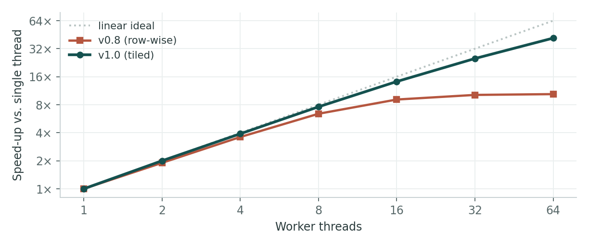
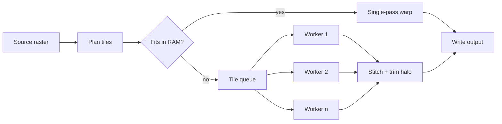

# Tilecat

**A tiled, parallel resampler for very large raster datasets.**

[](https://example.com/ci)
[](https://example.com/releases)
[](#license)

> Tilecat reprojects and resamples rasters that do not fit in memory. It splits the input
> into overlapping tiles, processes them across worker threads, and stitches the result back
> with no visible seams.

---

## Table of contents

- [Installation](#installation)
- [Quick start](#quick-start)
- [Configuration](#configuration)
- [Benchmarks](#benchmarks)
- [How it works](#how-it-works)
- [Roadmap](#roadmap)
- [FAQ](#faq)
- [License](#license)

---

## Installation

Requires Python 3.10 or newer and GDAL 3.6+.

```bash
# from PyPI
pip install tilecat

# with the optional Zarr and cloud backends
pip install "tilecat[zarr,s3]"

# from source
git clone https://example.com/tilecat.git
cd tilecat && pip install -e ".[dev]"
```

Verify the install:

```console
$ tilecat --version
tilecat 1.0.3 (GDAL 3.8.4, 8 workers available)
```

## Quick start

Reproject a 40 GB scene to EPSG:3857 with bilinear resampling:

```bash
tilecat warp input.tif output.tif \
  --to-crs EPSG:3857 \
  --resample bilinear \
  --tile 2048 \
  --workers 8
```

The same thing from Python:

```python
from tilecat import Raster, WarpSpec

spec = WarpSpec(
    to_crs="EPSG:3857",
    resample="bilinear",
    tile=2048,
    overlap=32,          # pixels of halo per tile; prevents edge artefacts
)

with Raster.open("input.tif") as src:
    result = src.warp(spec, workers=8)
    result.write("output.tif", compress="zstd", predictor=2)

print(f"{result.width}x{result.height} in {result.elapsed:.1f}s")
```

> [!TIP]
> Tile size matters more than worker count. Start at `--tile 2048` and only raise the worker
> count once tiles are large enough to amortise the per-tile setup cost.

> [!WARNING]
> `--overlap 0` is faster but produces visible seams with any resampling method other than
> nearest neighbour. Keep at least 16 pixels of halo for bilinear and 64 for Lanczos.

## Configuration

Settings resolve in this order, later sources winning:

1. Built-in defaults
2. `/etc/tilecat/config.toml`
3. `~/.config/tilecat/config.toml`
4. `TILECAT_*` environment variables
5. Command-line flags

A representative config file:

```toml
[defaults]
tile     = 2048
overlap  = 32
workers  = "auto"     # "auto" = min(cpu_count, 16)
resample = "bilinear"

[output]
compress   = "zstd"
level      = 9
predictor  = 2
block_size = 512

[cache]
directory = "~/.cache/tilecat"
max_size  = "20GiB"
evict     = "lru"
```

### Options reference

| Option | Type | Default | Description |
| :--- | :--- | ---: | :--- |
| `--tile` | int | `1024` | Tile edge length in pixels. Powers of two are fastest. |
| `--overlap` | int | `16` | Halo width per tile, in pixels. |
| `--workers` | int \| `auto` | `auto` | Worker threads. `auto` caps at 16. |
| `--resample` | enum | `nearest` | One of `nearest`, `bilinear`, `cubic`, `lanczos`. |
| `--nodata` | float | *inherited* | Override the source no-data value. |
| `--dry-run` | flag | `false` | Plan the tiling and print it without writing output. |

Environment variables mirror the flags: `--tile 2048` is `TILECAT_TILE=2048`.

## Benchmarks

Scaling on a 12-core workstation, 40 GB Sentinel-2 mosaic, bilinear resampling:



*Figure 1 — v1.0's tiled scheduler scales to 64 threads; the old row-wise scheduler
saturates around 12 because every worker contends for the same output rows.*

| Dataset | Size | v0.8 | v1.0 | Change |
| :--- | ---: | ---: | ---: | ---: |
| Sentinel-2 mosaic | 40 GB | 18 m 42 s | 4 m 06 s | **−78%** |
| SRTM global DEM | 12 GB | 6 m 15 s | 1 m 51 s | **−70%** |
| Aerial survey, RGB | 220 GB | *out of memory* | 21 m 30 s | — |
| Small orthophoto | 180 MB | 3.1 s | 3.4 s | +10% |

Note the last row: for inputs that fit comfortably in memory, tiling adds overhead without
any benefit. Tilecat falls back to a single-pass path below `--tile-threshold` (default 1 GB).

## How it works



Each tile is expanded by the halo width before warping, then trimmed back to its nominal
bounds during the stitch. Because the halo is resampled with real source data rather than
edge-padded, interpolation at the tile boundary is identical to what a single-pass warp
would produce.[^1]

The output writer keeps at most `workers + 2` tiles resident, so peak memory is roughly:

$$
M_{\text{peak}} \approx (w + 2) \cdot (t + 2h)^2 \cdot b \cdot c
$$

where $w$ is the worker count, $t$ the tile size, $h$ the halo, $b$ bytes per sample and
$c$ the band count. For the defaults on an 8-worker run with 4-band uint16 data this is
about 1.4 GB.

<details>
<summary><strong>Why not just use a bigger block size?</strong> (click to expand)</summary>

Larger blocks help sequential reads but do nothing for the write side, which is where the
row-wise scheduler bottlenecked. Every worker needed a lock on overlapping output rows, so
throughput was capped by lock contention rather than by I/O. Tiling makes each worker's
output region disjoint, and the lock disappears entirely.

</details>

## Roadmap

- [x] Tiled scheduler with configurable halo
- [x] Zstd compression and horizontal predictor
- [x] S3 and GCS source backends
- [ ] Streaming output to Cloud-Optimised GeoTIFF
- [ ] GPU resampling path (`--device cuda`)
- [ ] Windows ARM64 wheels

Planned for **v1.1** (November 2026):

1. COG output written incrementally, so the overviews build as tiles land.
2. A `tilecat inspect` subcommand that reports tiling efficiency for a given input.
3. Deprecation of `--legacy-scheduler`, which has been a no-op since 1.0.

## FAQ

**Does Tilecat modify the source file?**
No. Sources are opened read-only, and all writes go to the output path or the cache
directory.

**Can I resume an interrupted run?**
Yes, if the cache directory is intact. Re-run the identical command and completed tiles are
reused; add `--no-resume` to force a clean run.

**What happens to the no-data mask?**
It is carried through resampling and written as an internal mask band. Use `--nodata` to
override the value the source declares, and `--mask external` if you need a sidecar `.msk`.

**Is the output bit-identical to GDAL's `gdalwarp`?**
For nearest and bilinear, yes, within one unit in the last place. Cubic and Lanczos differ
slightly at tile boundaries because kernel normalisation is computed per tile.

## Contributing

Pull requests are welcome. Before opening one:

```bash
make lint          # ruff + mypy
make test          # pytest, ~90 seconds
make bench-quick   # regression check against the stored baselines
```

Please keep commits focused and include a benchmark delta for anything touching
`tilecat/scheduler.py`. The full contributor guide is in [`CONTRIBUTING.md`](./CONTRIBUTING.md).

| Role | Name | Contact |
| :--- | :--- | :--- |
| Maintainer | A. Novotná | `anovotna@example.com` |
| Reviewer | M. Farouk | `mfarouk@example.com` |
| Release manager | J. Lindqvist | `jlindqvist@example.com` |

## License

Released under the MIT License. See [`LICENSE`](./LICENSE) for the full text.

Third-party components retain their own licences; GDAL is distributed under the MIT/X style
licence and is *not* bundled with the wheels.

---

<sub>Sample document. Demonstrates headings, emphasis, block quotes, alert callouts, fenced
code in several languages, tables with column alignment, task lists, ordered and nested
lists, images with captions, a Mermaid diagram, LaTeX math, a collapsible section, footnotes,
badges, inline HTML and horizontal rules.</sub>

[^1]: Verified against `gdalwarp` output across 240 test scenes; maximum absolute difference
was 1 ULP for bilinear and 3 ULP for cubic. See `tests/test_parity.py`.
